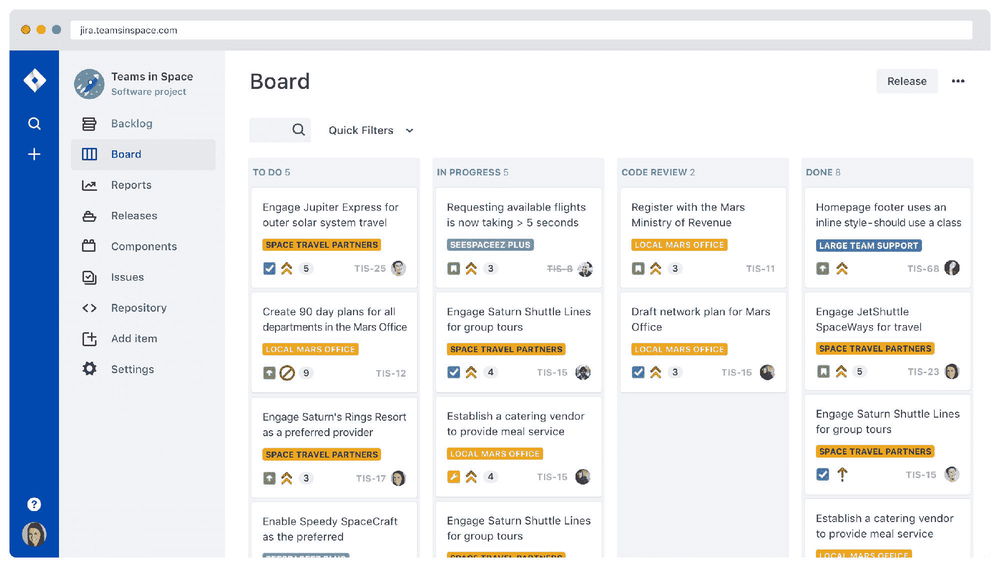
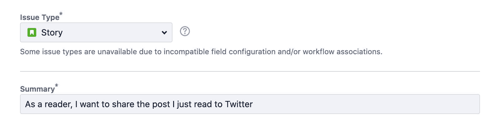
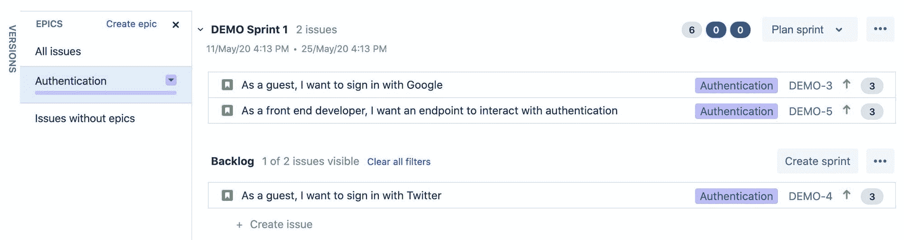
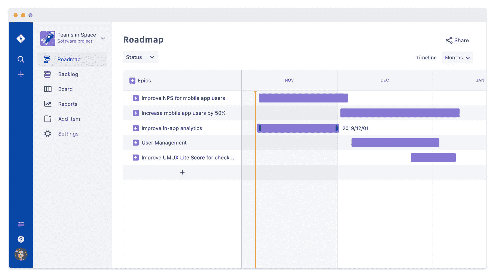

# 什么是敏捷，你如何成为一个史诗般的故事讲述者

> 原文：<https://www.freecodecamp.org/news/what-is-agile-and-how-youcan-become-an-epic-storyteller/>

管理一个开发团队很难。试图在保持每个人高效工作的同时协调堆积如山的工作本身就是一个挑战。但最重要的是，你必须与客户保持开放的沟通。我们如何使用敏捷来缓解这些棘手的问题呢？

*   [什么是敏捷？](#what-is-agile)
*   有哪些你应该知道的概念？
*   [故事](#stories)
*   [史诗](#epics)
*   [短跑](#sprints)

[https://www.youtube.com/embed/1GPYnoG_nkE?feature=oembed](https://www.youtube.com/embed/1GPYnoG_nkE?feature=oembed)

## 什么是敏捷？

敏捷是一种软件开发方法，源于将大量工作分解成小块的思想。这让产品经理、开发人员和任何利益相关者对工作有了更好的理解。

从历史上看，软件开发是一个缓慢的过程，需求的重大变化会给团队带来巨大的压力。

当遵循敏捷方法时，更小的工作块有助于团队变得更加灵活，我敢说*敏捷*。在这个过程中，它帮助他们更快地交付特性，更快地响应变化。

Example Jira project board from [atlassian.com/software/jira](https://www.atlassian.com/software/jira)

这些想法已经被分解成处理这种方法的不同框架。常见的两个是 [Scrum](https://www.scrum.org/resources/what-is-scrum) 和[看板](https://en.wikipedia.org/wiki/Kanban_(development))。

对于本演练，这些概念中的大部分都遵循 Scrum 框架，但是肯定有一些概念适用于这两者和其他。

## 有哪些你应该知道的概念？

我认为，在敏捷世界中，作为一名开发人员，高效工作的一半就是理解术语。通常情况下，项目经理会主持会议，所以如果你能和他们讨论的内容保持一致，这个过程会简单很多。

有很多书籍、课程和认证都是围绕着学习敏捷方法的细微差别。我不打算深入一些哲学方面或更深的部分，但我会涵盖一组很好的关键概念，这些概念将帮助您在敏捷团队中开始新工作时立即投入工作。

## 故事

一个故事通常是最小的作品。这通常以你在你正在使用的项目工具中创建的新标签的形式出现，无论是[吉拉](https://www.atlassian.com/software/jira)还是 [Github 问题](https://help.github.com/en/github/managing-your-work-on-github/about-issues)。

### 表达故事

在做一个项目时，你可能会遇到人们表达故事的各种方式。但是一个好的指导方针是通过“故事”这个词本身的概念来工作，并解释需要以这种方式完成的工作。

例如，如果你想为使用你的网站的人提供在 Twitter 上分享博客文章的能力，你可能想把这个故事写成:作为一个读者，我想把我刚刚读到的文章分享到 Twitter 上。

Creating a new story in Jira

使用“作为一个[人]，我想[行动]”这种模式有助于提供上下文，如某人在访问他们的网站时可能处于什么状态，以及他们试图实现什么。如果您正在为登录的人开发不同于客人的功能，这可能特别有帮助。

### 细节和要求

虽然故事的标题是作品的重要表现形式，但你还需要提供更多的细节。

至少，这应该通过添加一个完整的描述和一组验收标准来完成，这些标准可以帮助开发人员了解上下文和需求。根据团队的不同，这也可以包括像标签或分类这样的工具，使团队更容易将工作分组可视化。

提供一组强有力的需求有助于开发人员和评审人员有一个度量来确定它是否真正完成。没有它，每个人都只是猜测。

表述这些的一个好方法是:验证[需求]。回到我在 Twitter 上分享帖子的例子，这个故事的一些要求可能是:

*   验证点击分享按钮时是否创建了新的推文
*   验证推文是否包含当前博客文章的链接

### 工作量或难度

每个故事都由许多点来表示。这些要点是一种表达一个开发团队期望一个故事付出多少努力的方式。这种努力可能意味着各种各样的事情，无论是简单的团队预期工作有多困难，还是特定故事的风险或不确定性的大小。

团队表示这一点的一种方式是使用[斐波纳契数列](https://en.wikipedia.org/wiki/Fibonacci_number)，其中点数可以是 1、2、3、5、8 等等。一个微不足道的文本更新可能是 1 分，在页面上添加一个新的表单可能是 3 分。

通常情况下，你会希望避免给故事定得太高，当你得到 5 分以上时，很可能有一种方法可以将工作分解，使其更易于管理。虽然你可以很容易地创建一个巨大的 13 点故事来完成一个功能的所有方面，但通常以更小、更集中的块来处理工作是有意义的。

无论哪种方式，这些点加在一起，给你的团队一个粗略的估计，一组故事需要完成多少工作。

## 史诗

虽然故事的目标是定义一个小作品，但史诗是一种将这些作品组合在一起以表现一个特征的方式。

### 将故事定义为功能

另一个例子可以很好地解释这一点。如果您正在开发一个需要集成身份验证的应用程序，您可能希望创建一个新的 epic，简称为“身份验证”。

在这部史诗中，你可以找到这样的故事:

*   作为来宾，我想用我的电子邮件地址登录应用程序
*   作为认证用户，我想更改我的密码
*   作为安全团队，我希望防止垃圾邮件和滥用用户身份验证

Example of an Authentication epic in Jira

有了定义的 epic，您就给了您的团队一条途径来完成一个特性，同时也理解了该工作的整个范围。当计划要做的工作时，这是很重要的。

在你的史诗中定义你的故事给你一种感觉，一件事情需要多少工作，但它不能帮助你计算出它需要多长时间，这就是短跑的用处。

## 短距离赛跑

冲刺是一种计划如何完成工作的方式。虽然与史诗相似，它们是一种对大量工作进行分组的方式，但是 sprints 通常代表一段时间内将完成特定的大量工作。

### 每次冲刺的时间

定义冲刺的一个常见方式是两周的工作。在这两个星期里，你的团队将会有一个特定的速度，或者你可以完成的平均工作量。这个速度由许多点来表示，这些点是从事 sprint 工作的每个开发人员的平均速度的总和。

### 每次冲刺的点数

尽管许多人激烈地争辩说你不应该用时间来表示那个速度，但是点将会粗略地转化为每个开发人员平均工作时间的总量。对于有经验的开发人员来说，1 分可能是 1 小时，而对于经验较少的开发人员来说，同样的 1 分可能意味着 3 小时。

Example project roadmap from [atlassian.com/software/jira](https://www.atlassian.com/software/jira)

但是一旦你有了你的团队在 sprint 中的平均分数，你就会知道你可以期望完成多少故事点。当你展开一组故事或一部史诗时，这种计划会一步一步地进行，这样你就可以预测一个特性何时完成。

## 敏捷如何适合你的团队

请记住，通过 Scrum、看板或任何其他框架的敏捷方法仅仅是一个框架。当你第一次开始的时候，遵循这个过程可能是一个好主意，听听你的团队的意见，试着根据你自己的经验来塑造它。

每个团队的工作方式都有一点不同，将一个过程强加给这个团队可能会弊大于利，但是任何过程都有一个学习曲线。与眼球转动做斗争，直到每个人都掌握了它，并经常回顾，看看什么有用，什么没用。

在一天结束时，你的团队遵循的过程应该是无形的，为你工作而不是与你作对。找到最适合您的团队的方法，并分享您的经验供他人学习！

## 你的团队流程是什么？

在 Twitter 上与我分享！

*   [？在 Twitter 上关注我](https://twitter.com/colbyfayock)
*   [？️订阅我的 Youtube](https://youtube.com/colbyfayock)
*   [✉️注册我的简讯](https://www.colbyfayock.com/newsletter/)