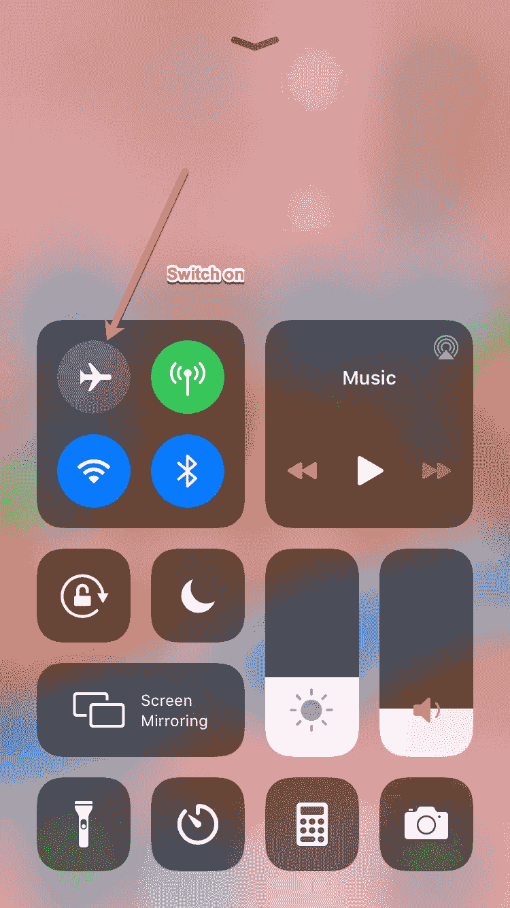

# 什么是飞行模式？它有什么作用，你应该什么时候打开它？

> 原文：<https://www.freecodecamp.org/news/what-is-airplane-mode-what-does-it-do-and-when-should-you-turn-it-on/>

如果你在过去十年里坐过飞机，并且你有一部智能手机，你可能不得不在飞机起飞前将手机调成飞行模式。

虽然我们大多数人只是遵守联邦航空局的规定，但你有没有想过为什么你真的需要使用飞行模式？

在这篇文章中，我们将学习飞行模式做什么，为什么你应该在飞行中使用它，以及它如何在日常生活中帮助你。

## 什么是飞行模式？

当您启用飞行模式时，您将禁用手机连接到蜂窝网络、WiFi 网络或蓝牙的功能。这意味着您不能拨打或接听电话、发送短信或浏览互联网。

然而，你仍然可以使用你的手机:你可以拍照、听音乐、玩游戏，或者撰写电子邮件/信息以便稍后发送。基本上任何不需要信号或互联网的东西。

### 你如何打开它？

如果您有 iPhone 或 iPad，只需从屏幕底部向上滑动即可打开飞行模式。你会在弹出的菜单中看到一个小小的飞机图标——只要点击它，它就会变成橙色。这意味着飞行模式已接通。

Just click that little airplane and all transmitting will be disabled.

你还会注意到你的 wifi 已经关闭，你的手机不再发射无线电信号。

如果你有一部 Android 手机，过程是类似的——只需从顶部向下滑动，打开飞行模式。

## 我们为什么要这么做？

你的手机是一个强大的小装置。它发出无线电波和电磁干扰(EMI ),可能会干扰飞机的通信设备。没有人想要一架不能与目的地机场的空中交通管制进行通信的飞机。

联邦航空管理局(FAA)也确定来自飞机的手机信号会淹没下面的信号塔，导致服务中断。毕竟，每天有数百万人乘坐飞机，所以会有很多塔台堵塞。

不管是什么原因，也不管你对它们的感觉如何，当你在空中时，听从乘务员的指示并打开飞行模式是个好主意。

### 一线希望

六年前，联邦航空局认为其对手机/蜂窝设备的限制有点过于苛刻。所以他们开始允许乘客在飞行中使用 WiFi 和蓝牙。

如果你的飞机有 WiFi 功能，你可以随意连接到互联网上浏览。额外收获:你也可以使用你的蓝牙耳机。一旦进入飞行模式，你只需要手动打开 WiFi(在上面看到的同一个 dock 菜单中)。

## 飞行模式还有其他用途吗？

想想飞行模式是做什么的:它让你无法接听(或拨打)电话或接收(或发送)信息。它还能防止你漫不经心地浏览网络。啊，内心平静和生产力的潜力。

### 完成一些工作

如果你需要集中注意力并且[完成一些深度工作](https://www.freecodecamp.org/news/focus-and-deep-work-your-secret-weapons-to-becoming-a-10x-developer-8e203a6ad291/)，考虑开启飞行模式。您的设备不再有令人分心的弹出窗口、通知或噪音——多么轻松。

你可以给自己设置一个时间限制(不需要整天开着飞行模式。如果你的 SO 需要问你晚饭想吃什么怎么办？还是你的孩子需要联系？).尝试几个小时，看看你完成了多少。

### 保护你的孩子

说到孩子，飞行模式对他们也很有用。如果你给你的孩子你的手机或平板电脑(一些非常有限的屏幕时间-对不对？)你不希望他们意外地给你的老板打电话，或者购买你的整个亚马逊愿望清单。

所以只要打开飞行模式。他们仍然可以玩游戏、拍照等等。他们只是不会陷入同样多的麻烦。

### 充电速度更快(并延长电池寿命)

当你的手机处于飞行模式时，它不会一直试图寻找无线网络或信号。所以你的电池会持续更长时间。

如果你度过了漫长的一天，并且忘记了你的电池组，打开飞行模式。你可以做更多的事情，让心情稍微平静一点，当你需要的时候，你的手机还会有一些电，可以导航到你一直想去的那家热门的新餐馆(或者其他什么地方)。

额外好处:当你使用飞行模式时，你的手机实际上会更快地充电(原因和上面提到的一样:它不想做太多，所以可以专注于充电)。因此，如果你没有一个新的超级快速充电设备，这将帮助你。

### 断开连接，休息一下

最后，有时你只想离开手机或平板电脑，把自己从所有的通知中解放出来。对你有好处-做吧。

飞行模式可以很容易地断开与设备的连接，但仍然让它开着(例如，用作闹钟)。或者在假期拍些照片。).所以，点击那架小飞机，把你的忧虑暂时抛在脑后。