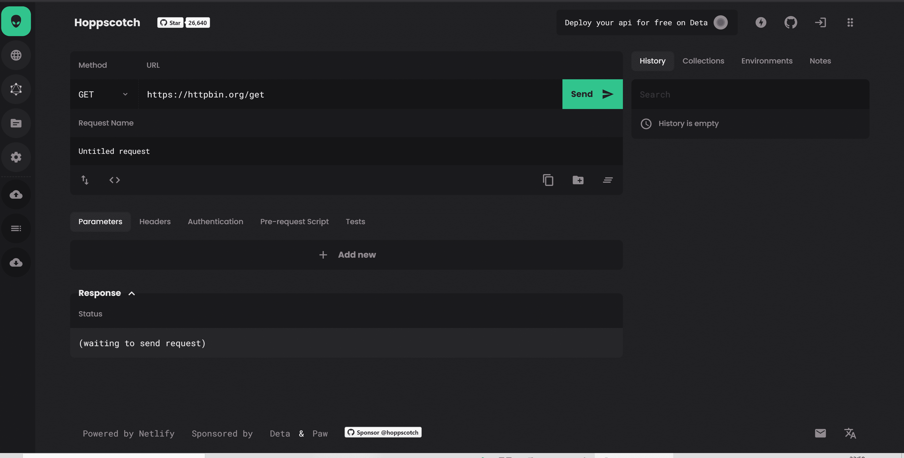
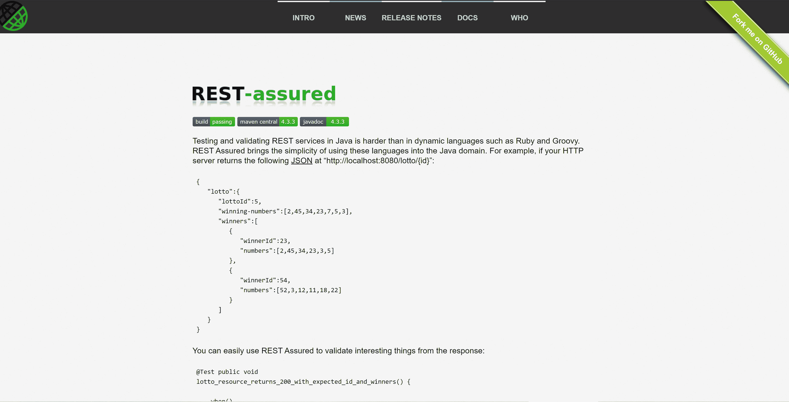
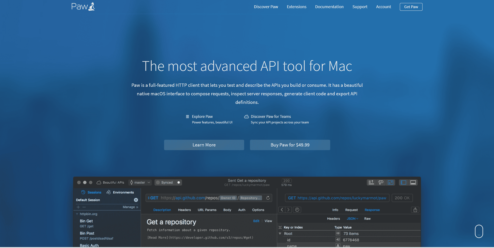
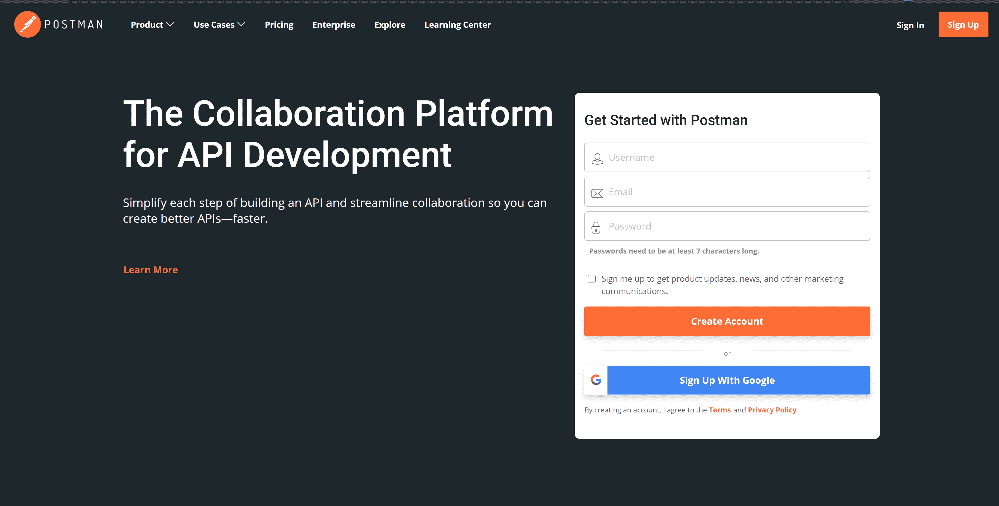
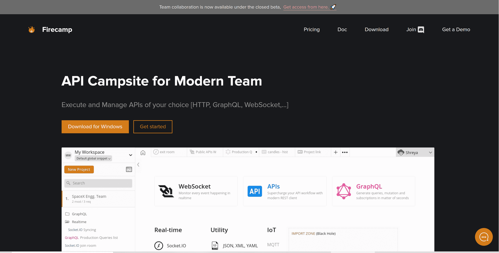
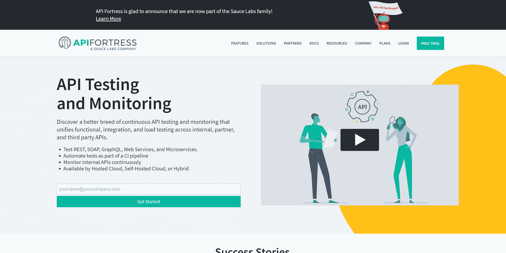

# API 备忘单——什么是 API，它是如何工作的，以及如何选择正确的 API 测试工具

> 原文：<https://www.freecodecamp.org/news/what-is-an-api-and-how-to-test-it/>

构建 API 很有趣，对吗？

在本文中，我将解释什么是 API，为什么需要它们，我们将深入研究 API 规范、文档等等。

通过使用 API 抽象出某些实现，并向需要在构建应用程序时使用端点的开发人员公开操作或端点，编程变得更加简单。

但是 API 会变得非常复杂，这取决于应用程序的代码库和用例。这意味着在开发 API 端点之后，测试它们可能是一个棘手的过程。幸运的是，我将分享一些令人惊奇的工具来帮助你有效地测试你的 API。

## 目录

*   API 简介
*   原料药的类型
*   为什么我们需要 API？
*   API 规范
*   API 测试工具
*   API 文档
*   结论

## 什么是 API？

API(应用程序编程接口)作为一个中间件，允许您在软件产品之间传递数据。

您可以使用它来定义已经提出的请求、处理业务逻辑、管理应该使用的数据格式以及在构建软件产品时要遵守的约定。

## 原料药的类型

API 有三种主要类型，分别是:

*   私人的
*   公共/合作伙伴
*   外部的

### 私有 API

这些是仅供组织内部使用的 API。它们被归类为供员工用来自动化业务流程和交付的内部应用程序。

### 公共/合作伙伴 API

这些 API 是公开推广的，但只对已知的开发者或商业伙伴开放。这些通常代表组织之间的软件集成。

### 外部 API

顾名思义，这些完全是外部 API，任何第三方开发人员都可以使用，并且主要是为最终用户/客户设计或构建的。

## 为什么我们需要 API？

API 使得访问各种资源变得更加容易。它们还允许解决某些业务逻辑的跨平台通信。

### API 是高效的

由第三方应用程序托管和创建的 API 可以显著减少组织内的工作量。这反过来会加快应用程序的开发过程。

公司将业务流程的某些部分外包出去，只需支付一小部分成本，就可以在组织内部构建相同的应用程序。

### API 让事情变得更简单

API 通过分块处理不同的业务逻辑来简化复杂的逻辑。它们还提供特定于特定用例的用户友好的端点。

API 可以提供您需要的数据，而不需要额外的研究或操作，从而加快开发过程。

## API 规范

有几种不同类型的 API 规范，我们现在将讨论它们。

### 表征状态转移(REST)

表述性状态转移(REST)是一种架构风格，它在计算机系统之间的 web 上提供标准，使应用程序内的通信流更容易。

REST APIs 是无状态的，可以用于分离客户端和服务器之间的关注点。

### 服务对象访问协议(SOAP)

根据微软的定义，SOAP 是一种轻量级协议，用于在分散的分布式环境中交换结构化信息。

它包含一些规则，这些规则指导通过超文本传输协议(HTTP)在系统之间使用 XML 从 web 应用程序发送请求和响应。

### GraphQL

GraphQL 是一种用于 API 的查询语言。它提供了 API 中数据的绝对和简化描述，使您能够获得您需要的准确数据。这使得随着时间的推移开发 API 变得更加容易，同时也支持强大的开发工具。

## API 测试工具

开发完 API 端点后，测试它们可能会很有挑战性，但是我会在这里分享一些非常有用的工具，帮助你有效地测试你的 API。

### [女邮递员/霍普斯科奇](https://hoppscotch.io/)

一个免费、快速、漂亮的 API 请求生成器，具有在线测试环境，支持多平台和多设备，以及更多功能。

### [放心](http://rest-assured.io/)

这个工具简化了用 JAVA 测试 API 端点——是的，Java。它测试和验证响应，使得 Java 开发人员可以无缝地测试 API。

### [爪子](https://paw.cloud/)

Paw 是一个全功能的 HTTP 客户端，允许您测试和描述您构建或使用的 API。它有一个漂亮的本机 macOS 界面来编写请求、检查服务器响应、生成客户端代码和导出 API 定义。

### [邮递员](https://www.postman.com/)

Postman 是一个 API 开发的协作平台。这个工具令人惊叹的地方在于它简化了构建 API 的每一步，并且它还使得构建更快的 API 的协作变得无缝。

### [肥皂泡](https://www.soapui.org/downloads/soapui/)

这也是一个测试工具，可以帮助无缝测试 API 端点。

### [Firecamp](https://firecamp.io/)

这是一个 UI 友好的工具，可以用来测试任何栈。使用哪种技术栈并不重要，从 REST API、WebSockets、GraphQL 等等软件工程中的技术栈都可以。

### [空手道](https://intuit.github.io/karate/)

空手道是一个开源工具，用于 API 测试自动化、性能测试、UI 自动化等操作。

### [API 堡垒](https://apifortress.com/)

这是测试 REST、SOAP、GraphQL、Web 服务、微服务的绝佳工具。它还帮助您将测试作为 CI 管道的一部分进行自动化，持续监控内部 API，等等。

## API 文档

API 文档是开发和测试 API 后要考虑的最重要的事情之一。它简化了理解每个端点做什么以及它们的请求和响应如何工作的过程。

假设您为用户身份验证构建了几个端点。如果您不在，但是您团队中的一个前端开发人员想要使用它，这可能是一个问题。如果没有指南或说明来解释每个 API 做什么，并且没有示例请求和响应，那么它真的会减慢开发过程。

以下是一些可用于 API 文档的工具，因此您不会遇到这些问题:

*   [大摇大摆](https://swagger.io/)
*   [apiDoc](https://apidocjs.com/)
*   [邮递员](https://www.postman.com/api-documentation-tool/)

## 结论

构建和测试您的 API 应该很有趣，不是吗？我希望你发现这个资源是有用的，它可以帮助你享受你的 API。

你可以在推特上联系我。