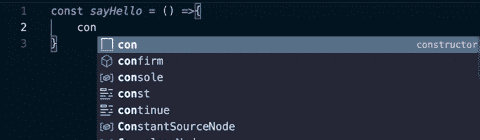
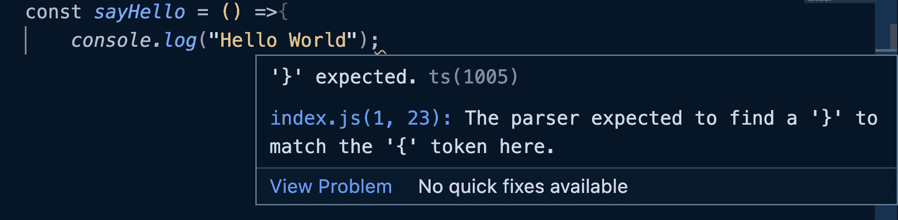

# 什么是 IDE？IDE 在编码中的意义

> 原文：<https://www.freecodecamp.org/news/what-is-an-ide-for-beginners/>

当你第一次学习编码时，有几个工具是你在开始之前需要决定的。

您将选择一个技术堆栈和一种编程语言来学习和使用，您还将选择一个 IDE 或集成开发环境，在那里您将编写代码。

如今有许多不同类型的 ide 可供使用。有些人只在网上工作，有些人在本地工作，也可能在网上工作。有些具有特定的特性，可以帮助您编写更精确和正确的代码，等等。

在本文中，您将了解什么是 IDE，IDE 可以具有哪些特性，以及在选择 IDE 进行编码时需要考虑哪些因素。

## 什么是 IDE？

开发人员使用 IDE(集成开发环境)来编写计算机程序。您可以用任何语言编写这些计算机程序，包括 Python、Java 和许多其他语言。

总有一些工具可以帮助你实现人生目标。例如，作家使用文本编辑器，如微软 Word 和谷歌文档。会计使用电子表格，如微软 Excel 和谷歌表。程序员使用 ide。

这些 ide 通过简化代码的编写、编辑、调试和测试来提高您的工作效率。

注意:你可以用文本编辑器编写代码，但是这些文本编辑器不会给你 IDE 所能提供的所有好处。

## 为什么要使用 IDE？

在 ide 推出之前，程序员使用记事本等文本编辑器来编写代码。然后，他们使用编程语言扩展保存代码，如。php 文件和更多。

然而，这些文本编辑器很简单，缺乏一些功能。这使得编写、调试和运行代码既困难又耗时。

这导致了 IDE 的开发，它包括一些扩展到文本编辑之外的核心功能，例如:

### 语法突出显示

IDE 检测编程语言，然后将特定的颜色、字体和样式应用于某些关键字、单词和文本。这使得您的代码可读性更好，更干净，更容易检测语法错误，等等。

```
// without syntax highlighting

const sayHello = () => {
  console.log("Hello World");
} 
```

```
// with syntax highlighting

const sayHello = () => {
  console.log("Hello World");
} 
```

### 自动完成

当我们在 IDE 中键入代码时，会出现一个可能的建议下拉列表，我们可以从中选择我们想要的。这些有用的建议是在我们不必编写整个代码的情况下出现的，而编写整个代码可能会很慢，并可能导致语法错误。



### 更容易调试

因为程序员也是人，我们很容易在代码中犯错误(bug)。用文本编辑器来检测这些可能很有挑战性，但是用 ide 就容易多了。

当我们运行或测试代码时，IDE 会向我们显示错误，包括错误出现的行和潜在的解决方案。

这使得调试(修复测试中发现的任何错误或缺陷的过程)更加简单。



您应该使用 ide 的原因还有很多，比如轻松编译代码的能力等等。

## 如何选择编码的 IDE

读到这里，您可能会想到下一个问题——我如何选择一个 IDE？

别担心，这不必太复杂。但是在选择 IDE 之前权衡一些选项是一个好主意。

以下是一些需要考虑的事项:

### 你用的是什么编程语言

如上所述，有许多不同类型的 ide。有些是专用的，只支持特定的语言，有些是多语言的，支持多种语言。

专门化的 ide 包含了为特定语言的语法定制的自动化特性。这意味着在选择 IDE 时，语言是一个重要的考虑因素。

一些专用 ide 的例子包括 Python 的 [PyCharm](https://www.jetbrains.com/pycharm/) ，Java 的 [Intellij IDEA](http://www.jetbrains.com/idea/) ，C/C++的 [Code::Blocks](http://www.codeblocks.org/) ，Ruby/Rails 的 [RubyMine](http://www.jetbrains.com/ruby/) 。

如果你正在寻找一个多语言 IDE， [Visual Studio Code](https://code.visualstudio.com/) 是一个受欢迎的选择。它对于 web 开发和许多其他目的都很有用。

### 你用的是什么操作系统

另一个需要考虑的重要因素是你使用的操作系统。

有些 ide 在一个操作系统上运行得很好，但在另一个操作系统上却不行。在一个操作系统上，IDE 可能很慢或者很难使用，反之亦然。有些 ide 存在于一个操作系统上，但不存在于另一个操作系统上，尽管今天大多数 ide 都有不同操作系统的多个版本。

例如，Xcode 是 macOS 的内置 IDE。它不是默认安装的，但是你可以通过终端或者苹果的网站从苹果免费获得。但是，此 IDE 与 Windows 不兼容。

### 成本

即使大多数 ide 是免费的，附加组件或定制特性也可能不是。这意味着你必须研究你想要的具体功能，成本，以及他们是否负担得起。

例如，如果你想要一个可以为你建议代码并完成你的代码的 AI 助手，节省你的时间，有许多扩展可用，如 VScode 的 [Tabnine](https://www.tabnine.com/) 。这支持几乎所有的编程语言，但它是付费的，只提供 14 天的免费试用。

在选择 IDE 之前，您应该尽可能多地比较提供您想要的功能的扩展和它们使用的 IDE、它们的成本、它们支持的语言以及其他因素。

还有其他细节要考虑，但这将让你开始。

## 包扎

在本文中，您了解了什么是 IDE，程序员为什么使用它们，以及如何选择一个 IDE。

总而言之，正如我们上面讨论的，有一些 ide 是特定于特定编程语言的。但是其他的，比如 VSCode，则更加通用，支持多种语言。

在选择 IDE 之前，先研究一下您喜欢的语言、操作系统、财务能力和定制功能。你可以阅读更多关于[什么是编程中的 IDE？](https://www.freecodecamp.org/news/what-is-an-ide-in-programming-an-ide-definition-for-developers/)在我们之前的文章中，作者是[希拉里](https://www.freecodecamp.org/news/author/larymak/)。

祝编码愉快！