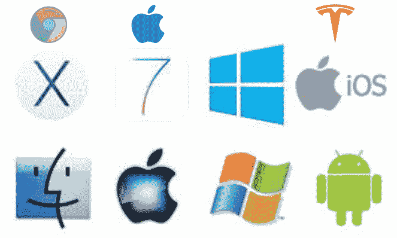
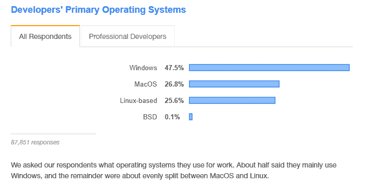

# 什么是操作系统？面向初学者的操作系统定义

> 原文：<https://www.freecodecamp.org/news/what-is-an-os-operating-system-definition-for-beginners/>

开发者长期以来一直在争论什么是最好的操作系统。

现在，如果你活跃在社交媒体平台和开发者论坛上，你可能会在 Reddit、StackOverflow 等平台上看到 Twitter 投票和无休止的讨论。我们还没有找到一个可靠的答案，因为每个人都有自己的看法。

我在这里向你保证一件事——我们不会在本文中回答这个问题，因为试图回答这个问题类似于回答*哪一台笔记本电脑最适合开发人员使用*——我们都有不同的偏好，对吗？

但是这篇文章要讨论的问题是:

*   什么是操作系统？
*   操作系统的历史
*   操作系统如何工作
*   操作系统的类型和示例
*   操作系统的功能
*   为什么你需要操作系统

通过回答这些问题，希望你能根据自己的需要选择合适的操作系统。您还将了解操作系统如何工作的基础知识，这将是您作为开发人员的最佳操作系统。

让我们开始吧:

## 什么是操作系统？

最近的技术进步，每个小工具都被认为是智能设备，这真的彻底改变了世界。几乎每个人都可以使用这种设备，无论是手机、平板电脑、笔记本电脑、智能手表，还是你家里的个人电脑。此外，现代汽车的数量也在不断增加。

上面提到的所有产品的共同点是，它们使用操作系统来启用它们的功能，以便您完成某项任务。尽管我们拥有这些神奇的东西，但很少有人能够理解操作系统是如何实现不同任务的。

基于这种理解，我们可以将操作系统( *OS* )描述为管理计算机硬件和软件资源并为计算机程序提供公共服务的软件。

用简单的英语来说，我们可以说操作系统是用户和机器之间的接口，使用户能够轻松地完成不同的任务。

现在你已经了解了什么是操作系统，也对它的功能有了一点概念，所以！这一切是如何产生的，从哪里开始的？让我们看看它的历史

## 操作系统的历史

这一切都要追溯到 20 世纪 50 年代，当时计算机一次只能处理一个程序。在此期间，用户直接与计算机硬件互动。对于一个要执行的程序，它在执行开始前被装入一个输入设备，如读卡器，如果在执行过程中出现错误，必须检查寄存器和主存储器以确定错误的原因。

1956 年，当通用汽车公司开发出第一个操作系统时，它在市场上获得了巨大的成功。它的主要目的是运行一台 IBM 中央计算机。由于它的成功，IBM 将其发扬光大，成为第一家开发操作系统并开始销售的公司。

20 世纪 60 年代，贝尔实验室推出了第一个版本的 Unix 操作系统，这是第一个支持多任务和多用户功能的系统。这个系统是用 C 语言编写的，可以免费获得。它被许多用户广泛接受和改编，这导致它在 70 年代正式发布了第一个版本。

随着它在早期阶段的成功，它被广泛接受，这导致了今天使用的许多操作系统借用他们的起源。一些源自 UNIX 的公司包括:Mac OS X、iOS、Android、Chrome OS 等...

1977 年苹果 Dos 在市场上推出。它是为家用电脑设计的，获得了巨大的成功。这个操作系统的设计者是史蒂夫·沃兹尼亚克。最初它被设计成一个 ROM，但是在 1978 年第一个 DOS 被委托，它成为一个流行的软件。

微软公司在 1981 年开始运作，他们推出了 MS-DOS。推出后，它被运送并用于 IBM 个人电脑。后来在 1990 年推出了 Windows 3.0，它成为了苹果 Macintosh GUI 的竞争对手。

1992 年，Windows 3.1x 推出。这个操作系统引入了几个增强功能，例如多媒体支持和系统可用性方面的改进。多年来，微软不断从用户的角度改进他们的系统。这种改进已经有很长一段时间了，直到我们最近的系统 Windows 11。

2008 年 3 月，苹果推出了 iPhone OS 1，这是苹果移动操作系统的第一个 iOS。当 iPhone 软件开发工具包(iPhone SDK)发布时，之前被称为 iPhone OS 的操作系统后来被重命名为 iOS。

Android 操作系统于 2008 年 9 月发布。它是 Google 基于 Linux 内核开发的。这时候 Android 成为了第一个竞争对手 iOS。

今天，苹果、OS X、Windows 和各种形式的 Linux 主导着现代操作系统的市场。

## 操作系统如何工作

当你按下电脑甚至手机上的电源按钮时，电脑的工作流程就开始了。一旦按下电源按钮，操作系统是第一个运行的程序。

在真实的场景中，我们可以将操作系统比作某个特定国家的政府。就像政府提供不同的服务指令和法规来运行不同的部门一样，操作系统控制机器中的程序执行。

另一个场景来描述这一点:如果你去一个你从未去过的地方旅行，在那里他们说一种你不熟悉的语言，你将如何与当地人交流？显然你需要一个翻译的帮助。这正是操作系统在你的电脑中所做的。它将计算机语言转换成人类可以理解的语言。

没有操作系统的帮助，在一台机器上运行一个程序都是困难的，实际上执行一个任务是非常复杂的。有了这个简单的理解，你就能够理解操作系统的作用之一是组织和控制硬件和软件，使它所在的设备不仅以灵活而且可预测的方式运行。

## 操作系统的类型

操作系统是过去几年不断更新的软件之一。不同的公司不断努力提供最好的产品，以跟上竞争对手。

**它们包括:**

1.  **实时操作系统**

该系统的主要目的是执行实时应用程序。它为它执行的每个关键操作提供了最长的时间。因此，它保证事件将在给定的时间内得到处理。

这个操作系统使用专门的调度算法，这是为了确保它根据任务的优先级来切换任务，以便每个任务都能在截止日期前完成。

一些常见的实时操作系统包括 Windows CE、OS-9 和 Symbian。实时一些常见应用包括空中交通控制系统、武器控制系统、工业控制系统和控制机械。

2.  **多编程操作系统**

它们也被称为多任务操作系统。他们分为两部分:
先发制人和合作。

在抢占模式下，操作系统会划分 CPU 时间，并为每个分配的程序分配一个插槽。它类似于多线程。另一方面，协作是通过依靠每个过程以一种确定的方式给其他过程时间来实现的。这类似于阻塞多线程。

多道程序操作系统的主要目标是提高资源利用率和系统吞吐量，这是通过组织计算作业以确保 CPU 在任何时刻都有作业要执行来实现的。

3.  **批处理操作系统**

程序的执行是分批完成的。节目被收集、分组和安排用于以后的处理。这确保了更快的程序处理速度。

与这些操作系统相关的一些问题包括缺乏用户和计算机之间的交互、难以根据任务的紧急程度对其进行优先级排序、以及由机械输入和输出设备的低速导致的高 CPU 空闲时间。这个系统的一个很好的例子是 IBM 的 z/OS。

4.  **分布式操作系统**

这是操作系统管理一组独立的机器，并使它们看起来像一台计算机。他们使用强大的微处理器，利用网络的进步。

分布式操作系统还确保即使在执行繁重的计算时，主机上也有较轻的负载。一组计算机一起合作形成一个分布式系统。

## 操作系统的示例

不同类型的操作系统意味着我们将为每种操作系统提供特定的示例。科技公司每天都在竞争，以满足客户的需求，无论是手机、台式机、笔记本电脑还是智能设备的 it 用户。

以下是当今市场上最流行的电脑和智能手机操作系统列表。

### 计算机操作系统

微软视窗系统由微软公司开发，是电脑用户中使用最多的操作系统。它的最新版本是 Windows 11，一些旧版本包括:Windows 10，8.1，8，7，Vista。XP 和 Windows 2000。

要安装它，您需要购买该软件的副本，并附带一个唯一的产品激活密钥。

**苹果公司为苹果电脑开发的 Mac OS**
。所有麦金塔电脑都预装了这个操作系统。

Linux 是一个开源软件，在过去的几年里，它已经发布了很多版本。它被认为是由熟悉命令行的人使用的。

它的一些发行版包括:Ubuntu、Parrot、Debian、Arch、Linux Mint、Fedora、Kali Linux 等等。

其他在计算机领域崛起的操作系统还有: **Chrome 操作系统&Android**

### 智能手机操作系统

其中最受欢迎的包括:Android、苹果 iOS、Windows Mobile、黑莓 OS、Palm OS、谷歌 pixel 和 Symbian OS。

## 操作系统的功能

说到操作系统的功能，你有没有想过计算机如何处理不同的进程，如何管理甚至执行不同的任务？

如果您曾经想到过这个问题，那么在这一节中，它们将得到回答，所有这些都是操作系统正在处理的功能，下面我们来详细讨论一下:

1.  **内存管理**
    管理计算机内存是操作系统的工作。在 CPU 的帮助下，操作系统跟踪特定程序使用的内存，公平地说，操作系统确保每个程序都分配有足够的内存来执行它的进程

2.  **进程管理**
    操作系统负责决定进程的执行顺序，这一行为被称为进程调度。在算法的帮助下，流程管理成为可能。属于这一类别的其他职责包括:保持流程的状态，并确保每个流程都有足够的时间来执行。

3.  **设备管理**
    它监控连接到您设备的所有设备，包括输入和输出设备。它的主要功能是确保所有连接的设备都正确分配和运行。它还决定哪个进程可以访问某个设备以及访问多长时间。

4.  **文件管理**
    众所周知一个系统确实包含多个且数量庞大的数据。操作系统的工作是跟踪所有这些信息，包括它们的位置、访问权限、存储位置、文件状态。它还管理文件删除过程。

5.  **作业调度**
    操作系统确定需要首先处理的作业/任务，并确保这些任务完成。通常首先执行优先级最高的那个。它还跟踪各种任务和用户使用的时间和资源。

6.  **错误检测&响应**
    当计算机运行时，我们不可避免地会遇到一些错误，因为计算机能够在操作系统的帮助下向您指出或展示这一点。操作系统会提供帮助，指导您下一步做什么。

## 操作系统的优点和缺点

由此可见，操作系统在我们的日常生活中扮演着重要的角色。它就在我们的列表中，无论是你的手机，甚至是你办公室里的笔记本电脑或个人电脑。

我们有不同的类型，它们都有各自的优点和缺点，这就是为什么总会有新版本不断发布的原因。让我们来看看操作系统的一些优点和缺点。

### 优势

1.  **资源共享**
    操作系统允许通过打印机、传真、网络等服务与其他用户共享资源...一些最常见的共享资源包括:文件文档、视频、图像和应用程序、邮件。

2.  随着大量数据存储在计算机中，操作系统有责任确保所有数据的安全。操作系统主动保护用户数据的一个很好的例子是微软的 Windows Defender，它检测恶意和有害的文件并删除它们或拒绝访问安装。

3.  用户友好
    与命令行界面相比，GUI 提供的界面更加用户友好。它带有各种符号、按钮、菜单和其他图形表示，这些都使它们易于理解。因此，用户可以轻松地与机器进行交互和通信。

4.  **多任务**
    通过使用一个操作系统，用户可以同时执行不同的任务。没有必要关闭一个窗口来打开另一个窗口。

### 不足之处

1.  **成本**
    除非是 Linux 及其发行版这样的开源操作系统，否则大部分操作系统都被认为价格不菲。尽管用户可以选择免费版本，但它们通常功能有限。

2.  **病毒攻击**
    就像任何其他软件一样，操作系统中的病毒风险总是更高。有时，用户可能会不知不觉地下载恶意程序、访问恶意网站或打开包含病毒的电子邮件附件，所有这些都会使计算机容易受到病毒的攻击。

3.  对于没有编程知识的人来说，用于开发操作系统的语言更加复杂。所以你不能总是仅仅通过观察来快速解决操作系统中的问题，你必须寻求专家的帮助，因此维护成本会上升。

4.  **系统故障**
    操作系统是计算机系统的心脏，如果由于任何原因，它停止运行，那么整个系统就会崩溃。也就是说，没有操作系统，你的机器根本无法运行。

## 如何选择操作系统

知道在选择操作系统时要寻找什么，将对你与计算机的日常互动产生重大影响。它总是建议商店牢记手头的预算和你渴望的功能，这也取决于你的职业生涯。

以下是需要考虑的常见因素:

1.  用户友好性
    每个操作系统都有新的功能，尤其是对新手来说。确保你选择的操作系统有一个简单的学习曲线，你可以很容易地适应它。对于新手来说，Linux 及其发行版一直被认为不太用户友好，而像 windows 这样的操作系统更友好。

2.  **软件兼容性**
    确保安装一个支持你日常使用甚至计划使用的软件的操作系统。一个很好的例子是 windows 系统支持各种各样的商业软件，而不像 Mac 系统只支持其库中的软件。

3.  **硬件配置**
    您需要确保能够访问您在服务交付中使用的软件。您只需要能够帮助您交付服务的软件。选择拥有您需要的一切、全面支持和更新的操作系统。

4.  **成本&支持**
    你需要确保价格范围在你的预算之内。Mac 通常比其他大多数产品都贵。有可能获得更便宜或免费的操作系统，有效地服务于你需要它服务的每一个目的。

5.  安全
    正如从缺点中所讨论的，因为操作系统就像其他软件一样，容易受到攻击。请务必选择具有高度安全措施的操作系统。通常 Windows 被认为更容易受到攻击，因为它的市场份额很大，而 Linux 发行版被认为不太容易受到攻击

## 包裹

也许你仍然想知道人们对最适合开发者的操作系统的最长辩论的看法，根据不同组织进行的许多调查和民意测验，windows 总是设法占据第一的位置:

根据最新的堆栈溢出调查，超过 80，000 名开发人员被问及同样的问题。而且这里是整体说:

这就是你所需要的帮助你绕开操作系统话题的所有知识，希望这篇文章能帮助你，如果你是一个初学者，祝你找到最适合你工作的操作系统。

享受编码❤.