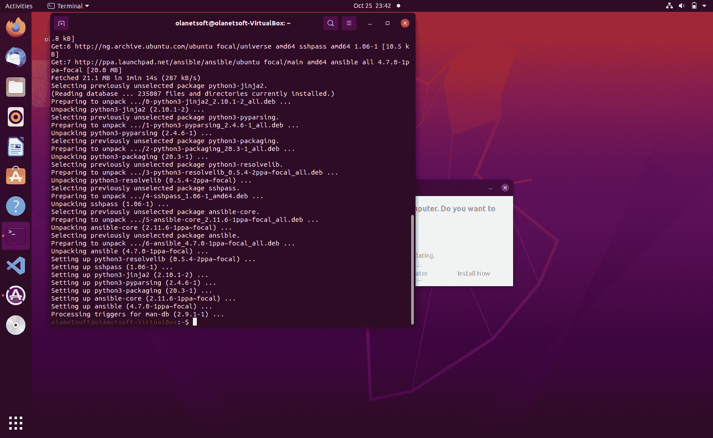
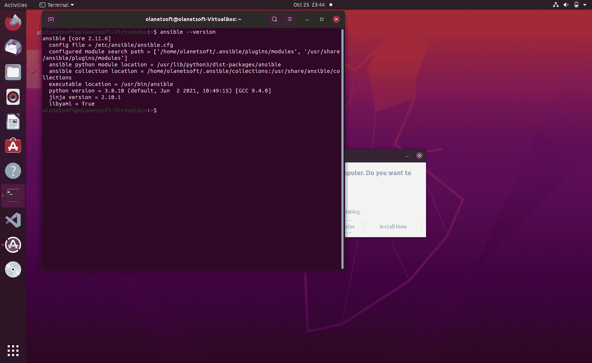
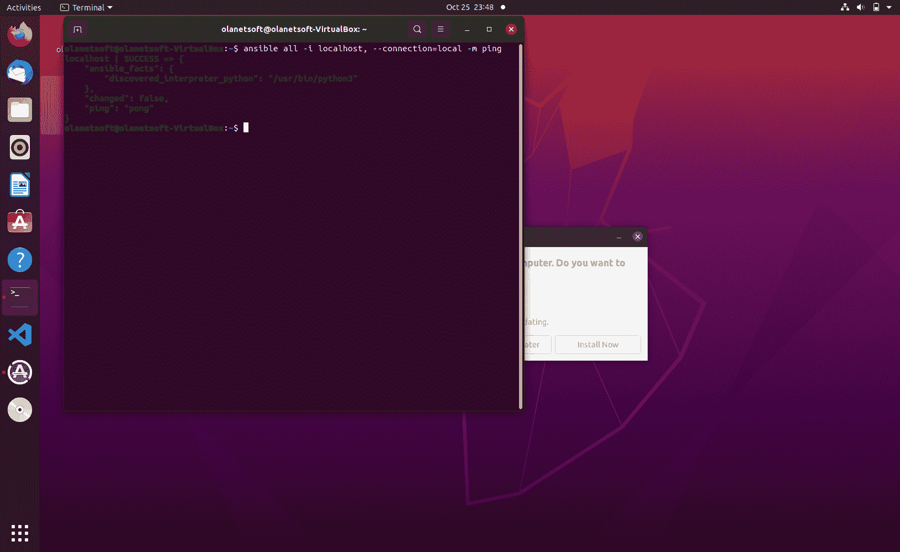
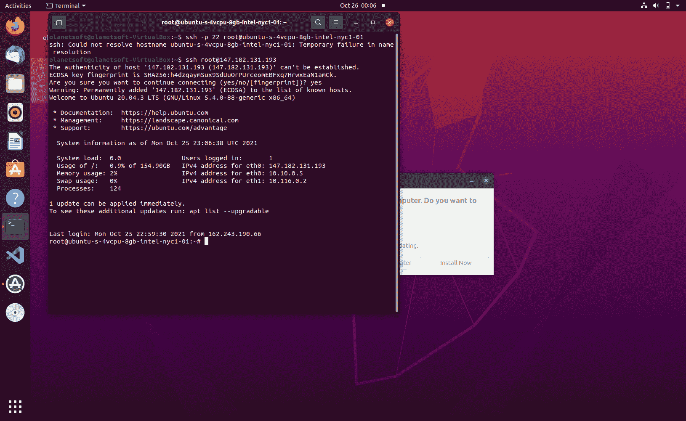
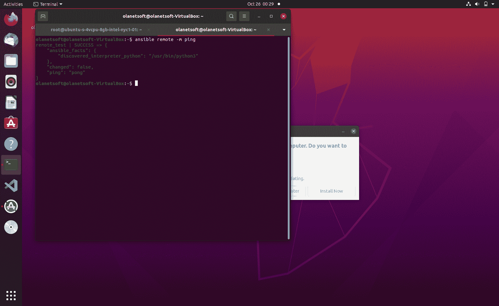

# 什么是 Ansible？自动化部分工作的工具

> 原文：<https://www.freecodecamp.org/news/what-is-ansible/>

大家好，今天我们将谈论 Ansible，这是一个神奇的软件工具，它可以让您以简单而有效的方式自动化跨平台的计算机支持。

## 目录

*   什么是 Ansible？
*   Ansible 是如何工作的？
*   安西布尔的建筑
    *   插件
    *   模块
    *   存货
    *   剧本
*   使用 Ansible 的好处
*   Ansible 为什么这么重要？
*   如何在 Ubuntu 上安装和配置 Ansible
*   结论
*   参考

## 什么是 Ansible？

Ansible 是一个生成书面指令的工具，用于自动化 IT 专业人员在整个系统基础设施中的工作。

它是专门为 It 专业人员设计的，他们使用它进行应用程序部署、配置管理、内部服务编排，以及系统管理员每周或每天做的几乎任何事情。

Ansible 安装简单，因为它不需要任何代理软件或其他安全基础设施。

虽然 Ansible 处于自动化、系统管理和 DevOps 的前沿，但它也是开发人员在日常工作中使用的有价值的工具。

Ansible 允许你一次建立不仅仅是一台机器，而是一个完整的网络，并且不需要任何编程知识。

## Ansible 是如何工作的？

Ansible 连接到网络上的节点(客户端、服务器等)。)然后给每个节点发一个叫 Ansible 模块的小程序。

然后，它通过 SSH 运行这些模块，并在完成后删除它们。

您的 Ansible 控制节点必须拥有对受管节点的登录访问权限，此交互才能工作。

最常用的身份验证方法是 SSH 密钥，但也允许使用其他方法。

如果您想了解如何安装和开始使用 Ansible，我们将在下面介绍。

## 安西布尔的建筑

现在我们来看看 Ansible 的架构以及它是如何管理运营的。

### 可转换插件

插件是增强功能的补充代码，您可能已经在许多其他工具和平台中使用过它们。你可以使用 Ansible 的内置插件，也可以自己创建插件。

例如:

*   动作插件
*   成为插件
*   缓存插件
*   回调插件
*   Cliconf 插件
*   连接插件
*   HTTP API 插件
*   库存插件
*   查找插件
*   Netconf 插件
*   试验

### 可变模块

模块是 Ansible 从中央控制工作站分发给所有节点或远程主机的简短程序。模块控制诸如服务和包之类的东西，并且可以通过行动手册来执行。

Ansible 运行安装更新或完成任何操作所需的所有模块，并在完成后删除它们。

### 易变库存

Ansible 使用清单文件来跟踪哪些主机是您的基础架构的一部分，然后访问它们来执行命令和行动手册。

Ansible 与基础设施中的各种系统并行工作。它通过选择 Ansible 的库存文件中提到的方法来实现这一点，默认情况下，库存文件保存在主机位置。

注册清单后，您可以使用简单的文本文件将变量分配给任何主机，并且可以从各种来源检索清单。

### 翻译剧本

IT 专业人员可以使用 Ansible 行动手册对应用程序、服务、服务器节点和其他设备进行编程，而无需从头开始。可翻译的剧本，以及其中包含的条件、变量和任务，可以被永久地存储、共享和重用。

行动手册的功能类似于任务手册。它们是简单的 YAML 文件，一种人类可读的数据序列化语言。

剧本是 Ansible 如此受欢迎的核心。它们指定可以快速完成的活动，而不需要用户知道或记住任何特定的语法。

## 使用 Ansible 的好处

*   Ansible 快速易用，因为它通过 SSH 运行所有操作，不需要安装任何代理。
*   Ansible 是一个免费的开源工具，安装和使用都很简单:Ansible 的剧本不需要任何特殊的编码知识。
*   Ansible 可用于执行简单的任务，如确保服务正在运行或从命令行重启，而不需要配置文件。

在更广泛或更统一的系统中，Ansible 可能更合适。它还提供了一组用于管理各种方法和云基础设施的模块。

## Ansible 为什么这么重要？

现代化和数字化转型需要必要且有针对性的自动化。在当今的动态环境中，我们需要新的管理解决方案来提高整个 IT 基础架构的速度、规模和稳定性。

技术是我们改进产品的最有力的工具。以前，完成这项工作需要大量的手工劳动和复杂的协调。但是今天，ansi ble——一个简单而强大的 IT 自动化引擎，被成千上万的企业用来简化他们的设置和加速 DevOps 操作——是可用的。

## 如何在 Ubuntu 上安装 Ansible

运行以下命令在您的计算机上配置 PPA 并安装 Ansible:

更新存储库:

```
sudo apt-get update 
```

安装软件属性:

```
sudo apt-get install software-properties-common 
```

然后像这样安装 Ansible:

```
sudo apt-add-repository --yes --update ppa:ansible/ansible 
```

然后运行以下命令:

```
sudo apt-get install ansible 
```

您应该有类似于下图所示的内容:



现在您已经成功安装了 Ansible，让我们使用下面的命令来测试它是否正常工作:

```
ansible --version 
```



我们将使用下面的命令来指示 Ansible 将所有系统作为清单主机 localhost 的目标，并且我们将从您的本地控制台(而不是 ssh)运行模块 ping。

```
ansible all -i localhost, --connection=local -m ping 
```

您应该会得到类似如下所示的响应:



### 如何修改 Ansible 目标主机

我们将在`/etc/ansible/hosts`中对主机文件进行修改。这是默认文件，Ansible 在其中搜索任何已定义的主机(和组),在这些主机上应该远程执行给定的命令。

```
sudo nano /etc/ansible/hosts 
```

将下面几行添加到文件中，并保存修改:

```
[local]
localhost 
```

使用调整后的清单文件执行以下命令:

```
ansible all --connection=local -m ping 
```

响应应该类似于下面的内容:


### 如何配置远程服务器

我们使用一个数字海洋水滴将我们的 Ansible 测试程序部署到我们的远程服务器上。

使用下面的命令 ssh 到服务器:

```
ssh username@IP_Address 
```

> 注意:我们已经在配置文件中配置了一个 ssh 密钥，它是在创建 droplet 时选择的。



### 如何为远程服务器配置 Ansible

我们将使用下面的命令编辑/etc/ansible/hosts 中的 hosts 文件:

```
sudo nano /etc/ansible/hosts 
```

将下面几行添加到文件中，并保存修改:

```
[remote]
remote_test

[remote:vars]
ansible_host=IP_ADDRESS_OF_VIRTUAL_MACHINE
ansible_user=USERNAME 
```

要查看 Ansible 是否可以通过 SSH 连接到您的远程计算实例，让我们键入以下命令:

```
ansible remote -m ping 
```



我们将使用下面的命令制作 Ansible 剧本，这是告诉 Ansible 在远程服务器上运行哪些命令以及以什么顺序运行的典型方式。战术手册是用。yml 并遵循严格的格式。

在官方 [Ansible 文档](https://docs.ansible.com/ansible/latest/user_guide/playbooks_intro.html)中，您可以了解更多关于剧本的信息。

```
nano my-playbook.yml 
```

添加以下代码，告诉 Ansible 分几个步骤安装 Docker:

```
---
- name: install docker
hosts: remote
become_method: sudo
become_user: root
vars: #local variables
docker_packages:
- apt-transport-https
- ca-certificates
- curl
- software-properties-common

tasks:
- name: Update apt packages
become: true #make sure you execute the task with sudo privileges
apt: #use apt module
update_cache: yes #equivalent of apt-get update

- name: Install packages needed for Docker
become: true
apt:
name: "{{ docker_packages }}" #uses our declared variable docker_packages
state: present #indicates the desired package state
force_apt_get: yes #forces to use apt-get

- name: Add official GPG key of Docker
shell: curl -fsSL https://download.docker.com/linux/ubuntu/gpg | sudo apt-key add -

- name: Save the current Ubuntu release version into a variable
shell: lsb_release -cs
register: ubuntu_version #Output gets stored in this variable

- name: Set right Docker directory
become: true
shell: add-apt-repository "deb [arch=amd64] https://download.docker.com/linux/ubuntu {{ ubuntu_version.stdout }} stable"

- name: Update apt packages
become: true
apt:
update_cache: yes

- name: Install Docker
become: true
apt:
name: docker-ce
state: present
force_apt_get: yes

- name: Test Docker with hello world example
become: true
shell: docker run hello-world
register: hello_world_output

- name: Show output of hello word example
debug: #use debug module
msg: "Container Output: {{hello_world_output.stdout}}" 
```

我们现在可以用下面的命令执行它:

```
ansible-playbook my-playbook.yml -l remote 
```

之后，我们会看到一些神奇的事情发生(这可能需要一段时间)，在我们终端的最后一条调试消息中，我们应该会看到“Hello from Docker！”

## 结论

在本文中，我们详细介绍了 Ansible、它的优点、它的工作原理和功能、它的架构、插件、剧本、清单，以及如何在远程服务器上使用 Ansible 配置和部署 Docker。

感谢您的阅读！

## 资源

[易变单据](https://docs.ansible.com/)
[设置易变库存](https://www.digitalocean.com/community/tutorials/how-to-set-up-ansible-inventories)
[易变安装](https://docs.ansible.com/ansible/latest/installation_guide/intro_installation.html)

我很乐意在推特|[LinkedIn](https://www.linkedin.com/in/olubisi-idris-ayinde-05727b17a/)|[GitHub](https://github.com/Olanetsoft)上与你联系