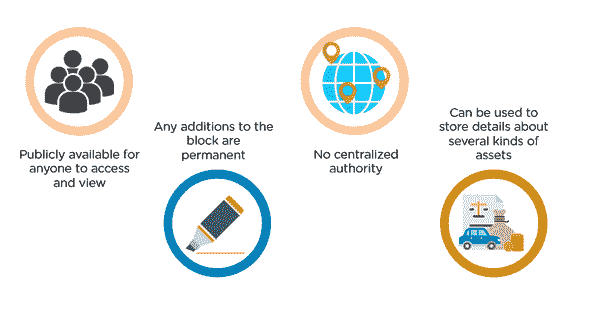
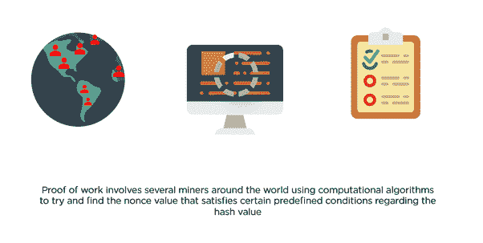

# 什么是区块链技术？区块链定义解释

> 原文：<https://www.freecodecamp.org/news/what-is-blockchain-technology-blockchain-definition-explained/>

## **区块链技术的特点**

区块链几乎总是被用来代替比特币和加密货币这些术语。还有很多其他地方可以使用这项技术。我们刚刚开始触及它的表面。

围绕它的所有宣传，我们知道区块链技术(BlockTech)将是巨大的。但它的独特之处在哪里？

在本文中，我们将探讨 BlockTech 的关键特征。

## 分散制

从设计上来说，区块链是一种去中心化的技术。

当一件事情由一个中央权力机构控制，决策权掌握在最高管理层手中时，这种制度被称为中央集权制。举例来说，银行是一个中央集权的系统，行长有责任做出决策。

相反，当权力掌握在人民或用户手中时，这种制度被称为分散制度。例如，对等网络 Torrent 是一个分散式系统，用户可以完全控制。

## 分布式分类帐

区块链使用分布式账本技术(DLT)来存储和访问周围的数据。

当某样东西存储在分布式分类账上时，它的多个副本会同时在网络上生成。与传统数据库不同，分布式分类帐没有中央数据库或管理功能。

在区块链这样的去中心化系统中应用时，每个用户都有一份账本，并参与交易验证。这就赋予了区块链不变性的属性，保证了安全性。因为数据是分布式的，所以没有供黑客破坏的数据的集中版本。数据和记录是公开的，很容易核实。这也消除了单点故障。

## 安全生态系统(加密哈希)

BlockTech 使用工作证明和哈希加密等概念来确保安全性和不变性。工作证明包括世界各地的几个人使用计算算法来尝试并找到满足关于散列值的预定义条件的适当散列值。

## 采矿

Torrent 是一个点对点的分散式网络，用于共享文件。BlockTech 使用类似的技术。区别用户的是，在 Torrent 中，系统依靠用户的荣誉代码来播种文件。而在区块链，参与交易的用户有经济激励。这些用户被称为“矿工”。矿工花费他们的计算资源来解决加密散列，并确保交易的不变性和可靠性。每一个成功的解决方案(解密)都确保了一些经济利益。

## 按时间顺序和时间标记

理想情况下，区块链只是非常复杂的链表，其中每个块都是一个存储库，存储与事务相关的信息，并链接到同一事务中的前一个块。这些块按顺序排列，并在创建时打上时间戳，以确保公平记录。

## 基于共识

基于共识是一种决策方法。这是一种创造性的、充满活力的方式，让一个群体的所有成员达成一致。区块链上的交易，只有网络各方一致认可，才能执行。然而，它可以根据各种情况进行修改。

### 关于区块链的更多信息:

*   [什么是区块链，它是如何工作的？](https://www.freecodecamp.org/news/what-is-blockchain-and-how-does-it-work/)
*   [区块链和以太坊技术入门](https://www.freecodecamp.org/news/technical-primer-to-blockchain-ethereum/)
*   [2 小时学会 Solidity 编程语言](https://www.freecodecamp.org/news/learn-the-solidity-programming-language/)
*   [利用这一免费课程构建您的首个区块链应用](https://www.freecodecamp.org/news/blockchain-app-etherium-solidity/)
*   [区块链开发最流行的编程语言](https://www.freecodecamp.org/news/the-most-popular-programming-languages-used-in-blockchain-development-5133a0a207dc/)