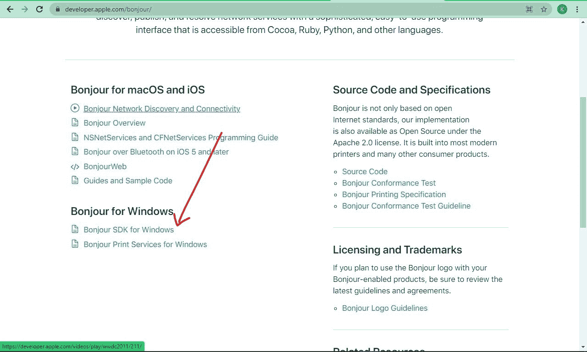
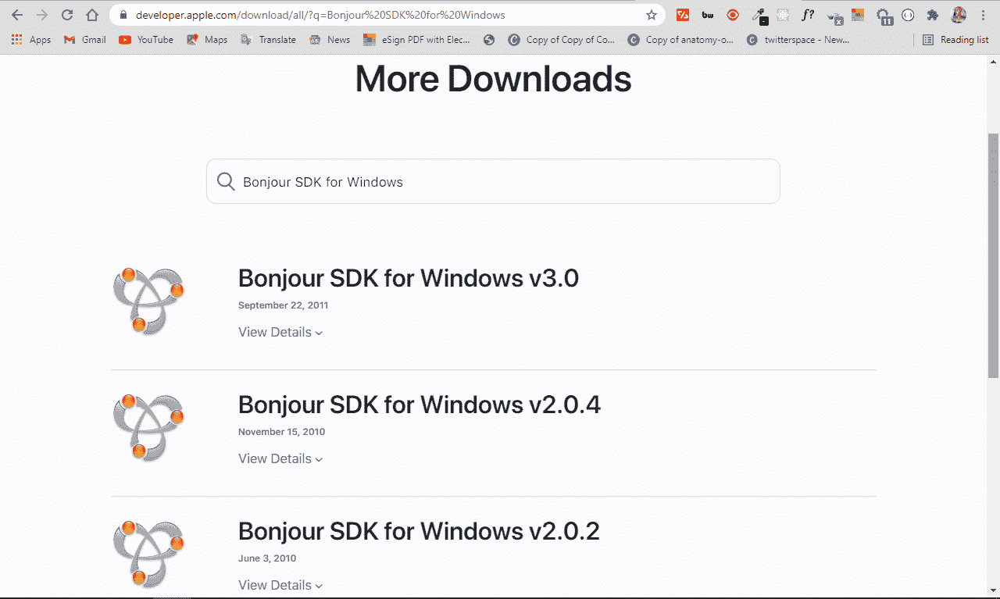
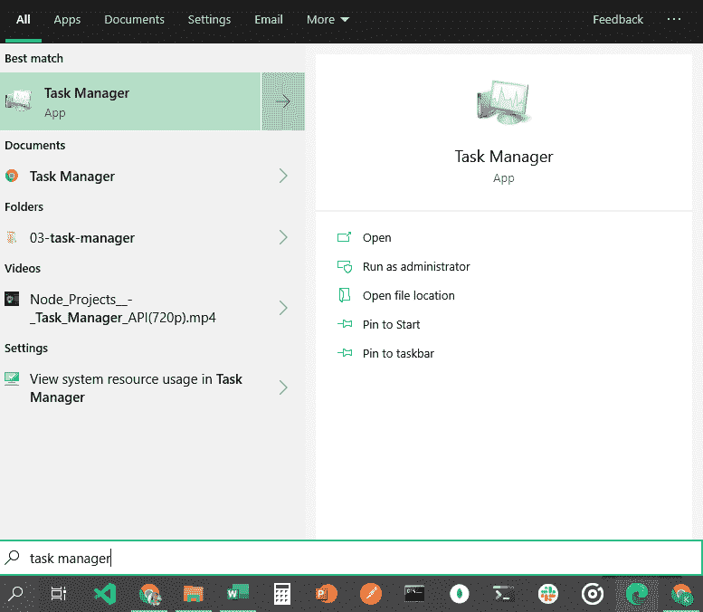
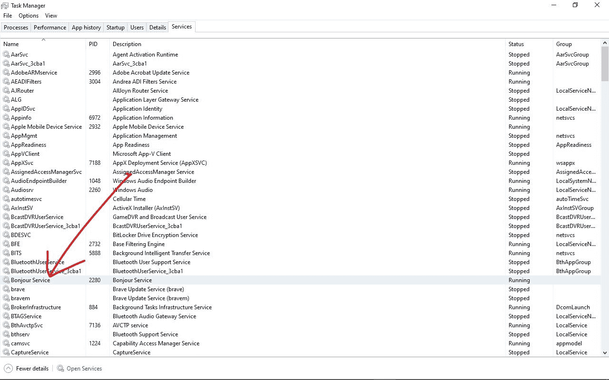
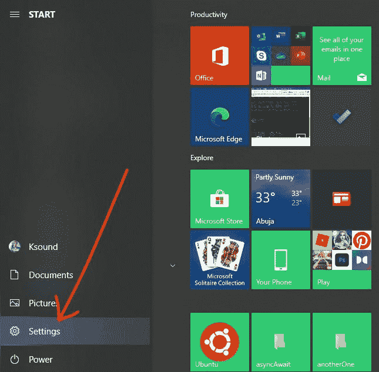

# 我的电脑上有什么 Bonjour？Windows 10 Bonjour 计划电脑指南

> 原文：<https://www.freecodecamp.org/news/what-is-bonjour-on-my-computer/>

苹果设备运行良好，并且容易与其他苹果设备连接。但是他们很难与运行其他操作系统如 Windows 和 Linux 的设备通信。

如果您同时拥有 Apple 和 Windows 设备，您可能想要通过局域网在它们之间共享文件。这就是苹果的 Bonjour 服务在幕后所做的事情。

在本指南中，我将带您了解 Bonjour 是什么，以及如何让它在 Windows 10 电脑上运行。

## 苹果的 Bonjour 程序是什么？

Bonjour 是苹果对零配置联网(zeroconf)的实现。它允许运行 Windows 和 Apple 操作系统(如 macOS 和 iOS)的设备在没有任何配置设置的情况下连接和共享资源。

使用 Bonjour，您可以在局域网上找到扫描仪和打印机等其他设备，并与它们连接。无论您使用的是什么操作系统，无论是 Windows、macOS 还是 Linux，您都可以共享文件。

## Bonjour 如何在电脑上工作

Bonjour 不是普通的软件产品。与其他软件和应用程序不同，您不能直接使用 Bonjour。

相反，Bonjour 在后台运行，并通过使用“链接寻址方案”将设备连接在一起，该方案会自动为本地网络上的设备分配 IP 地址。

使用 Bonjour 的应用程序示例包括 iTunes、Skype、iChat 和 iPhoto。

## 如何在 Windows 10 上启动和运行 Bonjour

与苹果设备与 Bonjour 协同工作不同，您可能需要在 Windows 10 电脑上手动安装 Bonjour。

Bonjour 不能作为独立的应用程序下载，因此您需要下载使用它的应用程序。

过去，它通常与 iTunes 和 Safari 浏览器等 Mac 应用程序一起放在一个 zip 文件夹中，但现在，iTunes 应用程序可能会通过 WiFi 网络为您下载它。

不过你可以从[苹果开发者网站](https://developer.apple.com/bonjour/)下载 Bonjour SDK(软件开发工具包)为你的 Windows 10 电脑安装 Bonjour。

确保您选择了 Bonjour SDK for Windows，如下所示:

一旦你这样做了，你将不得不用你的苹果 ID 登录。如果没有，可以创建一个。

成功登录后，您将看到不同版本的 Bonjour SDK。下载你想要的软件，打开安装程序，按照提示进行安装。

当安装 Bonjour SDK 时，Bonjour 程序也会随之安装。

## Windows 10 电脑需要 Bonjour 吗？

如果您使用依赖 Bonjour 在 Windows 电脑上运行的应用程序，您肯定需要 Bonjour 才能让应用程序有效运行。

此外，如果您使用跨多个操作系统(如 macOS、Windows 和 Linux)的设备，您可能需要将它们连接在一起以共享资源(如文件和设备)——这需要 Bonjour 来实现。这也会给你零配置的优势。

最后，如果你不像 Mac 那样使用苹果设备，但你有朋友使用，你应该考虑在你的设备上安装 Bonjour，这样你就可以与他们共享文件和其他资源。

## 如何在 Windows 10 上停止或卸载 Bonjour

如果您停止使用依赖 Bonjour 工作的应用程序，或者出于任何其他原因想要说再见，您可能想要停止 Bonjour。您可以从任务管理器中完成此操作。

**第一步**:点击开始，或者按键盘上的`WIN` (Windows)键。

**第二步**:搜索“任务管理器”，点击`ENTER`。

**第三步**:点击服务选项卡。在这里你会看到 Bonjour 服务，有时会以`"mDNSResponder.exe"`出现。

**第四步**:右键点击，选择“停止”。

### 要卸载 Bonjour，可以在设置应用中完成。

**第一步**:点击开始，或者按键盘上的`WIN` (Windows)键，选择设置打开设置 app。

**第二步**:选择应用。

**步骤 3** :在应用程序&功能标签上，滚动直到找到 Bonjour，或者搜索它。

**第四步**:选择卸载，再次卸载。

请注意，要完全删除 Bonjour 服务，您可能还需要卸载使用它的应用程序。如果您通过 Bonjour SDK 安装了 Bonjour，请确保您也卸载了 Bonjour SDK。

## 结论

Bonjour 是一项有用的服务，如果您在使用多种操作系统的设备上工作，它会给您带来更多的灵活性。

本指南向您展示了什么是 Bonjour 服务，它有什么作用，以及如何在 Windows 10 电脑上更好地控制它。

感谢您的阅读。如果你觉得这篇文章有帮助，请分享给你的朋友和家人。