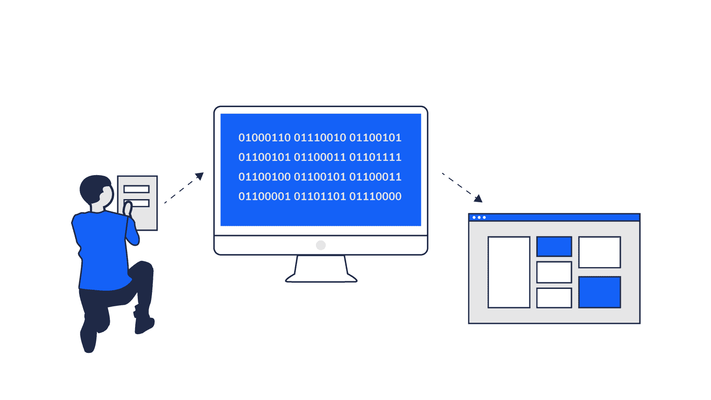
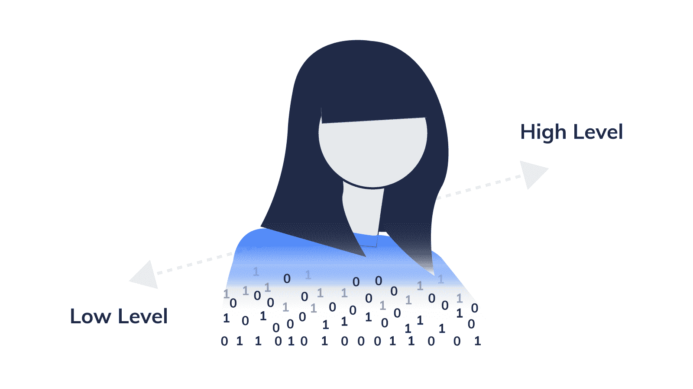
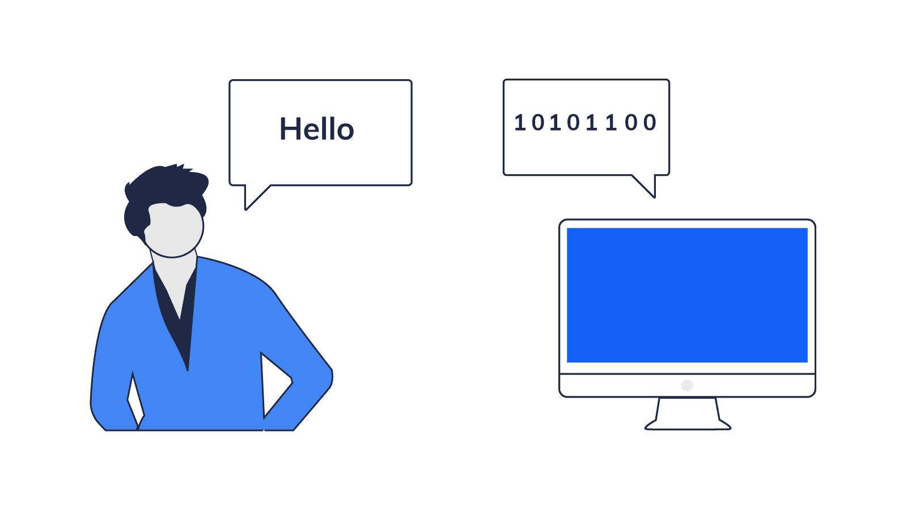
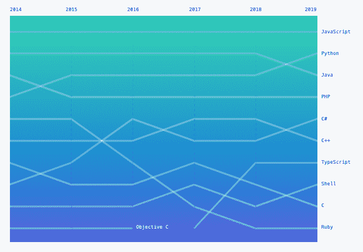
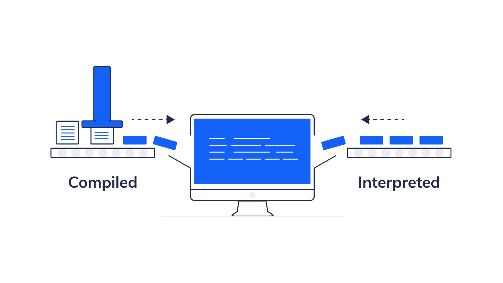
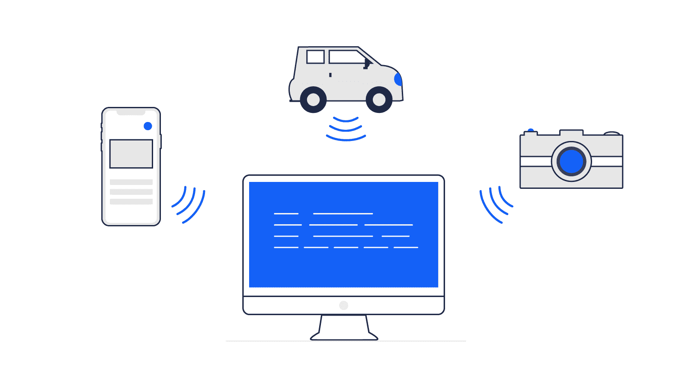
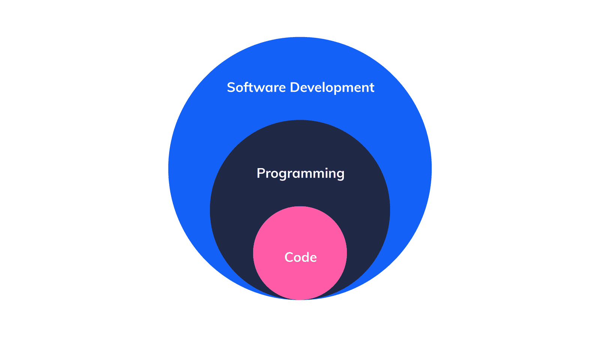
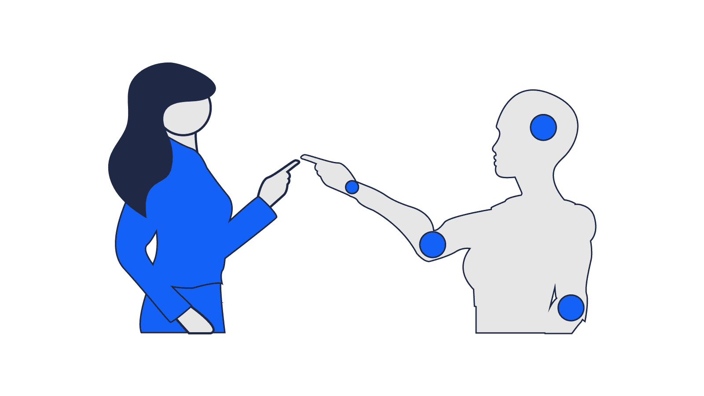

# 什么是计算机编程？定义软件开发。

> 原文：<https://www.freecodecamp.org/news/what-is-computer-programming-defining-software-development/>

一天，当我在家工作时，我五岁的儿子拉米走近我，问道:“妈妈，你在干什么？”

“我在工作，”我回答。

他看着我的笔记本电脑屏幕，再次询问道:“但是你在做什么呢？”

我愣了一下，开始思考这个问题。我是一名 web 开发人员，正在用 JavaScript 编程。我该怎么向一个五岁的孩子解释？

“我给计算机写指令，计算机就照我说的去做。这叫做编程，”我解释道。拉米看上去很困惑。

我继续说，“例如，我可以给计算机指令，将两个数字相加，它就会给我答案。”我写了一个加 2 + 2 的函数，并在我的屏幕上给他看答案。他的眼睛亮了。

从那时起，我开始思考*什么是编程*？引擎盖下到底发生了什么？当我在 2017 年开始在[免费代码营](https://www.freecodecamp.org/)上学习编码时，我使用了网站上内置的代码编辑器，并将看到结果。然而，我并没有真正理解幕后的魔术。

我开始做一些研究，这些是我搜索的一些术语:“什么是计算机编程？什么是软件？”“什么是计算机编程？”在谷歌上有超过 6 亿条搜索结果这有点像掉进兔子洞——可能会很复杂，让人不知所措。

我想为初学者提供一个关于计算机编程和软件开发的全面介绍。我将从计算机编程开始，然后介绍计算机编程语言。那我就说说软件和软件开发。最后，我将谈到计算机编程的当前趋势和未来。

如果您正在考虑过渡到编程领域，或者只是对学习编码感兴趣，那么这将为您提供一个总体概述，而不需要(太多！)技术行话。

只有一点需要注意:你可以用“开发人员”和“程序员”来表示写代码的人。

## 什么是计算机编程？



在维基百科上，“计算机编程”的定义是:

> “计算机编程是设计和构建可执行的计算机程序以完成特定计算结果的过程。”

但这意味着什么呢？

电脑本身并不智能。是的，他们很强大，有潜力比人类更快地完成任务。但是计算机需要人来编写指令，告诉它们做什么。

所以，编程就是写那些指令的过程。我们用编程语言来做这件事。这些指令被翻译成计算机可以理解的可读格式。这些指令随后由计算机执行。

## 编程如何泡杯茶


让我们以泡杯茶为例。如果你要给出如何泡茶的说明，它看起来会像下面这样:

1.  烧开一些水
2.  用茶包将热水倒入杯中
3.  让茶沏起来
4.  拿走茶包
5.  加入牛奶和/或糖(如果需要)

简单吧？

我们认为理所当然的是，与人类的交流不同于与计算机的交流。一个人有先验知识和生活经验——他们可能知道在哪里可以找到茶。我们假设他们知道牛奶储存在冰箱里。

人类也有直觉。如果你找不到杯子，你可以去橱柜里找找。还有解读人们的非语言暗示，比如肢体语言。

说到编程，你必须非常具体。继续如何沏一杯茶，你可以用[伪代码](https://en.wikipedia.org/wiki/Pseudocode)写这样的指令:

1.  去厨房
2.  找到水壶
3.  打开水壶的盖子
4.  把水壶装满水
5.  打开水壶
6.  等它沸腾到 100 摄氏度
7.  找个杯子

诸如此类。

如果像上面这样的指令是不够的怎么办？你可能需要添加一些*逻辑*来考虑所有的场景。例如:2)定位水壶。嗯，是电水壶还是你放在铁架上的水壶？你需要加上一个条件**如果**是电水壶，那么做 xyz。**否则**，为你放在铁架上的水壶做 xyz。

即使你认为你已经考虑到了每一种可能的情况，并且给出了非常具体的指示，还是有一些事情你可能没有预见到。你开始泡茶，然后出了点问题。哦不！你开始烧开水后，你的水壶就停止工作了。

发生了什么事？你的代码中有一个错误！bug 是代码中可能导致意外结果的错误或缺陷。为了修复你的代码，你要经历一个"[调试](https://en.wikipedia.org/wiki/Debugging)的过程，在这个过程中你会发现代码中的问题并解决问题。

在这种情况下，你的说明不包括将你的水壶加满 0.8 升以盖住加热元件。所以作为一种安全措施，水壶会自动关闭。

为了防止程序运行后出现错误，开发人员对他们的程序进行测试和单元测试。单元测试是为部分代码编写测试的地方。测试要么失败，要么通过。

例如，你写一个函数，把两个数相加:1 + 1。然后编写一个单元测试，预期输出是 2。所有答案都会失败，除非是 2。

你检查你的代码，直到一切运行没有任何意外的问题。因此，编程是一个详细的面向迭代的过程，在这个过程中，你不断地改进你以前写的东西。

## 你的电脑是如何理解你的代码的？



大多数程序员写的“代码”是一种高级编程语言。它是[设计的抽象](https://levelup.gitconnected.com/what-is-abstraction-in-programming-2f35c8c72e15)。在这种情况下，抽象意味着我们离机器代码越来越远，编程语言越来越接近口语。

但是计算机不能理解基于文本的代码。需要编译(翻译)成[机器码](https://en.wikipedia.org/wiki/Machine_code)。机器码是一组可以被计算机的[中央处理器](https://en.wikipedia.org/wiki/Central_processing_unit) (CPU)理解的指令。把 CPU 想象成计算机的大脑。机器代码由 1 和 0 组成。这叫做二进制。

例如，你可以这样用二进制写“Hello World ”:

`01001000 01100101 01101100 01101100 01101111 00100000 01010111 01101111 01110010 01101100 01100100`

如你所见，二进制对于人类来说不容易阅读，所以我们倾向于避免用机器码编程！

## 到底什么是编程语言？

编程语言既包括低级语言，如汇编语言，也包括高级编程语言，如 JavaScript 语言。



但是到底什么是编程语言呢？我能想到的最好的类比就是我们今天使用的口语。所有的语言都表达同样的意思，但对另一个人来说方式不同:

L1:你好

早上好

西班牙语:你好

编程语言是表达同一思想的不同方式，但对计算机而言。下面将用三种不同的编程语言打印出“Hello ”:

JavaScript: `alert(“Hello”);`

Python: `print(“Hello”)`

Perl: `print "Hello";`

每种编程语言都有自己的[语法](https://en.wikipedia.org/wiki/Syntax_(programming_languages))。在英语中，我们有语法。这同样适用于编程语言——它们都有自己的一套规则。

## 怎么知道一个编程语言是不是编程语言？

这似乎是一个奇怪的问题。所有的代码都是用编程语言写的吗？从技术上来说，不是。例如，有一种误解认为 [HTML](https://en.wikipedia.org/wiki/HTML) (超文本标记语言)是一种编程语言。它实际上是一种“[陈述性](https://en.wikipedia.org/wiki/Declarative_programming)语言，根据维基百科的说法是:

> *...一种构建计算机程序的结构和元素的风格——表达计算的逻辑而不描述其控制流*

换句话说，HTML 提供了网页的结构，但并不控制网站的行为或功能。

你可以通过一种语言是否“图灵完备”来判断它是不是编程语言。[图灵机](https://en.wikipedia.org/wiki/Turing_machine)是艾伦·图灵在 1936 年描述的一种假想机器。一门编程语言要成为[图灵全集](https://en.wikipedia.org/wiki/Turing_completeness)它需要:

1.  条件分支(我将在下面探讨)。
2.  读写无限长纸带的能力。这实质上意味着能够在内存中存储数据。

我不打算深入探讨这个话题，但如果你感兴趣，这个[视频](https://www.youtube.com/watch?v=RPQD7-AOjMI)是一个有用的介绍。

## 编程语言的基础是什么？

有一些基本元素是共同的特点。这包括变量、循环、条件语句、数据结构和算法。这些是大多数编程语言的组成部分。

### 什么是“for 循环”？

如果必须重复执行一组指令，For 循环非常有用。比如你有下午茶，要给客人泡五杯茶。为了泡一杯茶，你必须遵循一系列的说明，就像我前面的例子一样。

你可以告诉计算机循环执行相同的指令五次，而不是写五次指令。这使您能够扩展。

下面是一个基本`for`循环的例子:

```
for (let i = 0; i < 5; i++) {
  console.log("Make Tea!");
}

//expected output: 
"Make Tea!"
"Make Tea!"
"Make Tea!"
"Make Tea!"
"Make Tea!" 
```

### 什么是条件语句？

在 JavaScript 中，我们有`if...else`条件语句。当您希望基于某个条件执行不同的操作时，可以使用这些选项。

回到我之前的例子，你问用户**是否**他们想在茶里加牛奶。**如果**他们确实想要牛奶，那么在茶里加牛奶，**否则**什么也不做。

下面是 JavaScript 中一个`if...else`语句的例子:

```
if(milk == true) {
  // add milk
  } else {
  // don't add milk
} 
```

### 什么是数据结构？

> 数据结构是一种组织数据的方式，以便它能被有效地使用...它们是创建快速而强大的算法的基本要素。”

([数据结构易到进阶教程，威廉·费塞特](https://www.youtube.com/watch?v=RBSGKlAvoiM))

许多编程语言中常见的[数据结构](https://en.wikipedia.org/wiki/Data_structure)是数组、对象、元组和联合。我将以数组为例。

在 JavaScript 中，数组可以存储一系列数据，如数字和字符串(文本)。我喜欢在喝茶的时候吃饼干，所以我将它们存储在我的数组中:

```
biscuits = [“shortbread”, “digestive”, “ginger nut”]; 
```

这些饼干存储在计算机的内存中，作为开发人员，您可以通过引用其[索引](https://simple.wikipedia.org/wiki/Array_data_structure)来访问特定的饼干。你从 0 开始计算指数。索引就像饼干在饼干罐中的位置。您可以使用方括号符号来引用它。

```
biscuits[0]; // “shortbread”
biscuits[1]; // “digestive”
biscuits[2]; // “ginger nut” 
```

如果想得到一个消化饼干，可以访问它的索引位置:`biscuits[1]`。我很容易找到它，因为我知道它存放在哪里。

记住数组的第一项是索引 0。所以当你引用索引 1 时，它实际上是数组的第二项。

因此，数据结构是管理数据的一种方式。这包括存储和检索数据。如果数据以数据结构组织，执行算法会更有效。

### 什么是算法？

一个[算法](https://simple.wikipedia.org/wiki/Algorithm)是解决一个问题的一组特定的指令。这是一个抽象的概念。这里有一个链接，是 TED 关于“什么是算法？T2”的视频短片。”。

还记得我们之前在写如何泡茶的说明吗？这本质上是一种算法:一组连续的指令。

当我用 JavaScript 写我的第一个函数时，我实际上创建了我的第一个算法，而不知道它是一个算法！函数是算法的实现。

就像在现实生活中，一个编码问题往往有多个解决方案。例如，假设你打算去一家你从未去过的咖啡馆。有几种方法可以到达你的目的地。有些路线比其他路线耗时更长，但最终，它们都会把你带到同一个地方。理想情况下，你会选择最快、最有效、最容易的路线。

同样的原理也适用于编程。解决一个编码问题通常有几种方法，程序员努力寻找最优雅和有效的解决方案。

开发人员通常不会在第一次尝试时就做对！就像我会为一篇文章写初稿一样，编码也是一样。我会多次重新起草一篇文章，我可能会改变结构，编辑，重写章节，并删除不必要的句子。在编程中，我们会经历类似的过程，我们称之为[重构](https://en.wikipedia.org/wiki/Code_refactoring)我们的代码。

## 今天使用的主要编程语言是什么？有多少？

关于互联网上编程语言的总数似乎有一些争论。一些网站如维基百科列出了大约 700 种“所有著名的”当前和历史编程语言。其他网站如 [Tiobe](https://www.tiobe.com/tiobe-index/programming-languages-definition/#instances) 跟踪和监控 250 种“最流行”的语言。

在 [Github](https://github.com/) 上，2019 年最流行的编程语言是 JavaScript:



Source: [https://octoverse.github.com/#top-languages](https://octoverse.github.com/#top-languages)

### 为什么有这么多编程语言？编程语言是如何发展的？

开发不同的编程语言是为了满足不同的需求。这在整个编程语言的历史中得到了证明。请参考 O'Reilly 的图表，它描绘了从 20 世纪 50 年代到 2004 年的编程语言的历史。

在 20 世纪 50 年代中期，FORTRAN(公式翻译)被用来解决复杂的数学、统计和科学问题。COBOL(“通用面向业务语言”)创建于 1959 年，目的是让企业更容易使用代码。有一些语言更适合做统计分析，如 R (1976)。

从 20 世纪 70 年代开始，出现了通用编程语言，如 C、C++、C#和 Java。正如你在上面的图表中所看到的，通用语言占据了前 10 种最流行的语言。

JavaScript 创建于 1995 年，是一种流行的网络语言。它赋予网站交互性和生命力。

最近，我们已经看到了新语言的诞生，比如来自 Google 的 Go，它旨在更有效地维护大型软件系统。将来我们可能会看到更多的编程语言被创造出来。

## 编译与解释编程语言



随着你对编程语言越来越熟悉，你会遇到编译型和解释型编程语言。有什么区别？

### 什么是编译语言？

诸如 C、C++和 Java 之类的编程语言有一个“构建”过程，在这个过程中，你的代码被编译成计算机更可读的格式(机器语言)。

可能更容易想到两个说不同语言的人，但他们必须一起工作。约翰说英语，克洛伊说法语。克洛伊用法语写了一套如何制作巧克力蛋奶酥的说明，但是约翰看不懂。他们需要一个既会说英语又会说法语的翻译。如果翻译能在他们开始一起做饭前提前翻译克洛伊的指令就更容易了。

相反，开发人员“说”一种编程语言，如 Java 或 Python。在程序运行之前，他们需要将代码编译(翻译)成机器语言，这样计算机才能理解。

用编译语言编写的程序对计算机来说更容易理解，因此运行速度很快。

### 什么是解释型语言？

JavaScript、PHP 和 Python 都是解释型编程语言的例子。没有构建过程，代码也不需要编译。当你运行程序时，你的代码被一行一行的解释或阅读。

回到我对克洛伊和约翰的类比。约翰写下了一套制作牧羊人馅饼的说明。翻译没有提前翻译约翰的指令，而是加入他们的烹饪环节。克洛伊做饭时，翻译将约翰的每一行指令从英语翻译成法语。正因为如此，克洛伊准备和做饭的时间更长了。

因此，解释语言比编译语言慢。它们必须被即时翻译，这样计算机才能理解。

但是有了[即时](https://blog.sessionstack.com/how-javascript-works-inside-the-v8-engine-5-tips-on-how-to-write-optimized-code-ac089e62b12e) (JIT)编译器，解释语言变得更快更有效。

## 我应该选择学习哪种编程语言？

编程语言几乎做同样的事情，但它们只是向计算机表达相同指令的不同方式。一旦你掌握了一种编程语言的概念和基础，学习另一种语言的学习曲线就不会那么陡峭了。

您应该首先选择学习哪种编程语言取决于许多因素。例如，我想成为一名 web 开发人员，所以我选择 JavaScript 作为我的主要编程语言。你可以学习的其他网络语言是 PHP 和 Ruby on Rails。

如果你想成为一名数据科学家，那么 Python 可能是一个选择。Python 被认为是分析[大数据](https://en.wikipedia.org/wiki/Big_data)的最佳数据科学工具之一。我之前提到过 R，这是数据科学家和统计学家广泛使用的另一种语言。

Python 是一种通用编程语言，如果你想进入机器学习和人工智能领域，学习 python 也很有用。

如果你想成为一名软件工程师，那么 Java 可能是一个选择。Java 是世界上最流行和最受欢迎的语言之一。这是一种通用语言，可用于开发小型到大型企业软件。

所以，想想你想在科技行业扮演什么角色，想为什么样的公司工作。

选择一种编程语言还取决于你想要构建什么样的软件。这很好地引导我们进入下一部分。

## 什么是软件？



你一天中与软件互动多少次？

软件无处不在。它作为[嵌入式系统](https://en.wikipedia.org/wiki/Embedded_system)集成到日常设备中，比如你的微波炉、洗衣机、汽车、电视、儿童玩具和遥控器。还有更明显的与电脑相关的设备，它们有[应用](https://en.wikipedia.org/wiki/Application_software)和/或[系统](https://en.wikipedia.org/wiki/System_software)软件，比如平板电脑、智能手机、笔记本电脑、台式电脑和像 Alexa 这样的家庭助手。

普通人每天可能会与软件交互几十次，如果不是更多的话。这是我们日常生活的一部分。

所有的软件都是由开发者编写的。软件天生就是敏捷的，可以不断迭代。软件和硬件交织在一起。想象一下你的手机没有应用程序和操作系统。这款手机本质上是一块昂贵的砖头！因此，软件赋予硬件生命，硬件是我们与软件交互的方式。

程序员开发的大多数软件都是用高级编程语言编写的。

### 什么是软件开发？



软件开发是从一个想法的概念到开发和部署的一切。这个过程，从构思一个想法到部署软件，也被称为软件生命周期。

软件生命周期有几个阶段:发现、设计、编程/创建、测试和部署/执行。它还包括软件开发生态系统中的其他一切，如维护、文档和错误修复。

我不会在这里详细介绍，因为软件开发的主题值得单独撰写一篇文章。

## 软件开发和计算机编程的当前趋势

### 人工智能和机器学习



近年来，你可能听说过人工智能和机器学习这样的术语。有时它们可以互换使用，但它们是一样的吗？

不，它们不是一回事。机器学习是机器通过经验学习。而人工智能是一个更广泛的概念，即机器可以智能地执行任务。机器学习是人工智能的一个子集。

### 什么是人工智能？

我已经介绍了编程语言是如何工作的——程序员编写一组指令供计算机执行。人工智能(AI)是一个更广泛的概念，计算机可以模仿大脑的功能。它训练机器像人一样“思考”。

最大的问题是:你能在机器中复制人类智能吗？你能模仿人类学习、推理和感知的方式吗？艾伦·图灵在 1950 年的文章中提出了这个问题:

> “机器会思考吗？”

([计算机械与智能](https://phil415.pbworks.com/f/TuringComputing.pdf)，1950 年艾伦·图灵著)

在图灵的文章中，他提出了“图灵测试”,如果一个人不能区分人类和人工智能机器的反应，那么这个机器将被归类为“智能的”。

70 年后，AI 开发者、学者、科学家和研究人员仍在试图回答这个问题，创造一个人工智能机器。我认为我们还没到那一步。你试过和 Siri 或者 Alexa 对话吗？与这两款设备的对话仍然是基本的。不过，我相信技术进步只是时间问题。

像 DeepMind 这样的公司正在研究这个概念以及机器是否具有智能。DeepMind 的 [AlphaGo](https://deepmind.com/research/case-studies/alphago-the-story-so-far) 程序在围棋上击败了一名职业选手，成为头条新闻。这对人工智能来说是一个巨大的里程碑。

### 什么是机器学习？

[机器学习](https://en.wikipedia.org/wiki/Machine_learning) (ML)是人工智能的一个子集。ML 是一种不同的编程方式。这是一种想法，即计算机具有学习的能力，而无需显式编程。1959 年，亚瑟·塞缪尔在他的[论文](https://www.semanticscholar.org/paper/Some-Studies-in-Machine-Learning-Using-the-Game-of-Samuel/e9e6bb5f2a04ae30d8ecc9287f8b702eedd7b772)中首次提出了机器学习的想法:

> 编程计算机从经验中学习，最终将消除对这种细致编程工作的需求

当我教我儿子如何识别猫时，我会给他看猫的照片。我反复这样做，直到他能够在没有我提示的情况下认出一只猫。

机器学习与此类似。你给你的电脑一百张猫的图像(输入)。然后，它学习数据中的模式，并通过重复建立分类系统。如果你给你的电脑更多的猫和其他动物的图片，它应该能够识别图片中的动物是猫还是不是猫。它基本上已经学会了猫应该长什么样。

ML 给你的计算机数据和例子，反过来，它能像婴儿和小孩一样自己学习。不是开发人员给计算机指令，而是计算机创建自己的指令集来遵循——机器学习算法。机器学习算法是 ML 的一个子集，这是一个被称为[“深度学习”](https://en.wikipedia.org/wiki/Deep_learning)的概念。

> “人工智能是我们人类正在研究的最深刻的事情之一。比火或电更深刻……”

(桑德尔·皮帅，[世界经济论坛](https://www.youtube.com/watch?v=sqd516M0Y5A)，2020 年 1 月)

引用 Alphabet 公司首席执行官桑德尔·皮帅的话，总结了人工智能和人工智能的重要性。

## 计算机编程的未来是什么？

这最后一部分将是我对计算机编程未来的预测。

开发者将继续创造新的编程语言。编程语言将变得更加抽象，因此对于学习编码的个人来说是容易理解的。

我相信中小学课程将更加重视编码和编程教育。随着技术和软件越来越多地融入我们的日常生活，对开发人员和程序员的需求只会增加。编程将变得无处不在。

我们将看到 ML 和 AI 在软件开发过程中帮助开发者的不断兴起和流行。这包括自动化测试，以及检测和预防漏洞和错误。

人工智能将彻底改变我们社会的方方面面，而不仅仅是编程和软件开发。例如，我们已经看到了人工智能和自动驾驶汽车领域的巨大进步。

由埃隆·马斯克创立的[特斯拉](https://www.tesla.com/)是世界领先的开发无人驾驶汽车的公司之一。在人类司机的监督下，特斯拉汽车现在可以自动改变车道，在限制通行的高速公路上自主导航，车主可以召唤汽车进出车库或停车场。特斯拉的目标是创造一种全自动、无人驾驶的汽车。

随着机器变得越来越聪明，我们可能会达到机器超过人类智力的地步。这被称为[奇点](https://en.wikipedia.org/wiki/Technological_singularity)。目前看来，这似乎完全是科幻小说！但是像[雷·库兹韦尔](https://en.wikipedia.org/wiki/Ray_Kurzweil)这样的著名人物预测，具有人类水平智能的机器将在未来 20 年内问世。库兹韦尔因其对技术发展的准确预测而闻名。他写了一本关于这个的书:[精神机器的时代](https://en.wikipedia.org/wiki/The_Age_of_Spiritual_Machines)。

超级智能机器将如何改变我们的社会？

## 最后的话


技术影响和代码几乎触及我们生活的每一个部分。从我们对娱乐(在线游戏、流媒体)和购物方式的选择，到我们选择吃什么，甚至我们如何约会！代码很重要，更多的工作将会转移，需要人们至少对编程有一些基本的理解。

然而，根据 2019 年全球开发者人口和人口统计研究[，全球只有大约 2390 万名开发者。从这个角度来看，世界上只有 **0.3%** 的人口知道如何编程。正如我前面所讨论的，我们对软件和技术的依赖正在增加。根据](https://evansdata.com/reports/viewRelease.php?reportID=9)[美国劳工统计局](https://www.bls.gov/ooh/computer-and-information-technology/software-developers.htm#tab-6)的数据，从 2018 年到 2028 年，对软件工程师的需求预计将增长 21%。因此，我们需要增加开发人员的数量。

如果你想成为一名开发者，从今天开始。这是一个令人难以置信的激动人心的时刻！网上有很多学习代码的资源。还有像 [freeCodeCamp](https://www.freecodecamp.org/) 这样的自定进度平台。还有一个 Laurence Bradford 写的很棒的[帖子，里面汇集了所有免费学习编码的最佳资源。做一些研究，找出哪种资源适合你的学习风格。](https://learntocodewith.me/posts/code-for-free/)

如果你有什么问题或者只是想打个招呼，可以在 Twitter 上找我 [@PhoebeVF](https://twitter.com/PhoebeVF) 。

*特别感谢来自 [Undraw](https://undraw.co/) 的 Katerina Limpitsouni 为本文创作插图。*