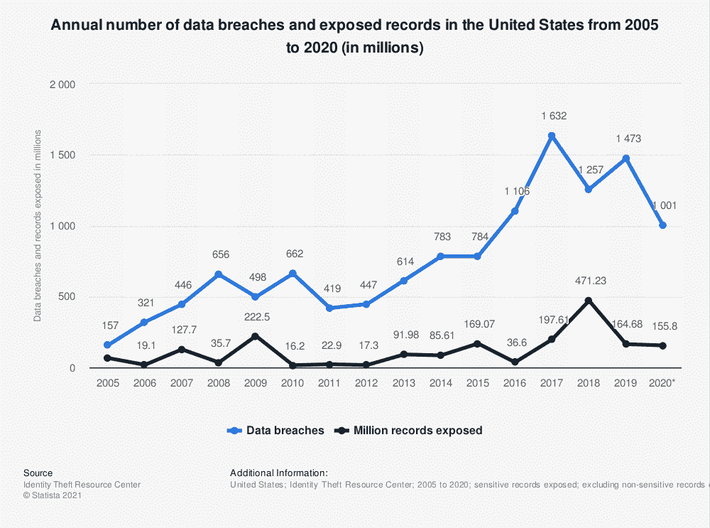
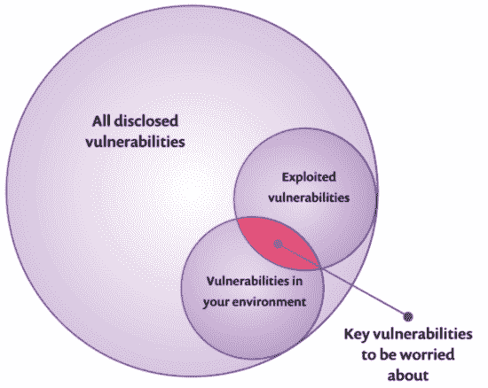
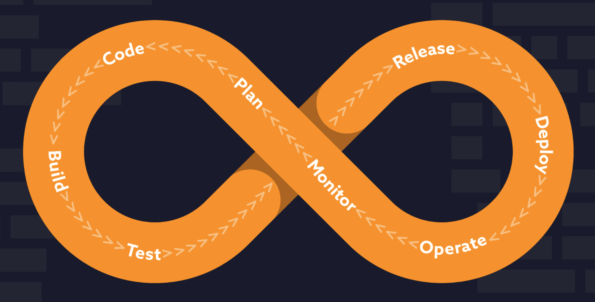
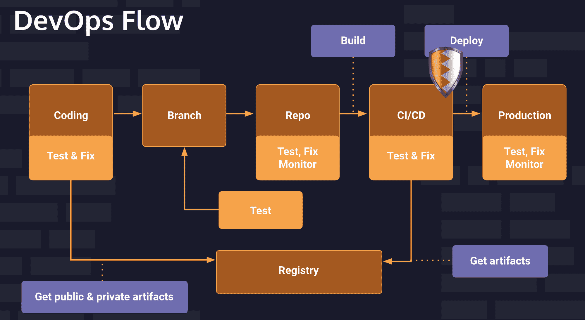
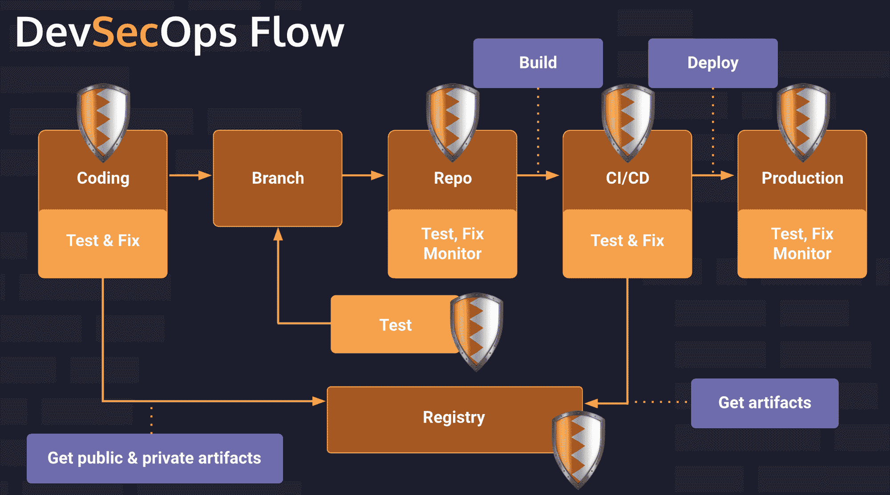
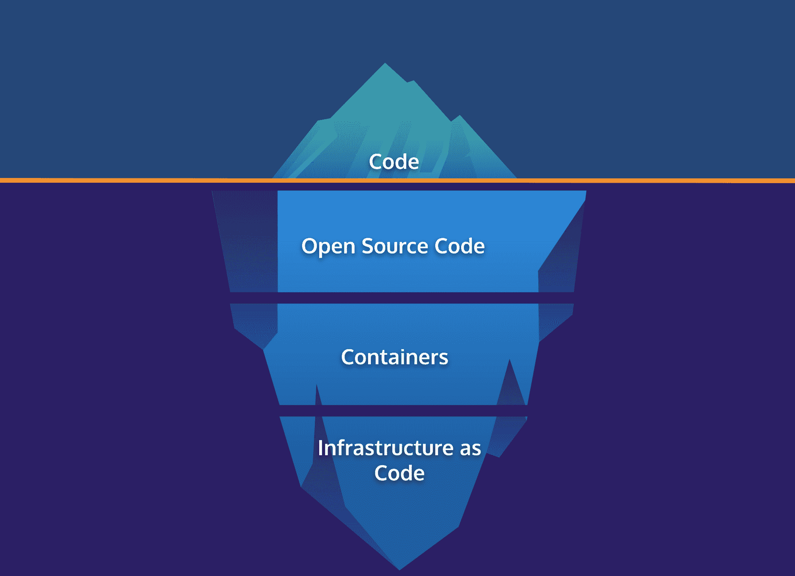
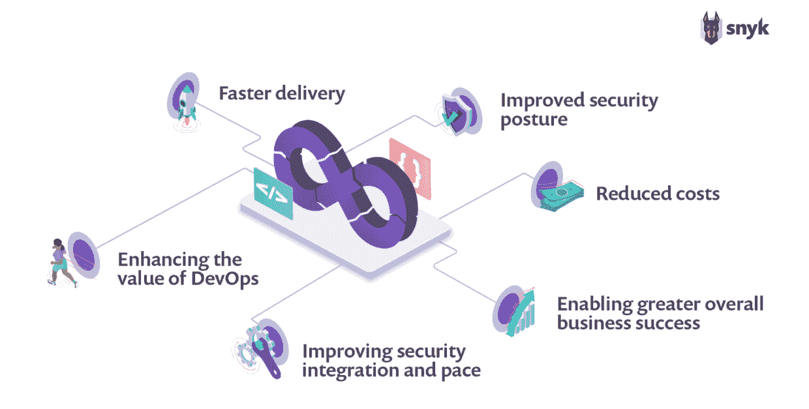

# 什么是 DevSecOps？如何保护网站或应用程序

> 原文：<https://www.freecodecamp.org/news/what-is-devsecops/>

每天，大公司的软件都有漏洞被利用。了解如何保护您的应用程序免遭数据泄露非常重要。

在本文中，您将了解 DevSecOps 和 web 安全。

本文附有一个视频课程。文章重点介绍了定义和理论。视频课程还将向您展示如何利用常见的 web 漏洞，如何修复这些漏洞，以及如何使用 DevSecOps 工具来确保您的应用程序是安全的。

您可以观看下面的视频课程或 freeCodeCamp.org YouTube 频道上的[。](https://youtu.be/F5KJVuii0Yw)

[https://www.youtube.com/embed/F5KJVuii0Yw?feature=oembed](https://www.youtube.com/embed/F5KJVuii0Yw?feature=oembed)

感谢 [Snyk](https://snyk.io/) 提供资助，使得本教程和视频课程的开发成为可能。

## 什么是 DevSecOps？

[DevSecOps](https://snyk.io/series/devsecops/) 指的是将安全实践集成到 DevOps 软件交付模型中。在 DevSecOps 模型中，安全目标尽可能早地集成到软件开发的生命周期中，安全考虑在整个生命周期中都很重要。

要真正理解 DevSecOps，首先理解 DevOps 和漏洞是有帮助的。

### 脆弱点

先说漏洞。安全性的全部意义在于防范漏洞，因此让我们了解不同的类型，然后我将讨论 DevOps。

2020 年数据泄露的平均成本为 386 万美元，到今年年底，全球网络犯罪成本预计将达到 6 万亿美元。据估计，90%的 web 应用程序容易受到黑客攻击，其中 68%的应用程序容易泄露敏感数据。

根据身份盗窃资源中心的数据，2020 年，美国有超过 1000 起数据泄露事件。超过 1.558 亿人受到数据泄露的影响。

### 漏洞、利用和威胁

在考虑安全性时，理解漏洞、利用和威胁之间的区别很重要。

**安全漏洞**是一种软件代码缺陷或系统配置错误，黑客可以利用它对系统或网络进行未经授权的访问。一旦进入系统，攻击者就可以利用授权和特权来危害系统和资产。

**漏洞利用**是黑客利用漏洞的方法。漏洞通常是一个定制软件或一系列命令。

甚至还有可以嵌入受损网页的漏洞利用工具包，它们在网页中持续扫描漏洞。一旦检测到弱点，该工具包会立即尝试部署漏洞，例如将恶意软件注入主机系统。

一个**威胁**是真实的或假设的*事件*，其中一个或多个漏洞利用漏洞发起攻击。

只有少量的已知漏洞会被用来侵入系统。构成最高风险的漏洞是那些被利用的可能性更高的漏洞，因此应该优先处理。

## 安全漏洞的类型

在与软件相关的所有不同领域都可以发现安全漏洞。以下是一些应用和网站常见的安全漏洞。

web 应用程序中有两个不同的重要弱点列表。第一个列表是由开放 Web 应用程序安全项目(OWASP)创建的。他们有一个名为 [OWASP Top 10](https://owasp.org/www-project-top-ten/) 的流行列表，列出了最常被利用的漏洞。

第二个列表是 [CWE](https://cwe.mitre.org/) ，或常见弱点枚举，这是一个“社区开发的具有安全影响的常见软件和硬件弱点类型的列表”这份名单是由 MITRE 公司管理的，这是一家经营联邦政府资助的 T2 研发中心的非营利公司。他们创建了 CWE-25，这是他们列出的 25 个最危险的软件弱点。

在 CWE-25 中，有 3 种主要类型的应用程序和网站安全弱点:

1.  多孔防御
2.  风险资源管理
3.  组件之间不安全的交互

## 1.多孔防御

漏洞防御的弱点是允许用户绕过或欺骗身份验证和授权过程。身份验证验证试图访问系统的人的身份，而授权是分配给用户的一组访问和使用权限。

漏洞百出的防御弱点包括:

*   弱密码编码
*   凭证保护不足
*   缺失或单一因素身份验证
*   不安全继承的权限
*   没有及时过期的会话

所有这些漏洞类型都可能让黑客成功访问敏感资源。

利用这些漏洞的攻击可能包括:

*   凭据填充攻击
*   劫持会话 id
*   窃取登录凭据
*   中间人攻击

## 2.风险资源管理

另一个漏洞类别是内存、函数和开源框架等资源的高风险管理。

这些漏洞包括:

*   **越界写入或读取(也称为缓冲区溢出):**应用程序可能被诱骗在预期内存缓冲区的末尾或开头之前写入或读取数据。
*   **路径遍历:**允许攻击者获取路径名，从而访问受限目录之外的文件。稍后我会展示一个例子。

利用这些漏洞，黑客可以控制应用程序、破坏文件或访问敏感信息。

## 3.组件之间不安全的交互

如今，许多应用程序通过各种服务、线程和进程发送和接收数据。不同组件彼此完好无损的方式可能会引入漏洞。

以这种方式暴露 web 应用程序或网站的弱点包括:

*   **跨站点脚本或 XSS:** 当用户输入未得到安全处理时，XSS 攻击就有了可乘之机，攻击者可以将客户端脚本注入其他用户浏览的网页。这是一个非常常见的漏洞。
*   **跨站点请求伪造(CSRF):** 对看似合法和真实的请求是否被故意发送的不正确验证。这些攻击通常通过社会工程媒介进行，如欺骗用户点击链接的伪造电子邮件，然后向用户已经通过身份验证的网站或服务器发送伪造的请求。

如果应用程序和网站没有正确实施组件之间交互的安全控制，这将使它们容易受到后门攻击、脚本攻击、蠕虫、特洛伊木马和其他利用恶意代码对基础架构、数据和系统造成严重破坏的攻击。

### 最常见的漏洞

在 OWASP-10 和 CWE-25 列表之间，显然访问控制漏洞是最大的漏洞。94%的应用程序都有某种形式的访问控制漏洞。

访问控制确保用户不能超越他们的预期权限。如果设置不正确，可能会导致未经授权的信息泄露、修改甚至数据破坏。

### DevOps

现在来说说 DevOps，它是 DevSecOps 的重要组成部分。

DevOps 是一个被谈论和书写了很长时间的概念，并且出现了许多关于 DevOps 的定义。

DevOps 基本上是一套结合了软件开发(Dev)和 IT 运营(Ops)的实践。它旨在缩短系统开发生命周期，并提供高质量的持续交付。

DevOps Pipeline

大多数现代 DevOps 组织将依赖于持续集成和持续部署/交付系统的某种组合，其形式为 [CI/CD 管道](https://snyk.io/learn/what-is-ci-cd-pipeline-and-tools-explained/)。作为生命周期的一部分，可以执行各种自动化安全测试和验证，而不需要人工操作。这是软件开发生命周期的一部分。

下面是一个常见 DevOps 流程的示例。首先，开发人员将编写代码并将其推送给回购人。此时，CI/CD 管道开始。有自动化测试，然后构建一个版本，最终部署到生产中。每一步都有测试来保证代码质量。在这种模式下，安全性有时只在部署到生产环境之前才被考虑。

DevSecOps 遵循类似的流程，但是在整个过程中增加了自动化的安全性考虑。安全性与 DevOps 集成在一起。DevSecOps 将安全目标作为整体目标结构的一部分。

盾牌代表所有我们测试安全性的地方。不同的步骤使用不同的工具，稍后我会谈到一些特定的工具。

DevSecOps 应该被认为是 DevOps 的自然延续，而不是一个独立的想法或概念。

旨在识别和理想地解决安全问题的活动是在应用程序开发的生命周期早期注入的，而不是在产品发布之后。这是通过让开发团队在软件开发生命周期(SDLC)中独立执行许多安全任务来实现的。

要在应用程序开发的早期集成安全目标，请在编写第一行代码之前就开始。安全性可以在系统、应用程序或单个用户故事的初始概念阶段集成并开始有效的威胁建模。静态分析、linters 和策略引擎可以在开发人员签入代码的任何时候运行，确保在变更进一步向上游移动之前处理掉任何容易摘到的果实。稍后，我将向您展示如何在编写代码时使用工具来检查代码的安全性问题。

可以应用软件组合分析来确认任何开源依赖项具有兼容的许可证并且没有漏洞。我将向您展示如何使用一个工具来检查软件依赖性的安全性问题。获得关于你所写代码的相对安全性的即时反馈是非常有帮助的，这有助于个人开发者对安全问题负责。

一旦代码被检入，静态应用程序安全测试(或 [SAST](https://snyk.io/learn/application-security/static-application-security-testing) )工具可以用来识别漏洞和执行软件组合分析。SAST 工具应集成到提交后流程中，以确保对引入的新代码进行前瞻性漏洞扫描。有了 SAST 工具集成，可以在软件开发生命周期的早期修复漏洞，并降低应用程序风险和暴露。

在代码构建之后，您可以开始使用安全性集成测试。在隔离的容器沙箱中运行代码允许自动测试网络调用、输入验证和授权等内容。这些测试通常是动态应用程序扫描工具(或 DAST)的一部分。这些测试产生快速的反馈，使得任何被识别的问题能够快速迭代和分类，对整个流程造成最小的干扰。如果出现像未解释的网络调用或未整理的输入这样的事情，测试就会失败，管道就会以报告和通知的形式向相关团队生成可操作的反馈。

接下来，可以测试正确的日志记录和访问控制。应用程序是否正确记录相关的安全和性能指标？访问是否仅限于正确的个人子集(或完全被阻止)？

最后，应用程序进入生产阶段。但是安全测试仍在继续。自动修补和配置管理可确保生产环境始终运行最新、最安全的软件依赖版本。

可以使用特殊的技术和工具来保护集装箱。稍后，您将学习如何在真实环境中做到这一点。

利用 DevSecOps CI/CD 管道有助于整合每个阶段的安全目标，从而保持快速交付。

整个方法有助于最大限度地减少影响生产的漏洞，从而降低与修复安全缺陷相关的成本。DevSecOps 的目标是将安全性构建到交付过程的每个阶段，从需求阶段开始，并建立安全自动化计划。

## 软件项目冰山

当考虑安全性时，你应该记住你的代码只是冰山一角。

在一个普通的软件项目中，只有 10-20%的代码是定制代码。是的，确保你的定制代码是安全的是很重要的，但是还有很多需要考虑的。

许多代码库的 80-90%由开放源代码、模块和库组成。您导入的框架和库本身可以导入更多的框架和库。这是你自己没有写的代码。

The node_modules directory of a project is often massive.

平均而言，80%的漏洞是在直接依赖关系中发现的。如果您导入了易受攻击的依赖项，那么您编写安全代码的能力有多强也没用。

然后是容器。这些通常由数百个从公共资源继承的 Linux 包组成。再说一遍，代码不是你自己写的。

你不能忘记基础设施是代码。这为恶意行为者打开了一堆新的攻击媒介。错误配置是头号云漏洞。

正确实施的 DevSecOps 应该涵盖所有这些领域。

## DevSecOps 的重要性

### 为什么 DevSecOps 实践很重要？

随着公司越来越大，通常会有更多的软件、云技术和 DevOps 方法。

软件越多，意味着组织面临的风险就越多，这使得保护数字资产变得越来越困难。

云技术意味着许多 IT 和基础设施风险都转移到了云上。这提高了许可和访问管理的重要性，因为任何地方都可以访问任何东西。

正如您所看到的，DevSecOps 将安全性引入了 DevOps，使开发团队能够保护他们按照自己的进度构建的内容，同时还在开发和安全从业者之间建立了更好的协作。安全团队提供专业知识和工具来增加开发人员的自主权，同时仍然提供一定程度的监督。

### DevSecOps 模型的 6 大优势(与传统的 DevOps 模型相比)

1.  **更快的交付:**当安全性集成到管道中时，软件交付的速度得到了提高。在部署之前识别并修复缺陷，使开发人员能够专注于发布特性。
2.  **改进的安全状况:**从设计阶段开始，安全就是一项功能。从构建、部署到保护生产工作负载，共享责任模式确保了安全性的紧密集成。
3.  **降低成本:**在部署前识别漏洞和缺陷，可大幅降低风险和运营成本。
4.  **提升开发运维的价值:**通过将安全实践整合到开发运维中，改善整体安全状况，作为一种责任共担的文化。
5.  **提高安全集成和速度:**通过消除开发后改进安全控制的需要，降低了安全软件交付的成本和时间。
6.  **实现更大的整体业务成功:**对已开发软件的安全性的更大信任以及对新技术的采用，有助于提高收入增长和扩大业务范围。

## 结论

有很多工具可以帮助保护你的应用，其中很多是免费的。在本文附带的视频中了解更多关于如何使用它们的信息。

[https://www.youtube.com/embed/F5KJVuii0Yw?feature=oembed](https://www.youtube.com/embed/F5KJVuii0Yw?feature=oembed)