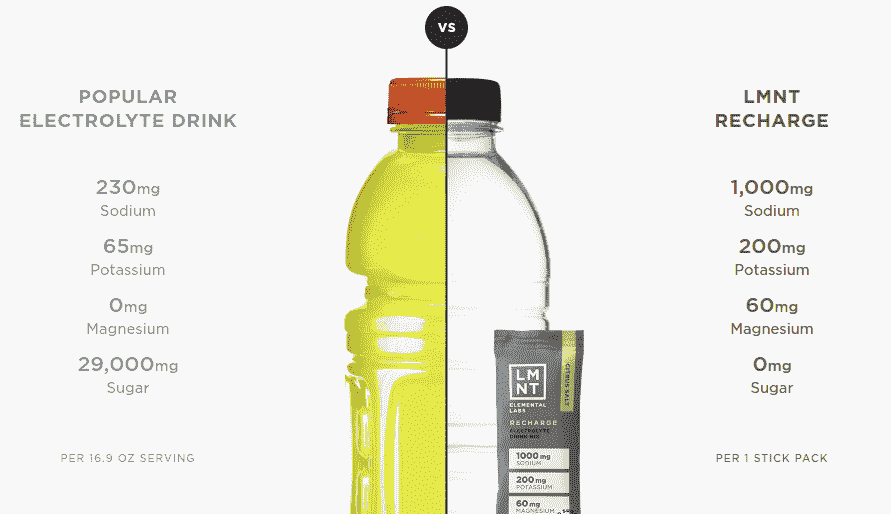
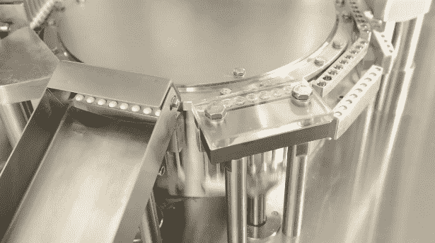
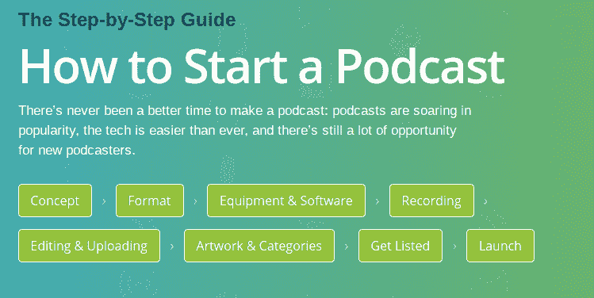

# 什么是数字设计，为什么它很重要？UX + UI +网页设计师乔布斯解释道

> 原文：<https://www.freecodecamp.org/news/what-is-digital-design-and-why-does-it-matter/>

我建立和设计了应用程序和网站，并帮助大大小小的公司扩展产品，从我自己的初创公司一直到谷歌。

我通过反复试验、开发周期、成功发布、产品失败、用户反馈和不可避免的迭代，了解了数字设计的最佳实践。

我想把我学到的东西传递下去。

我的经历希望能让你更好地理解数字设计是如何工作的，以及设计师在产品概念化中的作用。

通过这些课程，您将能够更及时、更有效地将产品推向市场，并更好地为您的用户服务。

## 什么是数字设计，为什么它很重要？

数字产品设计的形式化定义是一种迭代设计方法，采用形式化方法来解决实际问题。听起来有点复杂，对吗？

不需要这样。

使用更简单的语言，数字产品设计师发现一个当前的问题，使用多种技术提出最佳解决方案，并将其引入市场。

数字设计被认为是产品设计的一个子集，因为数字设计是关于产品的构建，但是通过软件。

你在 freeCodeCamp 上学习和发展的技能将帮助你从战略和技术上思考如何解决问题。这与数字设计的实践密切相关。

为了实现数字化设计，你需要发现机会，了解消费者的需求。

## 数字设计和现实世界

数字设计以用户为中心。

对客户的痴迷始于用户，并向反方向发展。

如果你是数字设计的新手，你可以采取一些战术步骤来了解客户重视什么，以及如何利用用户界面、UX 和设计思维的结合来解决实际问题。

### 你在解决什么问题？

首先，通过理解你的产品和设计要解决的问题，努力赢得并保持客户的信任。回答以下问题:这个产品为什么存在？会怎么用？

做得好的数字设计可以对用户产生深远的影响。

将直观的用户体验和简单的用户界面结合在一起，可以帮助您的客户更好地理解您的产品是如何工作的。

我的一个朋友致力于打造 iPad 阅读体验。他和我分享的一个故事是，数字设计师如何毫不费力地“翻页”数字书籍。

滑动页面的动作，很像在一本真正的书中移动纸张，证明了设计、UX 和用户界面的努力是如何结合在一起创造令人愉快的用户体验的。

下次你在 iPad 上滑动页面的时候，想想为什么这种体验感觉完全自然和简单。数字设计，做得好，很神奇。

### 创新和简化

其次，数字设计师期望并要求创新和发明，并总是找到简化的方法。正如你对客户的关注一样，你需要有外部意识，从任何地方寻找新的想法，不能被“不是这里发明的”思维模式所限制。

例如，在设计网站时，做好几件事非常非常重要。这是我在建立和优化自己的网站时学到的。

我有一个导师，他建议:

> “知道自己擅长什么，以及如何做得更好。如果你正在设计你的网站，你知道时间是宝贵的，你的用户在你的页面上多停留一秒钟就越好。强大的设计可以减少页面的额外延迟，提高服务环境的效率，这是我们努力的方向。”

请注意，这个建议是具体的(即，为速度而设计)，但也是宽泛的(尽你所能改善用户体验)。

当考虑数字设计时，花点时间深入理解你可以利用的杠杆，以及这些杠杆将如何为你的用户带来更好的体验和结果。

### 实验是关键

第三，实验。

数字设计，不像物理项目的设计，可以通过 sprints 和代码部署快速改进。

软件是可调的。

通过从你的客户开始，逆向工作，寻求简化，不断迭代，你可以确保你的设计最终会坚持下去。如果你还没有达到这一点，继续努力。

这是一个我喜欢和朋友一起玩的心理实验。

想想你最近一次在网上购买机票的情形。从登录页面导航到付款确认页面需要多少步骤？

你觉得航空公司为什么要让用户经历这个退房流程？你将如何改进和简化流程？

提高你的数字设计技能的一个好方法是在另一个设计师的地产上练习。看看你是否能改进它。

数字设计师将在某方面的卓越视为起点，而非终点。通过迭代和实验，一个数字设计师可以用新颖的和意想不到的方式来改进工作得好(或差)的东西。

如果你是数码设计领域的新手，这会让你兴奋不已。

### 数字设计做得好的例子以及它如何帮助用户

我想以数字设计做得好的例子来结束我的演讲。我提供了例子和图片，并解释了为什么数字设计是直观、简单和相关的。

如果你想发展你在这个领域的技能，花时间不仅考虑你将如何改进其他人的网站，还要从这个领域的领导者那里学习什么，以及*为什么*。

### 示例#1

Elemental Labs 提供了令人难以置信的直观图形，帮助用户了解他们的产品与竞争对手的产品之间的差异。无需阅读其他任何东西，你就能直观地理解他们的产品被宣传为更清洁、更纯净、更简单。

颜色之间的对比有助于视觉理解信息，是优秀数字设计的一个例子。

另外，注意克——一个常用的度量单位——是如何被毫克代替的。这让用户感觉有更多的糖(29，000 毫克的糖*感觉*很多)。

### 实施例 2

Woven 是一个有趣的日历应用程序，可以轻松进行群体投票。我用过各种软件工具来协调团队，但总是有点乱。

看看信息图和行动号召有多干净。不需要深入思考产品，你就可以清楚地了解产品如何工作，为什么它会让你受益:只需选择一个日期，民意测验，看看哪个日期对团队最合适。

我喜欢结合了引人注目的设计、UX、用户界面，并且非常容易操作的产品。

### 实施例 3

对于那些想要从数字和物理设计的世界中得到一个例子的人来说，我特别喜欢的是 LFA 机器。

他们的产品很复杂:他们提供半自动和全自动胶囊充填机。对于许多人来说，这项技术是抽象的，因为他们没有亲眼见过这样的机器。

那么网站是做什么的呢？它提供了一个视频，当你参观时会自动播放，这样你就可以看到该设备是如何工作的，以及它提供了什么好处。这种数字设计集简单、清晰和客户痴迷于一身。

### 实施例 4

这是最后一个例子。

如果你想开始一个播客，你可以尝试不同的数字播客软件。Buzz Sprout 结合了简单性、易用性和出色的数字设计标准。

当用户第一次访问他们的网站时，用户会得到关于如何创建播客的引人注目和直接的指导、教程和建议。

这些单选按钮说明了一切:它们使选择过程非常用户友好，并加快了播客的创建过程。在一个按钮中，这种设计融合了强大的设计和产品美学以及可用性。

