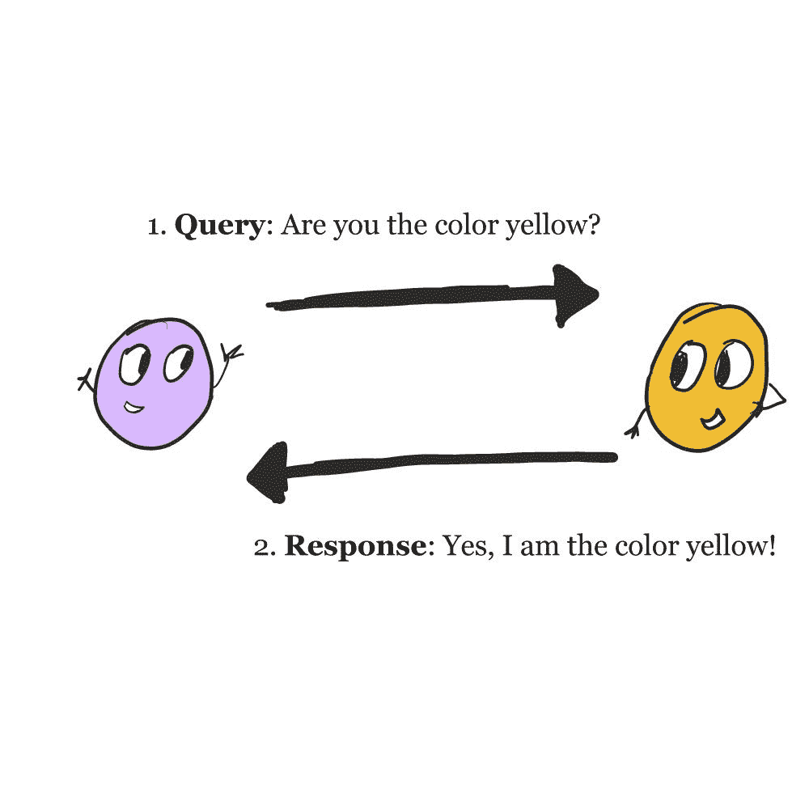
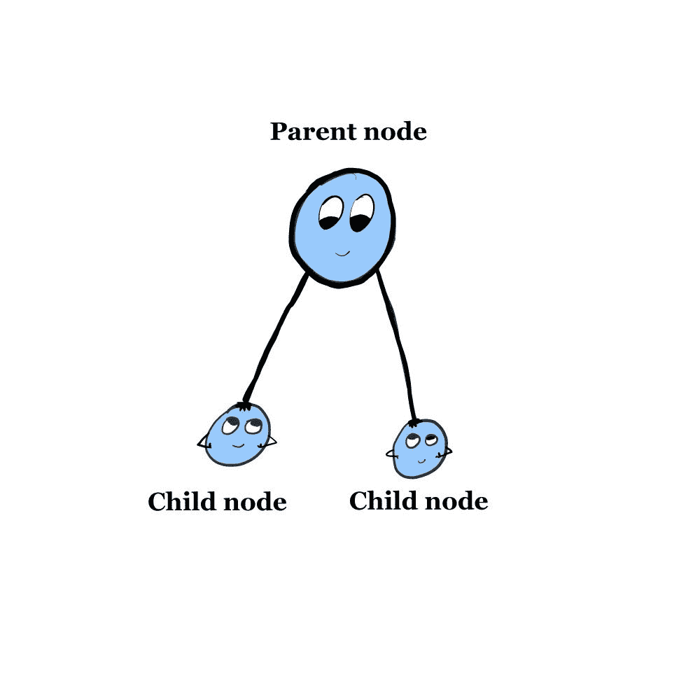
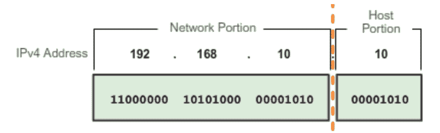
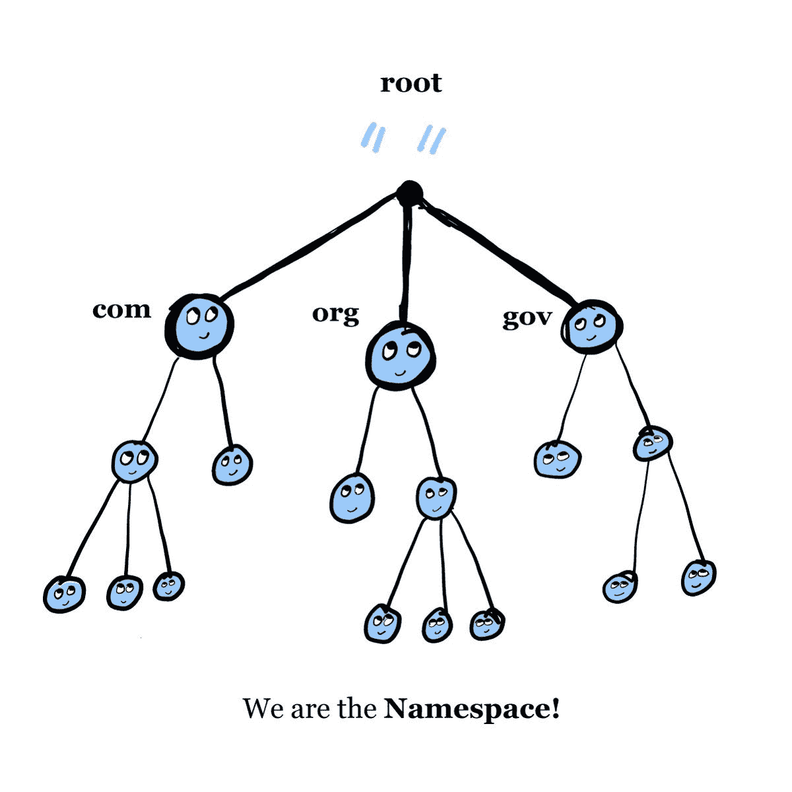
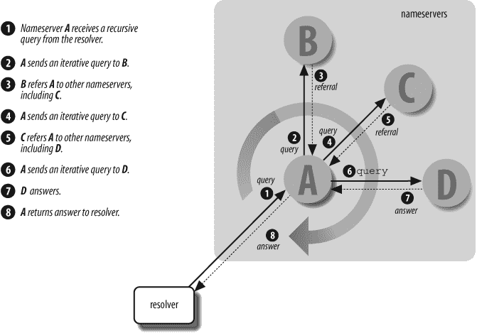

# 什么是 DNS？解释域名系统、DNS 服务器和 IP 地址的概念

> 原文：<https://www.freecodecamp.org/news/what-is-dns/>

## 介绍

阅读完本文后，您应该对以下内容有了更好的理解:

1.  什么是 DNS，它做什么
2.  DNS 服务器做什么
3.  互联网协议(IP)地址如何在 DNS 环境中工作

### 重要概念

在学习 DNS、DNS 服务器和 IP 地址时，需要熟悉一些基本的心理模型。在开始学习 DNS 之前，先回顾一下这些概念

*   帮助理解用于描述符合这些模型的行为的所有不同术语，以及
*   帮助记忆保持。

当事情变得有点奇怪和不熟悉时，心理模型会给你一个参考框架。

所以还是打好基础吧。

*   质疑与回应。这是当事物 1 向事物 2 要求某事时，事物 2 回应那个要求。像这样:

Query and Response

*   像这样的父子节点关系和图形(只是更复杂)。

Tree graph

*   消息。它不是一个查询和响应，因为没有响应。在 DNS 的世界里，消息的格式和内容根据使用情况而有所不同。

Message

*   客户端-服务器关系。简而言之，服务器是为其他软件或硬件设备(称为“客户端”)提供功能的软件或硬件设备

    做好大量谈论服务器的准备。事实证明，有大量的服务器连接到我们称之为 DNS 的东西，以及我们人类在连接到互联网时如何使用它。

Client-server relationship

## 什么是 DNS？

域名系统(DNS)将人类可读的域名(在 URL 或电子邮件地址中)映射到 IP 地址。例如，DNS 将域名[freecodecamp.org](http://www.freecodecamp.org)转换并映射到 IP 地址 104.26.2.33。

为了帮助您充分理解本说明，本节详细介绍了:

*   DNS 发展的历史背景-它和 IP 地址解决了什么问题？
*   域名
*   IP 地址

### 历史关联

1966 年，美国政府机构高级研究计划局(ARPA)建立了一个名为 ARPAnet 的计算机网络。简而言之，把阿帕网想象成我们今天所知的互联网的第一次迭代。

阿帕网的主要目标包括

> “(1)即使在部分设备或网络故障的情况下也能提供可靠的通信，(2)能够连接到不同类型的计算机和操作系统，(3)是一种合作努力，而不是由一家公司控制的垄断。为了在设备故障时提供可靠的通信，ARPANET 的设计使得没有一个点或链路比其他任何点或链路更重要。这伴随着冗余路由的建立和如果网络的任何部分出现故障时数据的即时重新路由的使用。

### 问题

DNS 和 TCP/IP 对于解决 ARPAnet 的两个问题至关重要:

对于 ARPAnet，只有一个位置(一个名为 HOSTS 的文件。TXT ),其中包含网络中每台主机的所有名称到地址的映射。

> “主持人。TXT 由 SRI 的*网络信息中心*(被称为“NIC”)维护，从一台主机 SRI-NIC 分发。[ [*](https://learning.oreilly.com/library/view/dns-and-bind/0596100574/ch01.html#ftn.dns5-CHP-1-FN1) ]阿帕网的管理员通常会将他们的更改通过电子邮件发送到网卡，并定期通过 FTP 发送到 SRI-NIC，获取当前的主机。TXT 文件。他们的改动被[编成了新的*主机。TXT* 文件一周一到两次。](https://learning.oreilly.com/library/view/dns-and-bind/0596100574/ch01.html)”

这种设置有三个挑战:

1.  对于负责的主机来说，文件的流量和负载分布变得太多了。
2.  名称冲突——每个主机都必须有一个唯一的名称，并且没有一个集中的机构来防止网络用户添加一个具有冲突(非唯一)名称的主机，从而“破坏整个方案”
3.  一致性——更新文件并确保所有主机都有最新版本变得不可能，或者至少非常困难。

本质上，宿主。TX 是一个单点故障，所以这里的整个过程不能很好地扩展到超过一定数量的主机。ARPAnet 需要一个分散的、可扩展的解决方案。是域名系统。[来源](https://learning.oreilly.com/library/view/dns-and-bind/0596100574/ch01.html)

同一网络内的主机对主机通信不够可靠。TCP/IP 帮助解决了这个问题。

1.  传输控制协议(TCP)为将消息(主机之间)转换为数据包的过程提供质量保证措施。TCP 协议是面向连接的，这意味着必须在源主机和目的主机之间建立连接。
2.  互联网协议(IP)定义了消息(数据包)如何在源主机和目的主机之间传送。IP 地址是通向网络主机的特定路径的唯一标识符。
3.  TCP 和 IP 紧密合作，这就是为什么它们通常被称为“TCP/IP”
4.  虽然我不会在本文中深入探讨，但 TCP 和用户数据报协议(UDP)都在 DNS 的数据传输层中使用。UDP 更快，更不可靠，并且不需要连接；TCP 更慢，更可靠，但是需要连接。它们在 DNS 中根据需要适当使用；不用说，APRAnet 中包含 TCP 是对数据传输层的宝贵补充。

到 20 世纪 80 年代初，DNS 和 TCP/IP(以及 IP 地址)成为阿帕网的标准操作程序。

这段历史被删节得很厉害。如果您想了解关于这些主题的更多信息，请参考本文末尾的参考资料部分。

现在我们有了一些历史背景，让我们继续学习更多关于域名和 IP 地址的知识。

## 域名

在 DNS 的上下文中，域名提供了一种指向非本地资源的用户友好方式。这可以是网站、邮件系统、打印服务器或互联网上可用的任何其他服务器。域名可以不仅仅是一个网站！

> “域名的目标是提供一种命名资源的机制，使域名可用于不同的[主机、网络、协议族、互联网和管理组织。](https://tools.ietf.org/html/rfc1035)

与 IP 地址相比，域名更容易记忆并输入到终端或互联网浏览器中。

域名是统一资源定位符(URL)的一部分，但是这两个术语*不是同义词*。URL 是资源的完整网址，而域名是网站的名称，是每个 URL 的子组件。

虽然 URL 和域名之间有技术上的区别，但网络浏览器通常以同样的方式对待它们，所以如果你输入完整的网址，或者只是域名，你就可以访问网站。

### 顶级域名和二级域名

任何给定的域名都有两个部分:顶级域名(TLD)和二级域名(SLD)。当从右边(结尾)移动到左边(开头)时，域名的各个部分变得更加具体。

这一开始可能会令人困惑。例如，我们来看看“freecodecamp.org”

*   网址:https://www.freecodecamp.org
*   域名:freecodecamp.com
*   TLD:组织
*   SLD:免费代码营

在 ARPAnet 的早期，可用的顶级域名数量有限，包括 com、edu、gov、org、arpa、mil 和两个字母的国家代码域名。这些顶级域名最初是为参与阿帕网的机构保留的，但有些后来在商业市场上可以买到。

今天，有一个相对丰富的可用顶级域名，包括网络，航空，商业，合作，信息，博物馆，名称，等等。

二级域名是指可以通过域名注册商(例如，Namecheap)进行个人购买的域名。

## IP 地址

虽然 IP 地址在功能上与 DNS 相关，但互联网协议本身在技术上是独立于 DNS 的。我已经为这种区别提供了历史背景，所以现在我将解释 IP 地址如何工作。

如前所述，IP 地址是通向网络主机的特定路径的唯一标识符。我想引用一个电话号码和一部电话的类比:电话号码并不代表电话本身，它只是一种联系拥有电话的人的方式。

对于 IP 地址来说，这种类比是相当恰当的(至少从表面上来看)。IP 地址代表一个端点，但它不是端点本身。IP 分配可以是固定的(永久的)或动态的(灵活的，可以重新分配)。

像域名一样，IP 地址的组织也遵循层次结构。与域名不同，IP 地址从左到右变得更加具体。下面是一个 IPv4 示例:

This diagram shows that 129.144 is the network part and 50.56 is the host part of an IPv4 address.

*   网络:分配给网络的唯一编号
*   主机:标识网络上的主机(机器)

如果需要更大的特异性，[网络管理员可以对地址空间划分子网，并委派额外的号码](https://docs.oracle.com/cd/E19683-01/806-4075/ipref-1/index.html)。

### 有多少个 IP 地址？

IPv4 是 ARPAnet 在生产中使用的第一个 IP 版本。部署于 80 年代初，它仍然是最流行的 IP 版本。这是一个 32 位方案，因此可以支持略超过 40 亿个地址。

但是等等，这就够了吗？没有。

IPv6 有一个 128 位的方案，这允许它支持 340 个十进制地址。它还提高了 IPv4 的性能。

示例 IPv4 地址:

*   104.26.2.33(自由代码营)

IPv6 地址示例:

*   2001:db8:a0b:12f0::1(压缩格式且不指向 freeCodeCamp)

# 域名系统是如何运作的？

所以，我们了解了域名！我们已经了解了 IP 地址！那么它们与域名系统有什么关系呢？

首先，它们符合名称空间。

## 域命名空间

如语言“顶级”域和“二级”域所暗示的，命名空间是基于层级的

> "...与组织结构大致对应的层级，名称用“."作为标记层次级别之间边界的字符."[来源](https://tools.ietf.org/html/rfc1034)。

这个树根在顶部的树形图最好地说明了结构:

The Namespace

让我们把它分解，从顶部开始。

这个图表的顶部标有“.”被称为“根”

> 服务于 DNS 根区域的权威名称服务器，通常称为“根服务器”，是一个由分布在世界许多国家的数百台服务器组成的网络。它们在 [DNS 根区域中被配置为 13 个命名机构。](https://www.iana.org/domains/root/servers)

根域有一个零长度标签。

从这里开始，图中的每个节点(点)都有一个长达 63 个字符的唯一标签。

从根开始往下的第一层是顶级域名:com、org、edu 和 gov。请注意，此图表不包含顶级域名的完整列表。

在顶级域名之下是二级域名。每个节点的子节点称为“子域”，它们仍被视为父域的一部分。例如，在 freecodecamp.org，freecodecamp(SLD)是 org(TLD)的一个子域。

根据网站的层次结构，可能有三级、四级、五级域名。比如在 hypothetical-subdomain.freecodecamp.org，hypothetic-subdomain 就是三级域名，freecodecamp 的子域。以此类推，至少达到 127 级，这是 DNS 允许的最大值。

### 谁管理名称空间？

试图让一个人或一个组织管理所有的事情不是很疯狂吗？是的，会的。特别是因为 DNS 的主要设计目标之一是促进整个系统的分布式分散管理。

我希望我能告诉你负责的人被称为“名称空间国王”，但是唉。

域名称空间中的每个域(或子域)都是一个*区域*的一部分，该区域是名称空间中自主管理的部分因此，命名空间被划分为多个区域。

这些区域的责任通过授权和管理来管理。

将子域职责分配给其他实体的过程称为*委托。*

例如，自 2003 年以来，公众利益注册管理机构管理域名 org。freecodecamp 表示，公共利益注册管理机构可能会将管理 org 子域名的责任委托给其他方。然后，管理 freecodecamp 的人可以将 freecodecamp 的子域(例如，hypothethical-subdomain.freecodecamp.com)的责任分配给另一方。

如果有人(组织、团队或个人)管理一个区域，他们所做的就是管理负责区域的[名称服务器。](https://learning.oreilly.com/library/view/dns-and-bind/0596100574/ch01.html)

这将我们带入域名系统中最基本的概念之一。

## 域名服务器

> 存储关于[域名空间信息的程序被称为域名服务器。](https://learning.oreilly.com/library/view/dns-and-bind/0596100574/ch02.html)

在这一点上，考虑客户机-服务器关系是有用的，至少在最初是如此。域名服务器是客户机-服务器关系中的“服务器”方。名称服务器可能加载一个、数百个甚至数千个区域，但它们从不加载整个名称空间。一旦名称服务器加载了整个区域，它就被称为该区域的*权威*。

为了理解为什么域名服务器以这样的方式运行，理解关系中的“客户”部分是有用的。

### 下决心者

在 DNS 中，客户端(信息的请求者)被称为“解析者”，乍一看可能有点落后。解析请求的服务器不是被称为“解析器”吗我也这么想，但事实并非如此。最好记住这句话，然后继续前进。

事实上，解析器通常包含在大多数操作系统中，因此安装在操作系统上的应用程序不必知道如何进行低级 DNS 查询。

DNS 查询和它们的响应是 DNS 消息的类型，并且有它们自己的数据传输协议(通常是 UDP)。解析器负责帮助安装在操作系统上的应用程序将对 DNS 相关数据的请求转换成 DNS 查询。

总之，解析器负责打包和发送数据请求。一旦解析器接收到响应(如果有的话)，它就以请求应用程序可使用的格式将该响应传递回最初的请求应用程序。

### 回到名称服务器

现在我们对关系的客户端有了更多的了解，我们需要了解域名服务器如何响应解析器查询。

域名服务器通过*解析*响应 DNS 查询。解析是名称服务器在名称空间中查找数据文件的过程。根据查询的类型，名称服务器对不同的查询有不同的响应，但最终目标是解决问题。

### 查询类型

查询类型？是的，有多种类型的 DNS 查询。但是首先，DNS 查询通常包含什么？这是一个信息请求，特别是与域名相关的 IP 地址。

*   *递归*:递归查询允许将查询提交给多个域名服务器进行解析。如果第一个查询的名称服务器没有所需的数据，则该名称服务器将查询发送到最合适的下一个名称服务器，直到找到具有所需数据文件的名称服务器并向解析器发送响应。
*   ***迭代* :** 迭代查询要求被查询的名称服务器以期望的数据或错误做出响应。响应可能包含下一个发送请求的最合适的名称服务器的 IP 地址；解析器然后可以向更合适的名称服务器发送另一个请求。

如果你需要的话，你也可以查询域名，如果你只有 IP 地址的话。这称为反向 DNS 查找。

一旦查询到达包含所需数据文件的名称服务器，就可以解析查询。名称服务器有许多与之相关的数据文件，所有或部分数据文件可用于解析查询。

### 资源记录

这些是域命名空间中的数据文件。这些数据文件有特定的格式和内容。

最常见的 RR:

*   一个记录:如果除了这个，你没有听说过其他的记录，那就说得通了。它可能是最著名的 RR，包含给定域的 IP 地址。
*   CNAME 记录:如果除了这个记录和 A 记录，你没有听说过其他记录，那也是有道理的。“C”代表“规范的”，用于代替 A 记录，为域分配别名。
*   SOA 记录:这个记录包含了一个人的管理信息，包括管理员的电子邮件地址。提示:如果您管理一个区域，请确保这里有一个有效的电子邮件地址，以便人们可以在需要时与您联系。
*   其他重要的资源记录(RR)类型有 PR、NS、SRV 和 MX。[在这里阅读它们](https://support.google.com/domains/answer/3251147?hl=en)。

### 缓存和生存时间(TTL)

当本地名称服务器接收到来自查询的响应时，它会缓存该数据(将其存储在内存中)，因此下次它接收到相同的查询时，它可以直接回答该查询，而不是经历最初的、更长的解析过程。

但是，一旦这些信息被缓存，它就既静态又孤立，因此有过时的风险。因此，所有资源记录都有一个所谓的*生存时间* (TTL)值，它决定了数据可以被缓存多长时间。当时间用完时(达到零)，名称服务器删除记录。

重要说明:TTL 不适用于包含资源记录的区域的权威名称服务器。它只适用于缓存该资源记录的名称服务器。

# 查询生命中的一天

我们在这篇文章中已经涉及了很多领域，并且在概念上也很重要。为了将所有这些联系在一起并使之成为现实，下面是查询生命中的一天(比喻的一天)。

[Source](https://www.oreilly.com/library/view/dns-and-bind/0596100574/ch02.html)

# 那我为什么需要知道这些？

熟悉 DNS 和 IP 地址相关概念的原因太多了。

*   首先，它是互联网的支柱，是我们许多人每天都在使用、发展感情(爱/恨/你说吧)并认为理所当然的东西。熟悉能够让我们借助当今的技术和互联网成就伟业的结构非常重要。
*   不可思议的聪明人花了几十年的时间来建造这个东西！让我们承认并感谢他们的贡献。
*   既然我已经说了很多，如果你负责公司、团队或你自己的业务中与基础设施相关的任何事情，熟悉 DNS 概念是很重要的。当重大问题突然出现时，有一个参考框架可以让你更快地采取行动，更快地找到解决方案。

# 结论

此时，您应该了解什么是 DNS，什么是名称服务器，并且熟悉与 IP 地址相关的技术概念。

已经有很多书籍深入研究了 DNS 的迷人世界，还有很多东西需要学习。本文中未包括但属于 DNS 的一部分或非常相关的主题包括:

*   名称服务器实现
*   促进
*   (更多信息)节点标签
*   主要和次要名称服务器关系
*   重传算法
*   负载平衡
*   此外，关于互联网如何运行的其他更一般的主题，如:
*   环球信息网
*   超文本传送协议
*   文件传送协议
*   通信协议层:链路层、IP 层、传输层、互联网层等。

对于那些还在阅读并且想了解更多 DNS 的人，我首先推荐《DNS 和 BIND，第 5 版》，由克里凯特·刘撰稿，奥莱利传媒出版。它是无价的。

我也鼓励大家在下面链接的原始征求意见稿(RFC)里戳来戳去。不仅有阅读原始资料的要点，而且它们也是组织得非常好和容易理解的文件，这就是为什么我在这篇文章中引用它们。

# 资源

1.  [RFC 1034:域名-概念和设施](https://tools.ietf.org/html/rfc1034)
2.  [RFC 1035:域名-实施和规范](https://tools.ietf.org/html/rfc1035)
3.  [RFC 1122:对互联网主机-通信层的要求](https://tools.ietf.org/html/rfc1122)
4.  [关于 DNS 设计目标的更多信息，来自《互联:互联网百科全书》](https://ec2.freesoft.org/CIE/Course/Section2/5.htm)
5.  [互联网是如何诞生的，从阿帕网到翻译，从对话](https://theconversation.com/how-the-internet-was-born-from-the-arpanet-to-the-internet-68072)
6.  [学习 DNS 视频课程，由板球刘，从奥赖利媒体](https://learning.oreilly.com/videos/learning-dns/9781771373692?autoplay=false)

### 关于我的一点

我是克洛伊·塔克，俄勒冈州波特兰市的艺术家和开发者。作为一名前教育工作者，我一直在寻找学习和教学，或者技术和艺术的交集。请在 Twitter 上联系我 [@_chloetucker](https://twitter.com/_chloetucker) 并查看我的网站 [chloe.dev](https://chloe.dev/) 。