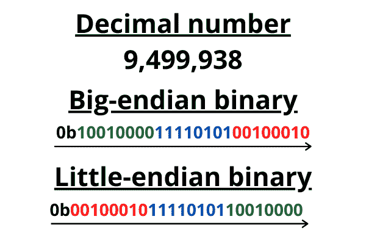
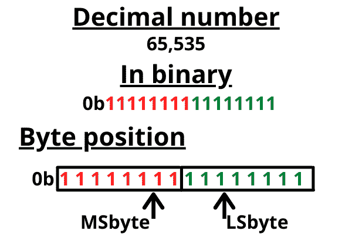
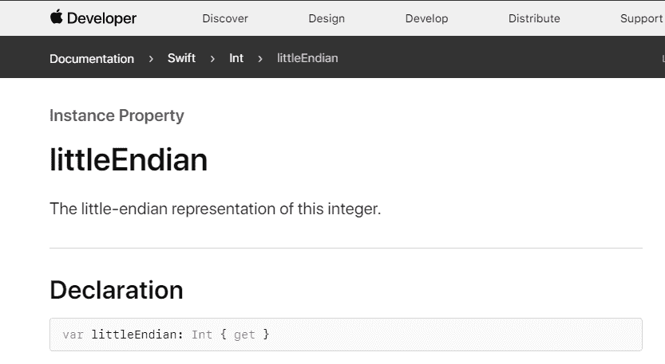

# 什么是字节序？举例说明大端对小端

> 原文：<https://www.freecodecamp.org/news/what-is-endianness-big-endian-vs-little-endian/>

计算机只懂二进制。这意味着`0`和`1`构成了计算机工作的语言。

一位是一个`0`或`1`。8 位组成一个**字节**。从这些简单的片段中，我们可以构建极其复杂的互联计算机系统来呈现视频，显示来自世界各地的文本，并计算极其复杂的算法。

一些数据(一些英文字符，如 a、e、I、o 和 u)可以用一个字节表示，但一些数据需要多个字节来表示。

但是**字节序**是计算机如何读取和理解字节的基本部分。

## 什么是字节序？

不同的语言以不同的顺序阅读文本。例如，英语从左向右读，而阿拉伯语从右向左读。

这正是**字节序**对于计算机的意义。

如果我的电脑从左到右读取**字节**，而你的电脑从右到左读取，当我们需要交流时，我们就会有问题。

**字节序**是指计算机内存中的字节是按照一定的顺序读取的。

如果我们从来不需要分享信息，我们就不会有任何问题。每台计算机内部的数据都是一致的。只是互联网让我们能够分享比以往更多的数据，而且我们的数据并不总是以相同的顺序读取。

**端序**表现为两种方式**端序** ( **端序** ) 和**端序** ( **了**)。

*   **先为**店**大端**。当读取多个字节时，第一个字节(或最低的内存地址)是最大的——所以对于从左向右阅读的人来说最有意义。
*   **乐**先储**小头**。当读取多个字节时，第一个字节(或最低的内存地址)是最小的——所以对于从右向左阅读的人来说最有意义。

如果以上没有意义，也没关系——让我们看一个例子。

## 字节序如何工作的例子

让我们以一个必须用多个字节来表示的数为例，展示它可以用大端和小端的方式来表示。

我们取一个需要三个字节用二进制表示的数。

这可能有点过于简化了，但我希望这是一个有用的直观解释。

A binary example where big-endian and little-endian numbers are arranged in the order they would be read.

开头的 0b 只是符号，让读者知道它是二进制的。所以我们知道二进制`1100`和 1100 的区别就是十进制数(一千，一百)。我还用了颜色，希望能让它看起来更清楚。

我只想说清楚，*钻头订购*没问题。**位**的排序没有区别。但是**字节**的正确排序是有区别的。我希望以上演示了一个字节内的`0`和`1`的顺序不会改变。但是**字节**的排序确实改变了。

如果我们也只需要发送一个**字节**，就不会有问题(没有多种方法可以只订购一件东西)。这只是一个多于一个**字节的序列的问题。**

## 最高有效字节(MSbyte)

术语**最高有效字节**是描述**字节序**的常用方式，所以我想确保我彻底地覆盖了它。

在我们开始用**位**和**字节**、**来解释之前，让我们先用一个十进制数来解释。**

如果我取十进制数 2，984，你可以换什么数来最小量地改变这个数？四号。如果我把 4 换成 5，整个数字只会增加 1。

但是假设你改变了 2984 中的 2。它将显著改变数字，增加一千。

这与**字节**和**位**完全相同。

我们将持有最小位置的**字节**称为**最低有效字节** ( **LSbyte** )，持有最小位置的**位**称为**最低有效位** ( **LSbit** )。

A diagram to illustrate that the byte containing the lowest position numbers is the least significant byte.

保存最高有效位的字节称为**最高有效字节** ( **MSbyte** )，保存最高有效位的位为**最高有效位** ( **MSbit** )。

现在知道了这个新的定义，我们可以把**定义为**和**了**为:

*   大端存储数据**首先是 ms byte**T3****
*   **小端存储数据 **MSbyte** 最后**

## **这什么时候会成为问题？**

**在一些不同的情况下，计算时必须考虑字节序。**

**例如 Unicode 字符(用于在手机、PC、电视等任何地方呈现字符的字符集！)必须通过一个特殊的字符字节序列(U+FEFF 字节顺序标记)，称为**字节顺序标记**或 **BOM** 。这个**炸弹**有几个用途。**

****BOM** 使系统意识到:**

*   **传入流是 Unicode 的。**
*   **其中使用了 Unicode 字符编码。**
*   **传入流的 **endian** 顺序。**

**一些编程语言甚至希望您详细说明正在使用的字节顺序。所以一个程序可以使用、发送和接收 **BE** 或 **LE** 中的数字，这取决于你想要什么。Swift 就是一个例子(用于 iOS 开发的语言)。**

**

The Apple documentation detailing how to get the little-endian representation of an Integer.** 

**你可以在这里阅读一些 Swift 代码[作为字节交换的例子，以获得`Integer`的小端和大端表示。](https://gist.github.com/vukcevich/fa793c8bcb55b14b6e0a0700f5f7316b)**

## **为什么这首先会成为一个问题？**

**只是出现了不同的协议，然后不得不彼此交互。 **BE** 是任何网络协议中的主导顺序，例如被称为**网络顺序**、**T5。另一方面，大多数 PC 都是小端的。****

**你可以在线运行一个 C++代码片段[这里](http://cpp.sh/524wi)看看你的机器是什么端序(我的是**小端序**)。**

**对于高级语言和抽象出我们不需要担心的具体实现细节来说，字节序在很大程度上已经不再重要。**

**另一部分是处理器决定它们是小端还是大端(或者可以处理两者——称为**双端**),所以消费者的选择驱动了我们认为计算机系统中“正常”的部分。**

## **结论**

**我希望这篇文章已经解释了什么是端序，什么是大端序和小端序，并且您现在更清楚地理解了这些概念。**

**如果你喜欢这篇文章并想看更多，我在 Twitter 上分享我的文章。**