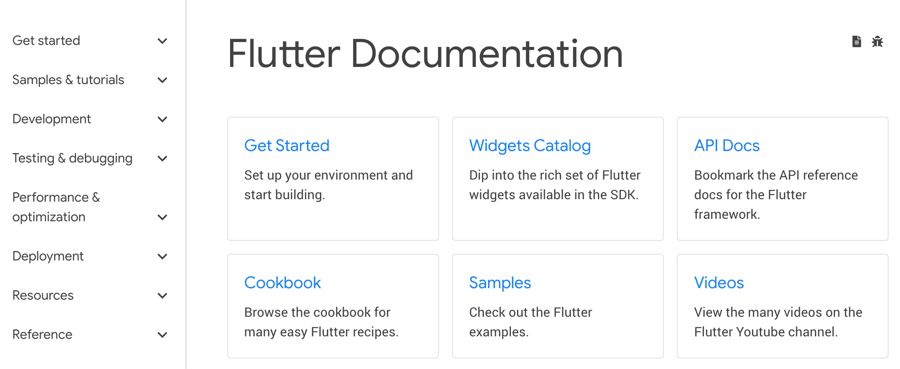

# 什么是颤振，为什么你应该在 2020 年学习它

> 原文：<https://www.freecodecamp.org/news/what-is-flutter-and-why-you-should-learn-it-in-2020/>

今年，移动应用程序继续变得越来越流行。幸运的是，有许多编程工具可供想要创建它们的开发人员使用。在这些工具中，有一个叫 Flutter 的工具，它最近表现突出。

## 什么是颤振？

Flutter 是谷歌创建的免费开源移动 UI 框架，于 2017 年 5 月发布。简而言之，它允许你创建一个只有一个代码库的本地移动应用程序。这意味着您可以使用一种编程语言和一个代码库来创建两个不同的应用程序(适用于 iOS 和 Android)。

颤振包括两个重要部分:

*   SDK(软件开发工具包):帮助你开发应用程序的工具集合。这包括将你的代码编译成本机代码(iOS 和 Android 的代码)的工具。
*   框架(基于小部件的 UI 库):可重用 UI 元素(按钮、文本输入、滑块等)的集合，您可以根据自己的需要对其进行个性化设置。

要使用 Flutter 进行开发，您将使用一种叫做 Dart 的编程语言。这种语言是谷歌在 2011 年 10 月创造的，但在过去的几年里已经有了很大的改进。

Dart 侧重于前端开发，您可以使用它来创建移动和 web 应用程序。

如果你懂一点编程，Dart 是一种类型化的对象编程语言。您可以将 Dart 的语法与 JavaScript 进行比较。

> “Flutter 是 Google 的 UI 工具包，用于从单个代码库为移动、web 和桌面构建漂亮的本地编译应用程序。”——谷歌， [flutter.dev](https://flutter.dev)

## 你为什么要学习颤振？

我选择了一些我喜欢 Flutter 的原因以及我明年想使用它的原因。我会给你详细资料和我的反馈如下。

[Companies using Flutter](https://flutter.dev/showcase)

### 易于学习和使用

Flutter 是现代的框架，你能感觉到！用它创建移动应用程序要简单得多。如果你使用过 Java、Swift 或者 React Native，你会注意到 Flutter 是多么的不同。

我个人在开始使用 Flutter 之前，一直不喜欢移动应用开发。

我喜欢 Flutter 的一点是，你可以创建一个真正的本地应用程序，而不需要一堆代码。

### 快速编译:最大生产力

多亏了 Flutter，你可以改变你的代码并实时看到结果。这叫热装弹。保存后只需很短的时间就可以更新应用程序本身。

重大修改迫使你重新加载应用程序。但是，如果你真的像设计一样工作，例如，改变一个元素的大小，这是实时的！

### 创业 MVP 的理想选择

如果想尽快把自己的产品展示给投资人，Flutter 是个不错的选择。

以下是我在 MVP 中使用它的四大理由:

*   用 Flutter 开发一个移动应用更便宜，因为你不需要创建和维护两个移动应用(一个用于 iOS，一个用于 Android)。
*   你只需要一个开发者就可以创建你的 MVP。
*   它是高性能的——你不会注意到本机应用程序和 Flutter 应用程序之间的区别。
*   它很漂亮——你可以很容易地使用 Flutter 提供的小部件，并对其进行个性化处理，为你的客户创建一个有价值的 UI(你可以在下面找到用 Flutter 制作的应用程序的例子)。

[Flutter App Example - ToDo List](https://github.com/LiveLikeCounter/Flutter-Todolist)

### 良好的文档

对于新技术来说，拥有好的文档是很重要的。但事实并非总是如此！

你可以从 Flutter 的文档中学到很多东西，每样东西都非常详细，都有基本用例的简单例子。每当我的代码中的一个小部件出现问题时，我都可以查看文档，答案就在那里。

Flutter Documentation Architecture

### 不断发展的社区

Flutter 有一个强大的社区，这仅仅是个开始！

你可能知道，我喜欢在我的网站上分享我的编程知识和有用的内容。我需要知道我正在研究一项有很多支持者的充满潜力的技术。

当我开始使用 Flutter 时，我做的第一件事是搜索社区，令我惊讶的是…有相当多的地方可以交换关于 Flutter 的信息。

我会给你一些我每天都想去的地方的例子。欢迎[在 Twitter 上给我发消息](https://twitter.com/gaelgthomas/)提出你的建议。

*   [Flutter Awesome:](https://flutterawesome.com/) 一个推荐最好的 Flutter 库和工具的列表。这个网站每天发布大量的例子、应用模板、建议等内容。
*   [Awesome Flutter:](https://github.com/Solido/awesome-flutter) 一个 GitHub 存储库(链接到 Flutter Awesome ),包含一系列文章、视频、组件、实用程序等等。
*   [都是 widgets！:](https://itsallwidgets.com/)用 Flutter 构建的应用开放列表。
*   [Flutter Community:](https://medium.com/flutter-community) 一个中型出版物，在这里您可以找到文章、教程等等。

### 受 Android Studio 和 VS 代码支持

颤振在不同的 ide 上可用。使用该技术开发的两个主要代码编辑器是 Android Studio (IntelliJ)和 VS Code。

Android Studio 是一个完整的软件，已经集成了所有的东西。你必须下载 Flutter 和 Dart 插件才能开始。

VS 代码是一个轻量级工具，一切都可以通过市场上的插件进行配置。

我使用 Android Studio 是因为我不需要配置很多东西来工作。

你可以自由选择你喜欢的 IDE！

## 奖金

### 自由记者

如果你想开始做一些自由职业者的工作，你应该考虑使用 Flutter。

2020 年，我相信这项技术会爆发。这意味着很多人会去寻找知道如何使用它的开发者。

法国最大的自由职业者平台 Malt 最近发布了今年的科技趋势。2018 年至 2019 年，Flutter 在该平台上增长了+303%。

[Flutter statistics - Malt](https://www.malt.com/resources/reports/tech-data-2019/)

## 结论

嗯，你觉得 Flutter 怎么样？明年开始学吗？

我希望这篇介绍已经引起了你的兴趣和兴趣。如果你喜欢这篇文章，请随意分享。

如果你想要更多这样的内容，你可以[在 Twitter](https://twitter.com/gaelgthomas/) 上关注我，在那里我会发关于 web 开发、自我完善和我作为一个全栈开发人员的旅程的推文！