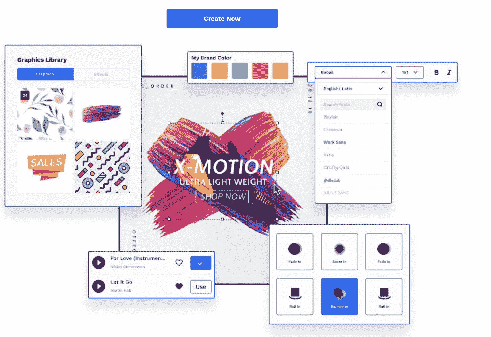

# 什么是前端开发？必要的网站开发工作技能解释。

> 原文：<https://www.freecodecamp.org/news/what-is-front-end-development/>

前端开发人员是从事软件工作的人，比如桌面或移动网站，用户与他们互动。具体来说，前端开发人员在用户接触和看到的技术方面花费时间。

前端通常也被称为客户端，或者更广泛地说，用户界面。

虽然许多人使用前端来描述网站相关的开发，它可以指任何用户与之交互的软件。

出于本文的目的，让我们使用一个更广泛的定义:前端开发可以包括在桌面软件的移动应用程序上完成的工程工作。

当我第一次学习前端开发时，我从一位老师那里听到了一个简单的比喻，我至今没有忘记。

我想和你分享这个比喻。

前端开发类似于在自动柜员机(ATM)上构建按钮。

不言而喻，ATM 的客户端对于取款是至关重要的。

但这只是过程的一部分。

ATM 的后端需要存储现金并正确计算取款。前端是用户在完成交易时接触和交互的东西。

将这个例子带回软件世界，前端工程师与后端工程师、设计师和产品经理密切合作，从整体上设计和构建产品。

为什么

让我们来看一下前端开发人员在构建网站或应用程序时与每个利益相关者的互动。

## 内部利益相关者

首先，前端开发人员必须与后端工程师合作，后端工程师管理现代应用程序和站点运行的服务器、实例、数据库和存储。

前端和后端开发人员之间的大量工作是云计算的驱动力，云计算是通过互联网按需交付 IT 资源。

其次，前端开发者与设计师互动频繁。设计师负责产品的外观和感觉。

设计师拥有配色方案、布局和可用性要求。

设计师帮助将风格、美学框架和模式放在最前面，这样前端开发人员就可以为最终用户提供所有这些属性。

第三，前端工程师将与产品经理建立关系，产品经理是最负责从战略角度思考如何制造产品并将其推向市场的利益相关者。

产品经理拥有产品体验、产品的利润和损失，以及发布和营销指南。

如果你想探索前端开发领域，你应该准备好以一种动态和协作的方式与其他内部技术利益相关者一起工作，来推动你的产品向前发展。

## 前端开发所需的技术能力

为了成为一名前端开发人员，你不仅需要了解工作的性质(我在上面已经试图去神秘化)。你还需要技术技能。

公式化的思考一下，前端开发就是让其他利益相关者参与进来+帮助用户+与技术合作。

例如，几乎所有的网站都是结合 HTML、JavaScript 和 CSS 构建的。如果你不熟悉这些技术，你将需要学习它们。

学习如何编写这些语言以及它们如何相互交互，对于成为一名高效的前端工程师来说是必不可少的。

在写这篇文章时，我采访了一位密友，他是一家大型科技公司的产品经理。

我向他提出了以下问题，以便为你——读者——提供更多指导

1.  *怎样才能成为一名优秀的前端开发人员？*
2.  *前端开发人员在构建产品时如何展示所有权？*

他的回答很有启发性。

如果你正在申请一份前端工程师的工作，或者想成为一名更好的前端开发人员，那么明智的做法是将他的指导融入到你的工作中。

## 是什么造就了一个伟大的前端开发者？

“一个强大而有效的前端开发人员表现出对用户和客户需求的坚定关注和执着。

他们从客户的用例开始，逆向工作，不知疲倦地通过构建产品的前端来赢得和保持客户的信任。

强大的前端开发者拥有自己的产品，拥有自己的解决方案。他们需要在交付即时产品结果的同时考虑中长期发展。

一个好的前端开发人员使用项目跟踪工具来跟踪变更，展示进展，最重要的是让他们的同事知道*为什么*要进行变更以及何时进行。

前端开发人员知道他们的工作需要什么，并保持在他们的领域内。

最后，一个强大的前端工程师努力发明和简化。

通过将创新精神带入工作中，开发人员可能会对产品、后端 API 或技术堆栈的其他方面提出改进建议，从而使产品更可用、更有效。"

## 前端开发人员在构建产品时如何展示所有权？

“前端开发人员很好奇，这种好奇心驱使他们对产品的成功和发展感兴趣。

工程师从未停止寻找改进产品或自身的方法。

最后，前端工程师拥有并保持高标准。他们提高了产品卓越性的标准——速度、操作效率、安全性、可靠性——并确保产品不会出现缺陷。

这些是前端开发人员在为产品的构建做出贡献时所展示的属性。

如果你是前端开发人员，你需要和你的团队沟通。

你需要管理复杂性，庆祝胜利，并发送产品发布电子邮件。

这是所有权，这是领导力。

如果你现在正在远程工作，知道如何安排和领导虚拟团队会议，并交流你计划做的开发工作。

总之，前端开发人员有义务在他们不同意时恭敬地挑战决策，即使这样做令人不舒服。他们表现出坚定的信念。"

## 需要的工作和通用技能

现在你已经知道前端开发人员是做什么的，前端开发人员与谁互动，以及是什么让一个人在这份工作中有效，让我们转向面试和接受这一领域的角色所需的技能。

网络开发工作需求量很大。

如果您喜欢编写、测试和部署软件，创建网站，或者使用 HTML 和 CSS 与数据库和服务进行交互，您可能会在 web 开发职业中获得成功。

我查看了几十份前端开发工作，总结了几乎所有招聘信息都需要的核心技能。以下是你必须展示的五大特质:

1.  网络编程方面的技术技能；
2.  展示 HTML 和 CSS 的技能；
3.  了解 JavaScript(和/或 PHP、ASP.NET 或 Ruby on Rails)；
4.  有与他人一起测试、诊断和分析软件的经验；
5.  对安全性和最佳开发实践的理解。

## 将所有内容整合在一起:示例和结论

根据您的工作或团队使用的技术，前端开发人员的日常职责可能会有所不同。

不管技术栈是什么，你都应该期望在前端文化的形成中扮演一个重要的角色，拥有一个或多个产品的技术所有权，并且是软件架构的主题专家。

无论你是开始在线业务，加入像金融科技初创公司这样的小公司，还是管理大型企业的工程团队，你都需要驾驭这些流程和工作流来推动价值。

还记得 ATM 的比喻吗？

如果你想帮助用户从机器中提取现金——并发现这是值得的和令人兴奋的——你就已经踏上了为用户创造价值的产品之路。

这会让你的职业生涯变得激动人心和有价值。

这里有一些额外的具体例子，可以启发你更深入地学习，成为一名前端开发人员。

Runners Athletics 是一个将简单优雅的 UI 与强大的电子商务后端订购流程结合在一起的网站。

如果你想在互联网上销售产品，前端工程师需要将可点击的 CTA(行动呼吁)与后端支付和订购系统结合起来。

许多网站会提示您输入电子邮件或联系信息。注册表单是前端设计的好例子。

它们以行动为导向，易于用户参与，并帮助公司或网站收集有价值的信息。

前端工作不仅可以改善移动和桌面网站，还可以改善视频社交媒体工具。前端开发人员可以帮助浏览器编辑和压缩视频，并呈现更好的视觉显示。

前端开发人员必须构建这些引人注目的模板，与支付、配色方案和图形进行交互。

