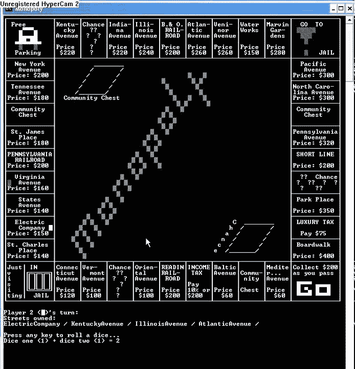
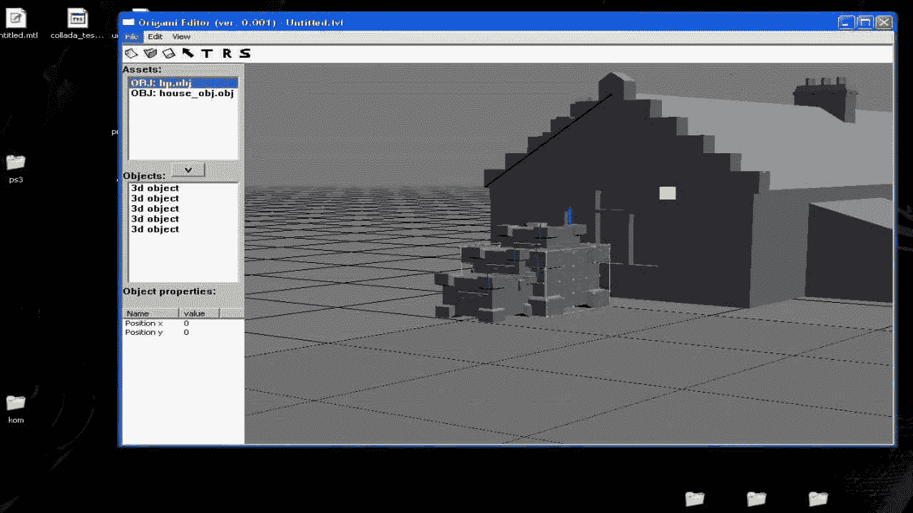
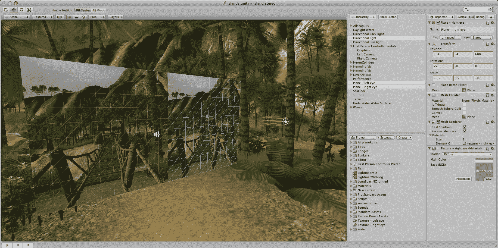

# 什么是游戏开发？

> 原文：<https://www.freecodecamp.org/news/what-is-game-development/>

游戏开发是创建游戏的艺术，描述了游戏的设计、开发和发布。它可能涉及概念生成、设计、构建、测试和发布。当你创建一个游戏时，考虑游戏机制、奖励、玩家参与度和关卡设计是很重要的。

游戏开发人员可以是程序员、声音设计师、艺术家、设计师或业内其他许多角色。

游戏开发可以由大型游戏开发工作室承担，也可以由个人承担。它可以根据你的喜好变小或变大。只要它能让玩家与内容互动，并能操控游戏的元素，你就可以称之为“游戏”。

要参与游戏开发过程，你不需要写代码。艺术家可能创建和设计资产，而开发人员可能专注于健康栏的编程。测试人员可能会参与进来，看看游戏是否像预期的那样运行。

为了解决游戏框架的问题，开发了像 libGDX 和 OpenGL 这样的工具。他们帮助游戏开发变得更快更容易，提供了许多预制的功能和特性。然而，对于来自非程序员背景的人来说，进入这个行业或理解一个框架仍然很难，这在游戏开发领域是一个常见的情况。

那时开发了像 Construct、Game Maker、Unity 和 Unreal 这样的游戏引擎。一般来说，一个引擎拥有一个框架所拥有的一切，但通过使用图形用户界面(GUI)和帮助游戏的图形开发来提供更友好的方法。

在某些情况下，如 Game Maker 和 Construct，预制功能的数量如此之大，以至于没有任何编程技能的人可以从头开始构建一个游戏，真正扩展了场景，使几乎任何人都可以进行游戏开发。

## 游戏引擎

许多开发者选择使用游戏开发引擎来开发游戏。

游戏引擎可以使创建游戏的过程变得更加容易，并使开发者能够重用许多功能。它还负责 2D 和 3D 图形的渲染、物理和碰撞检测、声音、脚本等等。

一些游戏引擎有一个非常陡峭的学习曲线，如 CryEngine 或 Unreal Engine。然而，其他工具对初学者来说非常容易，有些甚至不需要你能够编写代码来创建你的游戏，例如 Construct 2。

Unity 游戏引擎介于两者之间，虽然它是初学者友好的，但一些流行和商业游戏已经使用 Unity 开发出来了(例如，过度烹饪，超级热)。

BuildBox 游戏引擎主要用于开发超复杂游戏。

### **典型的游戏引擎**

*   CryEngine
*   虚幻引擎
*   Unity 游戏引擎
*   游戏制作者
*   建构 2 或 3
*   捻
*   来源
*   冻伤
*   建筑机器人

### **更多信息**

*   [Awesome-游戏开发资源列表](https://github.com/Kavex/GameDev-Resources)
*   [游戏编程书籍](http://www.fromdev.com/2013/07/game-development-books.html)
*   [libGDX 框架](https://libgdx.badlogicgames.com/)
*   [OpenGL 框架](https://www.opengl.org/)
*   [构建游戏引擎](https://www.scirra.com/)
*   [游戏制作引擎](https://www.yoyogames.com/gamemaker)
*   [Unity3D 引擎](https://unity3d.com/pt)
*   [虚幻引擎](https://www.unrealengine.com/en-US/what-is-unreal-engine-4)
*   [构建框](https://www.buildbox.com/)