# Git 是什么？Git 版本控制初学者指南

> 原文：<https://www.freecodecamp.org/news/what-is-git-learn-git-version-control/>

Git 是一个全世界开发者都在使用的版本控制系统。它帮助您跟踪代码的不同版本，并与其他开发人员协作。

如果您在一段时间内处理一个项目，您可能希望跟踪哪些更改是由谁以及何时进行的。如果您的代码中有一个 bug，这变得越来越重要！Git 可以帮你做到这一点。

但是，当您刚开始学习 g it 时，它也可能会有点令人害怕和困惑，所以在本文中，我将以一种人类可以理解的方式介绍 Git。我们将讨论诸如存储库、提交、分支等主题，所以让我们开始吧！

下面是我们将在本文中讨论的内容:

*   Git 是什么？
*   什么是 GitHub？
*   如何开始使用 Git
*   Git 如何跟踪变化？
*   典型的 Git 工作流
*   学习 Git 版本控制的在线课程

## Git 是什么？

Git 是一个版本控制系统，你可以下载到你的电脑上。如果你想在一个编码项目中与其他开发人员合作，或者在你自己的项目中工作，使用 Git 是必不可少的。

为了检查您的计算机上是否已经安装了 Git，您可以在终端中键入命令`git --version`。

如果你已经安装了 Git，那么你会看到你有什么版本。如果您没有安装 Git，您可以访问 [Git 网站](https://git-scm.com/),并轻松按照下载说明为您的操作系统安装正确的版本。

## 什么是 GitHub？

GitHub 是一个允许你在某个地方的远程服务器上托管你的 Git 项目的产品(或者换句话说，在云中)。

重要的是要记住 GitHub 不是 Git。GitHub 只是一个托管服务。还有其他一些提供托管服务的公司也做着和 GitHub 一样的事情，比如 Bitbucket 和 GitLab。

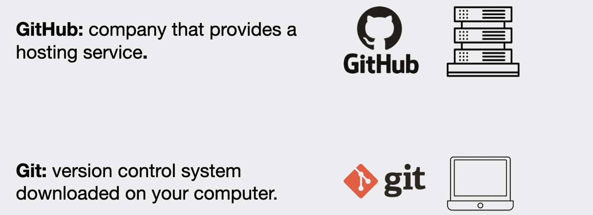

The difference between GitHub and Git

## 如何开始使用 Git

### 终端与 GUI

您可以通过在终端中键入命令来使用 Git，也可以使用图形用户界面(GUI ),如 Sourcetree 或 GitKraken。

如果您选择终端，您将不得不查找您将需要哪些 Git 命令。

幸运的是，你不必记住这些。除了少数几个您最常使用的命令之外，其余的命令您可以在需要时随时查找(这是大多数开发人员所做的，甚至是那些有几十年经验的开发人员)。Git 在其网站上提供了深入的[文档。](https://git-scm.com/docs)

如果您选择使用 GUI，那么您需要采取的各种操作将以更直观的方式显示。

无论您选择使用终端还是 GUI，您都需要了解 Git 的基本工作原理，以便自信地使用它。

在本文的其余部分，我们将分享在终端中使用 Git 的例子。但是如果你使用 GUI，我们分享的步骤是非常相似的。

### 如何在 Git 中准备项目文件夹

要使用 Git，我们需要有一个我们想要进行版本控制的项目。这可以是新项目，也可以是现有项目。

如果是一个新项目，那么我们需要创建一个新的项目文件夹(提示:我们可以使用`mkdir`命令),然后在终端中导航到该项目文件夹。

如果我们要选择一个现有的项目，那么我们只需在终端中导航到该项目文件夹。

在我们的例子中，我们将创建一个名为`novel`的新项目文件夹。

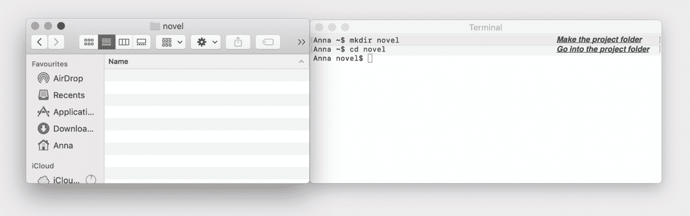

Creating our project folder

### 如何创建 Git 存储库

一旦我们进入项目文件夹，为了开始使用 Git，我们需要使用`git init`命令创建(或初始化)一个存储库。

一旦我们通过在终端中键入命令并按 enter 键来执行该命令，它可能会看起来好像没发生什么。但是不要被欺骗了，Git 有时会偷偷摸摸，它在幕后执行很多操作。

为了看到 Git 在幕后做了什么，我们必须查看我们的隐藏文件。确保在文件系统中打开项目文件夹。然后，如果你在 mac 上，你可以选择**命令** + **Shift** + **Dot** 来查看文件系统中隐藏的文件。如果您使用的是 windows 操作系统，那么您可以更改视图设置，以便查看文件系统中的隐藏文件。

为了在终端中查看隐藏文件，我们可以使用命令`ls -a`。

我们现在应该看到的是项目文件夹中的一个`.git`文件夹。这通常代表我们的存储库。

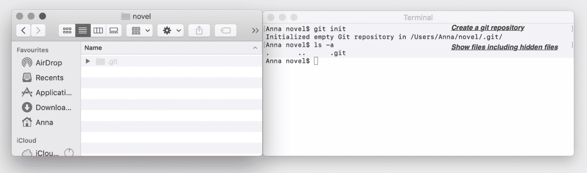

Creating our repository

### 什么是 Git 存储库？

**库**是我们项目文件夹中的`.git`文件夹。它将跟踪对我们项目中的文件所做的所有更改，并随着时间的推移记录历史。

我们计算机上的存储库称为**本地存储库**。

前面我们提到了 GitHub、GitLab 和 Bitbucket 等托管服务。当我们将本地存储库推(换句话说，上传)到这些服务之一时，位于云中这些服务中的存储库被称为**远程存储库**。

为了能够与其他人协作以及在我们的笔记本电脑或计算机发生问题时备份我们的项目，使用远程存储库是很重要的。

### 如何使用 Git 与其他开发人员协作

如果另一个开发者想在我们的项目上与我们合作，那么他们可以从你上传到他们计算机的主机服务中克隆(或者换句话说下载)远程存储库。

这允许他们在他们的计算机上也有项目。他们计算机上的项目也称为本地存储库。

在有多个开发人员的项目中，每个人在他们的计算机上都有一个本地存储库。有一个他们都参与的远程存储库，他们用它来分享他们的工作。

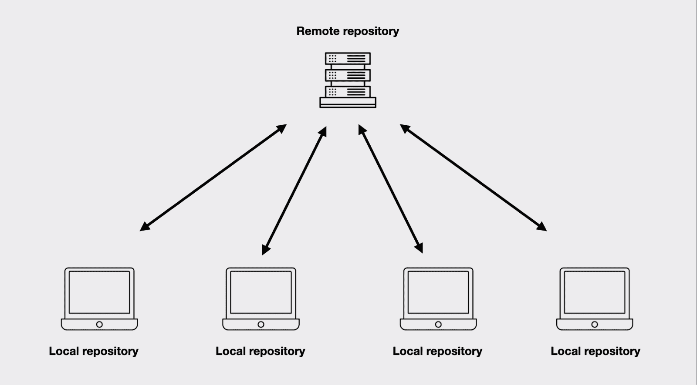

Remote repository and local repositories

## Git 如何跟踪变化？

为了在 Git 中保存项目的不同版本，我们将进行提交。

### 什么是 Git 提交？

提交是你的项目的一个版本。它表示项目的独立版本，并引用了属于该版本的所有文件和文件夹。

### 如何在 Git 中提交？

为了理解我们如何进行提交，我们需要了解 Git 中的三个不同空间——工作目录、暂存区和提交历史。

**工作目录**基本上是用我们项目文件夹的内容来表示的(提示:目录和文件夹是一回事)。它有点像工作台，我们可以在其中添加、编辑和删除项目中的文件。

暂存区和提交历史是我们存储库的一部分。

**集结地**有点像一个草稿区。在这里我们可以添加文件的更新版本或删除文件，以便选择我们希望在下一次提交(我们项目的版本)中包含的内容。在`.git`文件夹中，暂存区由一个名为`index`的文件表示。

最后，**提交历史**基本上是我们的提交被提交后的位置。在`.git`文件夹中，提交历史由名为`objects`的文件夹表示。

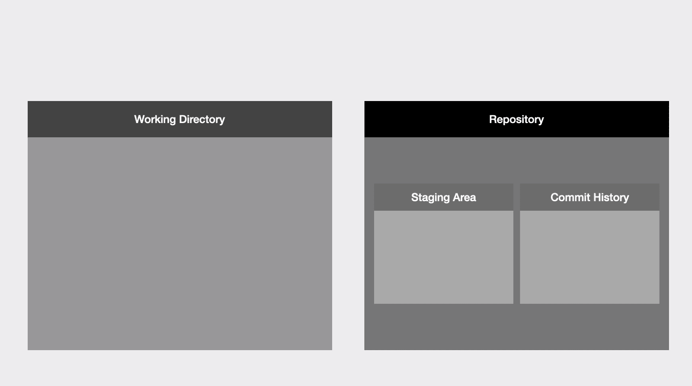

Working directory, repository, staging area, and commit history

## 典型的 Git 工作流

### 步骤 1 —编辑文件

如果您有一个新项目，您将在新项目中创建第一个文件。在我们的`novel`项目文件夹中，我们将创建一个名为`chapter1`的简单文本文件。我们可以使用文本编辑器或者直接在终端中完成这项工作。在我们的例子中，我们直接在终端中输入`touch chapter1.txt`来完成。

如果您有一个现有的项目，那么您将编辑一些现有的文件，添加新文件，或删除文件。

接下来，我们可以使用`git status`命令。这个命令将告诉我们工作目录和暂存区的状态，并告诉我们两者之间是否有任何差异。

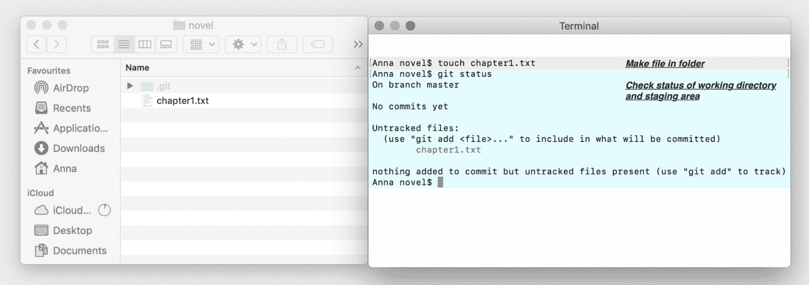

Adding a file to our project

在我们的例子中，我们只向新项目添加了一个新文件。当我们使用`git status`命令时，Git 告诉我们在我们的工作目录中有一个未跟踪的文件，我们需要使用`git add`命令将它包含在将要提交的文件中。这将我们带到第二步。

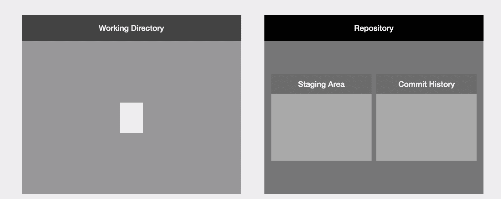

Our file is in the working directory

### 步骤 2 —将文件添加到临时区域

我们可以使用`git add`命令将新的或更新的文件添加到暂存区。如果我们决定在下一次提交时不包含我们更改的一些文件，那么我们只需确保不将这些特定的文件添加到暂存区。

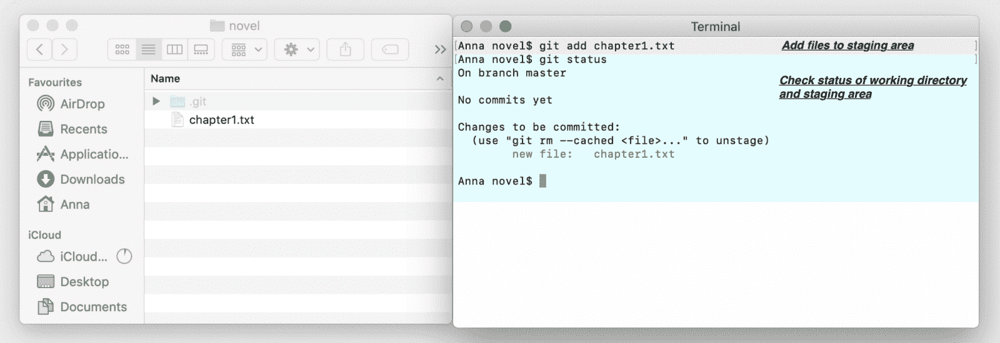

Adding a file to the staging area

在我们的例子中，我们使用`git add`命令并传递文件名，将项目中唯一的文件添加到临时区域。然后，如果我们使用`git status`命令，我们将看到 Git 会告诉我们，我们已经将文件添加到暂存区。

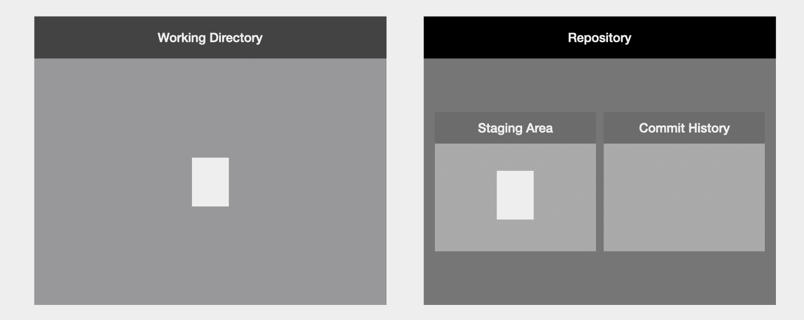

Our file is in the staging area

还需要注意的是，文件**不会将** **从工作目录移动到暂存区。文件通过**从工作目录复制到暂存区。

### 步骤 3 —提交

最后，为了进行提交，我们使用带有`-m`选项的`git commit`命令，并传入一个提交消息，例如`git commit -m "this is the first commit"`。

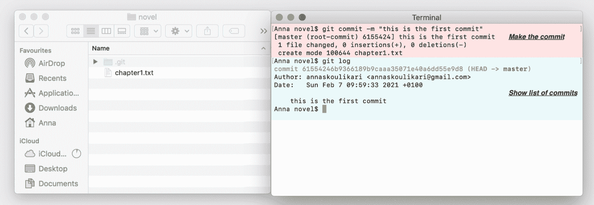

Making our first commit

然后，我们可以使用`git log`命令，按时间倒序列出项目中的所有提交。在我们的例子中，我们只有一个提交。

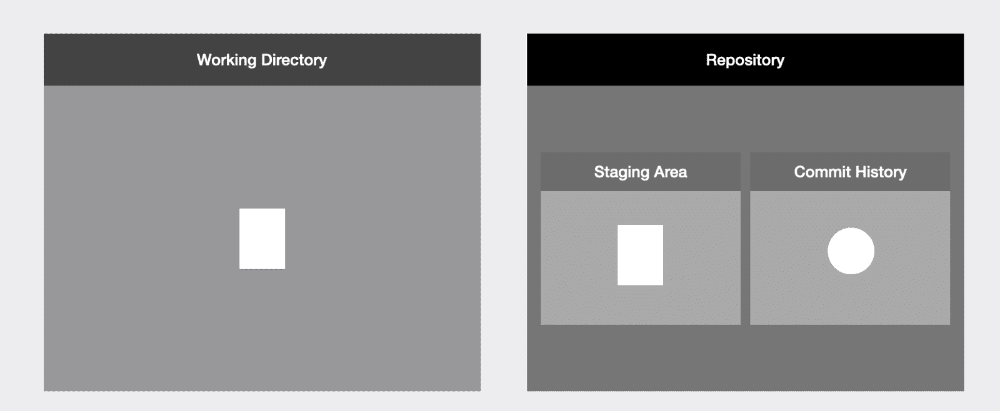

We have made our first commit

现在我们已经在我们的项目中进行了第一次提交！换句话说，我们已经保存了项目的第一个版本。

提交具有 40 个字符的提交哈希。一个**提交散列**是 40 个字母和数字，作为提交的名称或引用它的方式。

我们还可以看到提交者、提交时间和提交消息等信息。

## Git 中的提交历史是什么？

一个存储库由多个提交组成，在最简单的情况下，每个提交都有一个父提交，它是在它之前的提交。这就是为什么在下图中，一个提交指回它之前的提交。

当我们进入多分支和合并的领域时，会有更复杂的情况，但这超出了本文的范围。

A simple commit history

## 最后，Git 中的分支是什么？

**分支**是指向提交的指针。Git 中默认的分支叫做**主**或**主**。

通过进入`.git`文件夹，然后打开`refs`文件夹，打开`heads`文件夹，最后打开名为`master`的文件，我们可以看到分支是一个指向提交的指针。在这个文件中，我们会发现有一个散列。这是我们的主分支所指向的提交的散列。

我们可以再次使用`git log`命令来列出我们的存储库中的所有提交，我们会发现这个散列与括号中旁边有`master`标签的提交对齐。

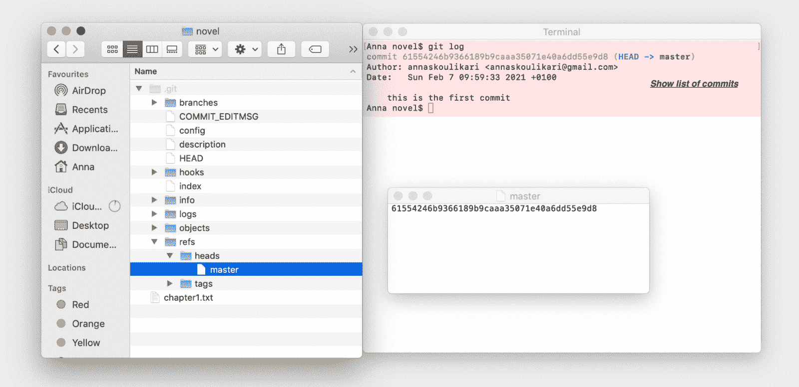

Showing the master branch in our .git folder

在终端中，我们可以通过输入命令`git branch`看到所有分支的列表。

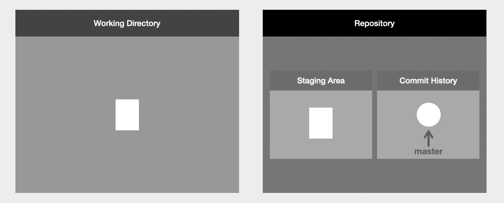

Showing the master branch pointing to our commit

分支真的很重要，因为它们使与其他人协作以及同时处理多个特性或项目的不同部分变得更加容易。

随着我们进行更多的提交，我们所在的分支将会更新以指向我们最近的提交。

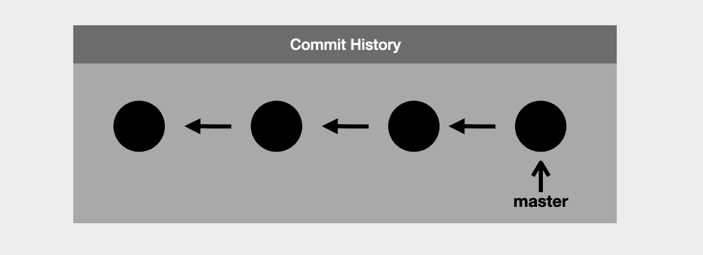

Showing our commit history and the master branch pointing to our latest commit

## 结论

如果你已经走到这一步，恭喜你！关于 Git 还有很多东西需要学习，在本文中我们只触及了皮毛。请随意查看下面的更多资源来学习 Git down！

### 学习 Git 版本控制的在线课程

本文基于我创建的一个名为 Git 学习之旅 的在线课程，该课程教授 Git 版本控制。它讲授 Git 版本控制的基础知识，更深入地涵盖了以上所有内容，包括使用远程存储库、合并和重新构建基础。

它是专门为从非技术背景过渡到技术领域的人设计的，已经成为 Udemy 上评分最高的课程，⭐️评分为 4.8 星，有 600 多名满意的学生(查看学生评论，他们自己会说话)。前八课是免费的预习，请随意观看！

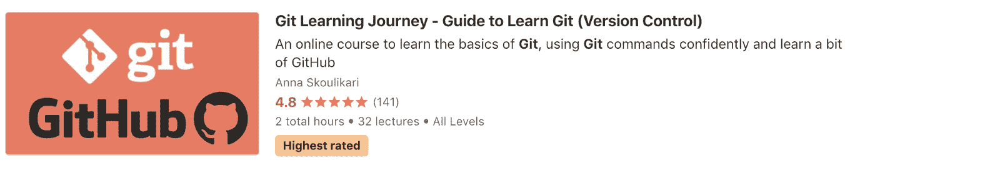

Git Learning Journey, online course teaching Git version control by Anna Skoulikari