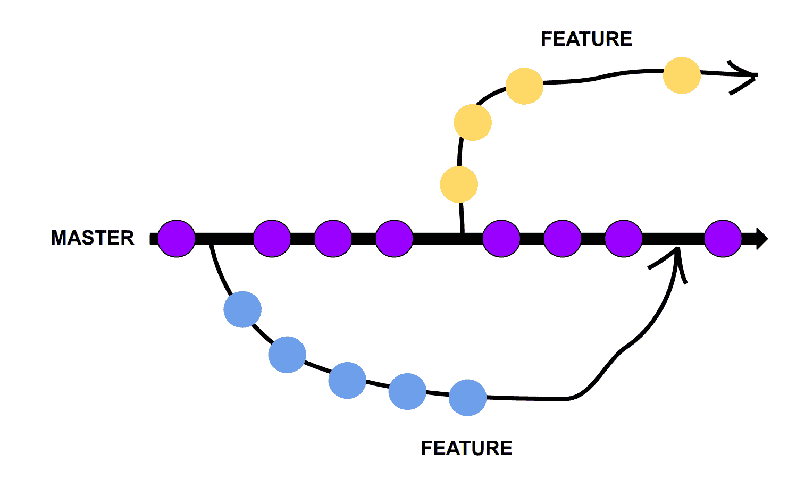
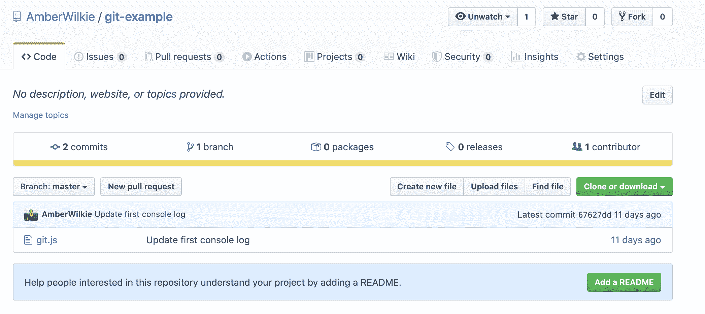
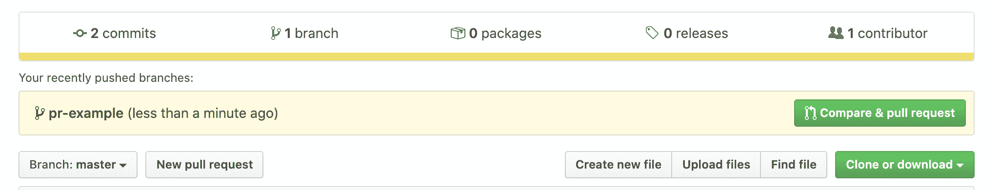
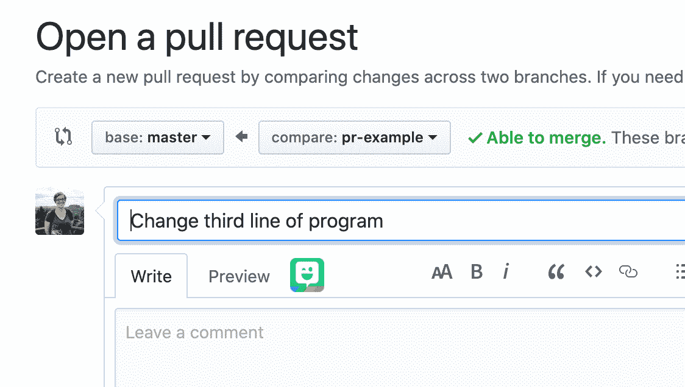
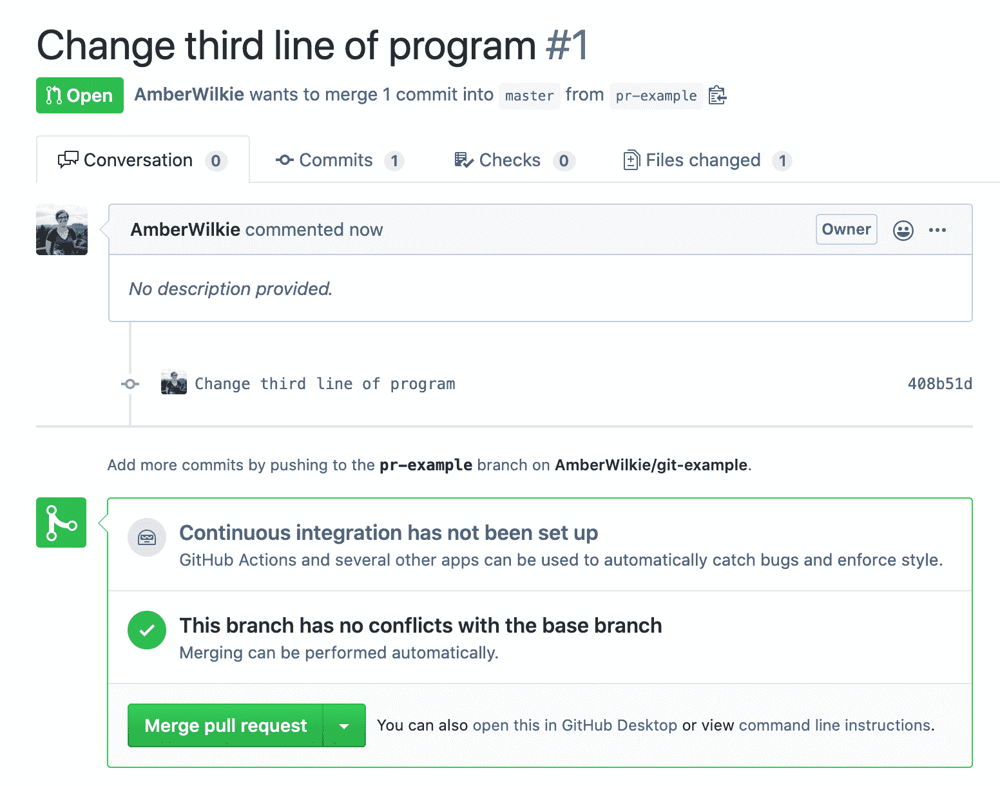

# 什么是 GitHub？Git 是什么？以及如何使用这些开发工具。

> 原文：<https://www.freecodecamp.org/news/what-is-github-what-is-git-and-how-to-use-these-developer-tools/>

你写的第一个程序可能不会给人留下深刻印象。你会犯很多错误，你永远不会想重温过去。

但是很快，你就会编写大型复杂的程序。也许你会删除一些你想以后带回来的东西。或者，您可能会带来一个朋友来帮忙，并希望在您继续工作的同时，优雅地将他们的更改添加到您的程序中。

这就是**版本控制**的用武之地，这是任何雇主都希望你掌握的技能。它对任何以碎片形式保存的东西的工作人员都非常有用——从计算机程序到食谱到小说。

## 什么是版本控制？

版本控制是指在文档或文件夹中保存您的位置并引用以前保存的内容的能力。

在我写这篇文章的时候，我的最新变化不断地覆盖我以前的版本。不是版本控制，因为我回不到一周前的草稿。但是如果我用 Git 写这个，那将是可能的。

## Git 是什么？

Git 是 Linus Torvalds 在 2005 年开发的一个版本控制系统(就是写 Linux 的那个家伙)。Git 帮助开发人员跟踪他们代码的状态，并允许在代码库上进行协作。稍后我们将讨论主要组件。

如果您想继续学习，您必须在您的计算机上安装 Git。打开一个终端，输入`git`。如果您看到可能的命令列表，您就可以开始了！

许多计算机已经安装了 Git。如果你需要安装，你可以按照这里的[说明](https://www.linode.com/docs/development/version-control/how-to-install-git-on-linux-mac-and-windows/)为你的电脑安装。

## 使用 Git

如果你曾经使用过一个计算机程序或者一个视频游戏，并且注意到你可以返回到一个先前保存的版本，你天生就理解对 Git 的需求。它只是及时保存程序的快照。

但是，它不需要跟踪程序中的每一行代码，而是记录您现在拥有的代码和上次保存的代码之间的变化。它会持续记录每一行代码最后保存的时间，并将它们存储在一个特殊的隐藏文件夹中。

让我们考虑这个 JavaScript 程序。它在控制台上打印了三行内容(您可以在浏览器或终端上看到这一输出):

```
console.log('Hello, this is a git example!')
console.log('And here is another!')
console.log('And yet a third') 
```

### 去吧，林特克

如果我想保存我作品的版本，我可以使用 Git。首先，我将在我的终端中键入`git init`，这样我就可以开始使用 Git 了。这将创建一个`.git`文件夹，Git 将在其中存储它的文件。

### 去把它给我

将添加我们程序中的所有文件。如果您在创建文件之后或者任何时候创建新文件时使用了`git init`,那么您必须用这个命令告诉 Git 开始跟踪对它们的更改。

### 去吧，Committee

接下来，我输入`git commit -am "Initial commit"`。`git commit`是保存我们代码版本的命令。`-am`被称为“标志”,表示我们希望对这个提交采取的可选操作。标志`a`意味着我们将保存所有的更改。标志`m`表示我们将在之后提供消息，即`"Initial commit"`。

你可以在这里写任何你想写的东西——freeCodeCamp 有很多关于如何写好提交消息的文章。

## Git 如何保存更改

如果我们对程序做了更改(比如更改第一行的文本)，我们可能想要保存一个版本。如果我们想看看我们的程序是如何随时间变化的，我们甚至可以在版本之间切换。

```
console.log('Now I have changed the first line.')
console.log('And here is another!')
console.log('And yet a third') 
```

### git 差异

这是你运行`git diff`时的样子。Git 将向您展示您现在拥有的代码和上次保存时的代码之间的*差异*。

有点难以理解这里发生了什么，但是`-`是删除，`+`是插入。我们删除了文本“你好，这是一个 git 示例！”并添加了文本“现在我已经更改了第一行。”Git 就是这样跟踪不同版本之间的变化的。

```
diff --git a/git.js b/git.js
index eb0f1d1..8dbf769 100644
--- a/git.js
+++ b/git.js
@@ -1,3 +1,3 @@
+console.log('Now I have changed the first line.')
-console.log('Hello, this is a git example!')
 console.log('And here is another!')
 console.log('And yet a third')
```

既然我们已经检查了正在提交的更改，我们可以继续进行第二次提交:`git commit -am 'Update first console log'`。这将保存我对第一行文本所做的更改。

### git log

我们可以用命令`git log`回顾我们已经提交的内容。如果我现在在程序中运行它，我会得到这样的输出:

```
commit 67627dd44e84a3106a18a19e94cf9f3723e59b3c (HEAD -> master)
Author: amberwilkie <amber@amberwilkie.com>
Date:   Wed Apr 22 16:55:39 2020 -0400

    Update first console log

commit 49fe4152f474a9674a83e2b014a08828209d2690
Author: amberwilkie <amber@amberwilkie.com>
Date:   Wed Apr 22 16:54:59 2020 -0400

    Initial commit
```

我们可以看到我们的提交消息、我们提交的时间以及我们提交的唯一 ID，我们可以用它来引用将来的提交。

### git checkout

如果我们想回过头来看看上次提交后代码的变化，我们可以用`git checkout 49fe4152f474a9674a83e2b014a08828209d2690`来实现。Git 会将我们的代码放在一个临时状态，这样我们就可以及时查看代码在快照时的样子。

我复制了第一次提交的 ID。如果我运行这个命令，我的程序会说“你好，这是一个 git 例子！”在第一行。

要回到最新的代码，您可以键入`git checkout master`。

## 分支

如果你注意到了上面的内容，我们必须键入`master`才能回到代码的当前状态。为什么？因为`master`是分支的分支的默认名称——我们的代码是最新的。

Git 依靠分支来维护我们的代码。你可以考虑代码树的主干。您可能会中断并做出一些更改，但最终目标总是将它们带回主干，带回`master`。

您可以使用`git checkout`创建一个新的分支，而不仅仅是检查您代码的以前版本。试试`git checkout -b new-branch`。当我们建立一个新的分支机构时，使用`-b`旗，并在旗后写上我们新分支机构的名称。我们可以在这个分支上进行多次提交，然后通过一个叫做**合并**的过程将它们返回给 master。

在下图中，点代表提交。两个分支已被设为“关”主。在软件开发中，我们通常称这些为“特性”分支，与主分支相对。蓝色分支已合并回 master，黄色分支仍在开发中。

请注意，即使黄色分支是在蓝色分支之后创建的，在该分支中也只能看到主分支的更改。如果我们在将来的某个时候创建了第三个分支，那么来自 master 和 blue 分支的更改将会出现在新的第三个分支中。



Git branching visualization

### git merge

`git merge`将获取您在该分支上所做的所有提交，并将它们放入`master`分支，保存您的工作。

### 为什么要用树枝？

如果你是一个人工作，把你的工作分成几个分支可能没什么意义。为什么不把所有东西都保存在`master`上呢？

直到我们开始考虑在开发团队中工作，分支的效用才变得非常清楚。如果他们每次做出改变时都提交到`master`分支，事情会很快变得非常混乱。也很难控制哪些代码“进入生产”(对客户来说是活的)，以及哪些代码仍在测试或工作。

通过这种方式，每个开发人员都可以拥有自己的分支(或者，很可能是许多分支)，根据他们的需要开发他们的特性，并在适当的时候进行合并。

## 什么是 GitHub？

GitHub 是一个免费(供个人使用)的云托管代码平台。它在你和你同事的电脑上与 Git 一起工作，作为**的源头**，任何从事代码工作的人的真理之源。

您和您的合作者定期将他们的代码上传到 GitHub，GitHub 提供工具来帮助管理代码随时间的变化。

### 将您的代码上传到 GitHub

首先，你需要创建一个 [GitHub 账户](https://github.com/)。你将在你的整个编程生涯中使用这个帐户，所以提示:坚持使用一个专业名称，最好是你的真实姓名。

一旦你进去了，在顶角找一个`+`。单击“新建存储库”(Git 文件夹的名称，简称“repo”)。给它起一个名字——可能与您之前创建的保存提交的文件夹相同。然后单击“创建存储库”。现在你可以复制你被重定向到的 url，我们可以为我们的代码设置**源**。

这里会有一个身份验证步骤——只需按照说明进行操作。Git 非常擅长就接下来要采取的步骤给我们明确的指示。

### git 远程添加原点

现在我们将告诉我们的代码库(我们的代码所在的文件夹)在云中的什么地方存储我们的代码。我们将输入`git remote add origin <your-url>`，这将为我们的存储库设置一个`origin`。现在我们可以**将**推送到我们的`origin`来存储我们在 GitHub 的云。

### git push

假设我们仍然在我们的`master`分支中(也就是说，我们还没有签出另一个分支)，我们现在可以输入`git push`并且我们的代码将会转到 GitHub。

### 查看您的代码

现在你的代码存在 GitHub 里了！在我按照我解释过的 GitHub 步骤操作后，上面的例子看起来是这样的:



GitHub repo for the git example in this article

您可以点击存储库中的文件和文件夹，查看代码的当前状态。您还可以通过点击右侧中间的“X commits”来查看代码的以前版本。您将看到对回购所做的提交的列表，如果您点击它们，您可以浏览您的项目的文件*，因为它们在那个时间段*存在。

### 拉取请求

GitHub 还有许多其他特性，但是在与同事协作中最重要的是一个**拉请求**。拉请求(通常简称为 PR)是一种管理代码库变更的方式。

要创建一个，您将在本地计算机上创建一个新分支，在该分支上创建至少一个提交，然后`git push origin head`将该分支发送到 GitHub。(您可以输入您的分支机构的名称，而不是`head`，但这对于保持所有内容完全匹配非常有用)。

现在，当你回到 GitHub，你应该看到你的分支机构可以进行公关。



GitHub automatically prompts you to create PRs from new branches

如果您点击“比较和拉动请求”按钮，您将能够更改您的 PR 的许多设置。最重要的通常是标题和描述。如果你在一个团队中工作，你可以标记同事，让他们检查你的代码，添加到项目中，以及许多其他你可能还不关心的特性。



Creating a pull request on GitHub

请注意，我们正在比较分支。这里我们请求将这个分支(`pr-example`)的变更添加到`master`分支中。但我们可以锁定回购中的任何一家分行。现在，只要明白`master`不是你唯一可以“提出拉取请求”的分行。

当您单击“创建拉动式请求”时，您将看到以下屏幕:



Pull request example

你可以看到这个分支中的所有提交(我只有一个——“修改程序的第三行”)，你也可以**合并**你的 pull 请求。

还记得我们在谈论 Git 时如何在本地合并代码吗？我们可以用 GitHub 上的云托管代码执行同样的操作。如果您单击绿色的“合并拉取请求”按钮，您的更改将被合并到主文件中。

### git pull

你现在需要知道的最后一个命令是`git pull`。如果你把你的 PR 合并到 GitHub 上的`master`分支中，现在会有对`origin`的修改，而这些修改在你的本地计算机上还没有。如果您签出`master`分支，然后是`git pull origin master`，那么您刚刚合并的变更现在将会在您的本地计算机上。

```
➜  git-example git:(master) git pull origin master
From https://github.com/AmberWilkie/git-example
 * branch            master     -> FETCH_HEAD
Updating 67627dd..38ad2da
Fast-forward
 git.js | 2 +-
 1 file changed, 1 insertion(+), 1 deletion(-)
```

那个“快进”是指我们当地的 master 分支“赶上”GitHub 上的`origin`分支。我们已经完成了这个循环:

*   局部变化
*   推到 GitHub，做 PR
*   将 PR 合并到母版
*   将主设备拉到本地计算机

一旦你熟悉了这些步骤，你就已经掌握了 80%的 Git 和 GitHub！