# 围棋是什么？Golang 编程语言含义解释

> 原文：<https://www.freecodecamp.org/news/what-is-go-programming-language/>

Go，也称为 Golang，是一种由 Google 设计的开源、编译和静态类型的编程语言。它被构建为简单、高性能、可读和高效的。

在本文中，您将了解到:

*   围棋从哪里来，现在在哪里，
*   为什么我认为你应该学习它，
*   如何在 Windows 10 上安装和运行它，以及
*   如何在 Go 中编写你的第一个“Hello World”程序

## 目录

*   [叫什么名字？去还是去 Golang？](#whatsthenamegoorgolang)
*   [围棋是如何产生的](#howgocameintoexistence)
*   [为什么要学围棋](#whyyoushouldlearngo)
*   [如何在 Windows 10 上安装并运行 Go](#howtoinstallandrungoonwindows10)
*   [如何在 Go 中写出自己的第一个 Hello World](#howtowriteyourfirsthelloworldingo)
*   [结论](#conclusion)

## 叫什么名字？去还是去 Golang？

你可能会听到一种语言叫 both Go 和 Golang，这可能会让人感到困惑。我曾经以为它们是不同语言的名称。但是 Golang 只是 Go 的另一个名字——而 Go 仍然是官方名称。

Golang 来自围棋官方网站 golang.org 的域名。这真的很有帮助，因为在谷歌上“Golang”比“Go”更容易搜索到。因此，对于那些可能正在寻找编程语言信息的人来说，这让他们的生活变得更加轻松。

## 围棋是如何产生的

Go 编程语言的诞生是因为谷歌的代码库变得越来越复杂。

它是由 Robert Griesemer、Rob Pike 和 Ken Thompson 设计的，据说他们都不喜欢 C++。

Go 于 2009 年向公众公布，并于 2012 年发布第一个版本 1.0 时开源。

由于其简单性、可读性、高效性和并发性，Go 迅速流行起来，成为许多开发人员的首选。并发意味着它可以同时运行多个任务。

Go 用于服务器端(后端)编程、游戏开发、基于云的编程，甚至数据科学。它也常用于制作命令行工具。

如今，许多科技巨头都在使用 Go，比如谷歌、网飞、Twitch、以太坊、Dropbox、Kubernetes、Docker、Heroku 等等。

Kubernetes、Docker 和 Heroku 等公司使用 Go 不足为奇，因为基于云的编程是设计 Go 的主要原因之一。

## 你为什么要学围棋

### 简单学习曲线

Go 是最简单的编程语言之一。这很容易掌握，尤其是如果你已经掌握了任何其他编程语言的知识。就我而言，我一口气就学会了围棋的基本原理。

很多使用 Go 并且对自己的教学能力很有信心的开发者说，他们可以让一个绝对的初学者在几个小时内用 Go 构建一个应用程序。

根据 2020 年 StackOverflow 开发者调查，Go 的简单性是它从最受欢迎的编程语言的第十名跃升至第五名的主要原因之一。

### 活跃的社区和良好的文档

Go 拥有可靠且易于阅读的文档。可以在官网上看文档。

除了文档之外，Go 背后还有一个支持它的活跃社区，所以当你遇到困难时，你总是可以得到帮助。

Twitter 上经常使用#golang 标签，所以如果你遇到困难，你可以在 Twitter 上发布你的问题并附上标签。

### 你可以用围棋做很多事情

Go 是一种多用途编程语言，这意味着你可以用它来做很多事情，比如 web 开发、数据科学、云计算等等。

如果你想从事基于云的编程，你应该考虑学习围棋，因为亚马逊网络服务、Kubernetes、谷歌云平台(GCP)等平台都支持围棋。

### 诱人的工资

根据 2020 年 StackOverflow 开发人员调查，Go 开发人员的薪酬位居 Perl 和 Scala 之后，中位数工资为 74K 美元。

这一数字可能会继续攀升，因为围棋每年都在不断普及，需求量也越来越大。所以，如果你想赚更多的钱，你应该考虑学习围棋。

## 如何在 Windows 10 上安装和运行 Go

要在你的 Windows 机器上安装 Go，你首先要从官网[下载 Go](https://golang.org/) 。它适用于所有流行的操作系统。单击与您的操作系统相关的选项并安装它。

**步骤 1** :在安装 go 之前，打开你的命令提示符，输入“Go”并回车。您可以通过在 Windows 搜索栏中输入“cmd”来打开命令提示符，然后选择出现的第一个应用程序。

当您输入“go”并按回车键时，您应该会得到一条消息，说明“‘go’不被识别为内部或外部命令、可操作程序或批处理文件”。

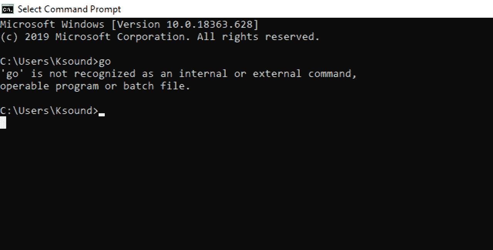

不用担心，这是因为你要通过双击 Go 网站下载的安装程序来安装 Go。

**第二步**:双击下载的安装程序安装 Go。按照提示进行操作，Go 将被安装。

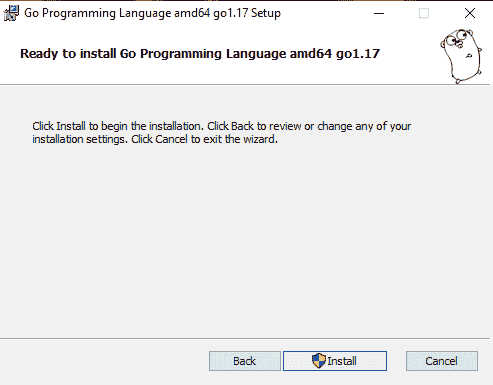


**第三步**:安装 go 通过安装程序后，回到命令行，再次输入“Go”。这一次，您应该会在 Go 中看到几个可用的命令。

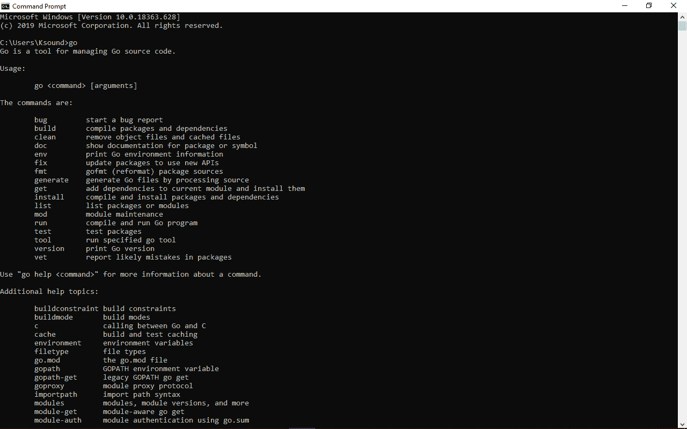

**第四步**:但是你不能就这样在 Go 里开始编程。您必须通过配置环境变量来设置您的 Go 工作空间。

所以，在你的桌面上创建文件夹“go-workspace”。你想叫它什么都可以。这是存储您的 Go 项目的文件夹。仅当您将`GOPATH`变量的值设置为它时。我们将在接下来的步骤中这样做。

**第五步**:在 windows 搜索栏搜索“env”，点击“编辑系统环境变量”。

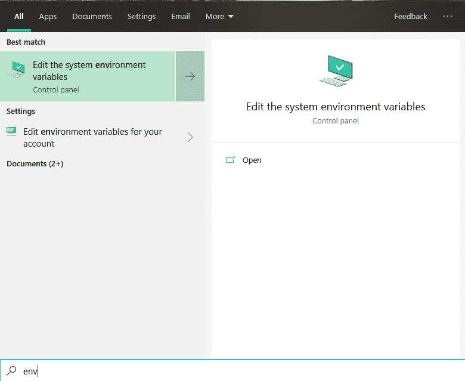

**第六步**:点击“环境变量”。


这里你要做的是将变量`GOPATH`的值更改为你在**步骤 4** 中创建的文件夹。

**第七步**:确认“GOPATH”被选中，然后点击“编辑…”。

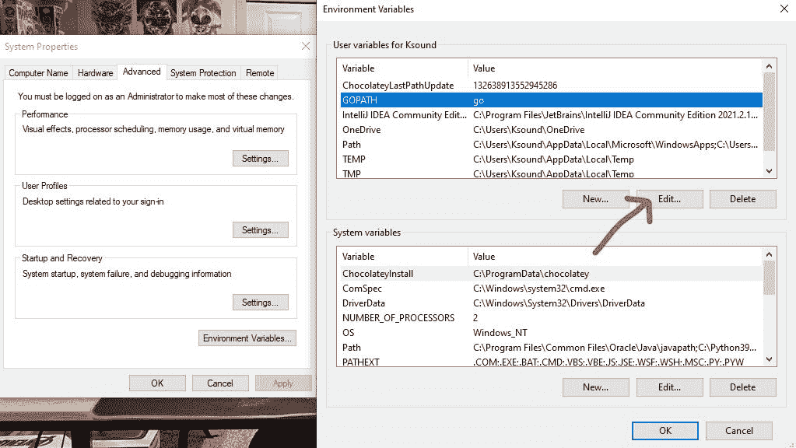

**第八步**:点击“浏览器目录”。

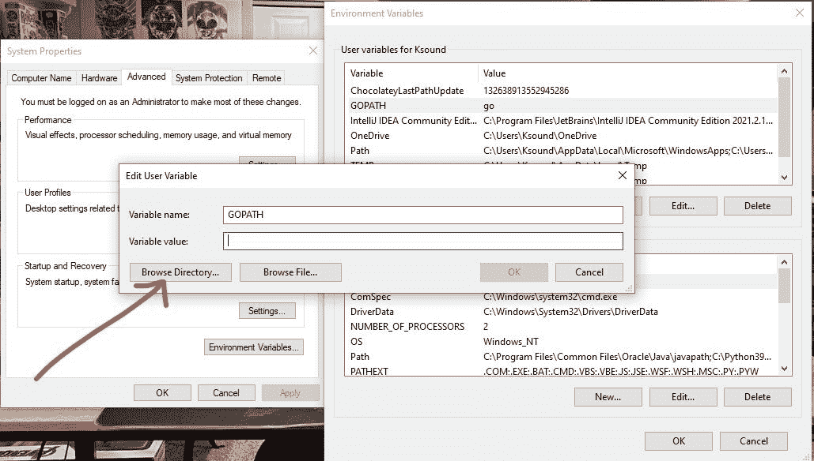

**第九步**:选择您在**第四步**中创建的文件夹。也就是“go-workspace”，或者随便你怎么称呼它。

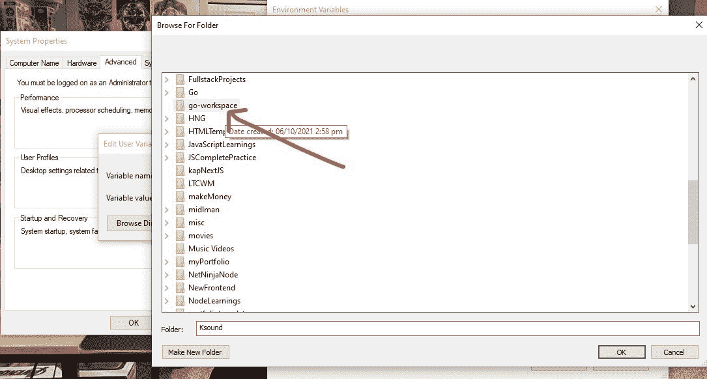

单击“确定”。

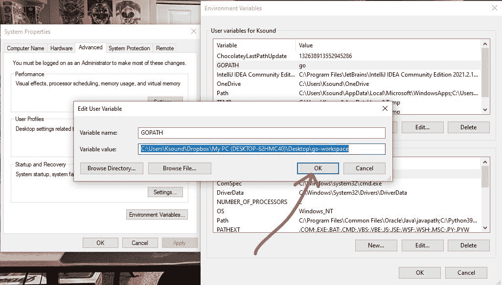

再次单击“确定”。

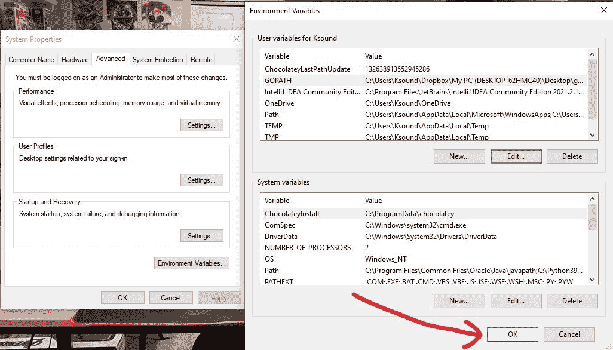

又是“好的”。

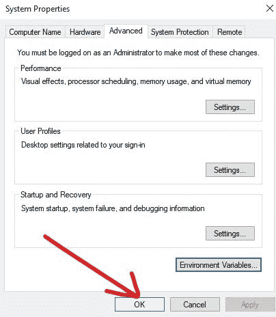

就是这样！你现在可以在你的 Windows 机器上开始编程了。

## 如何在 Go 中写出你的第一个 Hello World

**步骤 1** :用 VS 代码(或者你选择的代码编辑器)打开“go-workspace”文件夹(或者你给它起的名字)，创建一个名为`main.go`的文件。您可以随意命名该文件。


**第二步**:当你敲回车键时，会提示你安装 VS 代码的 Go 扩展。确保你安装了它，因为它会给你的代码编辑器一些 Golang 的超能力，比如语法高亮和代码段建议。

VS 代码还会提示你安装更多的扩展。全部安装。在我的例子中，我已经为我的 VS 代码安装了所有的东西，并且我所有的扩展都是同步的，所以我没有得到那些提示。

将以下代码粘贴到 main.go 文件(或您命名的任何文件)中:

```
package main

import "fmt"

func main() {
    fmt.Println("Hello World")
} 
```

**上面的代码在做什么？**

第一行有`package main`。“包”是每个 Go 文件拥有的文件和代码的集合。把`package`想象成一个包含 Go 文件和代码的文件夹。

不管你给你的文件起了什么名字，确保“package main”在你的代码上面是可用的。

之后`fmt`被带进来。“fmt”是 Go 标准库中的一个包。它用于格式化字符串并将消息打印到命令行。它包含了在 Go 中做事的方法。

其中一个方法是`Println`，意思是“打印行”，我们将用它来打印我们的“Hello World”文本。

在函数“main”中，`fmt`包用于将“Hello World”文本输出到控制台。

要运行这段代码，打开您的终端，键入`go run main.go`，然后按回车键。如果您将文件命名为其他名称，请将其命名为`go run yourFileName.go`。

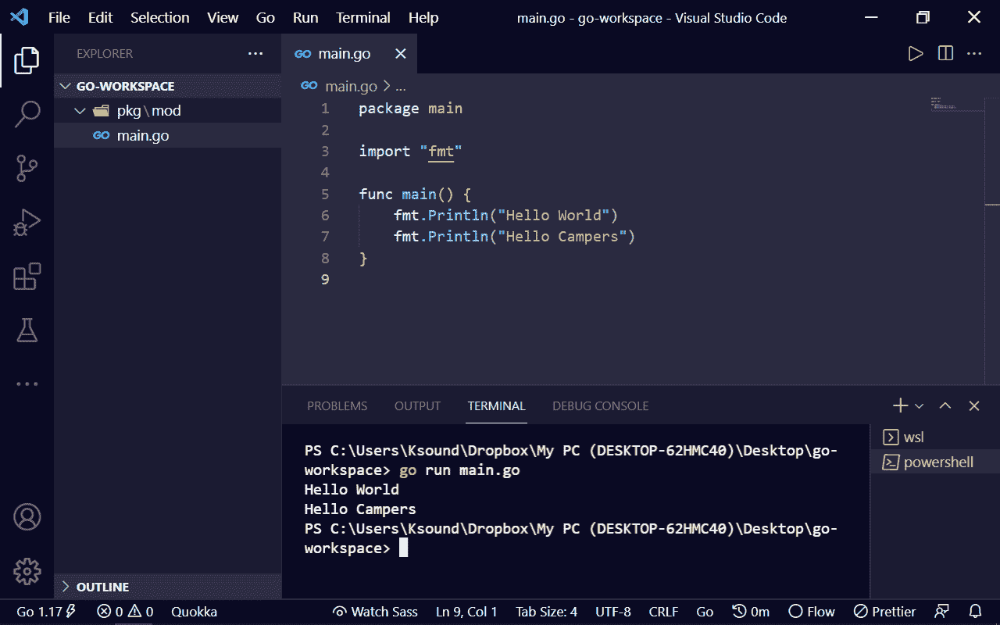

## 结论

在本文中，您了解了 Go 编程语言，以及为什么它是一种值得了解的语言。您还学习了如何在 Windows 机器上安装 Go，并在其中编写您的第一个 Hello World 程序。

Go 是一种强大的编程语言，它将一直存在。从 2020 年 StackOverflow 开发者调查可以明显看出，开发者热爱 Go，其受欢迎程度也在逐年上升。

围棋绝对值得你花时间。现在，去学点围棋吧。