# 如何使用 Google data proc——以 PySpark 和 Jupyter 笔记本为例

> 原文：<https://www.freecodecamp.org/news/what-is-google-dataproc/>

在本文中，我将解释什么是 Dataproc 以及它是如何工作的。

Dataproc 是一个适用于 Spark 和 Hadoop 的 Google 云平台托管服务，可以帮助您处理大数据、ETL 和机器学习。它提供了一个 Hadoop 集群并支持 Hadoop 生态系统工具，如 Flink、Hive、Presto、Pig 和 Spark。

Dataproc 是一个自动扩展的集群，它管理日志记录、监控、您选择的集群创建和作业编排。您需要手动供应集群，但是一旦供应了集群，您就可以向 Spark、Flink、Presto 和 Hadoop 提交作业。

Dataproc 隐式集成了其他 GCP 产品，如计算引擎、云存储、Bigtable、BigQuery、云监控等等。Dataproc 支持的作业有 MapReduce、Spark、PySpark、SparkSQL、SparkR、Hive 和 Pig。

除此之外，Dataproc 还允许与 Jupyter 笔记本进行本机集成，这一点我们将在本文后面介绍。

在本文中，我们将涉及:

1.  Dataproc 集群类型和如何设置 Dataproc
2.  如何向 Dataproc 提交 PySpark 作业
3.  如何通过 Jupyter Notebook 创建一个 Notebook 实例并执行 PySpark 作业。

## 如何创建 Dataproc 集群

Dataproc 有三种集群类型:

1.  标准
2.  单一节点
3.  高可用性

标准集群可以包含 1 个主节点和 N 个工作节点。单个节点只有 1 个主节点和 0 个工作节点。出于生产目的，您应该使用具有 3 个主节点和 N 个工作节点的高可用性集群。

对于我们的学习目的，只有一个主节点的单节点集群就足够了。

在 GCP 创建 Dataproc 集群非常简单。首先，我们需要启用 Dataproc，然后我们将能够创建集群。

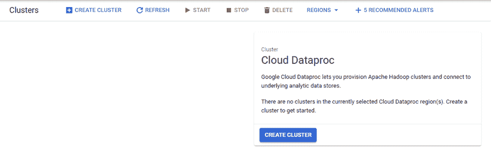

Start Dataproc cluster creation

当您单击“创建集群”时，GCP 会为您提供选择集群类型、集群名称、位置、自动扩展选项等选项。

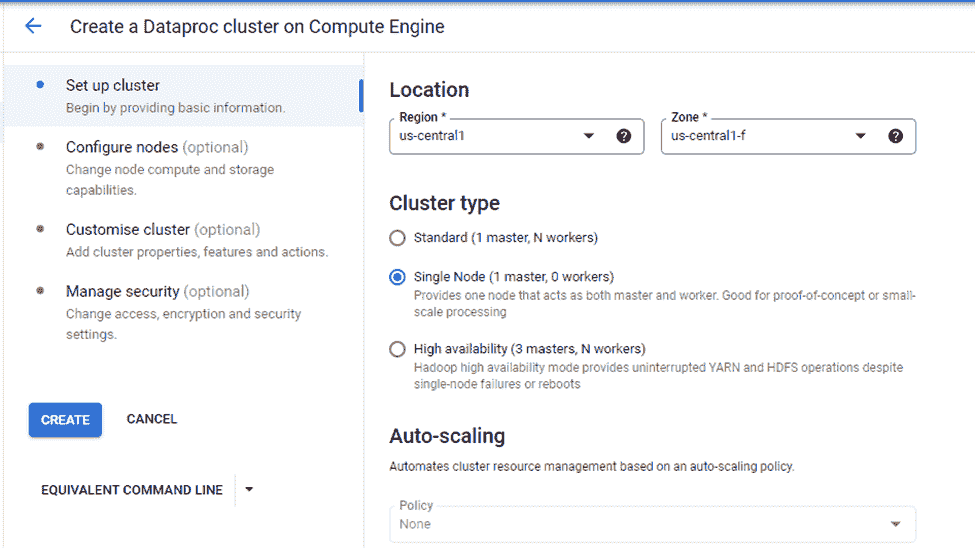

Parameters required for Cluster 

由于我们选择了单节点集群选项，这意味着自动扩展被禁用，因为集群只包含一个主节点。

配置节点选项允许我们选择计算机系列的类型，如计算优化、GPU 和通用。

在本教程中，我们将使用通用机器选项。通过这种方式，您可以选择机器类型、主磁盘大小和磁盘类型选项。

我们要选择的机器类型是 n1-standard-2，它有两个 CPU 和 7.5 GB 的内存。主磁盘大小为 100GB，足以满足我们在这里的演示目的。

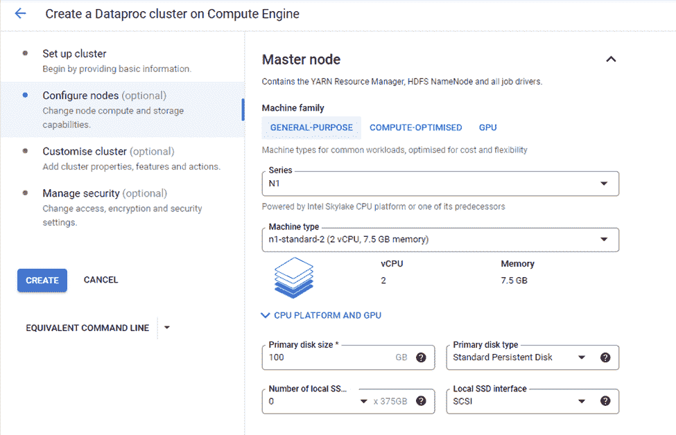

Master Node Configuration

我们选择了单节点的集群类型，这就是为什么配置只包含一个主节点。如果您选择任何其他集群类型，那么您还需要配置主节点和工作节点。

从自定义群集选项中，选择默认网络配置:

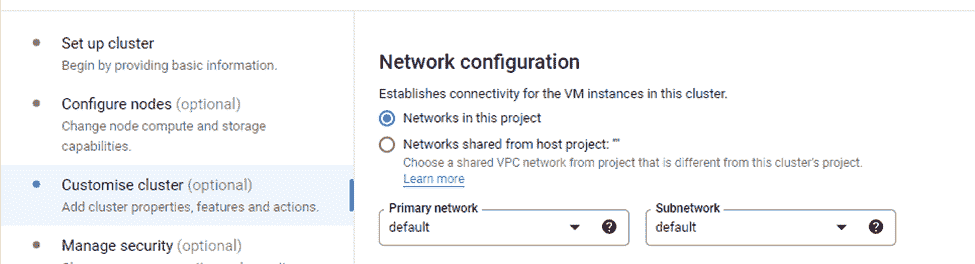

如果在指定的未来时间(例如几小时、几天或几分钟后)不需要集群，请使用“计划删除”选项。

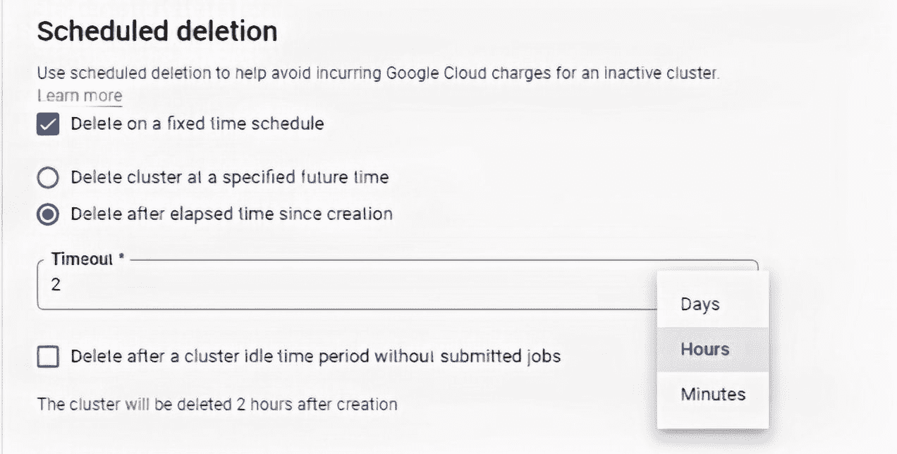

Schedule Deleting Setting

在这里，我们将“超时”设置为 2 小时，因此该集群将在 2 小时后自动删除。

我们将使用默认的安全选项，即 Google 管理的加密密钥。当您单击“创建”时，它将开始创建集群。

您也可以使用“gcloud”命令创建集群，您可以在“等效命令行”选项中找到该命令，如下图所示。

您可以使用 POST 请求创建一个集群，您可以在“等效 REST”选项中找到该请求。

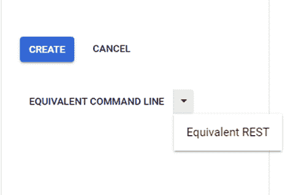

gcloud and REST option for Cluster creation

几分钟后，带有 1 个主节点的群集就可以使用了。

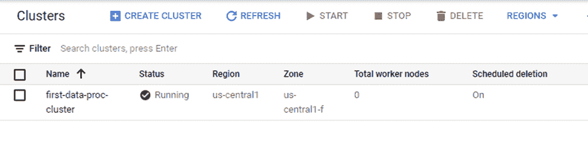

Cluster Up and Running

如果单击“Cluster Name”，您可以找到有关虚拟机实例的详细信息:

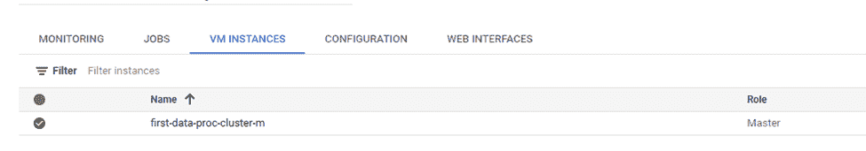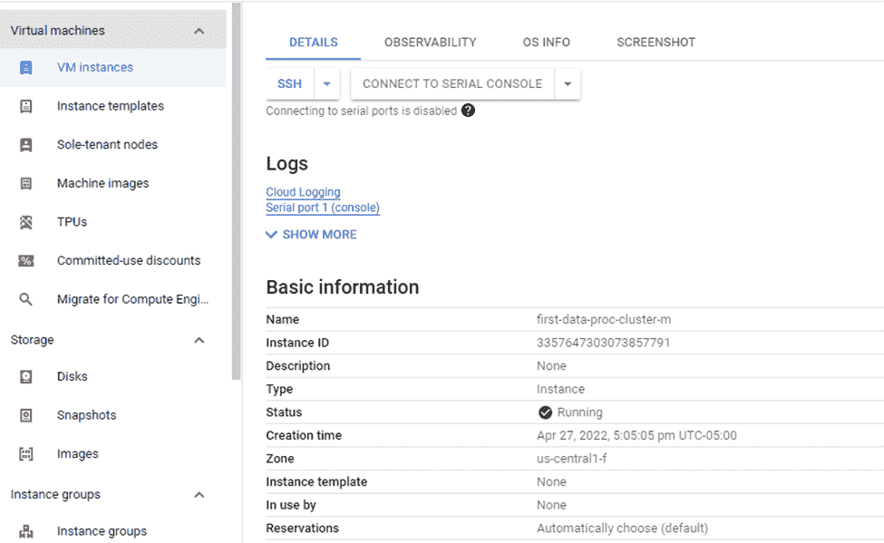

## 如何提交 PySpark 作业

在将 PySpark 作业提交给 Dataproc 之前，让我们简单了解一下它是如何工作的。从包含重复元素的列表中识别不同的元素是一项简单的工作。

```
#! /usr/bin/python

import pyspark

#Create List
numbers = [1,2,1,2,3,4,4,6]

#SparkContext
sc = pyspark.SparkContext()

# Creating RDD using parallelize method of SparkContext
rdd = sc.parallelize(numbers)

#Returning distinct elements from RDD
distinct_numbers = rdd.distinct().collect()

#Print
print('Distinct Numbers:', distinct_numbers)
```

Code for finding distinct elements from List 

上传。py 文件添加到 GCS bucket，我们在配置 PySpark 作业时需要它的引用。

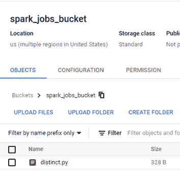

Job GCS Location

在 Dataproc 中提交作业很简单。您只需选择“提交作业”选项:

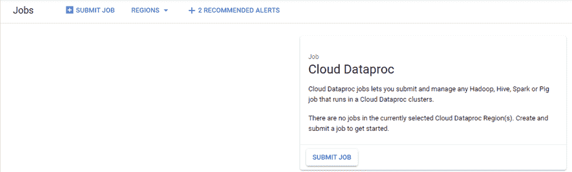

Job Submission 

要提交作业，您需要提供作业 ID，即作业的名称、区域、集群名称(这将是集群的名称“first-data-proc-cluster”)和作业类型(这将是 PySpark)。

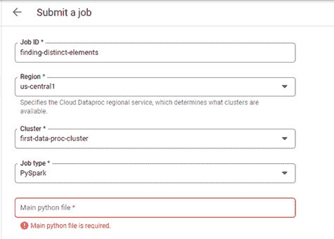

Parameters required for Job Submission

您可以从上传 Python 文件的 GCS bucket 中获得 Python 文件的位置——您可以在 gsutil URI 找到它。

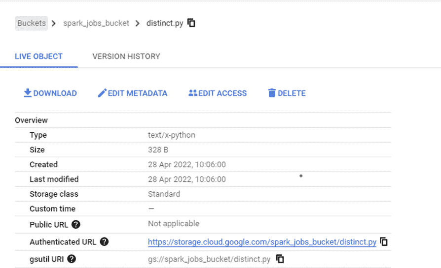

不需要其他参数，我们现在可以提交作业:

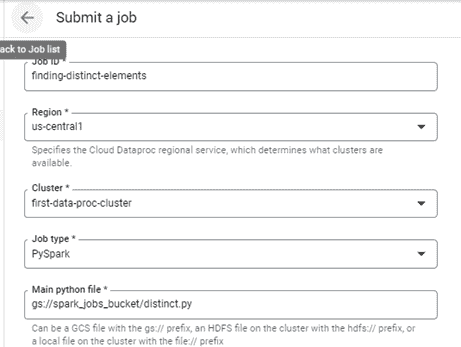

执行之后，您应该能够在日志中找到不同的数字:

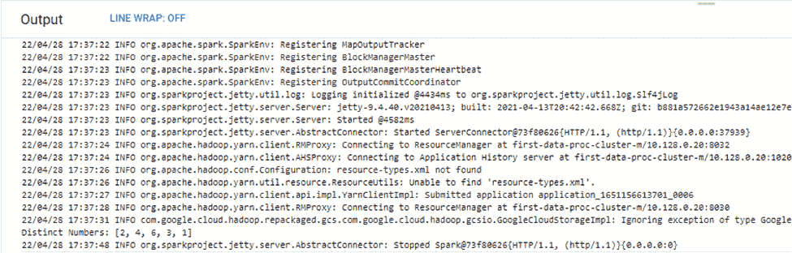

Logs 

## 如何创建 Jupyter 笔记本实例

您可以将一个笔记本实例与 Dataproc Hub 相关联。为此，GCP 为每个笔记本实例配置了一个集群。我们可以从笔记本中执行 PySpark 和 SparkR 类型的作业。

要创建笔记本，请使用如下所示的“工作台”选项:

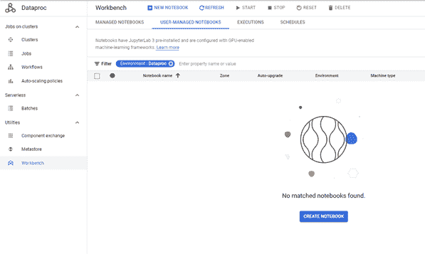

确保您完成了通常的配置，如笔记本名称、区域、环境(Dataproc Hub)和机器配置(我们使用 2 个 vCPUs 和 7.5 GB RAM)。我们使用默认的网络设置，在权限部分，选择“服务帐户”选项。

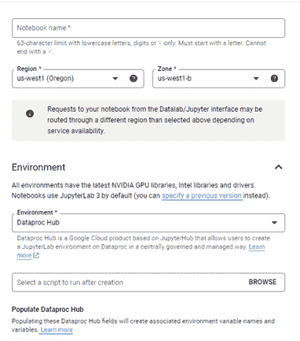

Parameters required for Notebook Cluster Creation

单击创建:

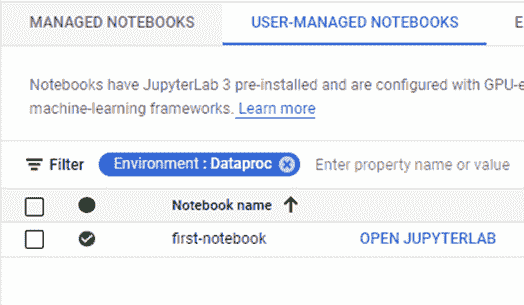

Notebook Cluster Up & Running

“打开 JUPYTYERLAB”选项允许用户为他们的笔记本指定集群选项和区域。

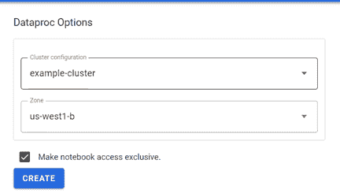

配置完成后，笔记本会为您提供一些内核选项:

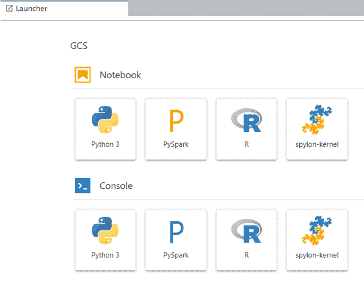

单击 PySpark，这将允许您通过笔记本执行作业。

SparkContext 实例已经可用，因此不需要显式创建 SparkContext。除此之外，程序保持不变。

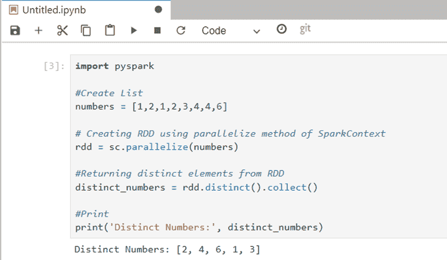

Code snapshot on Notebook

## 结论

当您使用 GCP Dataproc 时，在 Spark 和 Hadoop 上工作变得更加容易。最好的部分是你可以创建一个笔记本集群，这使得开发更简单。