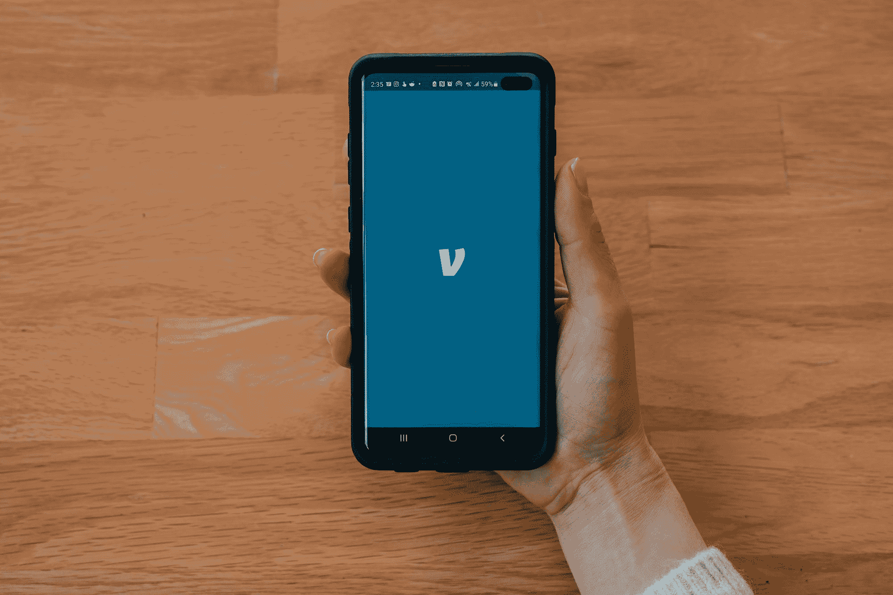
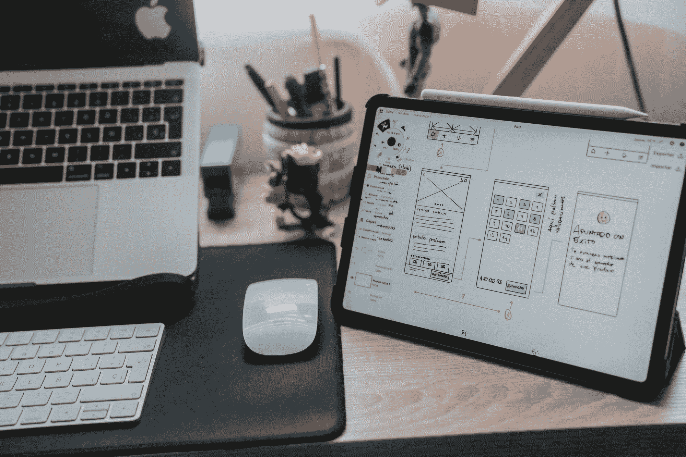
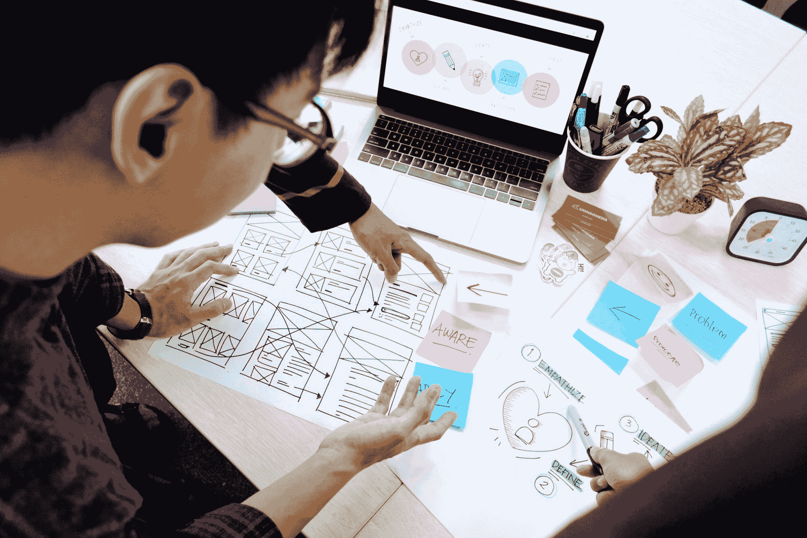
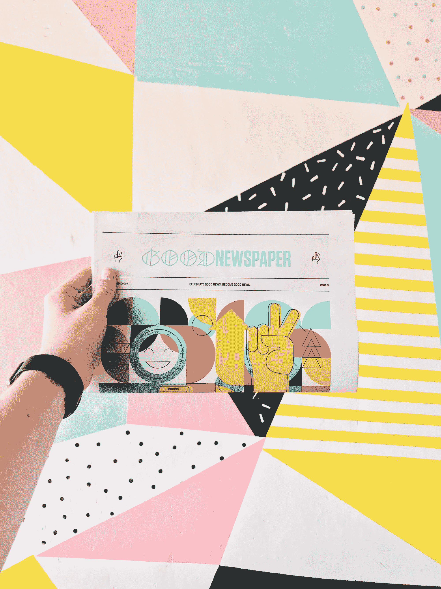
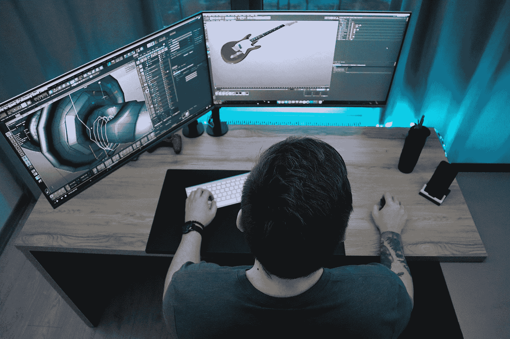
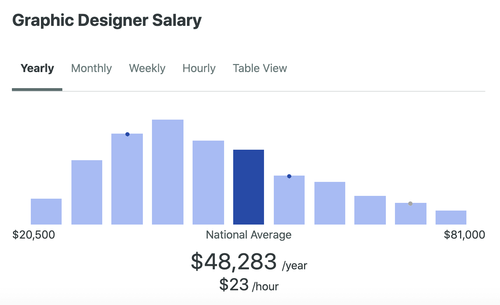
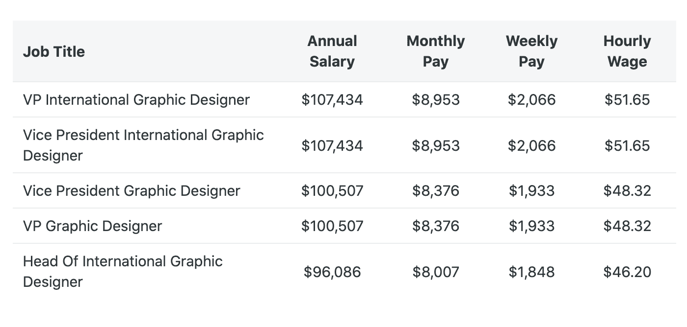

# 什么是平面设计？用简单的英语解释平面设计师的工作

> 原文：<https://www.freecodecamp.org/news/what-is-graphic-design-the-graphic-designer-job-explained-in-plain-english/>

杂志封面、商业标识和书籍封面都是平面设计的常见例子。但是什么是平面设计呢？

在这篇文章中，我将解释什么是平面设计，讨论平面设计的不同领域，提供有用的学习资源，并谈论设计师的工资。

## 什么是平面设计？

平面设计包括创建高质量的视觉内容，作为向观众传达信息的一种方式。企业花了很多钱来确保他们公司的设计传达了正确的品牌信息。

你可能听说过这样一句话，“一张图胜过千言万语”。创造引人注目的视觉效果来传达品牌或信息的能力是一项非常强大的技能。

## 平面设计的基本原则和要素

设计的基本原则和要素包括颜色、空间、大小、形状、形式、线条、运动、重点、纹理、平衡、对比等等。

平面设计师将学习所有这些原则和元素，以便他们能够理解如何创建一个有效的设计。

CalArts 通过他们的[图形设计专业](https://www.coursera.org/specializations/graphic-design)提供了对所有这些设计原则的深入研究。

让我们仔细看看这些重要的设计元素之一，即颜色的有效使用。

### 如何在平面设计中运用色彩

在设计中使用色彩可以吸引用户并引发情感反应。作为设计师，你必须非常小心地为特定的设计选择合适的颜色。

让我们看一个例子。你有没有想过为什么公司在销售中使用红色？

红色会引起人类强烈的反应。我们被设定停下来注意它。

当你试图促销时，它是一种非常有效的颜色，传达一种趁价格低时立即购买的紧迫感。

相比之下，蓝色被人类认为是安全和平静的。蓝色是银行等金融机构的热门选择。

这些金融机构想要传达的信息是“你的钱在我们这里是安全的”。

要了解更多关于在设计中有效使用色彩的知识，我建议阅读这些文章。

*   [如何利用色彩理论增加用户对你的应用的参与度](https://www.freecodecamp.org/news/how-to-increase-user-engagement-with-your-app-using-color-theory-7c6f5c632570/)
*   [网页设计色彩使用综合指南](https://www.freecodecamp.org/news/comprehensive-guide-for-color-usage-in-web-design-e2a9afce09fb/)

## 不同类型的平面设计

有不同类型的平面设计，你可以进入。以下是一些常见领域的列表:

*   用户界面
*   用户体验(UX)
*   出版物设计
*   组装设计
*   运动图形

现在让我们更详细地看看平面设计的每一个领域。

### 用户界面(UI)设计

UI 设计关注用户如何与界面交互。这些设计师会考虑智能页面布局，易于使用的界面，颜色和纹理的智能使用以及页面的一致性。

要了解更多关于 UI 设计基础的知识，我建议查看以下资源:

*   [通过这个一小时的免费课程学习 UI 设计基础知识](https://www.freecodecamp.org/news/learn-ui-design-fundamentals-with-this-free-one-hour-course/)
*   [UI 设计教程-来自线框的网站](https://www.youtube.com/watch?v=_P3CrgFlXhg)
*   UI/UX 设计指南:什么是 UI 设计师，他们和 UX 设计师有什么不同？

### 用户体验(UX)设计

UX 设计师关注用户如何与产品互动。目标是创造一个简单而积极的用户体验。

一个好的 UX 设计的例子是谷歌的搜索引擎。它使用起来非常简单快捷，创造了积极的用户体验。

要了解更多关于 UX 设计基础的知识，我建议查看以下资源:

*   [如何学习 UX 设计，成为自学成才的用户体验设计师](https://www.freecodecamp.org/news/learn-ux-design-self-taught-user-experience-designer/)
*   [谷歌 UX 设计专业证书](https://www.coursera.org/professional-certificates/google-ux-design)

### 出版物设计

这种类型的设计主要侧重于印刷和数字媒体，如书籍、报纸和杂志。

这些设计师将在布局、色彩、艺术作品和摄影等方面与编辑密切合作。

### 组装设计

这些设计师专注于产品包装的工业设计、视觉设计和制造方面。

精心设计的产品包装会有效地推销产品的品牌，让消费者产生购买兴趣。

### 运动图形设计

运动图像用于各种领域，如宣传片、应用程序、视频游戏、片头等等。

这些设计师将从构建故事板开始，然后将他们的设计转移到动画和其他视频艺术形式上。

## 图形设计工具

平面设计师在工作中会用到很多工具。以下是平面设计师使用的一些流行工具的列表。

*   可靠计算机
*   可靠的硬盘
*   平板电脑和手写笔
*   可靠的智能手机
*   数码相机
*   Adobe Creative Cloud(包括 Photoshop、Illustrator、InDesign、After Effects 等)
*   速写本

## 平面设计工资

由于薪水会根据你所在的地区而有所不同，我建议你使用像 [Indeed](https://www.indeed.com/) 和 [ZipRecruiter](https://www.ziprecruiter.com/) 这样的网站来研究平面设计工作。

这里有一些美国平面设计师的薪水。这个数据是由 [ZipRecruiter](https://www.ziprecruiter.com/) 提供的。

我希望这些信息对你有所帮助，并祝你在平面设计之旅中好运。