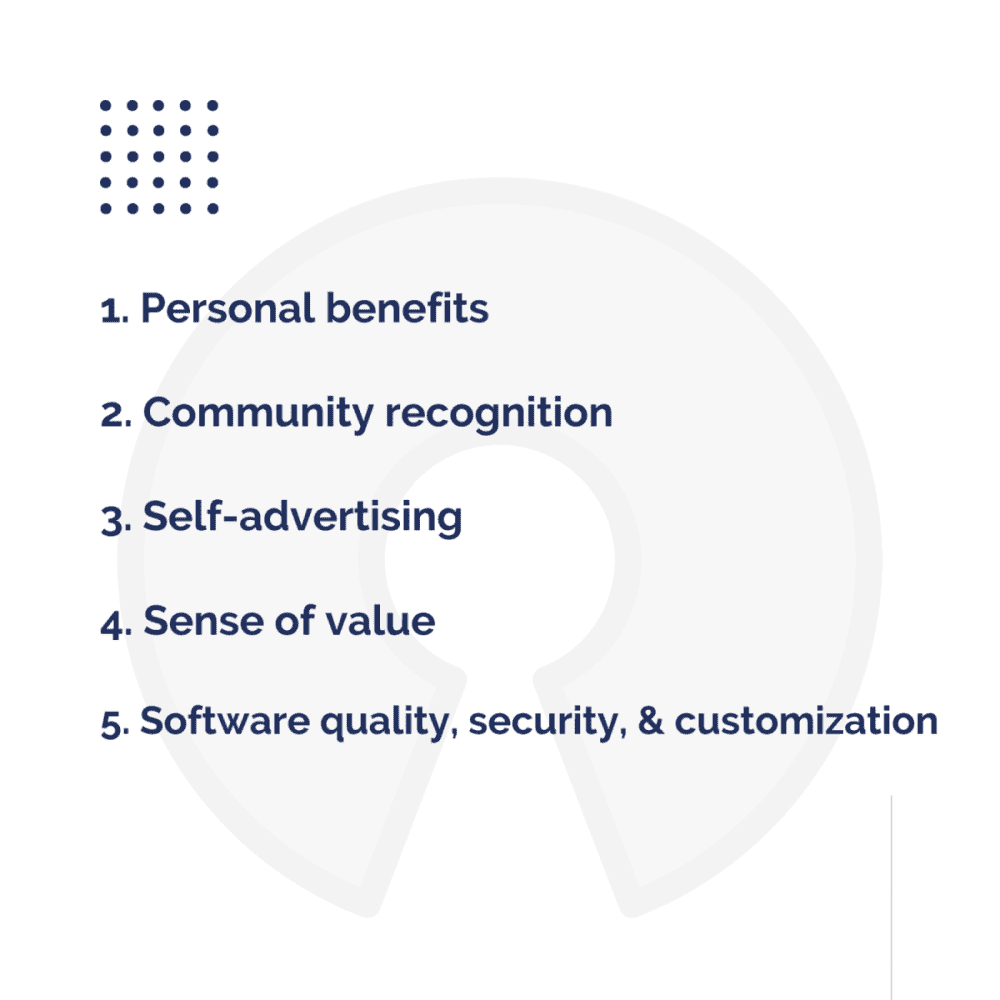
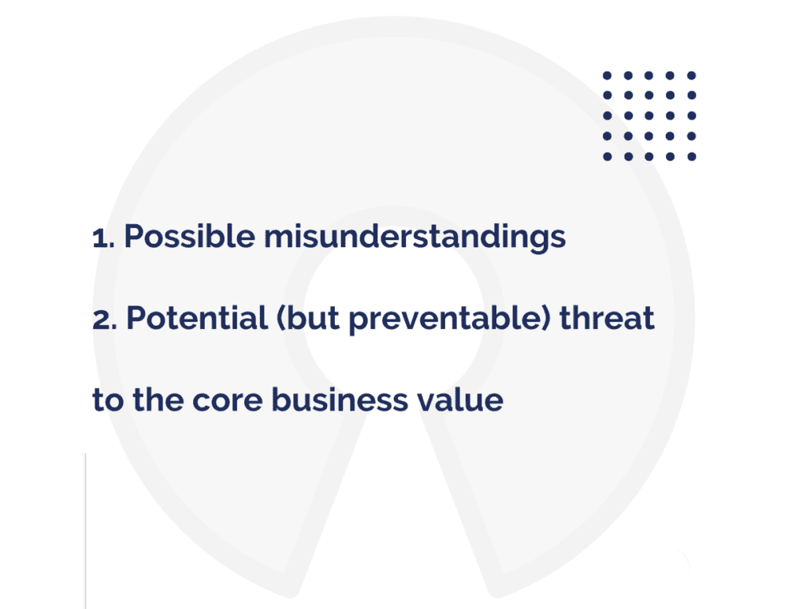

# 开源软件开发的利与弊

> 原文：<https://www.freecodecamp.org/news/what-is-great-about-developing-open-source-and-what-is-not/>

## 是时候回报那些让你能够使用互联网的人了！

许多开发人员喜欢开源项目，这是有充分理由的:他们每天都用它们来加速工作。开源软件解决方案有很多成功的例子，比如 Linux(一个操作系统)或者 [React](https://keenethics.com/tech-front-end-react) (一个 JavaScript 库)。这些解决方案通常是精心制作的，使用这种高质量的代码是一种享受。

所以，让我们仔细看看开源意味着什么，使用开源项目有什么好处和坏处。

## **什么是开源？**

术语“开源”是软件开发行业创造的，指的是任何人都可以检查、修改和共享的东西。它代表了一种创建计算机程序的特定方法，这种方法颂扬协作、透明和面向社区的开发的价值。

**开源代码是开发者写的，也是为开发者写的。**

为了保护参与开源的各方，项目所有者可以使用知识共享许可。知识共享(CC)许可使每个人都能共享、使用和构建您的作品。

**开源软件**通常是一种自由软件产品，开发者可以访问源代码。它们可以增强程序的性能，增加一些功能，并修复错误。这类软件的一些例子有 LibreOffice、Mozilla Firefox 和 Chromium。

相比之下，有**专有软件**，也叫“闭源软件”。这种程序的源代码只能由其所有者检查或修改。专有软件的一些例子包括微软、Adobe 或苹果的一些产品。

一些公司将开源软件视为规范，而另一些公司更喜欢开发闭源软件。可以肯定的是，开源模式有它的优点和缺点。

## 开发开源软件的好处是什么？

### **个人利益**

如果我说开源开发者是由利他主义和帮助他人的愿望所驱动的，很多阅读这篇文章的人可能会不相信地笑了。但是这种内在动机是大多数人从事开源项目的主要原因。

不要低估个人利益的重要性——那些乐于助人和自我实现的感觉。

### **社区认可**

科学家和医生通过撰写学术文章和参加科学会议来分享他们的经验。UI/UX 设计师分享他们在或[dribble](https://dribbble.com/)行为上的经验。作家印刷他们的书或通过在线平台分享。音乐家和电影制作人通过不同的流媒体服务与世界分享他们的作品。为什么软件开发人员会与众不同，并希望错过获得认可的机会？

在从事或运行开源项目时，您可以通过多种方式获得开发人员社区的认可，例如创建一个伟大的 GitHub-profile，以及参加像 [Hacktoberfest](https://hacktoberfest.digitalocean.com/) 这样的活动。

你可能还会得到折扣，免费入场，以及一个完善的基础设施来运行你的项目。从事开源项目不仅能为您节省资金，还能激励您在自己的项目中使用所有可用的最佳工具。

Here are a few participants of Lviv Hacktoberfest. 

### **自我广告**

如果你或你的公司积极参与开源社区，你可以赢得很大的声誉。这样的话，如果你是一个个体或者个体户开发者，你会更容易找到一份自由职业者或者全职员工的工作。如果你代表一家软件开发公司，你会更容易找到愿意为你工作的人，愿意合作的伙伴，以及愿意请求你的专业服务的客户。

这就是为什么开发开源软件创造了一个完美的广告机会——对开发者和开发机构来说都是双赢的局面。

### **价值感**

无需隐瞒真相:工作倦怠困扰着开发人员的工作和软件供应商的人力资源策略。如果你是一个公司老板，通过激励你的员工参与开源开发，你向他们展示了他们的工作是有价值的。他们不仅会参与你的商业项目，还会通过参与开源项目为更广泛的开发者社区提供价值。

通过帮助您的开发人员实现这些目标和价值感，您可以让他们保持与您合作的兴趣。

如果你是一个自雇的开发者，也是如此。从事开源软件开发会让你的工作变得有意义，你也不会变得讨厌它久而久之。

### **软件质量**

开源代码通常质量更高。由一个开发团队开发的一个软件可能比由来自世界各地、拥有不同技术、行业和项目经验的数千名开发人员开发的软件质量差。开源软件中的错误可以很快被识别出来，因为代码会被多个开发人员不断地检查。

如果代码是开源的，那么即使是由一个开发者编写的代码也往往质量更高。如果你写的代码只有你或你的亲密同事会看到，你可能不太关心代码风格。但是如果你写的代码每个人都可以看到，你会尽你所能不要看起来像一个代码猴子。来自社区的评论、贡献和重构在这里都很有帮助。

### **数据安全**

应用程序开发应该使用开源软件，因为它更安全。社区迅速发现并报告安全缺陷，软件所有者通常会立即修复这些缺陷。

反过来，如果一个专有软件产品存在安全缺陷，没有人会知道，直到有人成为它所造成的威胁的受害者。

此外，开源产品不能像一些专有软件公司那样故意误用和滥用用户数据。社区将会发现这种滥用，软件及其所有者的声誉将会被毁掉。

### **定制**

开发开源软件通常意味着你正在开发一个容易定制的软件。由于源代码是开放的，开发者可以很容易地对界面的功能进行修改。

例如，Apache CloudStack 是一个促进云计算的开源软件。另一个例子是开源平台 [Botpress](https://botpress.io/) ，它允许开发者轻松创建定制的聊天机器人。作为 Botpress 贡献者的 KeenEthics 开发者，当他们能够让其他人的生活变得更简单时，他们会感到很高兴。

**开源就是获取和分享经验。有时，你看到一个开源软件项目缺少一些东西，你通过贡献你的代码来填补这个空白。其他时候，你明白你可以做得更好。开源帮助你应对无聊，并赢得同行的认可。**

Sergey GornostaevFull-Stack Developer 

## 开发开源软件有什么不好的地方？

### **沟通不畅和误解**

你可能会被要求改进你的产品或者帮助做一些事情，但是你可能不得不与不同类型的人打交道。有些人可能希望你对他们的要求全天候回应。其他人可能会打开 PRs 来改进你的产品，但你必须解释应该如何准备以及如何将它们融入主线的规则。

最终，无法保证社区贡献的质量不会降低。这就是为什么你很有可能重构了某人的代码，却没有合并他们的变更，让人们失望。

### **对核心商业价值的威胁**

你不应该开源任何对你的业务有核心价值的东西。如果有一个商业秘密——一个让你的企业与众不同的想法或实现方式，你不应该开源它，这样你的竞争对手就不会得到它。然而，如果你有可以被公众使用而不会给你的企业带来任何损失的想法和工具——开源它们。

## **为什么开源是正确的选择**

如果你是一个互联网用户(你肯定是)，你不可避免地会使用数量惊人的自由软件开源。互联网发明者设计了大量的开源项目，今天任何使用它的人都会收获他们努力的成果。例如，云计算很大程度上基于开源贡献。

此外，Tidelift 和 New Stack 的一项调查表明，84%的软件开发人员在他们的专业工作中使用开源软件。利用别人的经验和知识，为什么不分享你的呢？

**如果我们享受开源的好处，回馈社区才是正确的做法。**

## **参与开源开发！**

如何开始？向公众开放你的 GitHub 库，并通过你的博客、社交媒体或开发者论坛告诉全世界。在 [上注册黑客新闻](https://news.ycombinator.com/) 因为有很多开源贡献者出没。

开源让你作为开发者成长得更快，并给整个社区带来有益的结果。与此同时，你应该尽量不要伤害给你所有这些伟大的开源东西的社区。明智地做出贡献，通过回答你能帮助的问题来帮助他人。

## 你对一个项目有想法吗？

我的公司 KeenEthics 在开源[网络开发](https://keenethics.com/services-web-development)和[移动应用开发](https://keenethics.com/services-mobile-development)方面有着丰富的经验。如果你准备好改变游戏并开始你的项目，请随时联系********。********

如果你喜欢这篇文章，你一定要读另一篇:[敏捷测试:如何确保高质量的软件](https://keenethics.com/blog/agile-testing)。

## 附言

我还要感谢@ KeenEthics 首席技术官 Alex Pletnov ，感谢他激发了我的灵感并为本文做出了贡献。

发布在 KeenEthics 博客上的原始文章可以在这里找到:[开发开源有哪些伟大之处，哪些不是？](https://keenethics.com/blog/1554243600000-open-source)