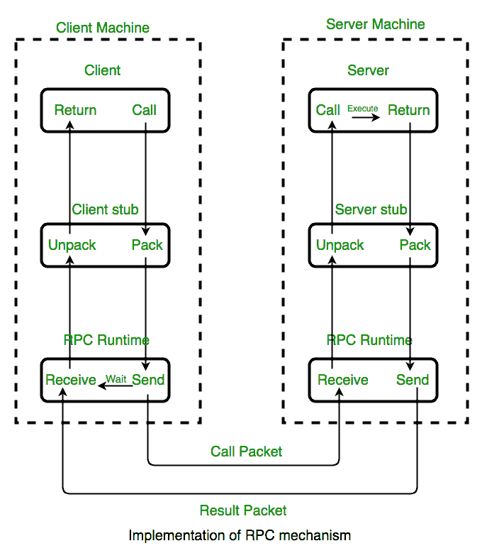
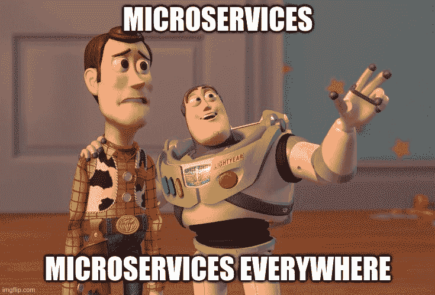
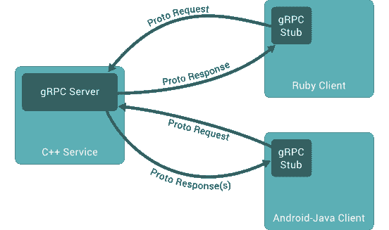
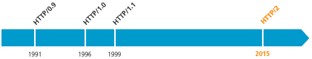
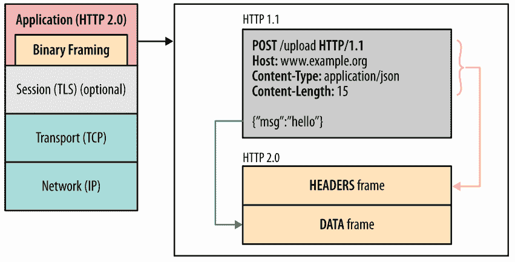
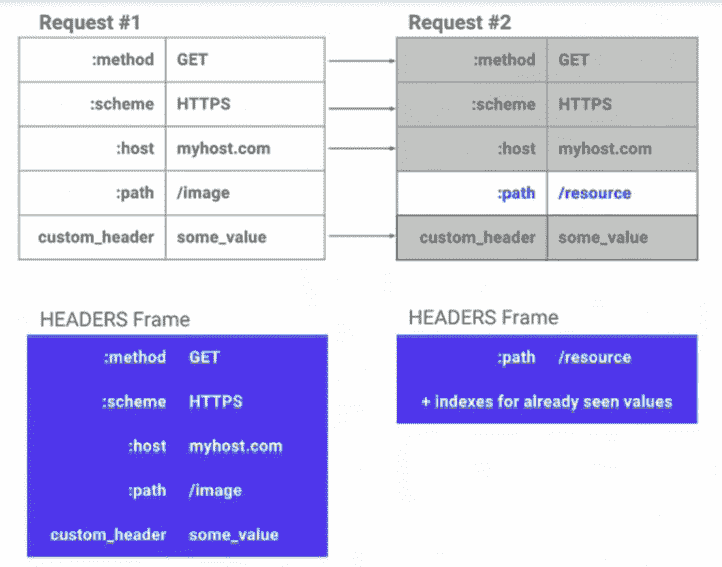

# gRPC 是什么？解释了协议缓冲区、流和架构

> 原文：<https://www.freecodecamp.org/news/what-is-grpc-protocol-buffers-stream-architecture/>

gRPC 是处理远程过程调用的强大框架。RPC 允许您编写代码，就像它将在本地计算机上运行一样，即使它可能在另一台计算机上执行。

在过去的几天里，我一直在深入研究 gRPC。在这篇文章中，我将分享我的一些重大发现。

请注意，我将更多地关注概念，而不是实现细节。您将了解 gRPC 本身的核心架构。您还将了解到:

*   为什么 gRPC 被开发者如此广泛地使用
*   它是如何表现得如此出色的
*   以及它是如何在引擎盖下工作的。

## 让我们倒回去一点

在我们进入 gRPC 之前，我们应该看看什么是**远程过程调用**。

RPC 是客户机-服务器通信的一种形式，它使用函数调用而不是通常的 HTTP 调用。

它使用 IDL(接口定义语言)作为要调用的函数和数据类型的契约形式。



RPC Architecture

如果你们还没有意识到，gRPC 中的 RPC 代表远程过程调用。是的，gRPC 确实通过函数调用复制了这种客户机服务器通信的架构风格。

所以 gRPC 在技术上并不是一个新概念。更确切地说，它是从这种旧技术中采用并加以改进的，使得它在仅仅 5 年的时间里就变得非常流行。

## gRPC 概述


2015 年，谷歌开源了他们的项目，最终成为名为 gRPC 的项目。但是 gRPC 中的“g”实际上代表什么呢？

许多人可能认为这是谷歌的，因为谷歌制造了它，但事实并非如此。

谷歌改变了每个版本中“g”的含义，他们甚至制作了一个自述文件来列出所有的含义。

自从 gRPC 被引入以来，它已经变得相当流行，许多公司都在使用它。

### 是什么让 gRPC 如此受欢迎？

gRPC 如此受欢迎有很多原因:

*   抽象很容易(这是一个函数调用)
*   许多语言都支持它
*   它很有表现力
*   HTTP 调用经常令人困惑，所以这使得它更容易

除了上述所有原因，gRPC 之所以受欢迎，是因为微服务非常受欢迎。

微服务通常会用不同的编程语言运行几种服务。他们通常还会有很多服务对服务的交互。

这就是 gRPC 通过提供支持和能力来解决这些情况下出现的典型问题的最大帮助所在。



Microservices

gRPC 在服务到服务的调用中非常流行，因为通常 HTTP 调用乍一看很难理解。

gRPC 函数更容易推理，因此开发人员不必担心编写大量文档，因为代码本身应该解释一切。

有些服务也可能用不同的语言编写，gRPC 提供了多个库来支持这一点。

性能是顶上的樱桃，而且是一颗大樱桃。

## grp 体系结构



The rough architecture of gRPC. It's more or less the same as regular RPC.

我已经多次提到 gRPC 的性能非常好，但是您可能想知道是什么使它如此好？当 gRPC 和 RPC 的设计非常相似时，是什么让它们比 RPC 好得多呢？

以下是使 gRPC 如此高性能的几个关键区别。

### HTTP/2

HTTP 已经伴随我们很久了。现在，几乎所有的后端服务都使用这个协议。



History of HTTP

如上图所示，HTTP/1.1 保持了很长时间的相关性。

然后在 2015 年，HTTP/2 出来了，本质上取代了 HTTP/1.1 成为互联网上最流行的传输协议。

如果你还记得 2015 年也是 gRPC 问世的那一年，那一点都不是巧合。Google 也创建了 HTTP/2，供 gRPC 在其架构中使用。

HTTP/2 是 gRPC 能表现这么好的一大原因。在下一节中，您将会看到原因。

### 请求/响应多路复用

在传统的 HTTP 协议中，不可能在一个连接中发送多个请求或得到多个响应。需要为它们中的每一个创建一个新的连接。

这种请求/响应多路复用在 HTTP/2 中成为可能，引入了一个新的 HTTP/2 层，称为二进制帧。



这个二进制层封装并编码数据。在这一层，HTTP 请求/响应被分解成帧。

头帧包含典型的 HTTP 头信息，数据帧包含有效载荷。使用这种机制，可以在一个连接中包含来自多个请求的数据。

这允许来自多个请求的有效载荷具有相同的报头，从而将其识别为单个请求。

### 标题压缩

您可能遇到过许多情况，HTTP 头甚至比有效负载还要大。HTTP/2 有一个非常有趣的策略叫做 HPack 来处理这个问题。

首先，HTTP/2 中的所有内容在发送之前都被编码，包括报头。这确实有助于提高性能，但这不是头压缩最重要的事情。

HTTP/2 在客户端和服务器端都映射了报头。由此，HTTP/2 能够知道报头是否包含相同的值，并且仅在报头值不同于前一个报头时才发送报头值。



如上图所示，请求#2 将只发送路径，因为其他值完全相同。是的，这确实大大减少了有效载荷的大小，从而进一步提高了 HTTP/2 的性能。

### 协议缓冲区，又名 Protobuf


Protocol Buffer

Protobuf 是 gRPC 最常用的 IDL(接口定义语言)。它是您以原型文件的形式存储数据和功能契约的地方。

```
message Person {
    required string name = 1;
    required int32 id = 2;
    optional string email = 3;
}
```

因为这是以契约的形式，所以客户机和服务器都需要有相同的原型文件。proto 文件充当客户机从服务器调用任何可用函数的中介契约。

Protobuf 也有它自己的机制，不像通常的 REST API 只是以字节的形式发送 JSON 字符串。这些机制允许有效负载更小，并实现更快的性能。

Protobuf 使用的编码方法相当复杂。如果你想深入了解它是如何工作的，请查看这个[综合文档](https://developers.google.com/protocol-buffers/docs/encoding)。

## gRPC 还提供什么？


Photo by [Kyle Gregory Devaras](https://unsplash.com/@kyledevaras?utm_source=ghost&utm_medium=referral&utm_campaign=api-credit) / [Unsplash](https://unsplash.com/?utm_source=ghost&utm_medium=referral&utm_campaign=api-credit)

现在，您应该对 gRPC 的体系结构、工作原理和功能有了基本的了解。

但是这里有一些 gRPC 提供给我们的其他有趣的东西。

### [计]元数据

gRPC 没有使用通常的 HTTP 请求头，而是使用了一种叫做元数据的东西。元数据是一种键值数据，可以从客户端或服务器端设置。

`Header`可以从客户端赋值，而服务器可以赋值`Header`和`Trailers`，只要它们都是元数据的形式。

### 流动

流是 gRPC 的核心概念之一，在一个请求中可以发生几件事。这是通过前面提到的 HTTP/2 的多路复用能力实现的。

有几种类型的流:

*   **服务器流 RPC:** 客户端发送一个请求，服务器可以发回多个响应。例如，当一个客户端发送一个包含多个项目的主页请求时，服务器可以单独发送回响应，使客户端能够使用延迟加载。
*   **客户端流 RPC:** 客户端发送多个请求，而服务器只发回一个响应。例如，客户端上传的 zip/chunk。
*   **双向流 RPC:** 客户端和服务器同时向对方发送消息，而不等待响应。

### 截击机

gRPC 支持在其请求/响应中使用拦截器。拦截器，嗯，拦截消息并允许你修改它们。

这听起来熟悉吗？如果您在 REST API 上体验过 HTTP 进程，拦截器与中间件非常相似。

gRPC 库通常支持拦截器，并且易于实现。拦截器通常用于:

*   在传递之前修改请求/响应。它可用于在发送到客户机/服务器之前提供强制信息。
*   允许您操作每个函数调用，例如添加额外的日志来跟踪响应时间。

### 负载平衡

如果您还不熟悉负载平衡，它是一种允许客户机请求分布在多个服务器上的机制。

但是负载平衡通常是在代理级别完成的(例如 NGINX)。那我为什么要在这里谈论它呢？

原来 gRPC 支持一种客户端负载平衡的方法。它已经在 Golang 库中实现了，可以轻松使用。

虽然这看起来像是某种疯狂的魔法，但它不是。有某种 DNS 解析器来获取 IP 列表，还有一个负载平衡算法。

### 电话取消

当不再需要响应时，gRPC 客户端可以取消 gRPC 呼叫。但是在服务器端回滚是不可能的。

这个特性对于服务器端的流特别有用，在这种情况下可能会有多个服务器请求。gRPC 库配备了一个 observer 方法模式，可以知道一个请求是否被取消，并允许它一次取消多个相应的请求。

## 包扎


Photo by [Ricardo Rocha](https://unsplash.com/@rcrazy?utm_source=ghost&utm_medium=referral&utm_campaign=api-credit) / [Unsplash](https://unsplash.com/?utm_source=ghost&utm_medium=referral&utm_campaign=api-credit)

我今天分享的一切只是触及了 gRPC 的皮毛，它的能力和大概的工作方式。

我真诚地希望这篇文章能帮助您更多地了解 gRPC。但是还有很多东西需要学习，所以不要就此打住！继续挖。

感谢阅读！