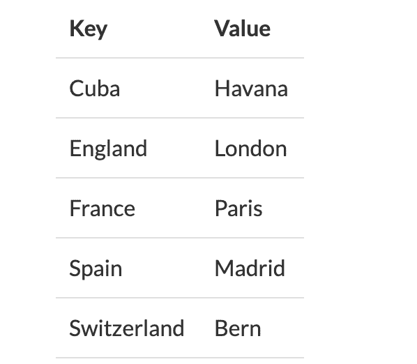
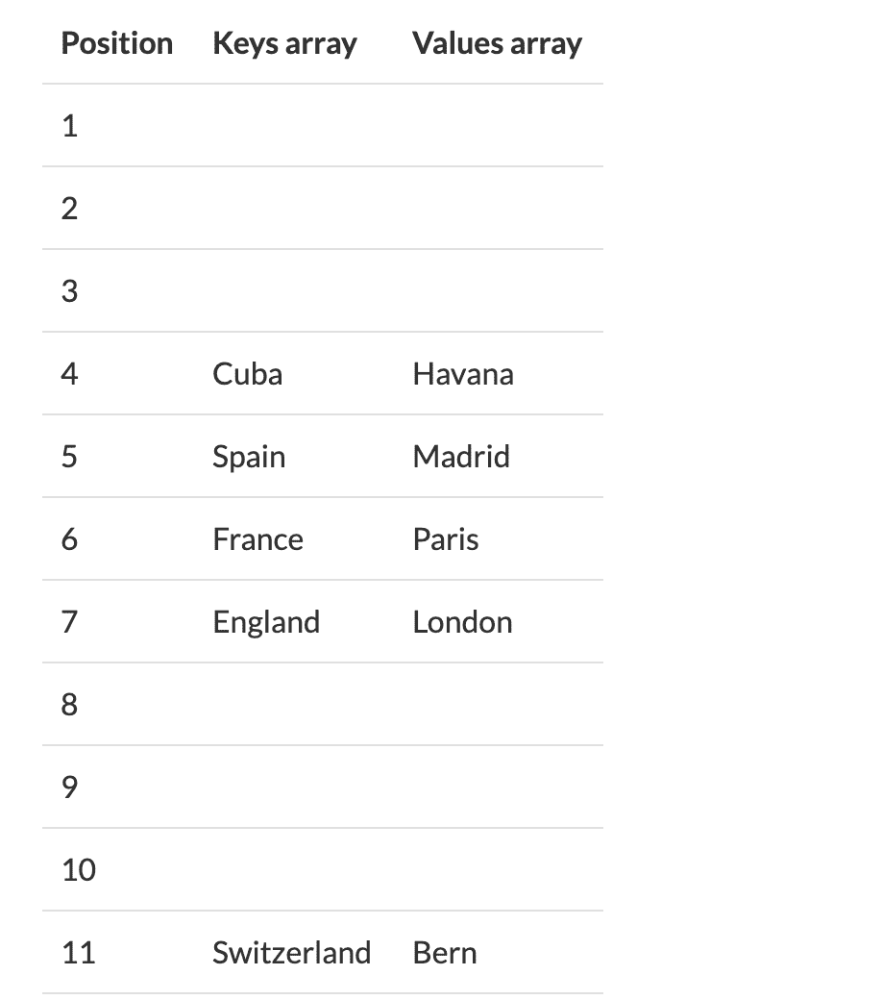

# 哈希是什么？散列码的工作原理——附示例

> 原文：<https://www.freecodecamp.org/news/what-is-hashing/>

## 哈希简介

哈希旨在解决需要高效地在集合中查找或存储项目的问题。

例如，如果我们有一个包含 10，000 个英语单词的列表，并且我们想要检查一个给定的单词是否在列表中，那么连续地将该单词与所有 10，000 个条目进行比较直到找到匹配项将是低效的。即使单词列表是按字典顺序排列的，就像在字典里一样，你仍然需要一些时间来找到你要找的单词。

哈希是一种技术，通过从一开始就有效地缩小搜索范围来提高效率。

## **什么是哈希？**

哈希意味着使用某种函数或算法将对象数据映射到某种有代表性的整数值。

这种所谓的哈希代码(或简称为哈希)可以用来在地图中查找项目时缩小搜索范围。

通常，这些哈希代码用于生成索引，值存储在该索引中。

## **哈希的工作原理**

在哈希表中，您以键和值对的形式存储数据。用于识别数据的密钥作为散列函数的输入。散列码是一个整数，然后被映射到我们拥有的固定大小。

哈希表必须支持 3 个函数。

*   插入(键，值)
*   获取(键)
*   删除(按键)

纯粹作为一个帮助我们理解概念的例子，让我们假设我们想要将一个字符串键列表映射到字符串值(例如，将一个国家列表映射到它们的首都)。

假设我们想将数据存储在地图的表中。



让我们假设我们的哈希函数是简单地获取字符串的长度。

为了简单起见，我们将有两个数组:一个用于键，一个用于值。因此，要将一个项目放入哈希表，我们需要计算它的哈希代码(在本例中，只需计算字符数)，然后将键和值放入相应索引处的数组中。

例如，古巴的哈希码(长度)为 4。因此，我们将古巴存储在键数组的第 4 个位置，将哈瓦那存储在值数组的第 4 个索引中，等等。最后我们得到了以下结果:



现在，在这个具体的例子中，事情运行得很好。我们的数组需要足够大以容纳最长的字符串，但是在本例中只有 11 个槽。我们确实浪费了一些空间，例如，我们的数据中没有 1 个字母的键，也没有 8 到 10 个字母的键。

但在这种情况下，浪费的空间也不是那么糟糕。获取字符串的长度既好又快，查找与给定键相关的值的过程也是如此(当然比进行多达五次的字符串比较要快)。

但是，如果数据集的字符串超过 11 个字符，我们该怎么办呢？如果我们有另一个包含 5 个字符的单词“India ”,并尝试使用我们的哈希函数将它分配给一个索引，会怎么样？既然索引 5 已经被占用了，我们必须打个电话决定如何处理它。这叫做碰撞。

如果我们的数据集有一个包含 1000 个字符的字符串，而你用一个包含 1000 个索引的数组来存储数据，这将导致空间的浪费。如果我们的密钥是英语中的随机单词，那么使用长度作为散列函数是没有用的。

## **碰撞处理**

有两种基本方法用于处理冲突。

1.  单独链接
2.  散列地址

### 单独链接

通过分离链接的散列冲突处理使用附加的数据结构，最好是用于动态分配的链表，到桶中。在我们的示例中，当我们将 India 添加到数据集时，它被追加到存储在索引 5 处的链表中，然后我们的表将如下所示。


要找到一个项目，我们首先去桶，然后比较关键。这是一种流行的方法，如果使用了一个链接列表，散列永远不会填满。`get(k)`的成本是平均的`O(n)`，其中 n 是桶中的键的数量，键的总数是 n。

独立链接的问题是数据结构可以无限制地增长。

### 散列地址

开放式寻址没有引入任何新的数据结构。如果发生冲突，我们将在算法生成的下一个点中寻找可用性。开放式寻址通常用于存储空间受限的情况，即嵌入式处理器。开放式寻址不一定比单独链接更快。

开放式寻址的方法

*   [线性探测
*   [二次探测](https://en.wikipedia.org/wiki/Quadratic_probing)
*   [双重哈希](https://en.wikipedia.org/wiki/Double_hashing)

## 如何在你的代码中使用散列。

#### **Python**

```
 # Few languages like Python, Ruby come with an in-built hashing support.
   # Declaration
    my_hash_table = {}
    my_hash_table = dict()

   # Insertion
    my_hash_table[key] = value

   # Look up
    value = my_hash_table.get(key) # returns None if the key is not present || Deferred in python 3, available in python 2
    value = my_hash_table[key] # throws a ValueError exception if the key is not present

    # Deletion
    del my_hash_table[key] # throws a ValueError exception if the key is not present

    # Getting all keys and values stored in the dictionary
    keys = my_hash_table.keys()
    values = my_hash_table.values()
```


[运行代码](https://repl.it/CVtK)

#### **Java**

```
 // Java doesn't include hashing by default, you have to import it from java.util library
    // Importing hashmaps
    import java.util.HashMap;

   // Declaration
    HashMap<Integer, Integer> myHashTable = new HashMap<Integer, Integer>(); // declares an empty map.

   // Insertion
    myHashTable.put(key, value);

   // Deletion
    myHashtable.remove(key);

    // Look up
    myHashTable.get(key); // returns null if the key K is not present
    myHashTable.containsKey(key); // returns a boolean value, indicating the presence of a key

    // Number of key, value pairs in the hash table
    myHashTable.size();
```


[运行代码](https://repl.it/CVt1)

## 关于哈希的更多信息

*   [哈希和哈希表的无代码指南](https://www.freecodecamp.org/news/the-codeless-guide-to-hash/)
*   [如何用 JavaScript 实现一个简单的哈希表](https://www.freecodecamp.org/news/how-to-implement-a-simple-hash-table-in-javascript-cb3b9c1f2997/)
*   [散列表解释](https://www.freecodecamp.org/news/hash-tables/)