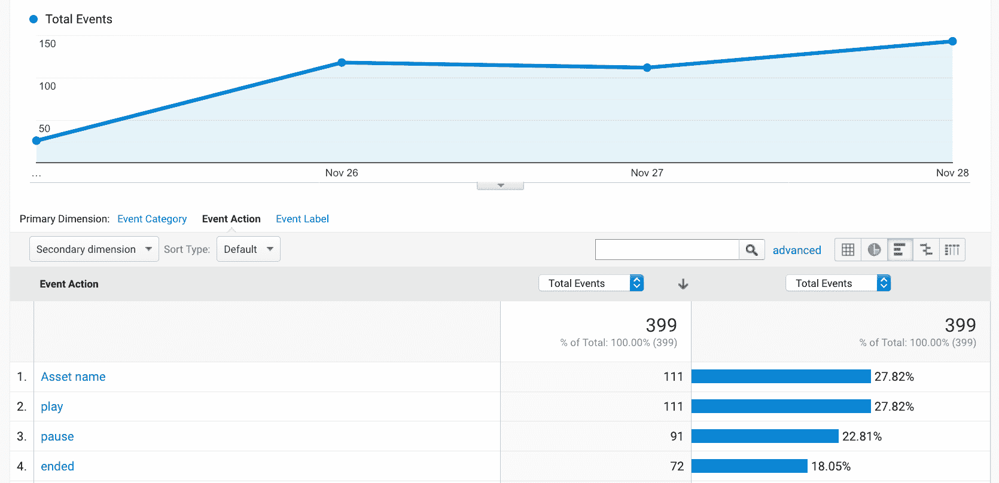

# HLS 视频流:它是什么，何时使用它

> 原文：<https://www.freecodecamp.org/news/what-is-hls-and-when-to-use-it/>

在这篇短文中，我将重点介绍 HLS，这是用于视频传输的最广泛的自适应比特率协议。我将回答第一次考虑 HLS 的人可能会问的一些主要问题:它是什么，何时使用它，以及如何使用它。

为了有所帮助，我将展示一些使用在线视频发布工具的例子，您可以自由地使用它来测试 HLS 的性能。

## 什么是 HLS，它是如何工作的？

HLS 是 Apple 定义的一种协议，用于实现他们的设备和软件可以支持的自适应比特率流格式。随着时间的推移，它获得了广泛的支持。

HLS 最重要的特性是它能够根据连接的实际速度调整视频的比特率。这优化了体验的质量。

HLS 视频以不同的分辨率和比特率编码成不同的格式。这通常被称为比特率阶梯。当连接变慢时，协议会自动将请求的比特率调整到可用的带宽。

与渐进式视频相比，HLS 避免了重新缓冲和延迟效应，也避免了客户端连接膨胀。我们可以在这个视频中看到它的作用。

[https://store.abraia.me/05bf471cbb3f9fa9ed785718e6f60e28/HLS-video/HLS_video-at-work/index.html](https://store.abraia.me/05bf471cbb3f9fa9ed785718e6f60e28/HLS-video/HLS_video-at-work/index.html)

Behaviour of HLS for different network speeds using [Abraia's video publishing service](https://abraia.me/video/)

本质上，当我们在应用或网站中使用视频内容时，HLS 提供了更好的用户体验。

它在 iOS 和 Android 中有原生支持。Safari 也支持它，通过使用一些 JavaScript，它在所有主流浏览器(Chrome、Firefox、Edge)中都得到支持。虽然使用 HLS 需要一些努力，但没什么大不了的。

让我们看看什么时候应该使用它以及如何使用它。

## 我们应该什么时候使用 HLS？

也有视频没那么重的情况。例如，您可以将一系列图像编码为 1-2 秒的视频，其重量小于 1 MB。在这种情况下，渐进式视频——可以像图像一样使用普通 HTML5 进行消费——肯定是最佳选择。HLS 在这方面没有任何优势。

但是，当我们想要交付重量超过 3MB 的高分辨率视频(HD 或更高)时，HLS 确实有意义。这种类型的内容可能会扼杀我们的网络 UX。

值得注意的是，越来越多的媒体内容都是如此，包括电子商务和营销环境中使用的许多不到 20 秒的短视频。在本文开头的例子中，我们有一个只有 9 秒的全高清视频，重量超过 6MB。

## 我们如何在我们的站点中使用 HLS？

要使用 HLS，我们必须解决许多方面的问题。我将着重谈两点:

*   需要对视频进行编码，
*   需要把它嵌入我们的网页。

为了更全面地了解一个普通的视频发布管道需要什么，你可以看看这篇文章。

### HLS 编码

我们可以在 HLS 内部或通过使用第三方服务对视频进行编码。要构建一个内部编码器，最好的选择是使用 FFMPEG，这是一个用于视频处理和编码的强大的开源库。在这种情况下，我们应该分析将要编码的内容，并设置一些参数。

在 HLS 中，我们应该定义一个比特率阶梯(每一步的比特率和分辨率)和组块的长度。当我们对视频进行编码时，我们以一组播放列表和组块结束。通常，我们用. m3u8 结束前者，用. m3u 8 结束后者。ts 扩展。我们可以在下图中看到一个例子。

我们可以看到一个主播放列表、每个节目的一个附加播放列表以及每个节目的所有块。主播放列表指定比特率阶梯和每个节目的相对路径。

苹果公司提出了一个通用的建议，指定比特率阶梯和 10 秒的组块持续时间。然而，这对于许多类型的内容来说不是很有用，比如电子商务和营销中常见的短视频。

事实上，最好的方法是根据视频内容调整比特率阶梯。在这种情况下，如果您想充分利用 HLS，而您又不擅长编码，那么提供按标题编码(带 HLS)的第三方服务可能是正确的选择。

## HLS 玩家

在这里，我们发现两个主要选项。我们可以坚持使用 HTML5 播放器，也可以使用用 JavaScript 实现的播放器。

### HTML5 播放器

最近的 Safari 版本支持 HLS。在这种情况下，您可以像使用渐进式视频一样使用 HLS 播放列表。对于其他浏览器，您可以使用一个微型 JavaScript 库来实现 HLS 协议，并再次使用 HTML5 播放器来播放渐进式视频。

这可以通过 HLS.js 来完成。这个库只是根据可用带宽来实现格式副本的协商。支持几乎是通用的，只是以媒体元素的 API 的支持为条件。

### JavaScript 播放器

如果我们需要定制视频体验——这在营销和故事页面中很常见——那么我们需要使用除默认 HTML5 播放器之外的东西。

虽然有许多商业选择，但 Video.js 是一个不错的选择。这是一个支持高度定制的开源播放器，包括不同的皮肤和控件。

像 Video.js 这样的播放器也支持跟踪与视频相关的事件(如播放或暂停动作)，这样我们就可以将它们包含在我们自己的分析中。事实上，在我们的谷歌分析中包含这些数据真的很容易。

GA data for events tracked in a video viewed with a Video.js player

## 摘要

我已经解决了大多数潜在用户会有的关于 HLS 的第一个问题:它是什么，以及我们何时应该使用它。

虽然依赖于 HLS 的视频发布管道可以通过开源工具(如 FFMPEG 和 video.js)在内部实现和部署，但如果您不是该技术的专家，使用[视频发布服务](https://abraia.me/video/)可能是个好主意。他们带来了先进的功能，如每标题编码，照顾所有的艰苦工作，并让我们专注于我们的定制需求。