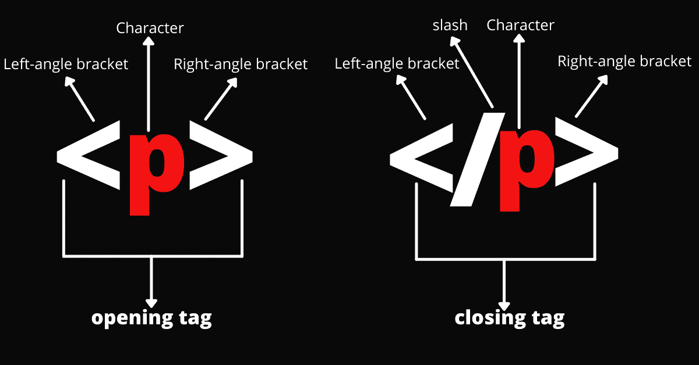
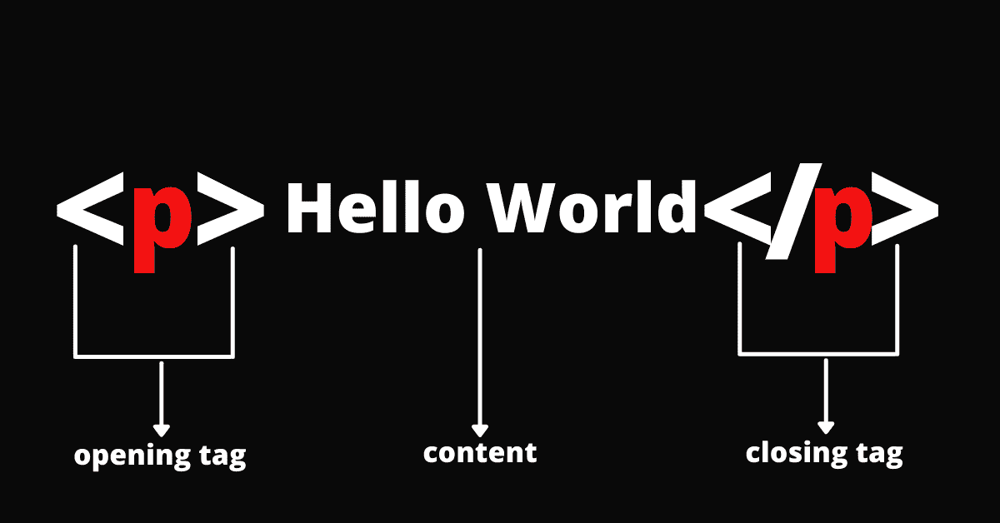
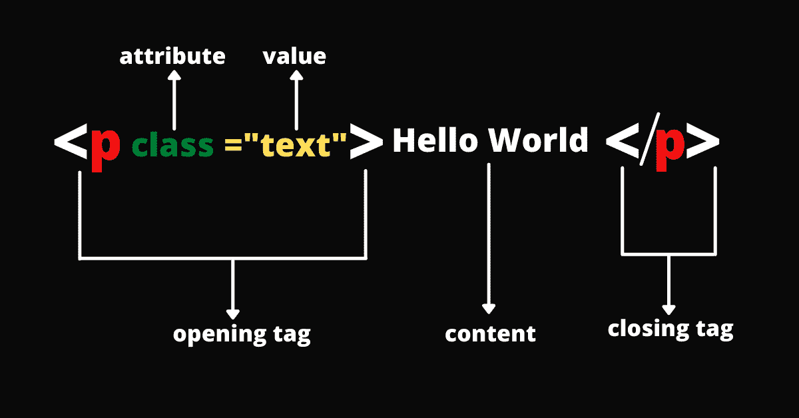
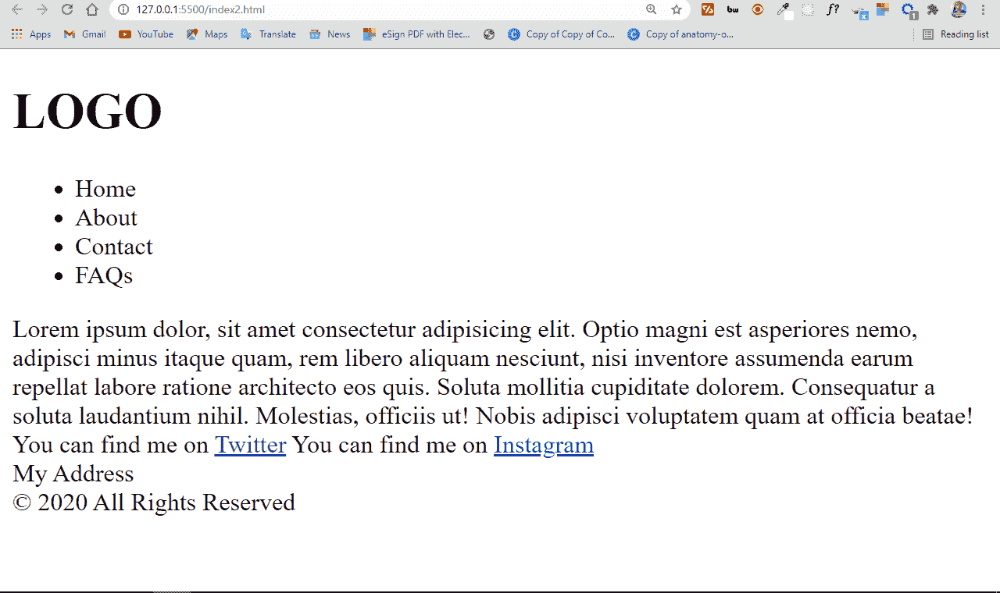

# 什么是 HTML 超文本标记语言的定义和含义

> 原文：<https://www.freecodecamp.org/news/what-is-html-definition-and-meaning/>

HTML 或超文本标记语言是一种用于 web 的标记语言，它定义了网页的结构。

它是每个网站最基本的组成部分之一，所以如果你想从事网站开发，学习它是至关重要的。

在这篇文章中，我将带你详细了解 HTML 是什么，它是如何在网页上做事情的，我们还将触及 HTML 中非常酷的部分——语义 HTML。

## 什么是 HTML？

为了从前到后理解“HTML ”,让我们看看组成缩写的每个单词:

超文本:为了连接相关条目而组织起来的文本(通常也嵌入了图片)

标记:把任何要以硬拷贝或软拷贝格式印刷的东西排字的样式指南

语言:计算机系统理解并用来解释命令的语言。

HTML 决定了网页的结构。光靠这种结构还不足以让网页看起来很好并且具有交互性。因此，您将分别使用 CSS 和 JavaScript 等辅助技术来美化 HTML 并增加交互性。

在这种情况下，我喜欢将三种技术——HTML、CSS 和 JavaScript——这样分解:它们就像一个人的身体。

*   HTML 是骨架，
*   CSS 是皮肤，
*   JavaScript 是循环、消化和呼吸系统，它将结构和皮肤赋予生命。

你也可以这样看待 HTML、CSS 和 JavaScript:HTML 是房子的结构，CSS 是内部和外部装饰，JavaScript 是电力、水系统和许多其他使房子宜居的功能特性。

## HTML 标签

由于 HTML 定义了特定网页的标记，所以您会希望文本、图像或其他嵌入内容以特定的方式出现。

例如，您可能希望一些文本较大，另一些文本较小，还有一些文本采用粗体、斜体或项目符号形式。

HTML 有“标签”可以让你做到这一点。所以，有标签来创建标题、段落、粗体字、斜体字等等。

下图描述了 HTML 标签的结构:



## HTML 元素

元素由开始标记、字符、内容和结束标记组成。有些元素是空的，也就是说，它们没有结束标记，而是有一个源或链接，指向您要嵌入到网页上的内容。

空元素的一个例子是``，用于在网页上嵌入图像。

HTML 元素经常和标签互换使用，但是两者之间有一点点不同。元素是开始和结束标记的组合，然后是它们之间的内容。

我制作了另一个图像来帮助您可视化 HTML 元素的结构:



## HTML 属性

HTML 标签也接受所谓的属性。这些属性放在开始标记中，范围从样式和 id 到类。它们接受值，这些值传达了关于元素的更多信息，并帮助您使用 JavaScript 进行样式化和操作。

在下面的信息图中，开始标记包含一个值为`“text”`的`class`属性。这可以用来设置元素的样式，或者用 JavaScript 选择元素以实现交互性。



下面是一个基本 HTML 页面的剖析:

```
<!DOCTYPE html>
<html>
  <head>
    <meta charset="UTF-8" />
    <meta http-equiv="X-UA-Compatible" content="IE=edge" />
    <meta name="viewport" content="width=device-width, initial-scale=1.0" />
    <title>Definition of HTML</title>
  </head>
  <body>
    <!--Page content such as text and images goes in here-->
  </body>
</html> 
```

让我们看看这里重要的代码:

`<!Doctype html>`:指定我们在这段代码中使用 HTML5。在引入 HTML5 之前，您必须使用`<!Doctype>`标签明确声明您正在编写哪个版本的 HTML。比如 HTML4.0，3.2 等等。但是现在我们不再需要它了。当代码中写有“html”时，浏览器会自动假定您正在用 HTML5 编码。

`<html></html>`:每个 HTML 文档的根或顶层元素。其他所有元素都必须包含在其中。

HTML 文档中最重要的部分之一。网络爬虫查看头部标签来获得关于页面的重要信息。它包含信息，如页面标题，样式表，搜索引擎优化的元信息，等等。

这是一个空元素，传达了关于页面的元信息。这些信息可能包括作者、使用的编码类型(几乎总是 UTF 8)、响应性、兼容性等等。网络爬虫总是查看 meta 标签来获得关于网页的信息，这在 SEO 中将起到至关重要的作用。

`<title></title>`:定义网页的标题。它总是显示在浏览器选项卡中。

`<body></body>`:HTML 文档的所有内容都在 body 标签里面。整个页面上只能有一个`<body>`标签。

## 什么是语义 HTML？

语义 HTML 意味着你的 HTML 标签传达了它们的实际用途。

自从 90 年代初 HTML 诞生以来，语义就一直是它不可或缺的一部分。但是直到 90 年代末 CSS 开始在大多数浏览器中工作时，它才变得特别重要。

在语义 HTML 中，语义中立的标签如`<div>`和`<span>`不被接受，因为语义更具描述性的标签如`<header>`、`<nav>`、`<main>`、`<section>`、`<footer>`和`<article>`可以做同样的事情。

使用语义标签的一个显著优点是，网络爬虫能够很容易地索引网页或网站，从而提高 SEO。

此外，对于那些使用屏幕阅读器访问网站的人来说，使用语义的网站变得信息量更大、适应性更强、更容易访问。

### 重要的语义标签及其作用

让我们看看一些最常用的语义 HTML 标签:

`<header>`:`<header>`元素定义了网页的介绍部分。它包含诸如徽标、导航、主题切换器和搜索栏等项目。

`<nav>`:`<nav>`元素指定页面的导航项，如主页、联系人、关于、常见问题等。

`<main>`:`<main>`元素通常被视为标签的直接后代。除了`<header>`和`<footer>`，它包含了 HTML 文档的主要部分。理想情况下，整个 HTML 文档中应该只有一个这样的元素。

`<section>`:`<section>`元素定义了网页的特定部分。这可能是展示部分、关于部分、联系部分或其他部分。您可以在一个 HTML 文档中使用多个部分。

`<article>`:`<article>`元素表示网页的某个部分，传达一些特定的信息。这些信息可以是文本、图像、视频和嵌入内容的组合。将此元素视为页面上的一篇独立博客文章，其中包含其他博客文章的摘录。

顾名思义，这代表了网页上的侧边栏。它通常是网页中与主要内容没有直接关系的部分。

`<footer>`:`<footer>`元素容纳诸如快速链接、版权信息或任何其他与整个网站或网页相关的数据。

请注意，由于语义元素传达了实际的含义和某些特定内容的实际用途(例如`nav`用于导航，`aside`用于侧边栏，等等)，这些元素不会自动定位在它们应该在的位置。你仍然需要用 CSS 来做这件事。

一个超级简单的语义 HTML 文档看起来像这样:

```
<!DOCTYPE html>
<html lang="en">
  <head>
    <meta charset="UTF-8" />
    <meta http-equiv="X-UA-Compatible" content="IE=edge" />
    <meta name="viewport" content="width=device-width, initial-scale=1.0" />
    <title>Definition of HTML</title>
  </head>

  <body>
    <header>
      <h1 class="logo">LOGO</h1>
      <nav>
        <ul>
          <li>Home</li>
          <li>About</li>
          <li>Contact</li>
          <li>FAQs</li>
        </ul>
      </nav>
    </header>
    <main>
      <section class="about-me">
        <article>
          Lorem ipsum dolor, sit amet consectetur adipisicing elit. Optio magni
          est asperiores nemo, adipisci minus itaque quam, rem libero aliquam
          nesciunt, nisi inventore assumenda earum repellat labore ratione
          architecto eos quis. Soluta mollitia cupiditate dolorem. Consequatur a
          soluta laudantium nihil. Molestias, officiis ut! Nobis adipisci
          voluptatem quam at officia beatae!
        </article>
      </section>
      <section class="contact-me">
        You can find me on
        <a href="https://twitter.com/koladechris">Twitter</a> You can find me on
        <a href="https://Instagram.com/koladechris">Instagram</a>
      </section>
      <aside class="address">My Address</aside>
    </main>
    <footer>© 2020 All Rights Reserved</footer>
  </body>
</html> 
```

这是它在浏览器中的样子:



您可以看到,`<aside>`标签中的内容不在侧边栏中,`<nav>`标签中的内容也不会自动作为导航栏使用。这就是为什么你仍然必须用 CSS 让它们看起来像它们应该看起来的样子。

## 结论

我希望这篇文章已经帮助你学习了 HTML 的基础知识和它的作用。现在可以开始学习 CSS、JavaScript 等更高级的技术，然后开始在 web 开发方面形成一个扎实的职业生涯。

非常感谢你的阅读，祝你玩得愉快。