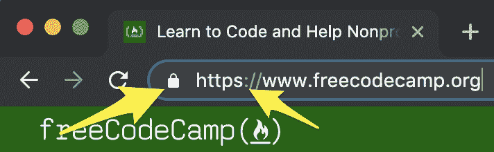

# 什么是 HTTPS？安全网页浏览和浏览器加密指南

> 原文：<https://www.freecodecamp.org/news/what-is-https-a-guide-to-secure-web-browsing-and-browser-encryption/>

你可能已经注意到了 URL 开头的“https”。或者，您可能已经注意到浏览器的 URL 栏中有一个锁。

“https”是什么意思？你的浏览器中的锁图标是什么意思？这些是安全浏览网页的关键。在本文中，您将了解到有关安全网页浏览和浏览器加密的所有内容。

“HTTPS”中的“S”代表**安全**。我们先来学习一下 HTTP”是什么。

## 什么是 HTTP？

HTTP(代表超文本传输协议)是一种网络协议。它告诉网络浏览器如何通过互联网连接到网页和其他文档。它是无连接的，这意味着每次浏览器必须加载新的文件或元素时，都会建立一个新的连接。

如果您在浏览器中键入网站 URL，浏览器将向托管该网站的服务器发送 HTTP 请求。然后，服务器将发回所请求的网页，分别发送每个部分(即图像、文本、样式)。

然而，HTTP 有一个主要问题。使用 HTTP 传输的信息根本没有加密。任何知道怎么做的人都可以观察流量，看到所有传输的数据。这包括用户名和密码！

HTTPS 保护和加密整个过程。

## 什么是 HTTPS？

HTTPS(超文本传输协议安全)确保浏览器和 web 服务器之间的安全通信。它使用 SSL 或 TLS 加密对发送的每个数据包进行加密。如果没有这种额外的安全性，您输入到网站的任何信息都将以明文形式发送，并且有可能被试图窃取您的数据的人看到。

TLS 比 SSL 更新更安全，是大多数 HTTPS 网站使用的。TLS 将确保双方都是他们所说的那个人。它还确保发送的数据没有被篡改。

TLS 使用非对称加密，通过私钥/公钥在用户和服务器之间创建链接。这些钥匙就像一把锁和一套钥匙。一个人用锁加密数据，另一个人用钥匙解密数据。

在会话开始后，服务器切换到对称加密，因为它速度更快，可以传输更大量的数据。对称加密不使用公钥/私钥，而是使用共享密钥。这就像在一个没有人知道的房间里与某人交谈。由于房间是秘密的，你不必担心其他人会在房间里听到你在说什么。

今天大多数网站使用 HTTPS 而不是 HTTP，因为它有很多优点，也有一些缺点。

在提交任何机密信息(如密码)之前，您应该始终确保该网站使用的是 HTTPS。

大多数 web 浏览器会在 URL 的左侧显示一个锁图标，以表明该站点是安全的。此外，大多数浏览器还会警告用户“不安全”,因为该网站没有使用 HTTPS。

## 虚拟专用网络

即使启用了 HTTPS，ISP 仍然知道您正在访问哪些网站，即使他们不知道您在那里做什么。

仅仅知道你要去哪里——你的网络活动的“元数据”——就给了 ISP 很多他们可以出售的信息。

所以，如果你想让安全性更上一层楼，可以考虑使用虚拟专用网络(VPN)。VPN 会加密一切，包括你访问什么网站。关于 VPN 以及如何设置的更多信息，请查看昆西·拉森的这篇文章。