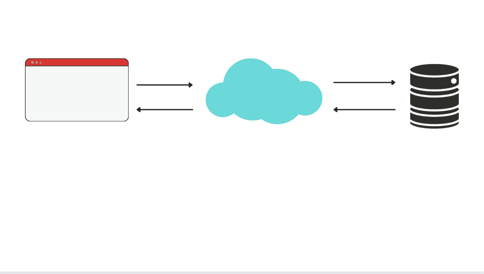
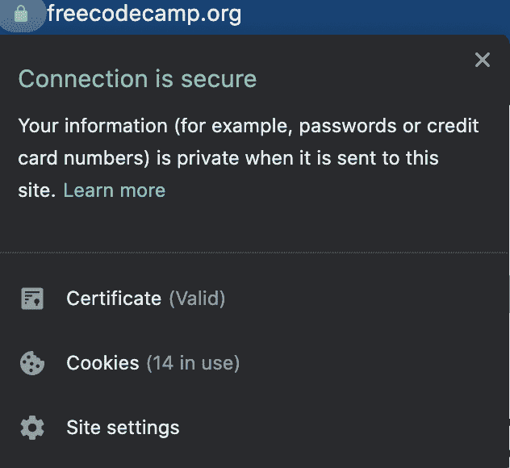

# 什么是 HTTPS？HTTP 与 HTTPS 的含义及其工作原理

> 原文：<https://www.freecodecamp.org/news/what-is-https-http-vs-https-meaning-and-how-it-works/>

你有没有注意到浏览器中网址开头的“HTTP”或“HTTPS ”?那么，什么是 HTTP，什么是 HTTPS 呢？它们有什么不同？

为了理解这些区别，澄清这两个术语的含义并理解它们是如何工作的会有所帮助。

## 什么是 HTTP？

HTTP 代表**H**yper**T**ext**T**transfer**P**rotocol，是万维网的基础。没有它，网络就不会是今天的样子。

一个 HTTP URL 以`http://`开头，默认情况下有一个 80 号端口。

名称中的*超文本*部分表示涉及到文档或文件。这些可以包含文本、图像、图形、视频或任何其他媒体。

此外，它们可能包含指向其他文档或文件的链接以进行交叉引用，在使用鼠标或触摸板单击该链接或在手机屏幕上触摸该链接后，您可以轻松访问这些链接。

名称中的*传输*部分意味着文件可以通过万维网从一个联网设备移动到另一个。

*协议*部分意味着它由一组控制设备如何使用互联网的计算机规则组成。它还告诉他们如何在与远处的许多其他设备连接时使用互联网作为通信媒介。

HTTP 建立在 TCP/IP 网络协议簇和协议栈中其他层的基础上。

TCP/IP 是一组标准化的规则，用于规定浏览器和服务器如何通过互联网进行通信。毕竟，万维网就是浏览器和服务器之间的通信。

具体来说，HTTP 是应用层协议，并且是用于网络客户端和网络服务器之间的通信和数据传输的主要协议。

简而言之，HTTP 是超文本文件和各种信息在网络上传输的一套规则和标准。这就是浏览器和服务器的通信方式。

## 典型的 HTTP 请求和响应流

当浏览器想要连接到网站时，使用 HTTP。

它们通过发送 HTTP 请求和接收 HTTP 响应进行通信。在客户端计算机- web 服务器计算模型中，这被称为*请求-响应周期*。



客户端通常是一个网络浏览器，如 Google Chrome、Mozilla Firefox 或 Apple Safari，发出请求。它通过在浏览器顶部的地址栏中输入一个类似于`freecodecamp.org`的友好的 URL(统一资源定位符)来做到这一点。

在域名系统(DNS) 的帮助下，域名`freecodecamp.org`被映射到 IP 地址[。](https://www.freecodecamp.org/news/what-is-dns/)

然后，网络浏览器连接到服务器并发出 HTTP *请求*，请求它需要接收的信息以加载网页。

HTTP 请求可能看起来像这样:

```
GET / HTTP/1.1
Host: www.freecodecamp.org 
```

它包括:

*   一个 HTTP 方法，经常被称为 HTTP 动词，比如`GET`。这个特定的动词是用来*获取*信息回来的。另一个常见的动词是`POST`，当客户端在表单中提交数据时使用。动词指定浏览器期望从服务器得到的动作。
*   路径，在我们的例子中是`/`，*根*路径。服务器存储组成网站的所有文件，因此请求需要指定浏览器请求加载的部分。
*   HTTP 类型及其版本。
*   URL 的域名。

然后，web 服务器接收请求，并通过查找请求的数据来处理它。

服务器是一台不同于我们日常使用的计算机。它的唯一目的是存储数据和文件，并在需要时检索和分发它们。

服务器向浏览器返回一条消息，或 HTTP *响应*。

响应的一个例子是:`HTTP/1.1 200 OK`

*   首先从协议和版本`HTTP/1.1`开始
*   接下来是 HTTP *状态码*，一个 3 位数，在本例中是`200`。它指示 HTTP 请求是否完成。以`2`开头的状态代码表示成功，请求已成功完成。以`4`开头的状态代码，如`404`，表示客户端错误(例如在 URL 中输入错误)，因此页面不会显示在浏览器中。以`5`开头的状态码意味着服务器端出错，页面也不会显示在浏览器中。
*   接下来是*状态文本*，人类可读的文本，总结了状态代码的含义。在这种情况下，它是“OK”，意味着成功地检索到了所请求的文档。

HTTP 响应还包括如下所示的标头:

```
date: Thu, 12 Aug 2021 12:07:16 GMT
server: cloudflare
content-type: text/html; charset=utf-8 
```

标头包括有关发回的内容类型的重要信息，如语言、格式和发送响应的时间。

最后，对“GET”请求的响应包括可选的 *HTTP 主体*。这包含所请求的信息，比如组成网站的 HTML/CSS/JavaScript 文件。

然后，浏览器接收响应，呈现页面，并关闭连接。

每次它需要在页面上加载一个新的元素(比如不同的风格或图像或视频)时，它会启动一个新的连接，整个过程再次重复。

## HTTP 的局限性

HTTP 因其简单而快速，但在交换数据时不提供安全性。这是因为所有数据都是以**明文**传输的，根本没有加密。

在传输过程中，超文本数据被分解成“数据包”，任何拥有浏览器和服务器之间的适当工具、技能和知识的人都可以很容易地查看和窃取正在传输的信息。

这意味着用户名、密码和敏感信息有被攻击者获取的风险，同时注入病毒的风险也很高。

这意味着 HTTP 不是一个安全或私有的媒介，导致用户感到不安全。

HTTP 对于某些网站是安全的，比如博客，但是你不应该通过 HTTP 连接提交任何信用卡或其他个人信息。

## 什么是 HTTPS？

HTTPS 代表**H**yper**T**ext**T**transfer**P**rotocol**S**ecure。

默认情况下，HTTPS URL 以`https://`开头，使用端口号 443。

它不是一个独立于 HTTP 的协议，但它是 HTTP 的更安全、更机密的版本。这是在浏览器和服务器之间传输数据最安全的方式。

现在大多数网站通过 HTTP 使用 HTTPS。所以在提交任何敏感信息之前，比如登录你的银行账户和进行金融交易，一定要确保网站使用 HTTPS。

您可以通过地址栏左侧的锁图标来判断站点是否安全以及是否有 HTTPS 连接:




与工作在应用层的 HTTP 不同，HTTPS 工作在传输层。

## HTTPS 是如何工作的？

通过 HTTPS 连接发送的每一个数据包都是经过加密的，并且是安全的，在 HTTP 之上使用了加密协议，如 TLS 或 SSL。

传输层安全性(TLS)，以前称为安全套接字层(SSL)，是用于加密通信的协议。它是 SSL 的更新、更安全的版本。

TLS 提供了抵御攻击的安全性，它的三个主要目标是身份验证、隐私和整体安全性。

TLS 通过使用非对称密钥算法公钥基础设施(PKI)来保护通信。该系统使用两个唯一相关的密钥来加密和解密敏感信息，从而实现互联网上的安全通信。

两个密钥一起使用，通过这种方式，TLS 在发送方和接收方之间创建了一个链接。它确保双方都被识别，并且确实是他们所说的那个人。

首先，您有**公共**密钥。它可供公众查看，并可以与任何人和任何想与该网站互动的人共享。

此密钥用于将纯文本转换为密码文本、加密数据，并作为锁来加密数据。它还确认私钥的所有者。向浏览器分发公钥是通过证书完成的。

然后，每个公钥都有一个唯一的**私钥**，它们成对工作。你用这个密钥来解密信息。用公钥加密的数据只能用相应的唯一私钥解密。

正是这个唯一的私钥打开了锁并解密了数据。私钥也可以确认这些信息是你的。这个密钥是私有的，被存储并且只对它的所有者可用。

在传输任何实际数据之前，会建立安全连接并交换证书。

客户端键入他们想要访问的网页的 URL。网页的服务器会发送包含公钥的 TLS 或 SSL 证书来启动连接。客户端和服务器在建立安全会话之前会经历许多来回(称为 TLS/SSL 握手)。

## 结论

在本文中，我们了解了什么是 HTTPS，它是如何工作的，以及它与 HTTP 有何不同(并且更安全)。

概括地说，HTTPS 是 HTTP 的安全版本，HTTP 是通过网络发送超文本的基本网络协议。

在 HTTPS，有额外的安全步骤，如 TLS/SSL 证书和 TLS/SSL 握手。

它为用户和数据提供身份验证，确保交易保持私密(数据完整性是优先考虑的事项),而不用担心在客户端-服务器通信期间数据泄露。

消息和交易的内容只能由发送者和预期接收者查看。

感谢阅读！