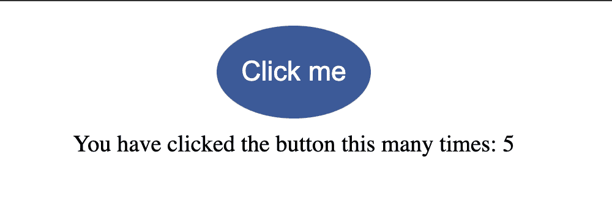
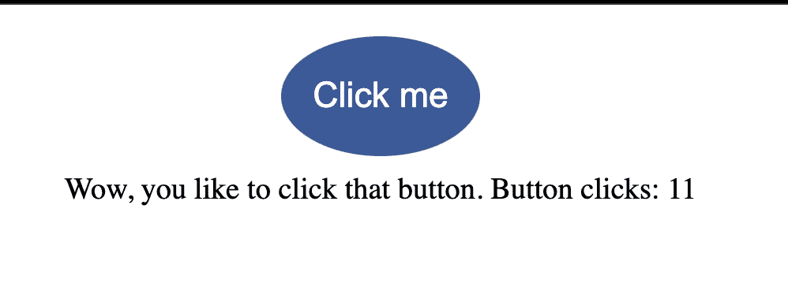
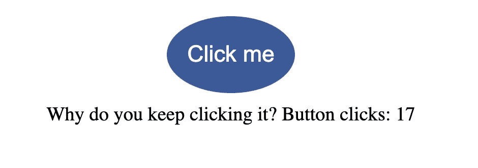
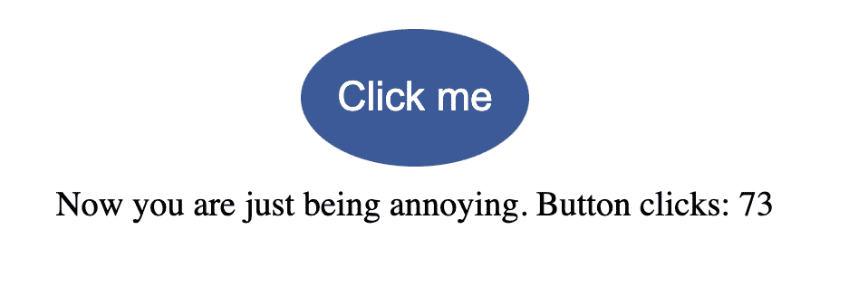
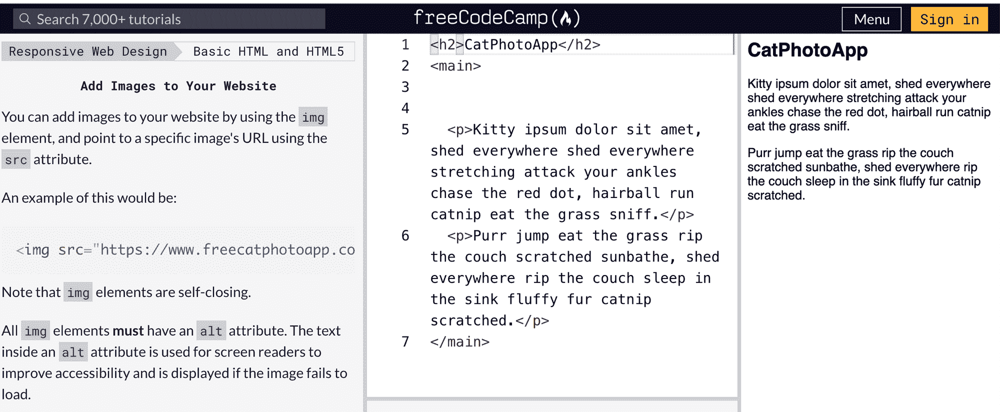
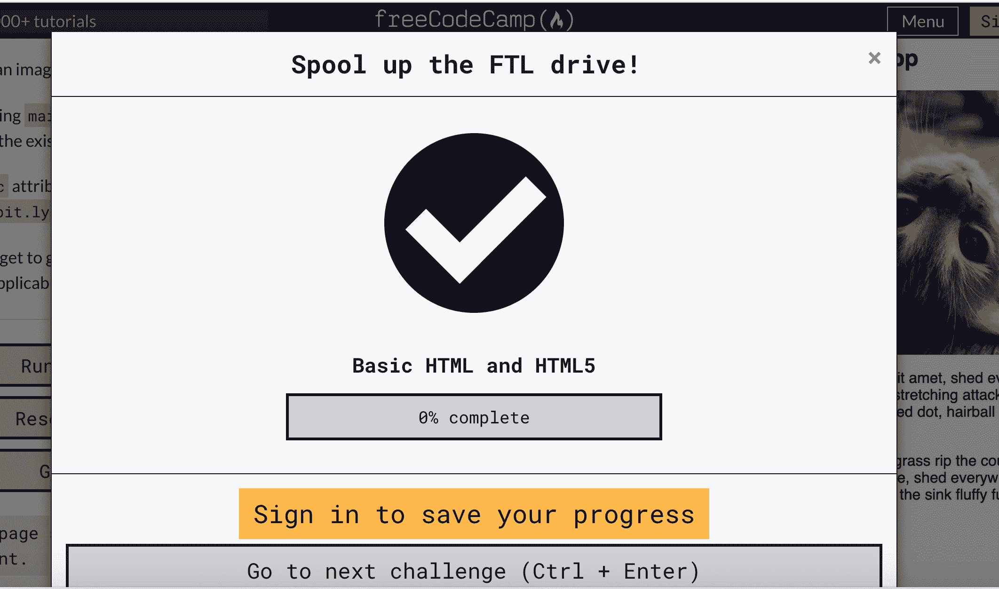
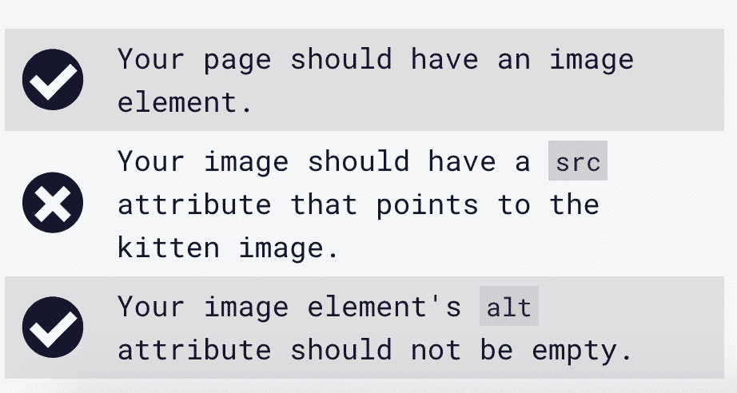
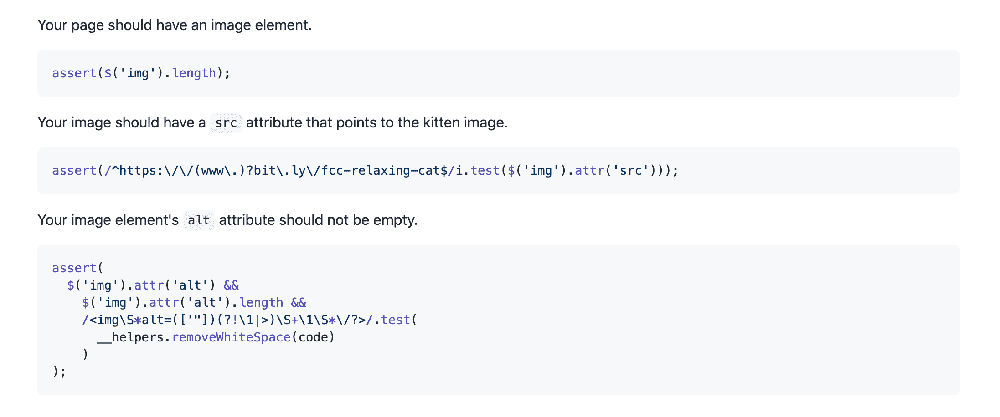

# JavaScript 是什么？用简单的英语解释 JavaScript 代码

> 原文：<https://www.freecodecamp.org/news/what-is-javascript-javascript-code-explained-in-plain-english/>

JavaScript 创建于 26 年前，是目前最流行的编程语言之一。但是 JavaScript 是什么呢？

JavaScript 与 HTML 和 CSS 一起用于创建动态的交互式网页和移动应用程序。我们经常称之为 [web 开发](https://www.freecodecamp.org/news/what-is-web-development-how-to-become-a-web-developer-career-path/)的构建块之一。

据 [W3Techs](https://w3techs.com/technologies/details/cp-javascript/) ，

> 97.6%的网站使用 JavaScript 作为客户端编程语言。

## JavaScript 的历史

1995 年，网景公司的开发人员 Brendan Eich 只用了 10 天就编写出了 JavaScript 的第一版。它刚出来的时候叫 Mocha，后来改成了 LiveScript，最后定在了 JavaScript 上。

Brendan Eich 的老板们希望 JavaScript 拥有与 Java 相似的语法。他们还认为 JavaScript 将有助于加速 web 开发，并且比 Java 更容易学习。

多年来，JavaScript 已经发展成为一种通用语言，可以在 web 和移动应用程序上使用。

## 什么是 ECMAScript？

ECMAScript 代表欧洲计算机制造商协会脚本。根据 [MDN 文档](https://developer.mozilla.org/en-US/docs/Web/JavaScript/Language_Resources)，

> ECMAScript 是构成 JavaScript 基础的脚本语言。

该协会创建了 ECMA 标准，以确保不同浏览器的网页保持一致。截至 2021 年 8 月，ECMAScript 共有 12 个发布版本。

## Java 和 JavaScript 一样吗？

即使这两种语言具有相似的语法，并且共享“Java”的前四个字母，它们也不是同一种语言。

以下是这两种语言之间的一些主要区别。

*   Java 是一种编译型编程语言。这意味着在程序运行之前，代码需要被翻译成机器代码，这样计算机才能理解它。
*   JavaScript 是一种解释型语言。在浏览器中，解释器将读取代码并运行它，而不需要先编译它。
*   Java 用作服务器端(后端)语言，而 JavaScript 主要用作客户端(前端)语言。但是 JavaScript 也可以用来通过 Node.js 创建后端 web 应用程序。

## HTML、CSS 和 JavaScript 在网页上是如何协同工作的？

既然我们已经了解了 JavaScript 的历史，我们需要了解它在网站上是如何工作的。

HTML 呈现内容，CSS 设计页面样式使其看起来更好，JavaScript 使站点具有交互性。但是交互是什么意思，JavaScript 如何与其他两种语言协同工作？

让我们看一个例子来更好地理解这三种语言是如何协同工作的。

在本例中，当用户单击一个按钮时，将显示一条消息，显示用户单击的次数。当计数达到某个阈值时，消息会随着计数的上升而改变，变得更加讽刺。

[https://codepen.io/jessica-wilkins/embed/preview/xxrxwVp?default-tabs=css%2Cresult&height=300&host=https%3A%2F%2Fcodepen.io&slug-hash=xxrxwVp](https://codepen.io/jessica-wilkins/embed/preview/xxrxwVp?default-tabs=css%2Cresult&height=300&host=https%3A%2F%2Fcodepen.io&slug-hash=xxrxwVp)

我们使用 HTML 来创建和显示页面上的按钮。

```
<button id="btn">Click me</button>
```

我们的 HTML 中也有这个`p`元素，它在开始和结束标记之间没有任何文本。在 JavaScript 中，一旦用户单击按钮，文本就会被添加。

```
<p id="para"></p>
```

我们使用 CSS 来设计按钮的样式并使其在页面上居中。

```
button {
  display: block;
  margin: 20px auto 10px;
  padding: 25px 20px;
  font-size: 1.4rem;
  cursor: pointer;
  border: none;
  border-radius: 50%;
  background-color: #3b5998;
  color: white;
}
```

为了访问 HTML 元素，我们使用`getElementById`。这就是我们的 JavaScript 的用武之地。

```
const btn = document.getElementById("btn");
const para = document.getElementById("para");
```

名为`count`的变量记录用户点击按钮的次数。每次单击按钮时，计数都会不断更新。

```
let count = 0;
```

这是将向用户显示的响应数组。

```
const responsesArr = [
  "You have clicked the button this many times: ",
  "Wow, you like to click that button. Button clicks: ",
  "Why do you keep clicking it? Button clicks:",
  "Now you are just being annoying. Button clicks:"
];
```

我们使用`addEventListener`来告诉计算机监听一个点击事件。一旦检测到咔哒声，信息将出现在屏幕上，并显示计数。

```
btn.addEventListener("click", () => {
  count++;
  if (count < 10) {
    para.innerHTML = `${responsesArr[0]} ${count}`;
  } else if (count >= 10 && count < 15) {
    para.innerHTML = `${responsesArr[1]} ${count}`;
  } else if (count >= 15 && count < 20) {
    para.innerHTML = `${responsesArr[2]} ${count}`;
  } else {
    para.innerHTML = `${responsesArr[3]} ${count}`;
  }
});
```

我们使用一个`if else`语句来检查按钮被点击了多少次，并根据计数显示不同的消息。

如果`count`小于 10，则这是显示在屏幕上的信息。



如果`count`在 10 和 14 之间，那么这就是显示在屏幕上的信息。



如果`count`在 15 和 19 之间，那么这就是显示在屏幕上的信息。



如果`count`为 20 或更大，则这是显示在屏幕上的信息。



## JavaScript 在真实的网站上是如何工作的？

我们刚刚看了一个 HTML、CSS 和 JavaScript 如何协同工作的基本例子。但是 JavaScript 在真实的网站上是如何工作的呢？

再来看看 [freeCodeCamp 学习平台](https://www.freecodecamp.org/learn)。这是一个来自响应式网页设计课程的 HTML [挑战](https://www.freecodecamp.org/learn/responsive-web-design/basic-html-and-html5/add-images-to-your-website)的例子。



如果我通过了挑战，就会弹出这条消息。



但是如果我的答案是错误的，那么这个教训会告诉我问题在哪里。



但是 freeCodeCamp 怎么知道我的答案正确与否呢？

freeCodeCamp 为每个挑战编写一系列测试，以确保代码正确。这些测试是用 JavaScript 编写的。

这些是为[向你的网站添加图片挑战](https://www.freecodecamp.org/learn/responsive-web-design/basic-html-and-html5/add-images-to-your-website)的 JavaScript 测试。



## 如何开始学习 JavaScript

这里有一个很好的资源列表，你可以从这里开始学习 JavaScript。

1.  [JavaScript 算法和数据结构](https://www.freecodecamp.org/learn/javascript-algorithms-and-data-structures/) (freeCodeCamp)
2.  [学习 JavaScript -初学者全教程](https://www.youtube.com/watch?v=PkZNo7MFNFg) (freeCodeCamp YouTube 频道)
3.  [现代 JavaScript 教程](https://javascript.info/) (javascript.info)
4.  [JavaScript 教程](https://www.javascripttutorial.net/)(javascripttutorial.net)
5.  learn js(learn-js.org)
6.  [学习 JavaScript](https://www.codecademy.com/learn/introduction-to-javascript) (Codecademy)
7.  [JavaScript](https://www.sololearn.com/learning/1024) (SoloLearn)
8.  [MDN JavaScript](https://developer.mozilla.org/en-US/docs/Web/JavaScript) (MDN 网络文档)
9.  [JavaScript 初学者教程:1 小时学会 JavaScript](https://www.youtube.com/watch?v=W6NZfCO5SIk)(用 Mosh 编程)

一旦你学会了 JavaScript 的基础知识，你就可以开始构建你自己的项目了。我已经创建了一个列表 [40 个初级 JavaScript 项目](https://www.freecodecamp.org/news/javascript-projects-for-beginners/)来帮助你开始。

## JavaScript 库和框架

JavaScript 库和框架的创建是为了帮助加速开发。一旦你学会了“普通的”(或基本的/普通的)JavaScript，你就可以开始学习一个库或框架。

有许多选项可供选择，但你不需要全部学会。研究你所在地区的招聘信息，看看使用的是什么库和框架。

以下是一些受欢迎的选择。

*   [反应](https://reactjs.org/)
*   [角度](https://angular.io/)
*   视图

以下是一些建议的学习资源。

*   [freeCodeCamp 的 React YouTube 课程](https://www.youtube.com/watch?v=nTeuhbP7wdE)
*   [布拉德·特拉弗斯的棱角分明的 YouTube 课程](https://www.youtube.com/watch?v=Fdf5aTYRW0E)
*   [布拉德·特拉弗斯的 Vue YouTube 课程](https://www.youtube.com/watch?v=qZXt1Aom3Cs)

## 结论

JavaScript 最初创建于 1995 年，此后成为一种用于网站、在线游戏和移动应用的强大而通用的语言。

即使 Java 和 JavaScript 具有相似的语法，并且共享“Java”的前四个字母，但它们不是同一种语言。Java 主要用作服务器端语言，而 JavaScript 用于浏览器。

HTML、CSS 和 JavaScript 是 web 的三大核心语言。HTML 用于内容，CSS 用于样式，JavaScript 用于网站的交互性。

希望这篇文章对你有所帮助，祝你在 web 开发者之旅中好运。