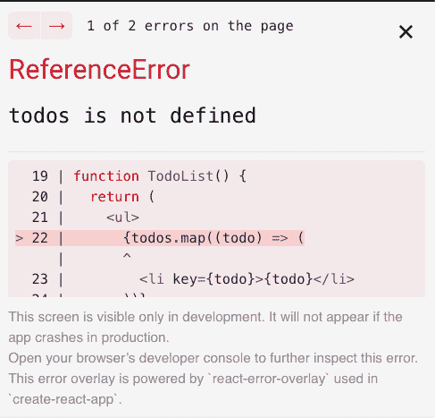
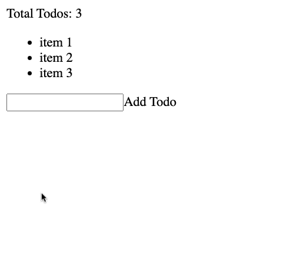

# React 中的“提升状态”是什么？

> 原文：<https://www.freecodecamp.org/news/what-is-lifting-state-up-in-react/>

下面是一个简单实用的例子，说明 React 中“提升状态”意味着什么，以及它如何帮助您构建应用程序。

提升状态是一种常见的模式，React 开发人员必须了解这一点。它帮助您避免更复杂的(通常是不必要的)状态管理模式。

它是怎么做到的？让我们通过一个简单的例子来看看。

> 想要从头到尾使用最佳实践来构建令人惊叹的 React 应用程序吗？查看 [**反应训练营**](https://reactbootcamp.com) 。

[https://www.youtube.com/embed/rdwc4JmX_fU?feature=oembed](https://www.youtube.com/embed/rdwc4JmX_fU?feature=oembed)

## 分解我们的待办事项应用程序

让我们从一个基本的 todo 应用程序开始，它由三个组件组成:`TodoCount`、`TodoList`和`AddTodo`。

所有这些组件，顾名思义，将需要共享一些公共状态。

如果你看一下`TodoCount`，这是你将要显示的地方，在你的应用程序的顶部，你在你的应用程序中总共有多少。

将会是你展示你所有待办事项的地方。它有一些初始状态，这三个项目(“项目 1”，“项目 2”，“项目 3”)，你会在一个无序列表中显示。

最后，你还有`AddTodo`。这是一个表单，您可以在其中向列表添加新项目。现在，您只是记录您在控制台的输入中键入的 todo:

```
// src/App.js

import React from "react";

export default function App() {
  return (
    <>
      <TodoCount />
      <TodoList />
      <AddTodo />
    </>
  );
}

function TodoCount() {
  return <div>Total Todos: </div>;
}

function TodoList() {
  const [todos, setTodos] = React.useState(["item 1", "item 2", "item 3"]);

  return (
    <ul>
      {todos.map((todo) => (
        <li key={todo}>{todo}</li>
      ))}
    </ul>
  );
}

function AddTodo() {
  function handleSubmit(event) {
    event.preventDefault();
    const todo = event.target.elements.todo.value;
    console.log(todo);
  }

  return (
    <form onSubmit={handleSubmit}>
      <input type="text" id="todo" />
      <button type="submit">Add Todo</button>
    </form>
  );
}
```

## 你为什么要关心提升国家？

如何使用提升状态的概念来帮助完成应用程序？

这些组件需要共享一些状态，一些 todo 状态。您需要共享待办事项状态以便显示待办事项的数量以及更新您的待办事项列表。

这就是提升状态的概念的由来。

> 我们将状态提升到需要它的组件的共同祖先，这样它们就可以共享状态。这允许我们更容易地在所有需要依赖它的组件之间共享状态。

您应该将您的状态提升到哪个公共祖先，以便所有组件都可以读取和更新该状态？`App`组件。

您的应用程序现在应该是这样的:

```
// src/App.js

import React from "react";

export default function App() {
  const [todos, setTodos] = React.useState(["item 1", "item 2", "item 3"]);    

  return (
    <>
      <TodoCount />
      <TodoList />
      <AddTodo />
    </>
  );
}

function TodoCount() {
  return <div>Total Todos: </div>;
}

function TodoList() {
  return (
    <ul>
      {todos.map((todo) => (
        <li key={todo}>{todo}</li>
      ))}
    </ul>
  );
}

function AddTodo() {
  function handleSubmit(event) {
    event.preventDefault();
    const todo = event.target.elements.todo.value;
    console.log(todo);
  }

  return (
    <form onSubmit={handleSubmit}>
      <input type="text" id="todo" />
      <button type="submit">Add Todo</button>
    </form>
  );
}
```

## 你要把状态传递下去

然而，有一个小问题。

`TodoList`没有访问`todos`状态变量的权限，所以你需要从`App`那里传递过来:



您可以使用 props 对 React 中的组件执行此操作。

在`TodoList`上，我们来添加一个名为`todos`的道具。你可以从道具物品中析构`todos`。这允许你再次看到你的待办事项。

现在如何显示`TodoCount`组件中 todos 的总数呢？

这是您可以将数据作为道具传递下去的另一个实例，因为`TodoCount`依赖于该状态。我们将再次提供相同的道具`todos`，从道具对象中将其析构，并使用`todos.length`显示 todos 的总数:

```
import React from "react";

export default function App() {
  const [todos, setTodos] = React.useState(["item 1", "item 2", "item 3"]);

  return (
    <>
      <TodoCount todos={todos} />
      <TodoList todos={todos} />
      <AddTodo />
    </>
  );
}

function TodoCount({ todos }) {
  return <div>Total Todos: {todos.length}</div>;
}

function TodoList({ todos }) {
  return (
    <ul>
      {todos.map((todo) => (
        <li key={todo}>{todo}</li>
      ))}
    </ul>
  );
}
```

## 如何传递回调

现在，最后一步是能够添加一个新的待办事项。

这就是 setter 函数`setTodos`的用武之地。要更新您的 todo 状态，您不需要传递值、变量和 setter 函数——您需要做的只是传递`setTodos`。

你将把它作为同名道具(setTodos)传递给`addTodo`并从 props 中析构它。

如您所见，您在 submit 上使用表单来访问输入的值——无论输入了什么，都放在名为`todo`的局部变量中。

不需要传递当前的 todos 数组，您可以只使用一个内部函数来获取前一个 todo 的值。这允许你获得以前的待办事项，并返回你想要的新状态。

这个新状态将是一个数组，您将在其中展开所有以前的待办事项，并将您的新待办事项添加为该数组中的最后一个元素:

```
import React from "react";

export default function App() {
  const [todos, setTodos] = React.useState(["item 1", "item 2", "item 3"]);

  return (
    <>
      <TodoCount todos={todos} />
      <TodoList todos={todos} />
      <AddTodo setTodos={setTodos} />
    </>
  );
}

function AddTodo({ setTodos }) {
  function handleSubmit(event) {
    event.preventDefault();
    const todo = event.target.elements.todo.value;
    setTodos(prevTodos => [...prevTodos, todo]);
  }

  return (
    <form onSubmit={handleSubmit}>
      <input type="text" id="todo" />
      <button type="submit">Add Todo</button>
    </form>
  );
}
```

> 我们不仅可以通过提升状态并将它的状态变量传递给需要读取它的组件来使用这种模式——我们还可以将它用于回调以更新状态。

一旦你添加了一个新项目到你的待办事项列表，它会立即被添加到状态。然后您会看到您的`TodoList`组件被重新呈现以显示新的项目，以及`TodoCount`显示 todos 的总数，现在是 4:



## 结论

提升状态对于 React 开发人员来说是一种重要的模式，因为有时我们的状态位于一个特定的组件中，也需要与兄弟组件共享。

我们不需要使用像 Redux 或 React Context 这样的整个状态管理库，我们只需要将状态提升到最近的公共祖先，并向下传递状态变量和状态值，以及任何用于更新该状态的回调。

## 准备好下一步了吗？加入 React 训练营

**[React 训练营](http://bit.ly/join-react-bootcamp)** 将你应该知道的关于学习 React 的一切打包成一个全面的包，包括视频、备忘单，外加特殊奖励。

获得数百名开发人员已经使用的内部信息，以掌握 React、找到他们梦想的工作并掌控他们的未来:

[](http://bit.ly/join-react-bootcamp) 
*打开时点击此处通知*