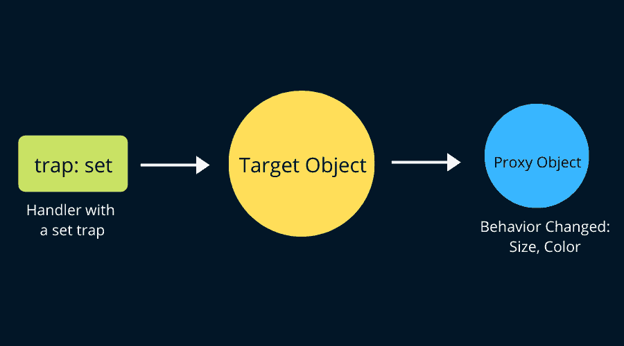

# JavaScript 中的元编程是什么？请用英语。

> 原文：<https://www.freecodecamp.org/news/what-is-metaprogramming-in-javascript-in-english-please/>

JavaScript 有许多有用的特性，大多数开发人员都知道。与此同时，如果你意识到它们，有一些隐藏的宝石可以解决真正具有挑战性的问题。

JavaScript 中的元编程就是这样一个概念，我们很多人可能并不熟悉。在本文中，我们将学习元编程以及它对我们的用处。

在 ES6 (ECMAScript 2015)中，我们支持`Reflect`和`Proxy`对象，这使得我们可以轻松地进行元编程。在本文中，我们将通过例子来学习如何使用它们。

# 什么是元编程？

`Metaprogramming`无非是编程中的 **魔法** ！写一个读取、修改、分析，甚至生成程序的程序怎么样？这听起来是不是很神奇和强大？


Metaprogramming is magic

维基百科是这样描述元编程的:

> `Metaprogramming`是一种编程技术，其中计算机程序具有将其他程序视为其数据的能力。这意味着一个程序可以被设计成读取、生成、分析或转换其他程序，甚至在运行时修改自己。

简单地说，元编程包括编写能够

*   生成代码
*   在运行时操作语言结构。这种现象被称为`Reflective Metaprogramming`或`Reflection`。

## **什么是元编程中的反射？**

`Reflection`是元编程的一个分支。反射有三个子分支:

1.  **:代码能够自我检查。它用于访问内部属性，这样我们就可以获得代码的底层信息。**
2.  ****:顾名思义，代码是能够自我修改的。****
3.  ********说情**** :说情的字面意思是，代表人家行事。在元编程中，中介使用包装、捕获、截取等概念做完全相同的事情。****

**ES6 给了我们`Reflect`对象(又名反射 API)来实现`Introspection`。ES6 的`Proxy`对象帮助我们处理`Intercession`。我们不会过多谈论`Self-Modification`，因为我们想尽可能远离它。**

**稍等一下！澄清一下，ES6 中没有引入元编程。更确切地说，它从一开始就有这种语言的版本。ES6 只是让它更容易使用。**

## ****元编程的前 ES6 时代****

**你还记得`eval`吗？让我们来看看它是如何使用的:**

```
`const blog = {
    name: 'freeCodeCamp'
}
console.log('Before eval:', blog);

const key = 'author';
const value = 'Tapas';
testEval = () => eval(`blog.${key} = '${value}'`);

// Call the function
testEval();

console.log('After eval magic:', blog);` 
```

**您可能已经注意到，`eval`帮助生成了额外的代码。在这种情况下，对象`blog`在执行时被修改了一个附加属性。**

```
`Before eval: {name: freeCodeCamp}
After eval magic: {name: "freeCodeCamp", author: "Tapas"}` 
```

### ****自省****

**在 ES6 中包含`Reflect object`之前，我们仍然可以进行自省。下面是一个阅读程序结构的例子:**

```
`var users = {
    'Tom': 32,
    'Bill': 50,
    'Sam': 65
};

Object.keys(users).forEach(name => {
    const age = users[name];
    console.log(`User ${name} is ${age} years old!`);
});` 
```

**这里我们正在读取`users`对象结构，并记录一个句子中的键值。**

```
`User Tom is 32 years old!
User Bill is 50 years old!
User Sam is 65 years old!` 
```

### ****自我修改****

**让我们以一个拥有自我修改方法的博客对象为例:**

```
`var blog = {
    name: 'freeCodeCamp',
    modifySelf: function(key, value) {blog[key] = value}
}` 
```

**`blog`对象可以这样修改自己:**

```
`blog.modifySelf('author', 'Tapas');` 
```

### ****说情****

**在元编程中，意味着代表某人或某物来行动或改变事物。ES6 之前的`Object.defineProperty()`方法可以改变对象的语义:**

```
`var sun = {};

Object.defineProperty(sun, 'rises', {
    value: true,
    configurable: false,
    writable: false,
    enumerable: false
});

console.log('sun rises', sun.rises);
sun.rises = false;
console.log('sun rises', sun.rises);` 
```

**输出:**

```
`sun rises true
sun rises true` 
```

**如您所见，`sun`对象是作为普通对象创建的。然后语义被改变了，所以它是不可写的。**

**现在让我们开始理解`Reflect`和`Proxy`对象各自的用法。**

# ****反射 API****

**在 ES6 中，Reflect 是一个新的`Global Object`(像 Math 一样)，它提供了许多实用函数。这些函数中的一些可能做与来自`Object`或`Function`的方法完全相同的事情。**

**所有这些函数都是自省函数，您可以在运行时查询程序的一些内部细节。**

**下面是来自`Reflect`对象的可用方法列表。**

```
`// Reflect object methods

Reflect.apply()
Reflect.construct()
Reflect.get()
Reflect.has()
Reflect.ownKeys()
Reflect.set()
Reflect.setPrototypeOf()
Reflect.defineProperty()
Reflect.deleteProperty()
Reflect.getOwnPropertyDescriptor()
Reflect.getPrototypeOf()
Reflect.isExtensible()` 
```

**但是等等，这里有一个问题:为什么我们需要一个新的 API 对象，而这些 API 对象可能已经存在，或者可以添加到`Object`或`Function`中？**

**迷茫？让我们试着解决这个问题。**

### ****都在一个名称空间****

**JavaScript 已经支持对象反射。但是这些 API 不是在一个名称空间下组织的。从 ES6 开始，他们现在在`Reflect`之下。**

**反射对象的所有方法本质上都是静态的。这意味着，您不必使用`new`关键字实例化反射对象。**

### ****使用简单****

**`Object`的`introspection`方法在未能完成操作时抛出异常。这增加了消费者(程序员)处理代码中异常的负担。**

**您可能更喜欢将其作为`boolean(true | false)`来处理，而不是使用异常处理。反射对象可以帮助你做到这一点。**

**以下是 Object.defineProperty 的示例:**

```
 `try {
        Object.defineProperty(obj, name, desc);
    } catch (e) {
        // Handle the exception
    }`
```

**使用反射 API:**

```
`if (Reflect.defineProperty(obj, name, desc)) {
  // success
} else {
 // failure (and far better)
}` 
```

### ****一级函数的印象****

**我们可以发现一个对象的属性的存在性为(obj 中的 prop)。如果我们需要在代码中多次使用它，我们必须通过包装这段代码来创建一个函数。**

**在 ES6 中，Reflect API 通过引入一个一级函数`Reflect.has(obj, prop)`解决了这个问题。**

**让我们看另一个例子:删除一个对象属性。**

```
`const obj = { bar: true, baz: false};

// We define this function
function deleteProperty(object, key) {
    delete object[key];
}
deleteProperty(obj, 'bar');` 
```

**使用反射 API:**

```
`// With Reflect API
Reflect.deleteProperty(obj, 'bar');` 
```

### ****一种更可靠的使用 apply()方法的方式****

**ES5 中的`apply()`方法有助于调用带有`this`值的函数。我们也可以将参数作为数组传递。**

```
`Function.prototype.apply.call(func, obj, arr);
// or
func.apply(obj, arr);` 
```

**这不太可靠，因为`func`可能是一个已经定义了自己的`apply`方法的对象。**

**在 ES6 中，我们有一种更可靠、更优雅的方式来解决这个问题:**

```
`Reflect.apply(func, obj, arr);` 
```

**在这种情况下，如果`func`不可调用，我们将得到一个 [`TypeError`](https://developer.mozilla.org/en-US/docs/Web/JavaScript/Reference/Global_Objects/TypeError) 。**

### ****帮助其他种类的反思****

**我们会在了解`Proxy`物体的时候明白这意味着什么。在许多用例中，反射 API 方法可以与代理一起使用。**

# ****代理对象****

**ES6 的`Proxy`对象有助于`intercession`。**

**顾名思义，一个`proxy`对象有助于代表某个事物。它通过虚拟化另一个对象来实现这一点。对象虚拟化为该对象提供自定义行为。**

**例如，使用代理对象，我们可以虚拟化对象属性查找、函数调用等等。我们将在下面看到其中的一些细节。**

**以下是一些你需要记住和使用的有用术语:**

*   **`target`:代理提供自定义行为的对象。**
*   **`handler`:一个包含陷阱的物体。**
*   **`trap` : Trap 是一种提供访问目标对象属性的方法。这是使用反射 API 方法实现的。每个陷阱方法都与反射 API 中的方法相映射。**

**你可以这样想象:**

****

**应该定义一个具有`trap`功能的处理程序。然后，我们需要使用处理程序和目标对象创建一个代理对象。代理对象将具有应用了自定义行为的所有更改。**

**如果你还不太明白上面的描述，那也没关系。一会儿我们将通过代码和例子来掌握它。**

**创建代理对象的语法如下:**

```
`let proxy = new Proxy(target, handler);` 
```

**有许多代理陷阱(处理函数)可用于访问和定制目标对象。这是他们的名单。**

```
`handler.apply()
handler.construct()
handler.get()
handler.has()
handler.ownKeys()
handler.set()
handler.setPrototypeOf()
handler.getPrototypeOf()
handler.defineProperty()
handler.deleteProperty()
handler.getOwnPropertyDescriptor()
handler.preventExtensions()
handler.isExtensible()` 
```

**注意，每个陷阱都有一个与`Reflect`对象的方法的映射。这意味着您可以在许多用例中一起使用`Reflect`和`Proxy`。**

## ****如何获取不可用的对象属性值****

**让我们看一个`employee`对象的例子，并试着打印它的一些属性:**

```
`const employee = {
    firstName: 'Tapas',
    lastName: 'Adhikary'
};

console.log(employee.firstName);
console.log(employee.lastName);
console.log(employee.org);
console.log(employee.fullName);` 
```

**预期输出如下:**

```
`Tapas
Adhikary
undefined
undefined` 
```

**现在让我们使用代理对象向`employee`对象添加一些自定义行为。**

### ****步骤 1:创建一个使用 get trap 的处理程序****

**我们将使用一个名为`get`的陷阱，它让我们获得一个属性值。这是我们的负责人:**

```
`let handler = {
    get: function(target, fieldName) {        

        if(fieldName === 'fullName' ) {
            return `${target.firstName} ${target.lastName}`;
        }

        return fieldName in target ?
            target[fieldName] :
                `No such property as, '${fieldName}'!`

    }
};` 
```

**上面的处理程序有助于为`fullName`属性创建值。当缺少对象特性时，它还会添加更好的错误消息。**

### ****第二步:创建一个代理对象****

**由于我们有了目标`employee`对象和处理程序，我们将能够创建一个代理对象，如下所示:**

```
`let proxy = new Proxy(employee, handler);` 
```

### ****步骤 3:访问代理对象上的属性****

**现在，我们可以使用代理对象访问雇员对象属性，如下所示:**

```
`console.log(proxy.firstName);
console.log(proxy.lastName);
console.log(proxy.org);
console.log(proxy.fullName);` 
```

**输出将是:**

```
`Tapas
Adhikary
No such property as, 'org'!
Tapas Adhikary` 
```

**注意我们是如何神奇地改变了`employee`对象的！**

## ****验证值的代理****

**让我们创建一个代理对象来验证一个整数值。**

### ****步骤 1:创建一个使用 set trap 的处理程序****

**该处理程序如下所示:**

```
`const validator = {
    set: function(obj, prop, value) {
        if (prop === 'age') {
            if(!Number.isInteger(value)) {
                throw new TypeError('Age is always an Integer, Please Correct it!');
            }
            if(value < 0) {
                throw new TypeError('This is insane, a negative age?');
            }
        }
    }
};` 
```

### ****第二步:创建一个代理对象****

**像这样创建一个代理对象:**

```
`let proxy = new Proxy(employee, validator);` 
```

### ****步骤 3:给一个属性分配一个非整数值，比如年龄****

**尝试这样做:**

```
`proxy.age = 'I am testing a blunder'; // string value` 
```

**输出将是这样的:**

```
`TypeError: Age is always an Integer, Please Correct it!
    at Object.set (E:\Projects\KOSS\metaprogramming\js-mtprog\proxy\userSetProxy.js:28:23)
    at Object.<anonymous> (E:\Projects\KOSS\metaprogramming\js-mtprog\proxy\userSetProxy.js:40:7)
    at Module._compile (module.js:652:30)
    at Object.Module._extensions..js (module.js:663:10)
    at Module.load (module.js:565:32)
    at tryModuleLoad (module.js:505:12)
    at Function.Module._load (module.js:497:3)
    at Function.Module.runMain (module.js:693:10)
    at startup (bootstrap_node.js:188:16)
    at bootstrap_node.js:609:3` 
```

**同样，尝试这样做:**

```
`p.age = -1; // will result in error` 
```

## ****如何一起使用代理和反射****

**下面是一个处理程序的例子，我们在其中使用了反射 API 中的方法:**

```
`const employee = {
    firstName: 'Tapas',
    lastName: 'Adhikary'
};

let logHandler = {
    get: function(target, fieldName) {        
        console.log("Log: ", target[fieldName]);

        // Use the get method of the Reflect object
        return Reflect.get(target, fieldName);
    }
};

let func = () => {
    let p = new Proxy(employee, logHandler);
    p.firstName;
    p.lastName;
};

func();`
```

## ****更多代理使用案例****

**还有其他几个可以使用这个概念的用例。**

*   **保护对象的 **ID** 字段不被删除(trap: deleteProperty)**
*   **跟踪属性访问(trap: get，set)**
*   **用于数据绑定(陷阱:设置)**
*   **带有可撤销的引用**
*   **操纵`in`操作符的行为**

**...还有很多。**

# ****元编程陷阱****

**虽然`Metaprogramming`的概念给了我们很多力量，但它的魔力有时会出错。**

**

Be careful of the other side of the magic** 

**小心:**

*   **太过分了`magic`！在你应用它之前，确保你理解它。**
*   **当你把不可能变成可能时，可能的表现会受到影响**
*   **可能会被视为反调试。**

# ****总之****

**总而言之，**

*   **`Reflect`和`Proxy`是 JavaScript 中很好的内含物，有助于元编程。**
*   **在他们的帮助下，很多复杂的情况都可以处理。**
*   **也要意识到它的缺点。**
*   **[ES6 符号](https://blog.greenroots.info/explain-me-like-i-am-five-what-are-es6-symbols-ckeuz5sb8001qafs14of305dw)也可以用于你现有的类和对象来改变它们的行为。**

**我希望你觉得这篇文章很有见地。本文中使用的所有源代码都可以在我的 [GitHub 资源库](https://github.com/atapas/js-mtprog)中找到。**

**请分享这篇文章，这样其他人也可以阅读。你可以在 Twitter 上@我( [@tapasadhikary](https://twitter.com/tapasadhikary) )发表评论，或者随时关注我。**