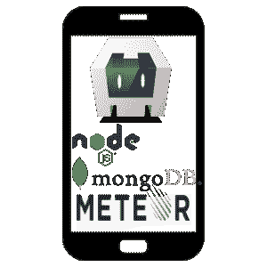

# 流星快速指南——它是什么，谁应该使用它

> 原文：<https://www.freecodecamp.org/news/what-is-meteorjs-and-who-should-use-it/>

MeteorJS 是一个制作 JavaScript 应用程序的全能框架。如果你喜欢用 HTML、CSS 和 JavaScript 制作网站，那么你可以用这些技能为你的电脑或手机制作应用程序。

默认情况下，当您执行“meteor create myapp & CD myapp & meteor run”时，它会提供一个 HTML/JavaScript 网页以及一个 Node/MongoDB 后端(目前未使用)。

Nodejs 只是位于服务器端的 JavaScript 的名字。Mongodb 是 Meteor 使用的 NoSQL(非唯一结构化查询语言)数据库。

## 让我们开始一个移动应用程序演示

要开始，你输入“流星添加-平台安卓”，然后输入“流星运行安卓”。这将使用你的电脑作为服务器(如果你在后台做了什么)，在你插着的[手机(或](https://www.xda-developers.com/install-adb-windows-macos-linux/)[虚拟设备](https://medium.com/androiddevelopers/developing-for-android-11-with-the-android-emulator-a9486af2d7ef))上运行这个应用程序。你可以在苹果电脑上用 iPhone 做同样的事情。

JS、HTML 和 CSS 文件直观地组织在“服务器”和“客户端”目录中。这就是 MVC(模型视图控制器)设计模式。

Android 和 iOS 移动接口由 Apache Cordova 处理。你不会在一个基本的 web 应用中看到它。然而，如果你正在使用任何手机硬件功能，你一定要注意。

基本平台允许你在后端或前端添加任何你想添加的框架。从 Angular，Express，React 和 Vue 的所有东西都可以安装在 Meteor 的顶部。

像 Material-UI 这样流行的 CSS 框架通常用来简化设计工作。然而，你根本不需要添加任何其他框架。Meteor 附带了一个很棒的[发布/订阅](https://docs.meteor.com/api/pubsub.html)方法、[火焰手柄](http://blazejs.org/)和用户账户等等。

## 超越演示

除了" [meteor add](https://atmospherejs.com/) 提供的插件，你还可以访问所有 npm 和 cordova 插件。你可以使用“流星 npm 安装”来访问它们。

你甚至可以使用 [Meteor-desktop](https://github.com/sharekey/meteor-desktop/) 添加一个桌面平台。这使用了电子框架。然后，您可以制作 Windows、Mac 和 Linux 应用程序。希望这个功能将在 Meteor 版本中得到原生支持。

自 2012 年以来，在不同的论坛上有一个健康的流星开发者社区。与大多数框架相比，guide.meteor.com 的文档更加广泛和清晰。

虽然这对于一个新开发人员来说似乎是完美的捷径，但是我要警告你:在你确信你知道它是如何工作的之前，不要在你的项目中包含一个包或者框架。

Meteor 擅长于集成，但是它需要额外的工作来组合不同的包。不要只是货比三家，寻找一个软件包清单，期望它能完美地一起工作。

对于希望了解应用程序开发的广阔领域和构建简单应用程序的初学者来说，Meteor 是一个很好的工具。

## **生产**

当然，Meteor 可以创建完整的 web 和移动应用程序。宜家和 Workpop 等几家大中型公司都使用这种方法。

为了便于开发和优化，可以使用 [Galaxy](https://www.meteor.com/hosting) 托管。Galaxy 将帮助您进入生产环境，无需任何系统管理知识。

如果你有知识和时间，那么你可以在你自己的服务器/VPC 上托管它。例如，一个月 5 美元的 AWS Lightsail 实例可以托管一个拥有 100 名用户的应用程序。

自托管和构建的工作方式与您开始 Meteor 演示的方式非常相似。然而，你将构建(流星构建)你的后端到一个标准的 nodeJS 应用程序，你的手机到一个[签名的 APK](https://medium.com/@yehudaclinton/how-to-make-an-android-app-with-meteorjs-62ae5b22623a) 或 IOS 应用程序，而不是“流星运行”。

多年来一直有传言说流星规模不大。这在很大程度上已经被证明是错误的，并且可以用各种技术来克服。

Meteor security 具有维护良好的开源项目的典型高标准。紧跟[安全指南](https://guide.meteor.com/security.html)并注意 [noSQL 注射](https://medium.com/rangeforce/meteor-blind-nosql-injection-29211775cd01)。

## 流星的优势

*   多元化的贡献者群体赋予了框架特殊的弹性和持久性。大多数其他框架都是由一家大型科技公司创建的。这可能意味着，如果他们看不到投资回报，该项目将被搁置。有了 Meteor，它的发展方向紧紧跟随它的用户。
*   是跨平台的。谷歌的 Flutter 不会在苹果的 iPhone 上运行。Meteor 允许你在一个地方实现你的应用程序。
*   它内置在 MongoDB 处理程序中，并且支持 GraphQL。

## 流星的缺点

*   如果开发人员过于依赖不同的预构建包，他们可能会相互冲突。
*   如果你只是制作一个 webapp，使用 Express 可能会更简单。
*   你无法让移动网络应用程序像本地应用程序一样高效运行。

总之，Meteor 是一个有效的框架，可以帮助您减少开发时间，简化应用程序维护。

如果你想了解更多关于如何用 JavaScript 制作应用程序的知识，请阅读这本来自 Manning Publications 的新书。