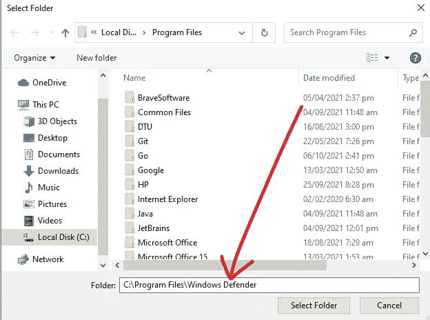
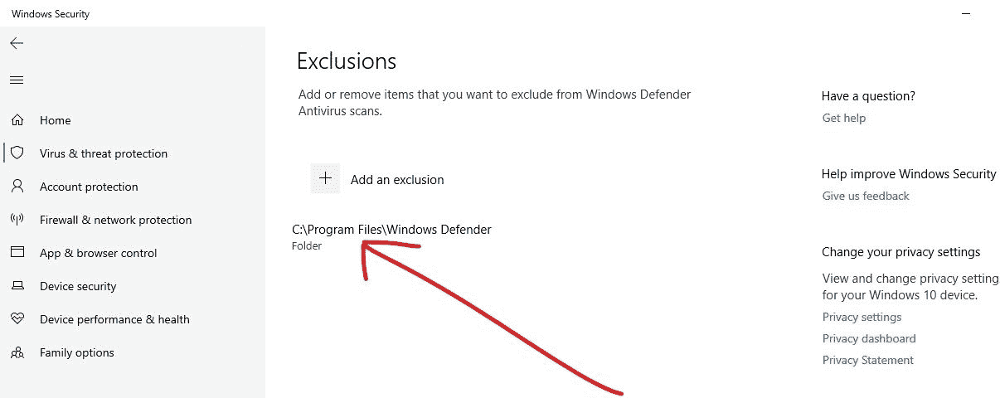

# 什么是 msmpeng.exe？为什么是 CPU 磁盘使用率高？

> 原文：<https://www.freecodecamp.org/news/what-is-msmpeng-exe-why-is-it-of-high-cpu-disk-usage/>

msmpeng.exe 是 Windows 安全的重要组成部分，原名 Windows Defender。它会扫描您的计算机，查找从恶意软件到间谍软件的各种威胁，然后给出适当的解决方案。

在本文中，我将带您了解什么是 mempeng.exe，它消耗太多 CPU 的原因，以及阻止它消耗太多 CPU 的两种不同方法。

## 什么是 msmpeng.exe？

Msmpeng.exe 代表微软恶意软件防护引擎。也被称为反恶意软件服务可执行文件，它是 Windows 10 计算机的内置防病毒程序。

该程序在后台运行，扫描您的计算机，查找有害软件、病毒、蠕虫等威胁，然后隔离或删除它们。

## 为什么 msmpeng.exe 的 CPU 磁盘使用率很高？

msmpeng.exe 吃了太多的 CPU 磁盘空间，因为它积极地在后台运行，并扫描你的计算机的每一部分，同时这样做。这当然使 msmpeng.exe 成为一个消耗资源的项目。

除此之外，msmpeng.exe 使用大量 CPU 的另一个原因是程序扫描自己的文件夹(`C:\Program Files\Windows Defender`)。硬件资源不足也与 msmpeng.exe 消耗太多 CPU 磁盘空间有关。

## 如何阻止 msmpeng.exe 使用过多的 CPU 磁盘空间

有两种主要方法可以阻止 Windows 10 反恶意软件服务可执行文件使用过多的 CPU。首先，您可以阻止 Windows Defender 扫描其自己的文件夹并禁用实时保护，其次，您可以重新计划 Windows Defender 扫描。

### 解决方案 1:阻止 Windows Defender 扫描自己的文件夹

**步骤 1** :点击开始或按键盘上的 WIN 键，然后点击齿轮图标打开设置应用。

**步骤 2** :点击列表中的“更新和安全”。

**第三步**:选择“Windows 安全”，点击“病毒和威胁防护”。

**第四步**:Windows 安全应用将会打开。在“病毒&威胁防护设置”下，点击“管理设置”链接。

**第 5 步**:向下滚动到“排除”并点击“添加或删除排除”链接。

**第 6 步**:在下一页，点击“添加排除”，然后选择“文件夹”。

**第七步**:为了避免多次点击，将`C:\Program Files\Windows Defender`粘贴到编辑器中，点击“选择文件夹”。

**步骤 8** :在你点击“选择文件夹”之后，一个巨大的模态将会出现——确保你点击“是”。

您现在可以看到，该文件夹已被添加为排除:

Windows Defender 将不再扫描此文件夹，因此您的计算机的 CPU 使用率应该会下降。

### 解决方案 2:禁用实时保护并重新计划 Windows Defender 扫描

**步骤 1** :要禁用实时保护并重新计划 Windows Defender 执行的扫描，请按`WIN` (Windows 键)打开运行对话框。

**第二步**:输入“taskschd.msc”，点击“确定”。这将打开任务计划应用程序。

**第三步**:展开“任务调度器选项卡”，然后选择“微软”，再选择“Windows”。

**第四步**:向下滚动，选择“Windows Defender”。

**第五步**:右键点击“Windows Defender 预设扫描”，选择“属性”。

**步骤 6** :在常规选项卡中，取消选中“以最高权限运行”。

**步骤 7** :转到条件选项卡，确保那里的每个框都没有被选中。

**第 7 步**:最后，转到“触发器”选项卡，点击“新建”。

**步骤 8** :最后，安排您希望 Windows Defender 运行扫描的时间，选择频率、日期和时间，然后单击“确定”。再次单击“确定”。

第八步:重启电脑。有了这个，msmpeng.exe 应该不会再消耗太多的 CPU 磁盘空间了。

## 包扎

Msmpeng.exe，也称为反恶意软件服务可执行文件，是一个相关和有效的程序，保护您的计算机免受威胁。

同时，它消耗了太多的 CPU 磁盘空间，这可能会降低计算机的速度并减少电池寿命，因此您可能会试图禁用它。

因为 msmpeng.exe 提供的保护是有用的，你应该寻找方法来最小化它的行为，而不是永久禁用它，就像这篇文章告诉你的那样。

如果 CPU 磁盘使用率没有减少，你可以尝试永久禁用 Windows Defender 但如果你这样做，请确保你的计算机获得另一个防病毒程序。

感谢您阅读这篇文章。如果你觉得有帮助，可以考虑与你的朋友和家人分享。