# 自动驾驶汽车眼中的世界

> 原文：<https://www.freecodecamp.org/news/what-is-my-convnet-looking-at-7b0533e4d20e/>

大卫·布莱洛夫斯基

# 自动驾驶汽车眼中的世界

#### 可视化神经网络用来识别交通灯的图像部分

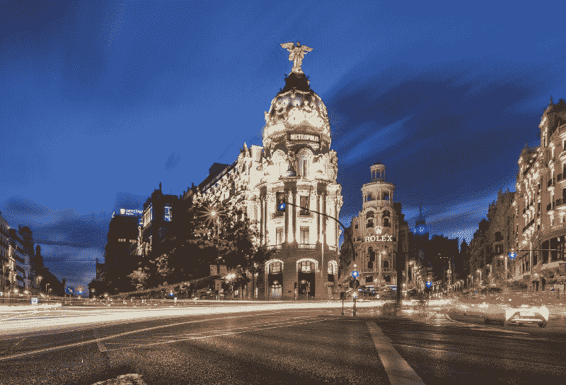

在我的上一篇帖子中，我描述了我如何训练一个卷积神经网络来识别仪表盘摄像头图像中的交通灯。表现最好的单一网络达到了令人印象深刻的 94%的准确率>。

虽然 ConvNets 非常擅长学习对图像进行分类，但它们在某种程度上还是一个黑箱。一旦他们接受训练，就很难知道他们在做什么。由于我从未明确地“告诉”网络关注交通灯，它可能正在使用图像中的一些其他视觉线索来预测正确的类别。可能是找静态车预测红灯？？

在这篇文章中，我描述了一个非常简单而有用的方法来可视化网络使用图像的哪一部分进行预测。这种方法包括遮挡部分图像，并观察这如何改变网络的预测。在“[可视化和理解卷积网络](https://arxiv.org/abs/1311.2901)”中描述了这种方法。

今天的自动驾驶汽车使用更加复杂的方法来检测场景中的物体，以及更多的传感器作为输入。我们在整篇文章中研究的 ConvNet 应该被视为自动驾驶汽车实际使用的简化版本。尽管如此，这篇文章中描述的可视化方法对不同种类的神经网络应用是有用的。

你可以从[这里](https://github.com/davidbrai/deep-learning-traffic-lights/blob/master/analysis/sliding_patch.ipynb)下载一个我用的代码的笔记本文件。

### 示例#1

我从下图开始，图中有一个红色的交通灯:

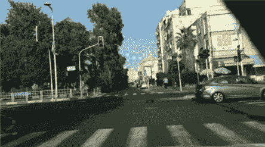

Source: [Nexar challenge](https://challenge.getnexar.com/challenge-1)

网络预测这张图片有 99.99%的概率是红灯。接下来，我用不同位置的灰色方块生成了这张图片的多个版本。更具体地说，是步长为 16 像素的 64×64 滑动正方形。

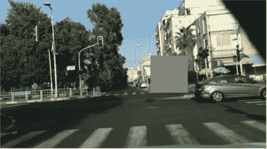

Example of image with 64x64 grey square patch

我在网络上运行每一幅图像，并记录下它为“红色”类预测的概率。下面你可以看到这些记录概率的热图。

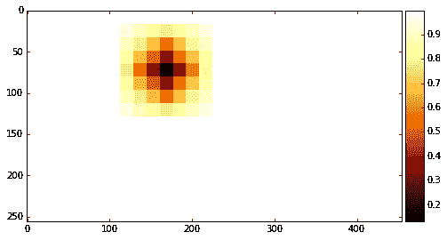

当有一个正方形小块覆盖该位置时，颜色代表“红色”类的概率。颜色越深意味着概率越低。有一个平滑的效果，因为我平均了覆盖它的所有补丁的每个像素的概率。

然后我在原始图像上绘制了热图:

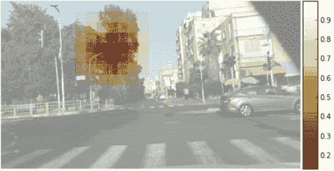

非常酷！？概率最低的恰恰是在遮挡红绿灯的时候。然后，我用一个更小的 16x16 的补丁重复了这个过程:

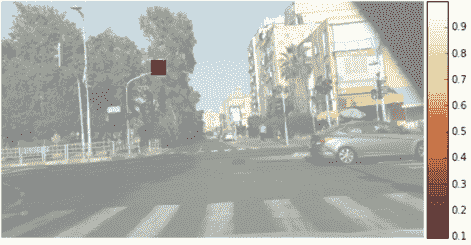

正好在红绿灯上！？

### 实施例 2

我不断检查更多的图片，发现了这个有趣的例子:

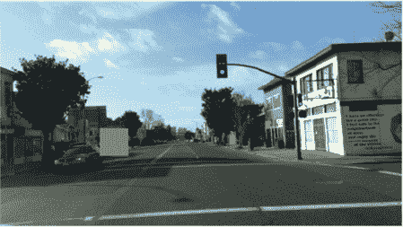

Source: [Nexar challenge](https://challenge.getnexar.com/challenge-1)

对于这幅图像，ConvNet 以 99.99%的概率预测了“绿色”类别。我通过滑动一个大小为 32x32、步长为 16 像素的补丁生成了另一个热图:

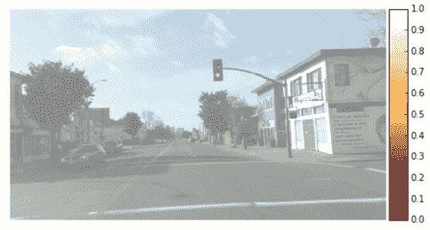

嗯…有些不对劲？。任何修补图像获得“绿色”的最低概率是 99.909%，这仍然是非常高的。概率最低的图像是:

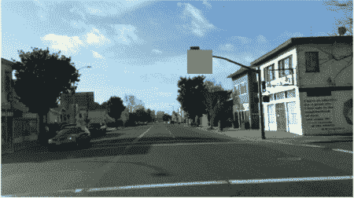

这看起来很好，它完美地覆盖了交通灯。那么，为什么网络仍然以很高的概率预测“绿色”呢？可能是因为图像中的第二个绿色交通灯。我在上面的修补图像上重复了滑动修补过程，并绘制了热图:

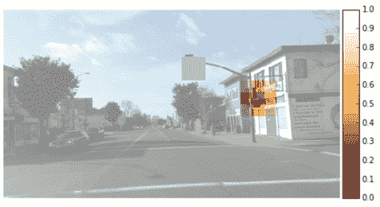

好多了！？在隐藏了第二个红绿灯之后，“绿灯”的概率下降到接近于零，准确地说是 0.25%。

### 看待错误

接下来，我想看看我是否能通过使用这种技术来了解一些网络的错误分类，从而学到一些有趣的东西。许多错误都是由于场景中有两个交通灯造成的，一个绿灯，一个红灯。很明显，在这些情况下，另一个交通灯是图像中导致错误的部分。

另一种错误是网络预测场景中没有红绿灯，而实际上却有。不幸的是，这种技术对于理解网络出错的原因不是很有用，因为它没有聚焦图像的特定部分。

我看到的最后一种错误是，网络预测到一个交通灯，而实际上并没有。请参见下面的示例:

上面标有热图:

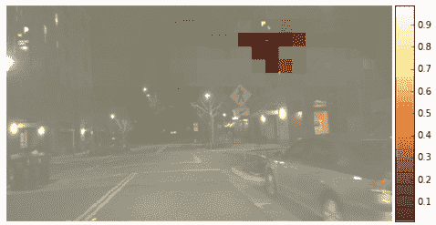

看起来网络把停车信号灯当成了交通灯。有趣的是，看到的只是右边的停车标志，而不是左边的。

### 结论

这种方法非常简单而有效，可以深入了解 ConvNet 在图像中关注的内容。不幸的是，它没有告诉我们*为什么*把注意力集中在那个部分。

我还做了一点实验来生成一个显著图，如“[深层卷积网络](https://arxiv.org/abs/1312.6034)”中所述，但是没有得到任何视觉上令人满意的结果。

如果你知道任何其他有趣的方法来了解 ConvNets 正在做什么，请在下面写下评论？

如果你喜欢阅读这篇文章，请点击下面的 **♥** ！