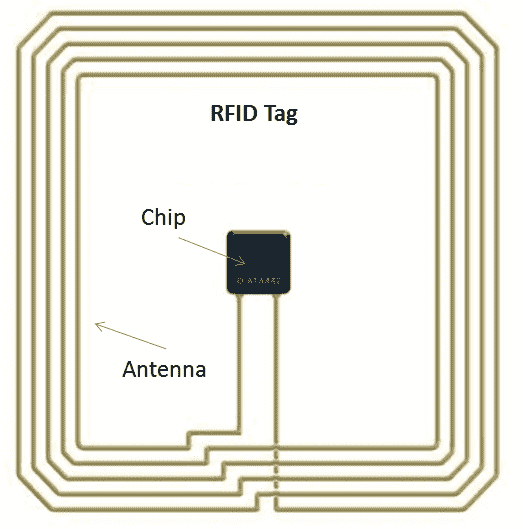
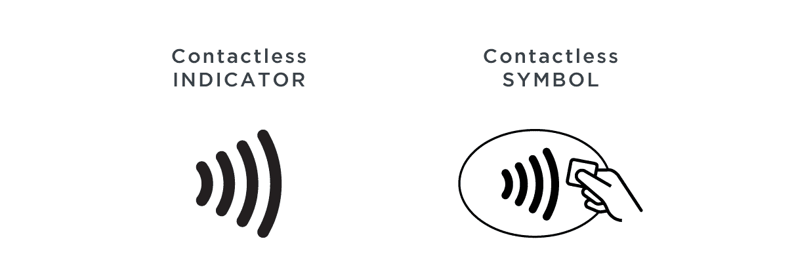
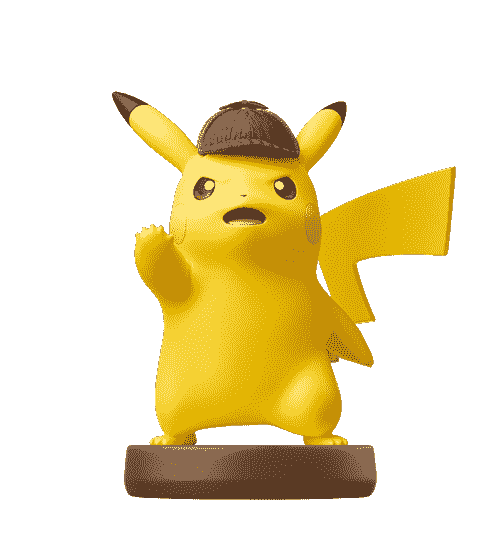

# 什么是 NFC？近场通信使用，芯片，标签和阅读器解释

> 原文：<https://www.freecodecamp.org/news/what-is-nfc-near-field-communication-uses-chips-tags-and-readers-explained/>

NFC 如今无处不在。你可能在手机设置里见过，或者在网上听说过。

虽然 NFC 在非接触式支付等方面的使用稳步增长，但由于冠状病毒疫情，今年年初出现了爆炸式增长。

在本文中，我们将讨论什么是 NFC，它的用途，一些使用 NFC 的创造性方法，等等。

## 什么是 NFC，它是如何工作的？

NFC 代表近场通信。设备在非常近的距离内进行无线通信是一种标准。

NFC 是另一种称为 RFID 的技术的子集，所以在回到 NFC 之前，让我们深入了解一下。

### 什么是 RFID？

射频识别(RFID)是使用来自阅读器的无线电波来跟踪特定标签的技术的总称。这些标签都包括一个天线和一个微型芯片，可以有多种形状和大小。

高速公路通行费支付装置和商店里衣服和其他昂贵物品上的塑料物品是 RFID 标签的一些常见例子。

A diagram of an RFID tag. NFC tags look very similar – [Source](https://www.analogictips.com/rfid-tag-and-reader-antennas/)

如果你曾经在商店入口的任何一边见过那些大的设备，那些只是大的 RFID 阅读器。他们不断发射无线电波，并监听回应。

那么，如果你试图离开一家商店，而你购买的商品上仍有标签，会发生什么呢？

大多数 RFID 标签都是无电的，所以当标签中的天线接收到来自阅读器的无线电波时，它会产生少量的电。这种电流激活了标签内的芯片，它将芯片上存储的信息发送回阅读器。

在这种情况下，当阅读器接收到来自商品标签的信号时，它会发出警报。

### RFID 和 NFC 有什么关系？

NFC 是 RFID 的更新、高频版本，也涉及标签和阅读器。

NFC 的频率更高，这意味着尽管它传输数据的速度比 RFID 快得多，但它只能在大约 4 厘米/1.6 英寸或更短的距离内工作。同时，RFID 的工作距离最远可达 12 米/40 英尺。

## NFC 是用来做什么的？

NFC 有很多使用案例，但这里是您将看到的一些最常见的。

### 非接触式支付

如今，NFC 最常见的用途是非接触式支付。许多较新的信用卡和借记卡都包含 NFC 标签，因此您可以将卡放在支付终端上方，而不是刷卡或插入。

支持非接触式支付的信用卡和借记卡上有一个类似的符号:

Most contactless payment cards will have a similar symbol on the front or back – [Source](https://www.emvco.com/emv_insights_post/contactless-payments-how-emvco-supports-seamless-and-secure-acceptance/)

大多数现代手机都包含一个 NFC 芯片，可以充当 NFC 读写器和标签。

这种芯片与 Google Pay、Apple Pay 和 Samsung Pay 等移动支付应用程序配合使用，意味着你甚至不再需要掏出钱包。

相反，你的手机可以充当你的信用卡或借记卡的虚拟 NFC 标签，即使所述卡内部没有实际的 NFC 标签。

无论您使用非接触式卡还是移动支付应用程序，您进行的每笔支付都涉及令牌化以获得额外的安全性。

令牌化是指使用您的卡信息为每笔交易生成一个随机的临时令牌。然后，你的卡或移动支付应用程序可以安全地发送临时令牌，而不是传输你的实际卡号、姓名和其他敏感信息。

无论你选择何种支付方式，使用非接触式支付卡、移动支付应用程序或插入你卡的芯片都比传统的刷卡方式安全得多。

### 与产品互动

传统上，RFID 用于跟踪仓库和商店中的库存。但是一旦产品离开商店，它的 RFID 标签就会失效。

现在很多产品都包括 NFC 标签，以便在你离开商店后进行额外的互动。任天堂的 Amiibo 数字可能是最近最常见的例子:

If this isn't the cutest NFC tag, I don't know what is – [Source](https://www.nintendo.com/amiibo/detail/detective-pikachu-amiibo/)

当你用你的任天堂游戏机扫描一个 Amiibo 人物时，你可以得到特殊的人物、物品或其他附加内容，这取决于你使用的游戏和人物。

你的任天堂游戏机也可以将信息写回到你的身材中的 NFC 标签，同样，这取决于游戏和身材。

耐克等其他公司已经在运动衫和运动鞋等物品中加入了 NFC 标签。这允许您根据您扫描的产品获得个性化内容(某个团队的最近得分、某个特定球员的统计数据等等)，甚至检查产品是否是正品。

### 数据传送

与 RFID 不同，RFID 通常是读取器和标签之间的单向通信，NFC 允许双向通信。

一些手机能够使用 NFC 在两个设备之间传输联系人或照片等数据，如果你将它们放在一起触摸的话。

## NFC 的创造性应用

你可以用 NFC 做的最酷的事情之一是在网上购买一包标签，并对它们进行编程，让它们用你的手机做不同的事情。

例如，如果你厌倦了总是把你的 WiFi 密码给客人，你可以编程一个 NFC 标签来自动连接到你的网络。然后，你的客人需要做的就是确保 NFC 已启用，并将他们的手机放在标签附近。

你还可以对 NFC 标签进行编程，以控制你家中不同的智能设备。你可以用一个标签来开关智能灯，或者设置恒温器。

NFC 标签触发的命令也可以针对特定设备进行个性化设置。例如，如果你喜欢房间比你的伴侣凉爽一点，当你扫描恒温器标签时，它可以降低温度。但是当你的伴侣扫描它时，它可以将温度提高到他们喜欢的设置。

还有许多其他有趣的方式来使用 NFC 标签，让您的生活稍微轻松一点。观看此视频，了解更多想法，并了解如何在 iOS 和 Android 中编写自己的 NFC 标签:

[https://www.youtube.com/embed/o9WHrX9cvXA?start=87&feature=oembed](https://www.youtube.com/embed/o9WHrX9cvXA?start=87&feature=oembed)

## 概括起来

虽然你可能直到今年早些时候才听说过 NFC(我当然没有听说过)，但它很可能会成为我们支付物品的标准。

考虑到你可以用一部手机和一包 NFC 标签做的所有很酷的事情，NFC 没有被更广泛地采用是令人惊讶的。

如果你最终编写了自己的 NFC 标签，请让我知道你做了什么，以及你是如何在 Twitter 上完成的。