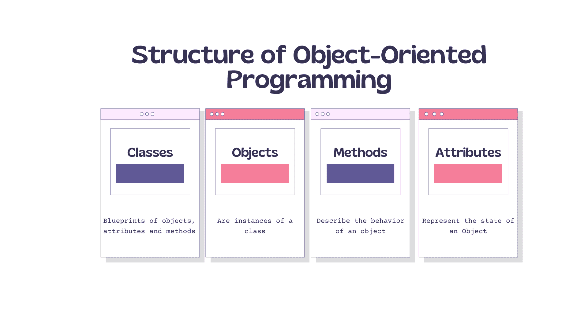
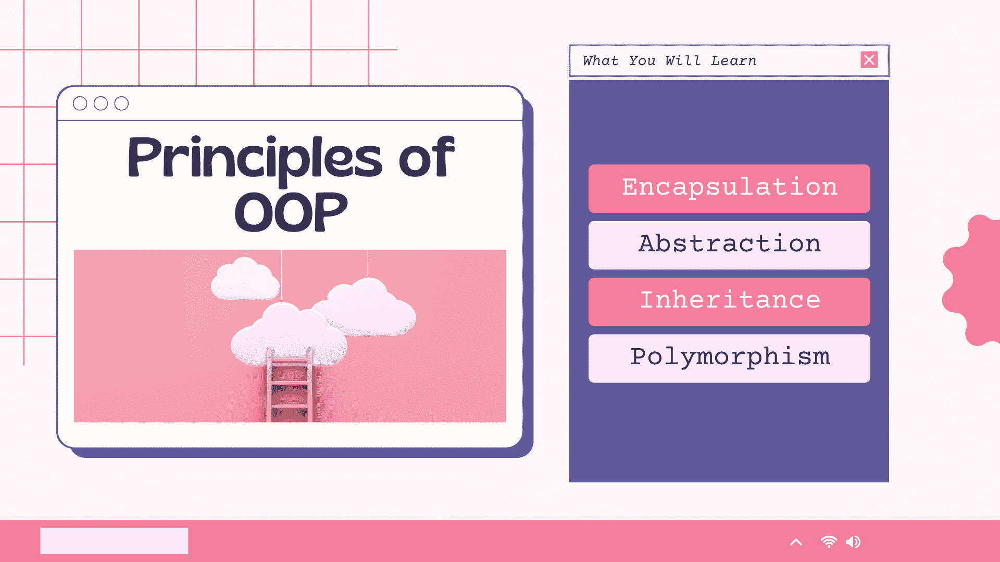

# OOP 的含义——什么是面向对象编程？

> 原文：<https://www.freecodecamp.org/news/what-is-object-oriented-programming/>

在当今技术驱动的社会中，对计算机编程知识的需求很高。作为一名开发人员，你需要了解各种编程语言。

在过去的几十年里，许多编程语言越来越受欢迎。你可以在这张实时排名图中看到流行语言的排名。

当新的语言被创造出来的时候，现存的语言总是在被更新以使它们变得更好。

尽管大多数编程语言都有一些相似之处，但每一种语言都有特定的规则和方法，这使其独一无二。

许多编程语言中常见的一个概念是面向对象编程。

当我第一次遇到这个术语时，有点困惑。我花了一些时间才真正理解它在编程中的重要性。但这也给了我一个机会来学习它的关键概念，并知道它对开发人员的职业生涯和解决挑战的能力有多重要。

在本文中，我们将把面向对象编程(OOP)作为一个整体来看，不依赖于特定的语言。您将了解它是什么，为什么它作为一种编程范式如此受欢迎，它的结构，它如何工作，它的原则等等。

让我们开始吧。

# 什么是面向对象编程？

如果你在互联网上快速搜索一下什么是面向对象编程，你会发现 OOP 被定义为一种依赖于类和对象概念的编程范式。

现在，对于一个初学者来说，这可能有点令人困惑——但没必要担心。我会尽量用最简单的方式来解释，就像那句名言“像我 5 岁一样给我解释”。

这里有一个关于你可以用 OOP 实现什么的简要概述:你可以用它把一个软件程序构造成简单的、可重用的代码块(在这种情况下通常称为类)，然后你用它来创建对象的单个实例。

所以让我们找到一个更简单的面向对象编程的定义，并了解更多。

## 像我 5 岁一样解释 OOP

面向对象这个词是两个术语的组合，对象和面向。

对象的字典含义是“存在于现实世界中的实体”，导向的意思是“对某一类事物或实体感兴趣”。

用基本术语来说，OOP 是一种围绕对象或实体构建的编程模式，所以它被称为面向对象编程。

为了更好地理解这个概念，让我们来看看常用的软件程序:一个很好的例子来解释这一点，当你打印一份文件时，打印机的使用。

第一步是通过单击打印命令或使用键盘快捷键来启动操作。接下来你需要选择你的打印机。之后，您将等待一个响应，告诉您该文档是否已打印。

在我们看不到的背后，你点击的命令与一个物体(打印机)交互，完成打印的任务。

也许你会好奇，OOP 到底是如何变得如此流行的？

# OOP 是如何流行起来的

OOP 的概念在 60 年代随着一种叫做 [Simula](https://en.wikipedia.org/wiki/Simula) 的编程语言开始浮出水面。即使回到过去，开发人员并没有完全接受 OOP 语言的第一次进步，方法学也在继续发展。

快进到 80 年代，大卫·罗宾逊写的一篇社论是对 OOP 的第一次介绍，因为许多开发人员不知道它的存在。

到现在，像 C++和 Eiffel 这样的语言在计算机程序员中变得更加流行和主流。在 90 年代，这种认识继续增长，随着 Java 的到来，OOP 吸引了大量的追随者。

在 2002 年，随着。微软推出了一种全新的面向对象语言 C#，这种语言通常被认为是最强大的编程语言

有趣的是，几代人之后，将代码组织成有意义的对象来模拟问题的各个部分的概念仍然困扰着程序员。

许多对计算机如何工作一无所知的人发现面向对象编程的思想很自然。相反，许多有计算机经验的人最初认为面向对象系统有些奇怪。

# 面向对象的结构

想象一下，你正在经营一家宠物店，里面有很多不同的品种，你必须记录它们的名字、年龄、照看的天数以及其他常见的保养细节。你将如何设计可重用的软件来处理这个问题？

请记住，我们有许多品种，所以为每个品种编写代码将是令人厌倦的。但是我们可以将相关的信息组合在一起，这样我们就可以产生更短、更可重用的代码。

这就是构建模块通过使用**类、对象、方法**和**属性**来帮助我们做到这一点的地方。

让我们深入了解一下这些构造块到底是什么:

*   **类**——这些是用户定义的数据类型，充当对象、属性和方法的蓝图。

*   **对象**——这些是具有明确定义的数据的类的实例。当最初定义一个类时，描述是唯一被定义的对象。

*   **方法**——这些是在一个类中定义的函数，描述一个对象的行为。它们有助于重用或一次将功能封装在一个对象中。代码重用在调试时是一个很大的好处。

*   **属性** -这些在类模板中定义，代表对象的状态。对象包含存储在属性字段中的数据。

# 面向对象的原则

为了让我们知道如何编写好的 OOP 代码，我们需要理解我们应该坚持的 OOP 的 4 个支柱:

*   包装
*   抽象
*   遗产
*   多态性

让我们深入研究一下，更好地理解每一项的确切含义。

## 包装

这是将数据绑定在一起的概念。函数处理信息并保证其安全。如果信息是隐藏的，就不能直接访问它。如果你想获得这些信息，你需要与负责这些信息的文章互动。

如果你受雇于一家公司，你很有可能有封装方面的经验。

想想人力资源部门。人力资源人员封装(隐藏)关于雇员的数据。他们决定如何使用和操作这些数据。任何对员工数据的请求或更新信息的请求都必须通过他们进行。

通过封装数据，您可以使系统中的信息更加安全可靠。您还可以监控信息是如何被访问的，以及对信息执行了什么操作。这使得程序维护更容易，并简化了调试过程。

## 抽象

抽象是指使用简单的类来表示复杂性。基本上，我们通过允许用户只看到相关和有用的信息来使用抽象来处理复杂性。

解释这一点的一个很好的例子是驾驶自动汽车。当你有一辆自动挡汽车，想从 A 点到 B 点，你需要做的就是给它目的地，发动汽车。然后它会带你去目的地。

你不需要知道的是汽车是如何制造的，它如何正确地接受并遵循指令，汽车如何筛选出不同的选项来找到最佳路线，等等。

同样的概念也适用于构建 OOP 应用程序。您可以通过隐藏用户不需要看到的细节来做到这一点。抽象使它变得更容易，并使您能够在小的、可管理的部分中处理您的项目。

## 遗产

继承允许类继承其他类的特性。举个例子，你可以把所有的猫归为具有某些共同特征的一类，比如有四条腿。它们的品种进一步将它们分成具有共同属性的亚组，如大小和颜色。

你在 OOP 中使用继承来根据共同的特征和性能对程序中的对象进行分类。这使得处理对象和编程更容易，因为它使您能够将一般特征混合到父对象中，并在子对象中继承这些特征。

例如，您将定义一个 employee 对象，该对象定义您公司中雇员的所有总体特征。

然后，您将能够定义一个 manager 对象，它继承了 employee 对象的特征，但也添加了贵公司经理特有的特征。manager 对象将自动反映 employee 对象实现中的任何变化。

## 多态性

这就是两个不同的对象回复一个形式的力量。程序将决定哪种用法对来自父类的东西的每次执行是关键的，这减少了代码重复。它还允许不同种类的对象与同一界面交互。

## 面向对象语言的例子

技术和编程语言一直在发展。我们已经看到了面向对象类语言的兴起，但是 Simula 被认为是第一种面向对象语言。

被认为是纯面向对象的编程语言把一切都像对象一样对待，而其他语言主要是用一些过程化的过程来设计的。

*OOP 语言的例子:*

*   斯卡拉
*   绿宝石
*   红宝石
*   翡翠
*   Java 语言(一种计算机语言，尤用于创建网站)
*   计算机编程语言
*   C++
*   Java Script 语言
*   Visual Basic。网
*   服务器端编程语言（Professional Hypertext Preprocessor 的缩写）

还有很多。

## 面向对象的好处

在 70 年代和 80 年代，面向过程的编程语言如 C 和 Pascal 被广泛用于开发面向商业的软件系统。但是，随着程序执行更复杂的业务功能并与其他系统交互，结构化编程方法的缺点开始浮出水面。

正因为如此，许多软件开发人员转向面向对象的方法和编程语言来解决遇到的问题。使用这种语言的好处包括:

*   **代码重用**——通过继承，你可以重用代码。这意味着一个团队不必多次编写相同的代码。

*   改进了与现代操作系统的集成。

*   **提高生产力** -开发人员可以通过使用多个库轻松快速地构建新程序。

*   多态性使单个函数能够适应它所在的类。

*   易于升级，程序员也可以独立实现系统功能。

*   通过**封装**对象可以自包含。它还使故障排除和开发协作变得更加容易。

*   通过使用封装和抽象，复杂的代码被隐藏，软件维护变得更容易，互联网协议得到保护。

## 包扎

今天，大多数语言允许开发人员混合编程范例。这通常是因为它们将用于各种编程方法。

例如，以 JavaScript 为例——你可以在面向对象和函数式编程中使用它。当你在编写面向对象的 JS 时，你必须仔细考虑程序的结构，并在编码的开始就做好计划。您可以通过查看如何将必需品分解成简单的、可重用的类来做到这一点，这些类将成为对象的习惯蓝图实例。

使用 OOP 的开发人员通常都同意，一般来说，使用 OOP 可以获得更好的数据结构和代码的可重用性。从长远来看，这可以节省时间。