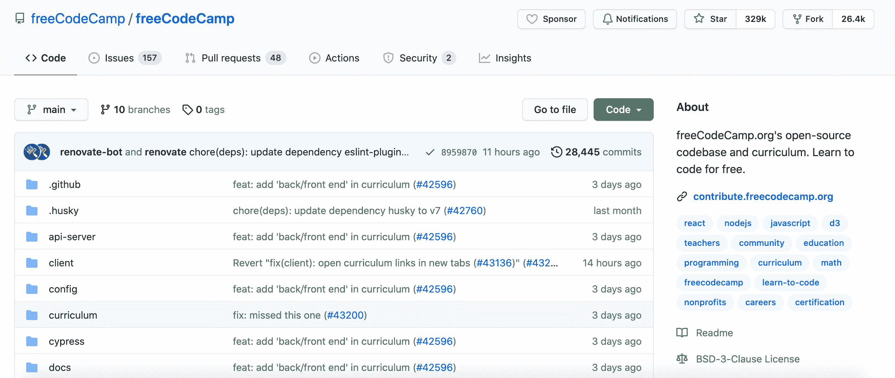

# 什么是开源软件？OSS 用简单的英语解释

> 原文：<https://www.freecodecamp.org/news/what-is-open-source-software-explained-in-plain-english/>

在您的编程之旅中，您可能听说过“开源”这个术语。但这实际上意味着什么呢？

在本文中，我将解释什么是开源软件，并讨论它与其他类型的软件有何不同。我还将讨论开源软件的优点以及如何开始为项目做贡献。

## 什么是开源？

开源软件是公众可以查看、修改和共享的代码。开源的一个例子是 [freeCodeCamp](https://www.freecodecamp.org/) 。

如果我想查看 freeCodeCamp 课程的代码，我可以在 freeCodeCamp 的 GitHub 页面上查看。

如果我在其中一个挑战中发现了一个 bug，那么我可以通读[贡献者指南](https://contribute.freecodecamp.org/#/index)并提出一个修复方案。开源软件让我为 freeCodeCamp 代码库做贡献成为可能。

有[百万个开源项目](https://github.com/open-source)可供选择和参与。

## “开源”一词从何而来？

二十多年前,“开源软件”一词是由前瞻研究所的共同创始人 Christine Peterson 创造的。她想创造这个术语来吸引新人进入这个领域。

最初的名字是“自由软件”,但是对于“自由”的真正含义有很多混淆。为了澄清这个问题，Peterson 提议将名字改为“开源软件”。

## 开源与其他类型的软件有什么不同？

现在我们已经了解了开源软件的基本定义，让我们来看看另一种类型的软件。

### 什么是专有软件？

与开源软件不同，只有专有软件的原始作者才能修改其代码。这类软件的用户必须同意不做任何改动，除非他们得到所有者的许可。

专有软件的例子包括 iTunes、Microsoft Windows 和 Adobe Photoshop。

## 什么是开源许可证？

开放源代码是在下列许可证之一下发布的。这让您知道可以对代码做什么，以及使用它需要什么权限(如果有的话)。

这是最流行的开源许可列表。

*   [Apache 许可证 2.0](https://opensource.org/licenses/Apache-2.0)
*   [BSD 3-条款“新”或“修订”许可证](https://opensource.org/licenses/BSD-3-Clause)
*   [BSD 2-条款“简化”或“免费”许可证](https://opensource.org/licenses/BSD-2-Clause)
*   [GNU 通用公共许可证(GPL)](https://opensource.org/licenses/gpl-license)
*   [GNU 库或“宽松”通用公共许可证(LGPL)](https://opensource.org/licenses/lgpl-license)
*   [麻省理工学院许可证](https://opensource.org/licenses/MIT)
*   [Mozilla 公共许可证 2.0](https://opensource.org/licenses/MPL-2.0)
*   [共同开发和发行许可证](https://opensource.org/licenses/CDDL-1.0)
*   [Eclipse 公共许可证版本 2.0](https://opensource.org/licenses/EPL-2.0)

让我们更详细地看一下其中的一个。

### 带许可证

这种许可证起源于 20 世纪 80 年代，限制很少。有了这个许可证，只要你保留版权和许可声明，你几乎可以对代码做任何事情。

[choosealicense.com](https://choosealicense.com/)提供了麻省理工学院许可证的描述:

> 它让人们可以对你的项目做任何他们想做的事情，比如制作和发布闭源版本。

使用这个许可的一些项目有 Ruby on Rails、Node.js、React 和 Angular。

如果您有兴趣了解更多关于提到的其他流行许可证的信息，请单击列表中的任何链接。

## 开源软件有什么好处？

使用开源软件有很多好处。其中一个好处是你对你决定使用的代码有多少控制权。

程序员可以查看代码并决定他们想要更改代码的哪些部分。普通用户可以用他们喜欢的任何方式使用这个软件，而不需要有人告诉他们以特定的方式使用它。

另一个好处是你可以从使用开源项目的代码中学到很多东西。来自各种背景的开发人员可以研究开源项目的代码，并与其他人分享他们的工作。

开源软件也被认为比专有软件更安全。由于代码可以免费获得，开发人员可以比在专有软件中更快地发现问题，进行更新，并修复这些错误。

开源背后也有一个非常大的社区。因此，对于希望加入开源社区并开始做出贡献的初学者来说，有很多有用的资源。

## 如何开始为开源项目做贡献

有大量的资源可以教授如何为开源项目做贡献的基础知识。这里有几个让你开始的例子:

*   [如何为开源项目做出贡献——初学者指南](https://www.freecodecamp.org/news/how-to-contribute-to-open-source-projects-beginners-guide/)
*   [开源终极指南](https://www.freecodecamp.org/news/the-ultimate-guide-to-open-source/)

你可以在 GitHub 上搜索标有“招聘”、“仅限首次者”或“好的第一期”的标签。一旦你发现一个项目符合你的技术栈，确保通读项目贡献指南。

如果你需要一些帮助来开始使用 Git 或 GitHub，这些指南可以帮助你:

*   [什么是 GitHub？Git 是什么？以及如何使用这些开发工具](https://www.freecodecamp.org/news/what-is-github-what-is-git-and-how-to-use-these-developer-tools/)
*   [Git 和 GitHub 速成班](https://www.freecodecamp.org/news/git-and-github-crash-course/)

为开源项目做贡献是进一步发展您的技能和与其他开发人员合作的好方法。如果你想进入科技行业，这也是你获得经验的另一种方式。

起初这可能看起来有点吓人，但是你可以从一些小事开始，比如修复文档中的一个打字错误。

这里有一个网站列表，可以帮助您找到要参与的项目:

*   [好的第一期](https://goodfirstissue.dev/)
*   [CodeTriage](https://www.codetriage.com/)

## 结论

开源软件是公众可以查看、修改和共享的代码。“开源软件”一词是由远见研究所的联合创始人克里斯汀·彼得森创造的。

对于专有软件，只有软件的原始作者才能修改其代码。这类软件的用户必须同意不做任何改动，除非他们得到所有者的许可。

开源软件有许多好处，包括大型社区支持、开始贡献的有用指南、通过研究人们的代码来学习，以及获得与其他开发人员合作的经验。

如果你有兴趣开始为一个项目做贡献，在 GitHub 中搜索标有“需要帮助”、“仅限首次者”或“好的第一期”的标签，找到你感兴趣的项目。

我希望这篇文章对您有所帮助，并祝您在开源之旅中好运。