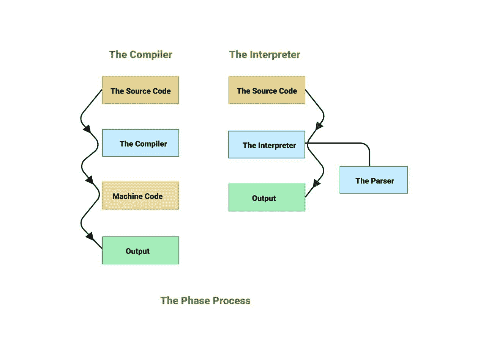
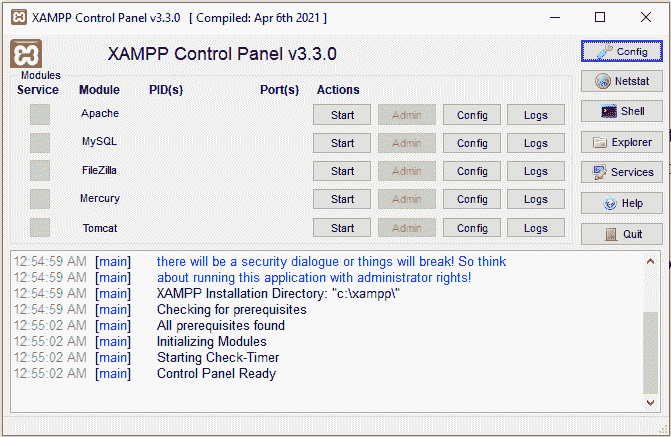
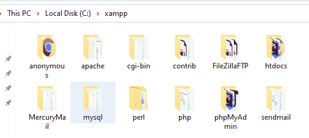
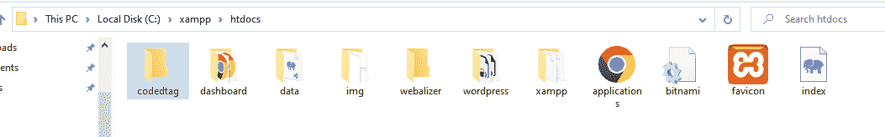
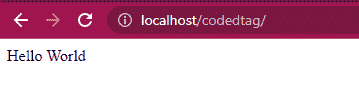

# PHP 是什么？如何编写你的第一个 PHP 程序

> 原文：<https://www.freecodecamp.org/news/what-is-php-write-your-first-php-program/>

在本文中，您将学习什么是 PHP 编程语言，以及如何用它编写您的第一个程序。

## PHP 的历史

PHP 是为 web 开发而产生的最常用和最流行的脚本语言。你可以把它嵌入到 HTML 文档中。

PHP 是用高级 C 编程语言编写的。第一代 PHP 是由拉斯马斯·勒德尔夫在 1994 年创建的 PHP/FI。他写这个是为了跟踪浏览他简历的人。

让他能够轻松地用 PHP 创建第一个主页的是将 PHP 代码嵌入 HTML 标记的能力。

第二代是 1995 年发布的 PHP/FI 版本 2，它引用了个人主页工具。此时，PHP 依靠一个小型解析器引擎来翻译和理解 PHP 个人主页上使用的一些特殊指令和一些实用程序。

PHP 在 1996 年正式诞生并得到更广泛的应用。最初，它被用于全世界超过 15，000 个网络应用程序。第二年，这个数字增加到了 50，000。

目前，PHP 完全依赖于一个叫做 Zend Engine 的高级解释器。要学习更多关于什么是 PHP 以及如何编写一个高级 PHP 程序的知识，你应该阅读更多关于它的语法。

正如我之前提到的，PHP 依赖于 Zend 引擎解释器。但问题是，口译员是什么？以及它是如何工作的？

在下一节中，我将从头开始解释一切——从源代码到 PHP 服务器响应。但在此之前，你必须知道解释器和编译器之间的区别。

让我们开始吧。

## 解释器和编译器有什么区别？

解释器是一个程序，它逐行获取源代码，并将其翻译成二进制位(0 和 1)——机器语言。在此过程中，开发人员可以编辑源代码。

解释器不需要花很长时间来分析代码——比如从源代码中删除注释、空白等等。但是总的执行时间有点慢。

另一方面，编译器是一个程序，它获取已经用高级编程语言编写的完整源代码，并将其翻译成二进制或机器语言。

在这个过程中，你不能编辑源代码，因为它是作为一部分进入编译器的。编译器分析代码很慢，但翻译速度很快。



让我们更深入地看看 PHP 解释器，看看它是如何工作的。

## PHP 解释器是如何工作的？

正如我之前提到的，PHP 解释器被称为 Zend 引擎，它有四个阶段来解释 PHP 源代码——在这一节中，我们将深入每个阶段。

### 词汇分析

PHP 解释器从服务器获取源代码，并开始称为词法分析(或标记化)的第一阶段。在这个过程中，解释器删除所有空格和注释语法，搜索源代码中的任何错误，然后生成一个标记序列。

词法分析在这个阶段不会导致任何错误，因为它只负责产生一个标记序列。但是如果在源代码中发现任何错误，它会抛出一个致命的解析错误来直接停止这个阶段。

### 解析器

在接下来的步骤中，解析器接管。在这个阶段，解析器接收令牌序列，并设置一些指令来创建 Zend Engine VM(虚拟机)——这类似于汇编语言——以操作前一阶段已经创建的令牌序列。

### 汇编

这个阶段已经在解析器阶段，这里解析器通过生成 AST(抽象语法树)开始编译，然后将它传递给代码生成器。

编译的输出是一个已经依赖于 Zend Engine VM 的中间代码。这被称为操作代码(操作码)。操作码包含一些执行所有需要实现流量控制的操作的指令。

### 死刑

这是最后一个阶段，在这里，执行器接收前一个阶段已经生成的中间代码。它可以从指令数组中读取这些操作码，然后逐个执行它们。

总的来说，Zend 引擎有两个独立的功能，编译和执行，分别是 zend_compile 和 zend_execute。

在下一节中，您将编写您的第一个 PHP 程序！但是在这之前，[你必须根据你使用的操作系统安装 Wamp(Windows)或 XAMPP(Linux/MAC OS)服务器](https://www.freecodecamp.org/news/how-to-get-started-with-php/)。

## 如何安装 XAMPP

在这一节中，我将解释 XAMPP 服务器以及如何在本地机器上运行 PHP 服务器。

首先，XAMPP 是一个用来创建 PHP 网络服务器的免费软件。但是 XAMPP 是什么意思呢？

1.  “X”指的是 Windows、Linux 或 macOS 等**操作系统**。这意味着我们可以将 XAMPP 服务器安装在我们在这一行中提到的一个操作系统上。
2.  “A”指的是 **Apache** ，那就是 PHP webserver 软件。
3.  “M”指的是数据库管理系统 MariaDB - MySQL。
4.  “P”指的是 **PHP** (个人主页)——帮助我们创建动态网页的服务器端脚本语言。
5.  “P”指的是用于 web 开发、网络编程或系统管理的 Perl。

因此，XAMPP 指的是你开发 web 应用程序所需的所有软件包。

要在您的本地机器上安装 XAMPP 服务器，请导航到 [XAMPP 官方页面](https://www.apachefriends.org/)并根据您的操作系统下载安装程序。

一旦你下载了它，只要按照你在安装程序中看到的说明安装程序就可以了。

最终结果应该如下图所示:



The XAMPP Control Panel

你只需要点击 Apache 模块旁边的“开始”按钮来运行 PHP 服务器。

让我们探索一下 XAMPP 服务器应用程序中的重要文件夹。



XAMPP Important Folders

上图显示了所有重要的文件夹，但我们只需要关注“ **htdocs** ”文件夹。这个文件夹是包含所有 PHP 项目的公共目录。

因此，您将把任何新的 PHP 项目放在“ **htdocs** ”文件夹中。要在网络浏览器上打开结果，您只需导航至“**localhost/your _ project _ folder _ name**”。

让我们写一个 PHP 程序来阐明这一点。

## 如何编写你的第一个 PHP 程序

为了帮助你编写你的第一个 PHP 程序，我们将打印一条小消息——“Hello World”。

首先，确保你的 PHP 服务器在你的本地机器上运行——我在我的本地机器上使用 XAMPP 服务器。

其次，在您的服务器应用程序目录中创建一个文件夹，并将其命名为 [codedtag](http://codedtag.com/) 。

下图显示了我在 Windows 上的 XAMPP 服务器应用程序中的公共文件夹是( **htdocs** )。



The public folder of the XAMPP server

下一步，创建一个以 PHP 扩展名结尾的索引页面。在“codedtag”文件夹中，复制粘贴以下 PHP 代码:

```
<?php 
   echo "Hello World";
?>
```

要运行该脚本，请打开浏览器并导航到 **localhost/codedtag** 。您将看到如下图所示的打印消息:



The PHP Print Message

就是这样！你已经打印了你的第一个 PHP 程序。

## 包扎

在本文中，我们讨论了什么是 PHP，并用几行文字总结了它的历史。我们还学习了编译器和解释器之间的区别。

此外，我们讨论了 PHP 解释器工作的具体步骤。总结一下，让我们从顶部看一下 PHP Zend 引擎。

1.  第一步是词法分析。在这个阶段，解释器从源代码中删除所有空格和注释，并生成一个标记序列。
2.  下一步称为解析器，解析器在这里设置创建 Zend Engine VM 的指令，以操作令牌序列。
3.  编译阶段创建 AST(抽象语法树)并将其传递给代码生成器，最终的编译输出是操作码。
4.  下面的步骤是针对执行程序的，在这个阶段，执行程序从数组中读取并执行指令。

如果你想学习更多关于 PHP 的知识，这里有一本[完整的手册，深入介绍了所有的基础知识](https://www.freecodecamp.org/news/the-php-handbook/)。

请继续关注我的下一篇文章。