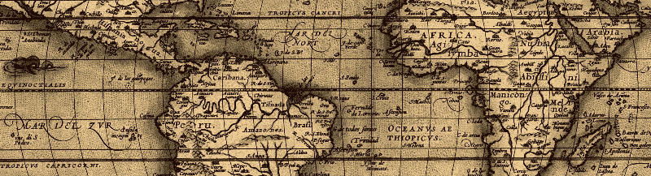
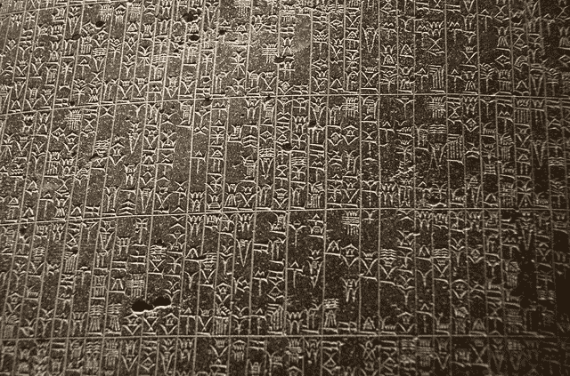

# 我们已经编程几千年了

> 原文：<https://www.freecodecamp.org/news/what-is-programming-22a72ef4fd02/>

by Tautvilas Mečinskas

# 我们已经编程几千年了



电脑程序就在我们周围。我们每天都与他们互动。看来软件对我们的社会越来越重要了。但是为什么我们发现程序对我们如此必要呢？我们为什么以及什么时候开始编程的？编程的本质是什么？这些问题可能听起来微不足道，但我觉得今天我们仍然没有一个好的定义是什么编程。也许这篇文章可以帮助改变这种情况。

很难定义编程，因为它是如此的多样化。人们可以编写游戏、移动应用、网站、编译器、模拟等等。在这种情况下，从打破一些误解和澄清什么不是编程开始可能会有所帮助。

编程不是科学。科学是审视世界并从中发现可重复模式的艺术。科学方法是提出一个假设，然后通过实验来证明或否定它。我们在编程中不使用这种方法，因此这不是科学。编程不是关于发现，而是创造力。

编程不是数学。是的，编程有数学的一面。程序的某些部分可以用数学函数来表达。写一个斐波那契数生成器很有趣，但是如果没有现实世界的应用程序就完全没有用。编程中的数学是达到目的的手段，而不是过程的核心部分。

编程与电子计算机无关。电脑很有用，但不是必须的。程序也能被人类理解和解释。所以，计算机只是我们在编程中使用的工具。

那么编程是关于什么的呢？无论是大项目还是小项目，每个项目的核心是什么？

抽象概念。

什么是抽象？这是一个缩小了的世界形象。抽象时，我们将现实转化为可以作为信息传播的符号。*抽象*一词来源于两个拉丁词，分别是 *abs、*意为 ***远离*** 和 *trahere、*意为 ***画**。*拉丁文翻译暗示抽象意味着从整体中分离出一个。

抽象的过程是编程独有的吗？不完全是。这是人类已经做了很长时间的事情。我们最基本的抽象工具是地图和时钟。

考古学家发现了人类在 14000 多年前制作的石头地图。由此可见，地图制作是人类的根本。这是一个通过抽象将领域转化为符号的过程。地图是抽象空间的一种方式。这是一个帮助我们理解周围领域的工具，这样导航会更容易。

另一方面，时钟是一种抽象时间的方式。我们发现时间的连续性令人困惑，所以我们将其抽象。人类将时间分割成离散的间隔:年、月、日、小时、分钟、秒。地图帮助我们导航空间，时钟帮助我们导航时间。时钟的前身——日历——出现于一万多年前。


Giant solar calendar [Chankillo](https://en.wikipedia.org/wiki/Chankillo) was built 2,300 years ago.

那么电脑呢？它们也是处理抽象的工具。每台计算机都有三个基本部分:

1.  内部时钟——计算机提取时间的方式
2.  记忆——计算机抽象空间的方式
3.  处理单元—计算机执行逻辑运算的方式

这些设施为计算机提供了一种理解空间抽象及其在抽象时间中的相互作用的方式。这意味着程序是时空的抽象，编程是创造时空抽象的艺术。这些抽象帮助我们驾驭现实，这就是为什么它们对我们如此重要。

有一种抽象方法与编程非常相似，但比地图、时钟和日历还要古老:语言。

如果你仔细观察我们的自然语言，你会发现它具有抽象时空所必需的所有特征。

我们来看一个例句:

> 今晚去花园摘些花。

**花园**和**花**是抽象的空间。**今晚**是一种抽象时间的方式。**和**给句子增加逻辑。**转到**和**拿起**都是子程序。

我们可以很容易地将上面的句子转换成 JavaScript:

```
whenEvening.then(()=>you.goTo(garden)).then(()=>you.pickUp(flower))
```

这句话可以被计算机理解，它有**晚**、**友**、**花、**的定义和必要的子程序定义。

自然语言的问题在于它有非常广泛的应用。语言不仅可以用来交流信息，还可以用来表达感情和情绪。纯自然语言程序的最好例子是法律、棋盘游戏规则和指导手册。



[Code of Hammurabi](https://en.wikipedia.org/wiki/Code_of_Hammurabi) is one of the oldest natural language programs (photo by [Richard](https://www.flickr.com/photos/prof_richard/) / [CC BY-NC-SA](https://creativecommons.org/licenses/by-nc-sa/2.0/))

另一方面，编程语言是严格的，只能创建抽象。计算机被设计成以非常具体和确定的方式解释这些抽象概念。

为了编写计算机程序，人们必须学会如何将自然语言编码成计算机能理解的符号。这通常需要计算机体系结构和所选计算机语言语法的复杂知识。因此，如果你想让计算机理解你的现实抽象，你必须学会如何编码。

计算机是能够以超人的速度和精度执行程序中定义的规则的工具。它们赋予我们构建复杂的、多层的抽象概念的能力，并将我们的程序转换成真正动态的、交互式的现实地图。

在许多方面，编程是我们所有人都已经知道如何去做的事情。对现实的抽象过程是人类的基本活动。计算机编程是做到这一点的最有效的方法。