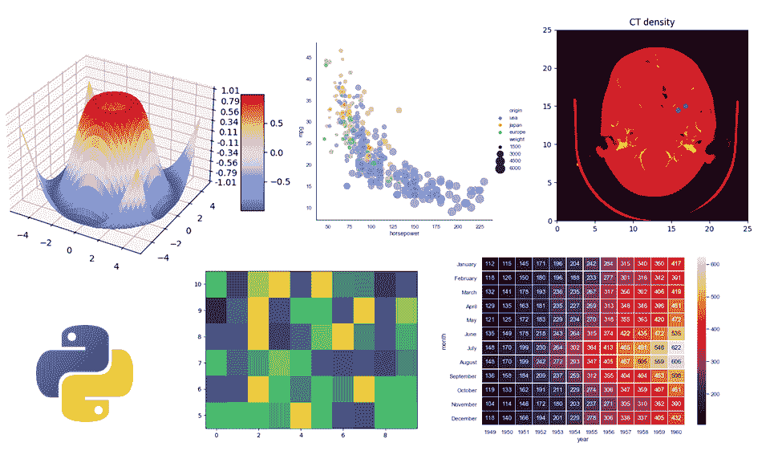
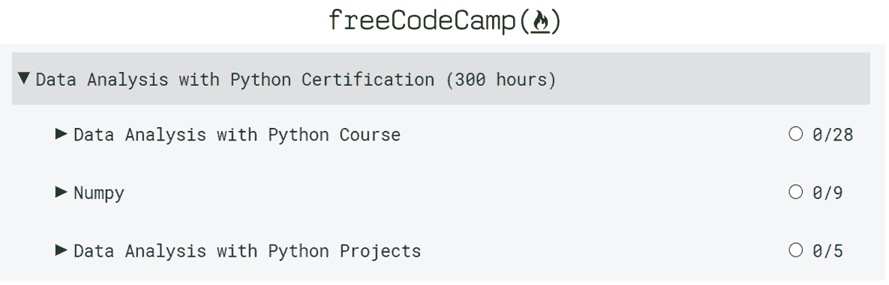
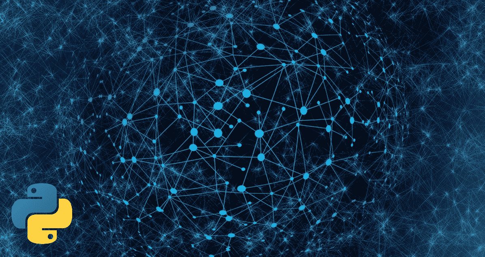
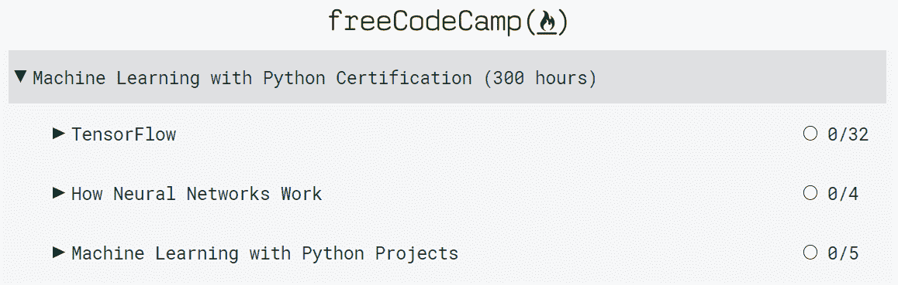
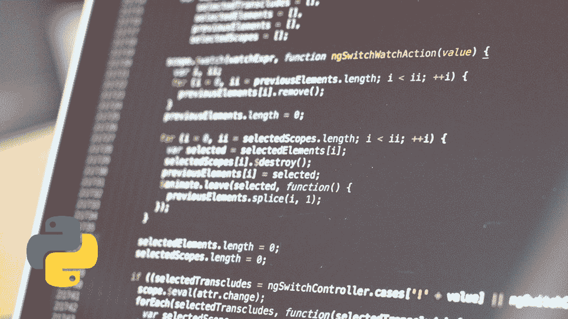
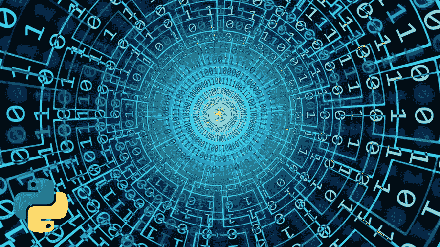
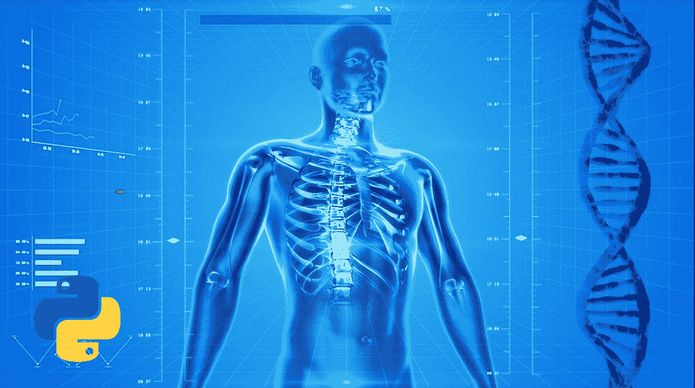
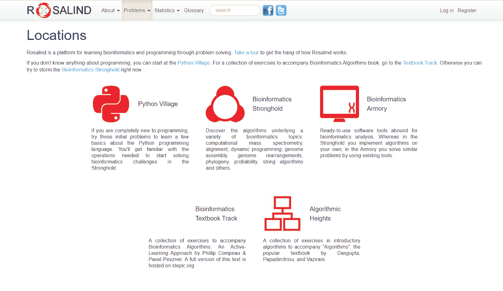
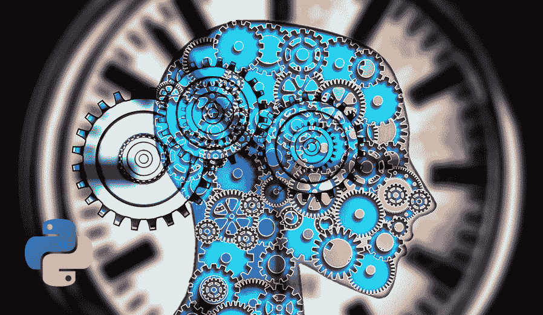
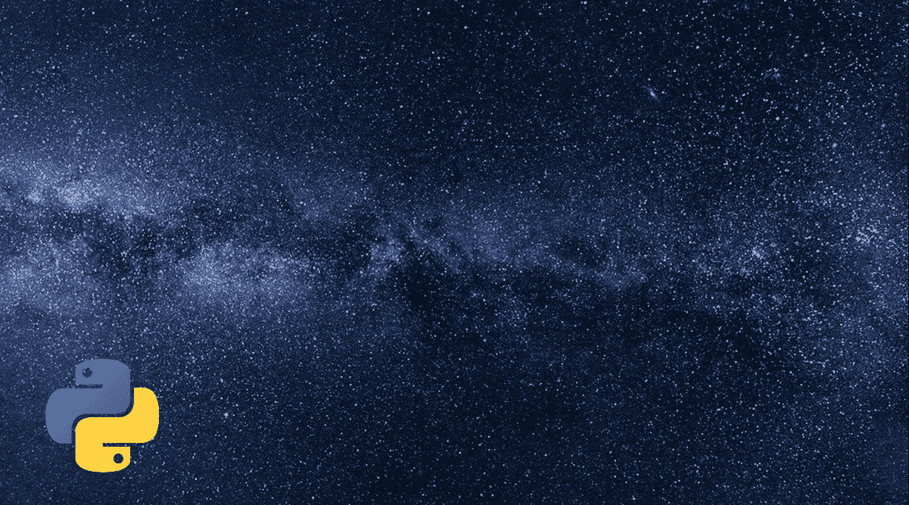

# Python 是用来做什么的？Python 编程语言的 10 多种编码用途。

> 原文：<https://www.freecodecamp.org/news/what-is-python-used-for-10-coding-uses-for-the-python-programming-language/>

## 🔹欢迎

嗨！请花点时间思考这个问题:

**Python 在现实场景中是如何应用的？**

如果你正在学习 Python，你想知道答案，那么这篇文章就是为你准备的。

对这种编程语言的应用和巨大潜力有一个清晰的概念会给你在整个旅程中需要的动力。

让我们开始吧！✨

## 🔸真实场景中的 Python

Python 几乎应用于你能想象到的每个行业和科学领域，包括:

*   数据科学。
*   机器学习。
*   网络开发。
*   计算机科学教育。
*   计算机视觉和图像处理。
*   游戏开发。
*   医学和药理学。
*   生物学和生物信息学。
*   神经科学和心理学。
*   天文学。
*   其他领域，如机器人、自动驾驶汽车、商业、气象学和图形用户界面(GUI)开发。

本文通过示例、用例以及 Python 库，涵盖了这种编程语言在这些行业中的广泛应用。让我们从 Python 在数据科学中的应用开始。

## 🔹数据科学:分析和可视化

Sample data visualizations from the [Matplotlib](https://matplotlib.org/) and [Seaborn](https://seaborn.pydata.org/examples/index.html) galleries

或许 Python 最受欢迎的应用之一是数据科学。为数据分析和可视化开发的 Python 库的能力是惊人的。我们来看看为什么。

### 数据科学应用

使用 Python 数据可视化库，您可以创建各种各样的绘图和可视化表示，例如:

*   线条、条形和标记。
*   图像、轮廓和字段。
*   支线剧情，轴和人物。
*   统计数据(箱线图、条形图和直方图)。
*   饼图和极坐标图。
*   三维绘图。
*   还有更多！

根据您选择使用的包或库，您可以向绘图添加文本、标签、注释、颜色、形状、集合、动画和交互性。

**💡提示:**在上图中，你可以看到一些用 Python 生成的数据可视化的例子。

### 库和包

让我们看看在数据科学中使用 Python 的一些最流行的包和库:

### 用于数据分析的 Python

*   这个包被描述为“用 Python 进行科学计算的基础包”。根据这个软件包的官方网站，“几乎每一个从事 Python 工作的科学家都利用了 NumPy 的力量。”
*   Pandas :是“一个快速、强大、灵活且易于使用的开源数据分析和操作工具。”

### 用于数据可视化的 Python

*   Matplotlib :是一个“用于在 Python 中创建静态、动画和交互式可视化的综合库。”如果你想知道你能用这个库做什么，去看看[范例库](https://matplotlib.org/gallery/index.html)。
*   [Seaborn](https://seaborn.pydata.org/) :是“一个基于 matplotlib 的 Python 数据可视化库。”如果你想知道你能用这个库做什么，去看看[范例库](https://seaborn.pydata.org/examples/index.html)。
*   ggplot2 :是“一个基于图形语法的声明式创建图形的系统”。根据它的官方网站:“你提供数据，告诉 ggplot2 如何将变量映射到美学，使用什么图形原语，它会处理细节。”
*   [Bokeh](https://bokeh.org/) :是“现代网络浏览器的交互式可视化库”。
*   [熊猫](https://pandas.pydata.org/):**这个库有很多数据可视化的工具。**

### 学习资源

如果你想学习使用 Python，Jupyter 笔记本，Numpy，Pandas，CSV 文件，数据框等等的数据分析和可视化，你可以从 [freeCodeCamp 的](https://www.freecodecamp.org/learn)免费的**数据分析带 Python 认证**开始你的旅程:

Screenshot of the certification in freeCodeCamp's curriculum. 

在认证过程中，您将参与并完成以下项目:

*   均值-方差-标准差计算器。
*   人口统计数据分析器。
*   医疗数据可视化工具。
*   页面视图时间序列可视化工具。
*   海平面预测器。

freeCodeCamp 的 YouTube 频道也有这些很棒的免费教程让你入门:

*   [Python 数据分析——初学者完整教程(Numpy、Pandas、Matplotlib、Seaborn)](https://www.freecodecamp.org/news/learn-data-analysis-with-python-course/) 作者 Santiago Basulto。
*   [用于数据科学的 Python 通过数据发布了解 Pandas、Matplotlib、Numpy 和更多内容](https://www.freecodecamp.org/news/python-data-science-course-matplotlib-pandas-numpy/)
*   基思·加利的 Matplotlib 速成班
*   Keith Galli 为初学者编写的 Python NumPy 教程

此外，如果您想了解如何使用这些库，这些资源也很有帮助:

*   Matplolib 教程:免费的入门、中级和高级教程，教你如何创建令人惊叹的可视化效果。
*   [熊猫“入门”板块:](https://pandas.pydata.org/docs/getting_started/index.html)免费入门教程。
*   NumPy Learn section :帮助你入门的外部资源精选。

## 🔸机器学习

对于每一个想进入机器学习这个迷人领域的开发者来说，Python 都是一个必不可少的工具。我们来看看机器学习的简介。

### 什么是机器学习？

机器学习是计算机科学的一个领域，它创造了能够自主学习的系统。

这种类型的系统使用基于输入数据不断改进的算法，帮助系统“学习”。它学习如何通过基于先前的知识在新的场景中产生适当的输出来自主地响应新的场景。

这些系统最令人惊奇的一点是它们在不断改进。

它们不像我们通常在 Python 脚本中编写的程序，我们在脚本中指定程序可以采取的每一个可能的动作。在机器学习中，系统被训练为“思考”，并根据先前的知识做出决策。

这就是为什么我们说机器从数据中“学习”。

**💡提示:**这是 Google 的一个有趣的演讲:[机器学习零到英雄(Google I/O'19)](https://www.youtube.com/watch?v=VwVg9jCtqaU) 。

### 神经网络:机器学习的基石

神经网络是系统的处理单元。他们试图模拟真实的大脑神经元网络。这些虚拟“神经元”接收输入，学习如何处理输入，并基于它们先前的知识生成输出。

这与我们的大脑每天每时每刻都在做的事情非常相似。

由于神经网络，机器学习算法可以学习如何根据先前的知识从给定的输入预测预期的输出。

例如，当你在 YouTube 上看到推荐的视频时，那些推荐是由神经网络生成的，神经网络根据你以前的模式预测你可能喜欢看什么视频。很神奇，对吧？

**💡提示:**这是[谷歌的一篇有趣的文章](https://static.googleusercontent.com/media/research.google.com/en//pubs/archive/45530.pdf)，如果你想了解更多关于 YouTube 的例子。

### Python 和机器学习

我相信你一定在问:Python 在这方面的作用是什么？它是用来对这种类型的系统进行编程的最流行和最强大的工具之一。

世界各地的开发人员使用 Python 进行机器学习的最流行的库之一是 **TensorFlow** 。这是一个由谷歌大脑团队开发的免费开源库。这个库用于谷歌的研究和生产。

根据谷歌人工智能部门负责人杰夫·迪恩的说法:

> 今天，它在我们的语音识别系统、新的谷歌照片产品 Gmail 和谷歌搜索中被大量使用。([来源](https://www.youtube.com/watch?v=oZikw5k_2FM))

最棒的是，全世界的开发人员都可以使用这个库来解决现实世界中的问题。

**💡提示:**这是一个由谷歌制作的关于 TensorFlow 的[视频。](https://www.youtube.com/watch?v=oZikw5k_2FM)

这是另外两个用于机器学习的流行 Python 库:

*   Keras——用 Python 编写的开源神经网络库。
*   [py torch](https://pytorch.org/)——一个开源的机器学习库，用于开发和训练神经网络。

### Python 中的机器学习项目

机器学习的潜力真的是无穷无尽。它可以适用于你能想到的几乎任何领域和背景。如果任务需要从模式中学习并预测输出，那么机器学习模型肯定会有所帮助。

例如，为了让你了解你可以创建的项目类型， [freeCodeCamp 的](https://www.freecodecamp.org/learn)课程包括一个免费的**机器学习和 Python 认证**:

Certification in freeCodeCamp's curriculum

在认证过程中，您将参与并完成以下项目:

*   石头剪刀布。
*   猫狗图像分类器。
*   使用 K 近邻的图书推荐引擎。
*   线性回归健康成本计算器。
*   神经网络短信分类器。

### 更多真实世界应用的例子

你可以在谷歌旗下的“数据科学家和机器学习实践者在线社区”Kaggle 中找到更多机器学习应用的例子。

在这个平台中，您可以通过从事项目和参加比赛来练习您的 Python 和机器学习技能。

为了让您了解可以用机器学习解决的项目类型，Kaggle 以前的比赛包括:

*   预测肺功能下降。
*   预测泰坦尼克号上的幸存者。
*   建立鸟类种群监测工具。
*   标记著名的地标。
*   预测新冠肺炎利差。
*   估计沃尔玛零售商品的单位销售额。
*   识别带有面部或声音操作的视频。
*   预测主要城市路口的等待时间。
*   从客户交易中检测欺诈。
*   预测电影的全球票房收入。
*   预测宠物收养。
*   当飞行员注意力分散、困倦或处于其他危险的认知状态时，识别风险。

正如您所看到的，在这个简短的项目列表中，应用范围从医学到商业，从生物学到风险检测，从欺诈检测到图像处理。当你使用机器学习解决现实世界的问题时，可能性真的是无穷无尽的。

### 学习资源

freeCodeCamp 的 YouTube 频道有这些有用的教程，可以帮助你开始学习 Python 中的机器学习:

*   [TensorFlow 2.0 完整教程- Python 神经网络初学者教程](https://www.freecodecamp.org/news/massive-tensorflow-2-0-free-course/)
*   [开发一个 AI 玩 Connect 四- Python 教程](https://www.freecodecamp.org/news/python-connect-four-artificial-intelligence/)
*   [Scikit-Learn 教程 Python 中的机器学习教程](https://www.freecodecamp.org/news/machine-learning-with-scikit-learn-full-course/)
*   [深度学习 PyTorch 完整课程/教程](https://www.freecodecamp.org/news/pytorch-full-course/)

## 🔹Web 开发

Python 用于 web 开发领域，构建 web 应用的后端。让我们从谈论一下什么是后端以及它如何帮助我们创建 web 应用程序开始这一部分。

### Python 用于后端 Web 开发

在 web 应用程序中，所有用于与用户交互并创建用户所看到的内容的代码称为应用程序的前端部分。

Python 用于编写应用程序的幕后功能，这一部分为应用程序的所有功能提供动力，但您无法在屏幕上直接看到。

它处理应用程序的服务器端，当用户请求数据时与所有必要的数据库进行交互。它将请求的数据返回给用户，使应用程序按预期运行。

**💡提示:**全栈 web 开发包括 Web 应用程序的前端和后端，以使用户在使用数据库时可以看到它。

### Web 框架

以下是一些流行的 Python web 框架:

*   Django :一个“鼓励快速开发和干净、实用设计的高级 Python Web 框架。”
*   Flask :一个非常流行的微框架，用于用 Python 开发 web 应用程序。
*   [金字塔](https://trypyramid.com/):一个“小型、快速、实用的 Python web 框架。”
*   [Web2Py](http://www.web2py.com/) :一个“免费的开源全栈框架，用于快速开发快速、可伸缩、安全和可移植的数据库驱动的基于 Web 的应用程序。”
*   一个“快速、简单和轻量级的用于 Python 的 WSGI 微型 web 框架”

### 学习资源

freeCodeCamp 的 YouTube 频道有很棒的免费教程来学习 Python 的 web 开发:

*   [Python Django Web 框架-初学者完整课程](https://www.freecodecamp.org/news/python-django-course/)
*   [学习 Python 的 Flask-Full 教程](https://www.freecodecamp.org/news/learn-flask-for-python-full-tutorial/)
*   [用 Flask 进行 Web 编程-计算机科学导论-哈佛的 CS50 (2018)](https://www.freecodecamp.org/news/learn-web-programming-with-flask-from-harvards-cs50/)
*   [全栈 Python Flask 教程——建立社交网络](https://www.freecodecamp.org/news/full-stack-python-flask-tutorial-build-a-social-network/)

这些也是学习如何使用这些框架的很好的免费资源:

*   [Django“第一步”部分](https://docs.djangoproject.com/en/3.0/#first-steps)
*   [金字塔教程](https://docs.pylonsproject.org/projects/pyramid-tutorials/en/latest/)
*   [金字塔快速教程](https://docs.pylonsproject.org/projects/pyramid/en/latest/quick_tutorial/index.html)

## 🔸计算机科学教育

Python 目前在全世界的计算机科学教育中发挥着关键作用。我们来看看为什么。

### 为什么是 Python？

Python 被广泛用作教学工具是因为:

*   **易学:**其语法简单，学起来很快。与其他编程语言相比，学生开始更快地投入到计算机科学的更高级的方面。
*   它功能强大:它用于现实世界的应用中，因此学生们立即开始获得对他们的职业生涯有价值的技能。
*   **它是通用的:**它支持包括命令式编程、函数式编程、过程式编程、面向对象编程在内的各种编程范式。

Python 语言的创造者[吉多·范·罗苏姆](https://es.wikipedia.org/wiki/Guido_van_Rossum)说:

> 现在，我相信 Python 比同时教学生编程和教他们 C 或 C++或 Java 要容易得多，因为语言的所有细节都要困难得多。

Python 的语法简单明了，因此学生可以更快地开始学习计算思维和解决问题的技能，这通常是计算机科学入门课程的主要目标。

### Python 在课堂和在线学习中的应用

世界上许多大学和学校已经决定使用 Python 来教授入门编程和计算机科学课程。

例如，麻省理工学院是世界上技术领域领先的大学之一，它使用 Python 教授计算机科学和编程入门课程(在 edX 上的校园版和在线版课程中都有)。

根据麻省理工学院新闻发表的一篇[文章，当该课程的在线版本达到 120 万注册人数时，该课程“已经成为麻省理工学院历史上最受欢迎的 MOOC”。](http://news.mit.edu/2018/first-mitx-mooc-reaches-enrollment-milestone-0830)

这清楚地表明 Python 的受欢迎程度持续上升。在本文中，您可以找到学习 Python 的学生的证词，以及这些新知识如何改善了他们的生活。

在这篇文章中，麻省理工学院 EECS 系讲师安娜·贝尔教授指出:

> “6.00 系列的核心是教授计算思维...它使用 Python 编程语言来实现这一点，但该课程也教授可以应用于任何其他编程语言的编程概念。”

这清楚地显示了 Python 作为教学工具的潜力。它可以用来教授适用于其他编程语言的高级概念。

它这样做没有额外的复杂性，其他编程语言如 Java 或 C 的语法可能会增加学习过程。

在过去的几年里，在线课程已经成为全世界各年龄段学习者日常生活的重要组成部分。在过去的几年里，免费在线课程和资源的种类急剧增加。

例如， [freeCodeCamp 的](https://www.freecodecamp.org/learn)课程包括三个免费证书和项目，帮助您在全球高需求的关键领域拓展 Python 技能:

*   用 Python 进行科学计算。
*   用 Python 进行数据分析。
*   用 Python 进行机器学习。

[哈佛大学](https://online-learning.harvard.edu/catalog?keywords=&subject%5B%5D=3&paid%5B1%5D=1&max_price=&start_date_range%5Bmin%5D%5Bdate%5D=&start_date_range%5Bmax%5D%5Bdate%5D=)也提供这些可以免费旁听的在线课程:

*   CS50 计算机科学导论。
*   CS50 的用 Python 和 JavaScript 的 Web 编程。
*   CS50 用 Python 介绍人工智能。

Python 无疑已经成为改善全球计算机科学教育的关键工具。而且今后还会继续这样做。

如果你正在考虑用 Python 来教授一门课程或者学习 Python，我保证你的时间和努力是完全值得的。

## 🔹计算机视觉和图像处理

Python 用于计算机视觉和图像处理，这些领域正在迅速发展。

图像处理的目标是处理图像，对其应用变换，并返回原始图像的新版本。

相比之下，计算机视觉的目标更复杂，因为它试图让计算机理解和解释图像及其内容。

### 图像处理

先说图像处理。使用 Python 库，您可以执行如下操作:

*   裁剪、翻转和旋转。
*   操纵曝光和颜色通道。
*   检测边缘和线条。
*   添加滤镜和恢复图像。

### 计算机视觉

现在让我们深入研究计算机视觉。如果你开始研究这个话题，你可能会对它目前的应用感到惊讶。其中一些是:

*   导航。
*   对象和事件检测。
*   面部识别。
*   图像分类。

这一科学领域如此重要，以至于谷歌开发了一个名为[云视觉](https://cloud.google.com/vision?hl=es)的工具，它有一个 Python 版本，供开发人员将这一功能纳入他们的程序。

根据 Google Codelabs 中的“[使用 Python 的视觉 API](https://codelabs.developers.google.com/codelabs/cloud-vision-api-python/index.html?index=..%2F..index#0)”教程，Google 云视觉 API:

> 允许开发人员在应用中轻松集成视觉检测功能，包括图像标记、人脸和地标检测、光学字符识别(OCR)和明确内容的标记。

这套工具提供了人脸检测、地标检测、徽标检测、标签检测、文本检测等功能。

💡**提示:**计算机视觉最惊人的应用之一是开发控制自动驾驶汽车的软件。这些车辆需要“看到”自己行驶在哪里，车道在哪里，周围有什么物体(包括其他车辆)。计算机视觉在这一功能中起着关键作用。

### Python 库

这些是一些非常棒的计算机视觉和图像处理库:

*   [OpenCV](https://opencv.org/about/) :一个“开源的计算机视觉和机器学习软件库”。它的 Python 版本叫做 OpenCV-Python。
*   [scikit-image](https://scikit-image.org/) :一个“用于图像处理的算法集合”。
*   [NumPy](https://numpy.org/) :可以用来把一个图像的像素处理成 2D 数组。
*   [SciPy](https://www.scipy.org/):[SciPy . ndimage](https://docs.scipy.org/doc/scipy/reference/ndimage.html#module-scipy.ndimage)包“包含了多维图像处理的各种函数”

## 🔸游戏开发

游戏无疑塑造了生活，创造了永恒的记忆。在未来的岁月里，他们将继续是我们社会的一部分。Python 已经在那里，点燃了游戏创作的火花。

### Python 游戏开发框架

根据[官方 Python 文档](https://www.python.org/community/sigs/current/edu-sig/#game-time)，有两种主要的 Python 框架用于开发游戏:

*   pygame :“使用 Python 进行游戏开发的原始且非常活跃的包。它允许 Python 与 [SDL](http://www.libsdl.org/index.php) 对话，这是一个跨平台的多媒体库。因为它需要针对每个平台和每个 Python 版本进行编译，所以当新的 Python 版本出现时，可能会有一个滞后。”
*   [pyglet](http://pyglet.org/) :这是“新人，基于 OpenGL。因为它是一个纯 Python 包，所以即使发布了新的 Python 版本，也可以按原样使用(Python 2 到 Python 3 的过渡除外)。”

你也可以使用[海龟](https://docs.python.org/3/library/turtle.html)模块来创建简单的游戏。Turtle 是一个内置的 Python 模块，当你在电脑上安装 Python 的时候会自动安装。它帮助你用简单的图形和简单的用户界面创建游戏。

### 学习资源

如果你想学习 Python 游戏开发，freeCodeCamp 的 YouTube 频道有这些很棒的免费教程:

*   [通过构建五个游戏学习 Python 全程](https://www.freecodecamp.org/news/learn-python-by-building-5-games/)
*   [Python 和 Pygame 教程——搭建俄罗斯方块！完整的游戏开发课程](https://www.freecodecamp.org/news/tetris-python-tutorial-pygame/)
*   [贪吃蛇游戏 Python 教程](https://www.freecodecamp.org/news/snake-game-python-tutorial/)

## 🔹医学和药理学

Python 在医学领域也有惊人的应用。你会惊讶于技术是如何与医学知识相结合，为病人提供准确有效的诊断和治疗。

### 应用程序

在医学和药理学中使用 Python 的一些例子包括:

*   根据患者的病历和症状进行临床诊断。
*   分析医疗数据。
*   制作计算模型以加速新药开发的进程。

这些广泛的应用包括世界各地成千上万的例子。我选择了其中的一些来说明 Python 是如何塑造这个领域的。让我们来看看它们。

### 制药业的成功故事:阿斯利康

根据官方 Python 文档显示，世界领先的制药公司之一[阿斯利康](https://www.astrazeneca.com/)使用 Python 来改进他们现有的计算模型，使其“更加健壮、可扩展和可维护”。

研究人员利用这些模型模拟分子的化学结构及其在体内的作用。这有助于科学家识别新药的潜在分子，并开始在实验室更快地测试它们。

当 Andrew Dalke 加入团队时，他是“计算化学和生物学中 Python 的著名倡导者”，他让团队相信 Python 正是他们所需要的。

> 选择 Python 来做这项工作是因为它是物理科学家可以使用的最好的语言之一，也就是说，对于没有计算机科学背景的人来说。

他指出:

> Python 是为解决专业程序员面临的现实问题而设计的。结果是一种语言，从化学家编写的小脚本到软件开发人员编写的大软件包都可以很好地扩展。

很神奇，对吧？Python 可以为制药实验室用来开发新药的计算模型提供动力。

### 红细胞(RBC)识别

Python 的另一个有趣的医学应用与血液学有关。通常，专业人员通过人工计数和识别细胞来分析血液测试，但这可以在自动化的帮助下得到改善。

研究人员发现 Python 可能是这项工作的合适工具。让我们看一个有趣的项目。

**[IdentiCyte](https://www.sciencedirect.com/science/article/pii/S2352711018301377#!)**
这个项目的目标是根据光学显微镜拍摄的图像对红细胞形状进行识别和分类。根据这篇文章中的[，“红细胞形状有助于诊断白血病、镰状细胞性贫血和疟疾等疾病和紊乱。”](https://www.sciencedirect.com/science/article/pii/S2352711018301377#!)

该项目由澳大利亚生物资源加工研究所的研究人员开发。它是用 Python 编程的，使用了图像处理 Python 包和库，如 numpy、scipy、opencv-python、scikit-learn 和 matplotlib。

### Python 医疗包

*   [pyGeno](https://pypi.org/project/pyGeno/) :由免疫学和癌症研究所( [IRIC](http://www.iric.ca/) )的 Tariq Daouda 开发的开源 Python 包。它旨在用于“围绕基因组学和蛋白质组学的精确医学应用”。它与参考和个性化基因组一起工作。
*   [MedPy](https://pypi.org/project/MedPy/) :一个开源的 Python 库，“用于 Python 中的医学图像处理，提供基本的功能来读取、写入和操作任意维度的大图像。”

### 真实世界的医疗应用(示例)

*   Gusztav Belteki 在柏林 PyData 的演讲中提出了另一个例子"[医学中的 Python:分析来自机械呼吸机的数据](https://www.youtube.com/watch?v=BZbGyQqQIe8)"他的研究目标是“解释从新生儿重症监护、机械通气和病人监护仪中使用的现代设备中检索到的大型数据集。”
*   在 PyCon 2019 上，Jill Cates 发表了题为“[如何用 Python 建立临床诊断模型](https://www.youtube.com/watch?v=9J83Pp9qH5w)”的演讲

## 🔸生物学和生物信息学

Python 在生物学和生物信息学领域也有惊人的应用。这些包括处理 DNA 序列，模拟种群动力学和遗传学，以及模拟生化结构。

### 生物 python

[Biopython](https://biopython.org/wiki/Documentation) 是一个 python 框架，拥有“生物计算的免费可用工具”。它的目标是“解决当前和未来生物信息学工作的需求”

根据其[文档](http://biopython.org/DIST/docs/tutorial/Tutorial.html)，该框架包括如下功能:

*   处理序列并对其执行常见操作，如转录、翻译和权重计算。
*   连接生物数据库。
*   使用 K 近邻、朴素贝叶斯和支持向量机对数据进行分类。
*   研究系统进化树和群体遗传学。

[文档](http://biopython.org/DIST/docs/tutorial/Tutorial.html)声明“Biopython 的目标是通过创建高质量、可重用的模块和类，尽可能容易地将 python 用于生物信息学。”

### 罗莎琳德:通过解决生物信息学挑战实践 Python

Rosalind 是“一个通过解决问题来学习生物信息学的平台。”它是“免费向公众开放的”(FAQ 页面表明它处于测试模式)。

Python 可以用来解决平台上的挑战。由于这是平台中非常流行的编程语言，因此有一个“ [Python Village](http://rosalind.info/problems/list-view/?location=python-village) ”部分，在这里，您可以在处理生物信息学算法之前学习 Python 的基础知识。

用户通过在他们的计算机上运行他们的解决方案，处理给定的数据集，并复制/粘贴输出以检查答案来解决问题。

💡**提示:**这个项目的名字是为了纪念[罗莎琳德·富兰克林](http://en.wikipedia.org/wiki/Rosalind_Franklin)，“他和雷蒙德·高斯林的 X 射线晶体学帮助沃森和克里克发现了 DNA 双螺旋结构”。

### 包和框架

*   ProDy :匹兹堡大学 Bahar 实验室开发的免费开源软件包“用于蛋白质结构动力学分析”。
*   [PySB](http://pysb.org/) **:** 由范德比尔特大学洛佩兹实验室和哈佛医学院索格实验室的成员开发的“将生化系统的数学模型构建为 Python 程序的框架”。
*   [社区模拟器:](https://www.ncbi.nlm.nih.gov/pmc/articles/PMC7092969/)这是一个“免费提供的 Python 包，用于以可重复、透明和可扩展的方式模拟微生物种群动态”，由波士顿大学的研究人员开发。

**💡提示:**如果你想了解更多关于 Python 在生物信息学中的应用，这里有 Martin Schweitzer 在澳大利亚 PyCon 上的演讲:“ [Python 对于学习 Python 的生物信息学](https://www.youtube.com/watch?v=uWWoRa8thN0&list=PL-4XVpiAbrw-hdZCYo6IVYUK4ScRaMDiz&index=21&t=0s)”。

## 🔹神经科学和心理学

Python 在神经科学和实验心理学研究中也有应用。

### 神经科学中的 Python

根据瑞士日内瓦洛桑联邦理工学院大脑模拟中心的研究人员撰写的文章[神经科学中的 Python](https://www.ncbi.nlm.nih.gov/pmc/articles/PMC4396193/):

> 对于数据采集和分析、自动化以及通过建模和模拟进行假设检验而言，计算在所有科学中都变得至关重要。

关于 Python，他们声明:

> 2007 年，我们清楚地意识到，我们正处于神经科学生态系统中一条新兴的巨蟒的尖端，特别是在计算神经科学和神经成像领域，但也包括电生理数据分析和心理物理学领域。

如你所见，Python 和计算已经扩展到了所有科学领域。

### 精神病患者

[PsychoPy](https://www.psychopy.org/about/overview.html) 是诺丁汉大学支持的“用 Python 运行实验的开源包”。根据此包的官方[文档](https://www.psychopy.org/about/overview.html):

> 它被世界各地的许多实验室用于心理物理学、认知神经科学和实验心理学。

该套餐官网声明为:

*   便于学习。
*   对心理物理学来说足够精确。
*   灵活。
*   在线或基于实验室，取决于用户的选择。

## 🔸天文学

Python 在天文学和天体物理学中也有应用。让我们来看看这个科学领域中使用的三个主要 Python 包:

### 天文望远镜

Astropy 包“包含各种类、实用程序和一个打包框架，旨在提供常用的天文学工具。”

Astropy 是一个更大的项目 Astropy Project 的一部分，该项目“是一个社区努力，以 Python 开发一个公共的天文学核心包，并培养一个可互操作的天文学包的生态系统。”

根据它的[关于](https://www.astropy.org/about.html)页面，它的目标之一是“提高可用性、互操作性和天文学 Python 包之间的协作。”

**💡提示:**你可以在[范例图库](https://docs.astropy.org/en/stable/generated/examples/index.html)中看到用 Astropy 制作的项目范例。

### 快活的

SunPy 包被描述为“社区开发的、免费的、开源的 Python 太阳能数据分析环境。”它基于 Python 包的功能，如 NumPy、SciPy、Matplotlib 和 Pandas。

Images from the [Example Gallery](https://docs.sunpy.org/en/stable/generated/gallery/index.html) of SunPy

### 不切实际的

SpacePy 包是“Python 的一个包，以空间科学为目标，旨在使基本数据分析、建模和可视化更容易。”

根据其官方[文档](https://github.com/spacepy/spacepy#spacepy):

> SpacePy 项目旨在通过为代码开发提供一个开放的环境来促进准确和开放的研究标准。

根据其 [GitHub 库](https://github.com/spacepy/spacepy)的描述，它具有叠加历元类、漂移壳追踪、获取磁场模型、流线追踪、引导置信限、时间和坐标转换等等。

## 🔹其他应用

Python 还可以应用于许多其他领域，包括:

*   **机器人学:** Python 可以用来给机器人编程。为此编写的一个库是 [pybotics](https://pypi.org/project/pybotics/) ，“一个用于机器人运动学和校准的开源 Python 工具箱”。
*   **自动驾驶汽车:** Python 可以用来编写控制自动驾驶汽车的软件。这些汽车需要计算机视觉来“看到”它们行驶在哪里，车道在哪里，以及它们周围有什么物体。
*   **气象学**:软件包[气候指数](https://pypi.org/project/climate-indices/)“包含各种气候指数算法的 Python 实现，这些算法提供了对气候监测和研究有用的降水和温度异常严重性的地理和时间图像。”
*   **商业:** Python 可以成为分析商业产生的数据和预测未来趋势的强大工具。
*   **图形用户界面(GUI)开发** : Python 可以用来通过 [tkinter](https://docs.python.org/3.8/library/tkinter.html#module-tkinter) 等工具创建图形用户界面。
*   如果你有兴趣了解更多这方面的知识，freeCodeCamp 在 YouTube 上有一个很棒的教程: [Tkinter 课程——在 Python 教程中创建图形用户界面。](https://www.freecodecamp.org/news/learn-how-to-use-tkinter-to-create-guis-in-python/)

## 🔸概括起来

在你能想象到的每个领域，Python 都有很多应用。我希望这篇文章能让您了解这种编程语言在当前塑造我们世界的行业中的广泛实际应用。

请记住，无论你是在哪个领域，或者你想在哪个领域，学习 Python 一定会为你打开很多扇门。它会一直留在这里。它已经改变和改善了我们当前的世界，并将继续这样做很多年。

我真的希望你喜欢我的文章，并发现它很有帮助。 [查看我的在线课程](https://www.udemy.com/user/estefania-cn/)。在推特上关注我。⭐️