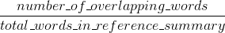
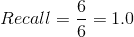
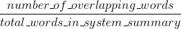
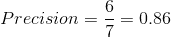
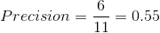
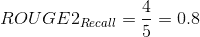
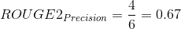

# 介绍 ROUGE，以及如何使用它来评估摘要

> 原文：<https://www.freecodecamp.org/news/what-is-rouge-and-how-it-works-for-evaluation-of-summaries-e059fb8ac840/>

作者:卡维塔·加内桑


# 介绍 ROUGE，以及如何使用它来评估摘要

ROUGE 代表面向回忆的替角，用于 Gisting 评估。它本质上是一套评估文本自动摘要和机器翻译的标准。

它的工作原理是将一个自动生成的概要或**翻译**与一组**参考概要**(通常是人工生成的)进行比较。假设我们有以下系统和参考摘要:

**系统总结(机器生产的内容):**

```
the cat was found under the bed
```

**参考摘要(黄金标准——通常由人类完成):**

```
the cat was under the bed
```

如果我们只考虑单个单词，则系统摘要和参考摘要之间的重叠单词数是 6。然而，这并不能告诉你多少度量标准。为了得到一个好的量化值，我们实际上可以使用重叠来计算**精度**和**召回**。

简单来说，召回(在 ROUGE 的上下文中)指的是**参考概要*****系统概要**中有多少是恢复或捕获的。如果我们只考虑单个单词，它可以计算为:*

**

*在本例中，召回将会是:*

**

*这意味着**参考摘要**中的所有单词已经被**系统摘要**捕获，这确实是本例的情况。瞧啊。*

*这对于文本摘要系统来说看起来非常好。但是它没有告诉你故事的另一面。机器生成的摘要(系统摘要)可能非常长，会捕获参考摘要中的所有单词。但是，系统摘要中的许多单词可能是无用的，使得摘要不必要地冗长。*

*这就是精确度发挥作用的地方。就精确度而言，您实际测量的是，**系统摘要中有多少是实际相关的或需要的**？精度的测量方法是:*

**

*在本例中，精度为:*

**

*这仅仅意味着系统摘要中的 7 个单词中的 6 个实际上是相关的或需要的。如果我们有下面的系统摘要，与上面的例子相反—

**系统摘要 2:***

```
*`the tiny little cat was found under the big funny bed`*
```

*精度现在变为:*

**

*现在，这看起来不太好，是吗？那是因为我们在总结中有相当多的不必要的话。当您试图生成本质上简洁的摘要时,**精度**方面变得非常重要。因此，最好是同时计算**精度**和**召回**，然后报告 **F-Measure** 。*

*如果你的摘要在某种程度上通过一些约束而被迫变得简洁，那么你可以考虑只使用 **recall，**，因为在这种情况下精确度不太重要。*

*ROUGE-N、ROUGE-S 和 ROUGE-L 可以被认为是在系统摘要和参考摘要之间进行比较的文本的粒度。*

*   *ROUGE-N-measures**unigram**， **bigram** ， **trigram** 与高阶 n-gram 重叠*
*   *ROUGE-L-使用 LCS 测量单词的最长匹配序列。使用 LCS 的一个优点是它不需要连续的匹配，而是需要反映句子级单词顺序的顺序匹配。因为它自动包含最长的序列中常见的 n 元文法，所以您不需要预定义的 n 元文法长度。*
*   *ROUGE-S——是一个句子中任意一对单词的顺序，允许任意的间隔。这也可以称为跳格并发。例如， **skip-bigram** 测量单词对的重叠，单词对之间最多可以有两个间隙。例如，对于短语*“戴帽子的猫”*，跳过二元模型将是*“猫在，猫在，猫帽子，在，在帽子，帽子”。**

*例如， **ROUGE-1** 是指系统摘要和参照摘要之间的 ***unigrams*** 重叠。 **ROUGE-2** 是指 ***二元模型*** 在系统和参考汇总之间的重叠。*

*让我们以上面的例子为例。假设我们想要计算 **ROUGE-2 精度，并回忆**分数。*

***系统总结:***

```
*`the cat was found under the bed`*
```

***参考摘要:***

```
*`the cat was under the bed`*
```

***系统概要二元模型:***

```
*`the cat, cat was, was found, found under, under the, the bed`*
```

***参考摘要二元模型:***

```
*`the cat, cat was, was under, under the, the bed`*
```

*基于以上二元模型，ROUGE-2 召回如下:*

**

*实际上，系统摘要已经从参考摘要的 5 个二元模型中恢复了 4 个二元模型，这相当不错！现在胭脂-2 的精度如下:*

**

*这里的精度告诉我们，在所有的系统摘要二元模型中，有 67%与参考摘要重叠。这也不算太差。请注意，随着摘要(系统摘要和参考摘要)越来越长，重叠的二元模型会越来越少。在抽象概括的情况下尤其如此，在这种情况下，你不能直接重用句子来进行概括。*

*使用 ROUGE-1 超过或结合 ROUGE-2(或其他更细粒度的 ROUGE 度量)的原因是为了显示摘要或翻译的流畅性。直觉告诉我们，如果你更严格地遵循参考摘要的词序，那么你的摘要实际上会更流畅。*

*关于这些评价指标的更深入的信息，可以参考[林的论文](http://www.aclweb.org/anthology/W04-1013)。使用哪种度量取决于您试图评估的特定任务。如果您正在处理具有相当冗长的系统和参考摘要的摘要，那么使用 ROUGE-1 和 ROUGE-L 可能是有意义的。对于非常简洁的摘要，单独使用 ROUGE-1 可能就足够了，尤其是如果您还应用了词干和停用词删除。*

### *要阅读的文件*

*   *[ROUGE:一个用于自动评估摘要的包](http://www.aclweb.org/anthology/W04-1013)*