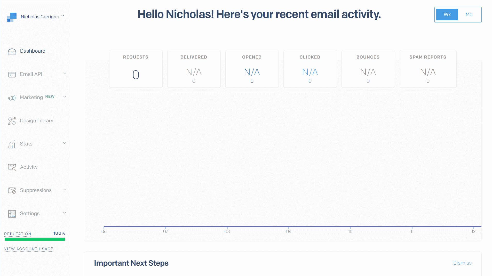
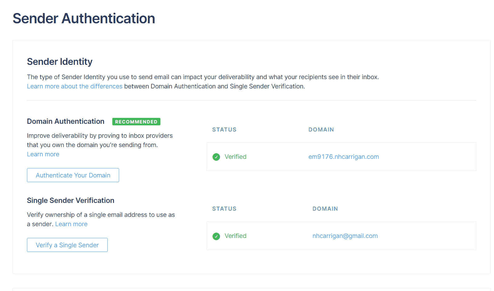
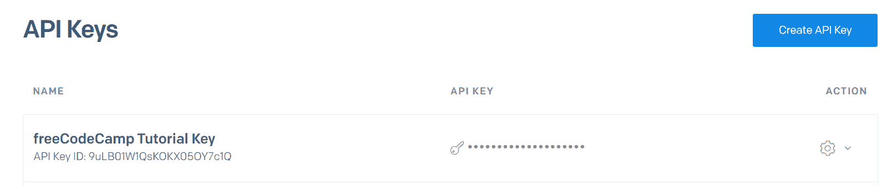
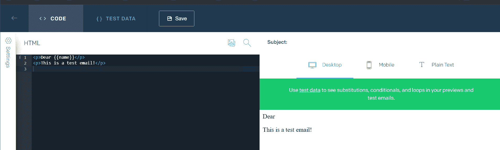

# 什么是 SendGrid？SMTP 电子邮件简讯教程

> 原文：<https://www.freecodecamp.org/news/what-is-sendgrid-smpt-email-newsletter-tutorial/>

您可能以前听说过 SMTP 这个术语，并想知道它是什么。SMTP 是处理电子邮件的常用方法。

今天我将解释什么是 SMTP，以及如何使用 SMTP 提供者如 [SendGrid](https://sendgrid.com) 从你的地址发送电子邮件。

## 什么是 SMTP？

SMTP 或简单邮件传输协议是 internet 服务器发送电子邮件的方法。例如，当您通过 Gmail 帐户发送电子邮件时，您的邮件客户端使用 SMTP 将邮件发送到服务器。然后，服务器也使用 SMTP 将其发送到接收服务器。

在不深入研究技术细节的情况下，最简单的方法就是认为 SMTP 是一个电子邮件服务器。

## 什么是 SendGrid？

SendGrid 是一个 SMTP 服务提供商——事实上，它是 freeCodeCamp 用来发送昆西每周时事通讯的提供商。

像许多 SMTP 提供商一样，SendGrid 提供使用他们的邮件服务器来发送您的电子邮件。对于发送大量电子邮件来说，这是一个非常好的选择，因为手动发送需要花费大量的时间和精力。

### 如何创建 SendGrid 帐户

使用 SendGrid 服务的第一步是创建您的帐户。前往 [SendGrid 网站](https://sendgrid.com)注册。他们提供了多种定价模式，但是免费级别至少对于本教程来说是足够的。

但是，当您扩大电子邮件列表时，您可能需要更高订阅级别的附加功能。

登录后，您应该会看到一个默认的仪表板视图:

Image depicting the default SendGrid dashboard view.

### 如何使用 SendGrid 设置您的域名或电子邮件

从仪表板视图中，选择“设置”，然后从下拉菜单中选择“发件人身份验证”。发件人身份验证设置是您告诉 SendGrid 允许从哪些电子邮件帐户发送电子邮件的地方。

这里有两种方法-如果你有一个自定义的电子邮件域，你可以设置域认证。如果您使用的是个人电子邮件地址，如 Gmail 地址，那么您需要设置单一发件人身份验证。

选择最适合您的选项，并按照 SendGrid 的提示进行设置。您的最终结果应该如下所示:

Image depicting Sender Authentication settings.

### 如何通过 SendGrid 的 API 发送电子邮件

发送电子邮件的实际过程是通过 [SendGrid 的 API](https://sendgrid.com/docs/api-reference/) 完成的。但是在使用 API 之前，您需要设置一个 API 密钥。

从您的仪表板视图中，选择“设置”，然后选择“API 密钥”。选择“创建 API 密匙”并选择你希望密匙拥有的权限(我给了我的完全权限，只是为了避免问题)。

一旦你有了钥匙，把它保存在一个安全的地方，因为你将无法再次使用它。

Image depicting the API Keys settings page.

现在您已经有了 API 密匙，您需要设置代码来使用`/mail/send`端点。您可以手动编写代码，或者使用一个助手库，比如 SendGrid 的 [Node.js 包](https://github.com/sendgrid/sendgrid-nodejs)。

使用 Node.js 包时，您可以按如下方式设置电子邮件的值:

*   `to`:发送邮件的地址。
*   `from`:发送电子邮件的地址。这应该与您在发件人身份验证中的设置相匹配。
*   你邮件的主题。
*   如果您发送的是纯文本电子邮件，则显示您的电子邮件内容。
*   `html`:如果你发送的是 HTML 格式的邮件，那么是邮件的内容。

原始 API 调用中的属性是不同的，其他助手库中的属性也是如此。请务必参考您的具体方法的文档。

### 如何在 SendGrid 中使用动态模板

作为另一种选择，您可以使用动态模板来生成内容，而不是在 API 调用中发送电子邮件内容。

动态模板允许您设置要发送的电子邮件的内容，并提供手柄功能来替换特定的数据字段。

要创建动态模板，从您的控制面板中选择“电子邮件 API”，然后选择“动态模板”。然后点击“创建一个动态模板”——你应该看到你的模板出现在下面。

点击它，然后选择“添加版本”打开模板选择。选择空白模板，然后选择您想要使用的编辑器类型(我使用代码编辑器)。

Image depicting the editor.

您可以编写电子邮件的内容，并为动态数据使用占位符，如`{{name}}`。当您发送电子邮件时，这些占位符将通过 API 调用被赋予值。

如果您想看看它是如何呈现的，您可以使用“测试数据”选项卡为占位符添加示例数据。

### 如何通过 SendGrid 的 API 获得阻止/反弹/垃圾邮件

追踪无法投递的邮件很重要。SendGrid 提供了工具来帮助您跟踪这一点，并且可以通过三个不同的仪表板视图(或者 API 端点，如果您希望以编程方式解析数据的话)获得数据。

*   `Blocked`电子邮件是被接收电子邮件提供商的政策拒绝的电子邮件，例如不接受外部流量的大学电子邮件，或者无法解析的电子邮件(未找到邮件服务器)。
*   `Bounced`电子邮件是服务器收到但被退回的电子邮件。当电子邮件服务器存在，但特定用户不存在，或者电子邮件收件箱已满时，会出现这种情况。
*   可以说，电子邮件是最需要监控的，因为当用户收到您的电子邮件并向其提供商报告您的电子邮件是垃圾邮件时，就会产生这些邮件。这些会直接影响你作为发件人的声誉，所以你一定不要给那些把你以前的邮件标记为垃圾邮件的人发邮件。

### 其他问题

说到你作为发件人的声誉，SendGrid 提供了一个顶级指标，叫做“发件人声誉”。这一指标是您通过其平台的活动的汇总，有助于了解电子邮件提供商可能处理您的电子邮件的方式。

较低的信誉将导致您的电子邮件被自动标记为垃圾邮件，甚至您的 IP 地址被阻止。

如果您在 SendGrid 的空闲层，您将使用共享的 IP 地址。这意味着其他客户也将通过相同的 IP 发送电子邮件，他们的行为会对您的声誉产生负面影响。

如果你打算发送大量的电子邮件，我建议你购买专用的 IP 地址，以确保你的声誉得到保护。

## 结论

我希望这篇文章能够帮助您更加熟悉 SendGrid 及其提供的服务。现在，您应该可以开始发送自己的电子邮件了。

如果你打算开始一个电子邮件简讯，我写了一篇关于[创建有效的电子邮件简讯](https://www.freecodecamp.org/news/how-to-create-an-email-newsletter-design-layout-send/)的文章，可能会有所帮助。