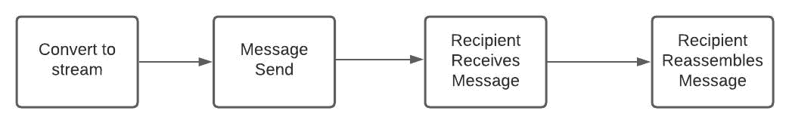
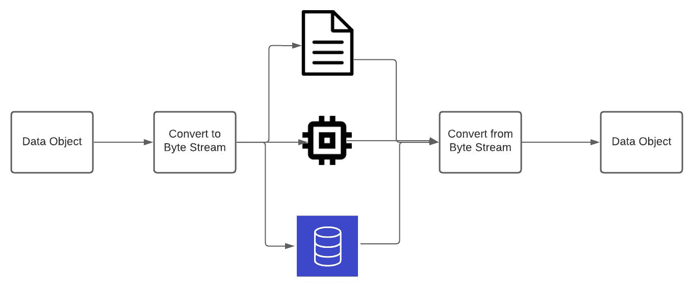
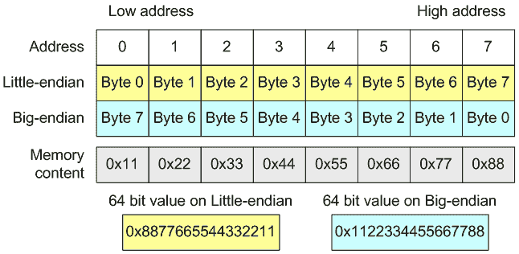

# 什么是序列化？

> 原文：<https://www.freecodecamp.org/news/what-is-serialization/>

在最近的一次项目更新会议上，我的团队谈到了我们将如何使用序列化在这个应用程序中来回发送数据。

一位希望深入软件项目的工程师告诉我，他们不熟悉这个术语。

很容易错过像这样的重要过程，直到你深入到更广泛的项目中才会出现。这个人就是这种情况，我也曾经是这种情况。

所以我想把它写下来。那天我帮助我的同事学习了序列化，今天你将学习它。

## 什么是序列化？

序列化是一个过程，在这个过程中，一个服务接收一个数据结构(如 Python 中的字典),包装它，并将其传输给另一个服务进行读取。这就是简单的定义。

想象一下，我需要给某人发送一条消息。所以我在已经组装好的拼图上写下文字。我把碎片拆开，添加一些如何重新组装拼图的说明，然后发送出去。

然后，信息接收者得到拼图的碎片，把它们放回一起，现在他们就有了我的信息。



Basic serialization flow of events

技术定义更有趣一点。也就是说，序列化是将数据对象转换成字节流，并将对象的状态保存在磁盘上或通过网络传输的过程。这就减少了所需的存储空间，使通过网络传输信息变得更加容易。



Serialization Process

### 封送处理和序列化有什么区别？

可能会想到[编组](https://en.wikipedia.org/wiki/Marshalling_(computer_science))的过程。封送处理是将对象的内存表示形式转换为适合传输的形式的过程。

尽管封送处理和序列化在广义上是同义的，但是有一个关键的区别。例如，当创建 Golang 程序将 JSON 数据读入 Golang 数据结构时，可以使用封送处理将 JSON 键值转换为 Golang 键值。

区别在于封送处理可能用于转换数据。相比之下，序列化以字节流的形式发送或存储数据，并以原始形式重组数据。两者都进行序列化，但是这两个过程的意图不同。

您可以在下面看到我为与 Twitter 数据交互而创建的这个结构，它是一个实际封送的例子。在 Golang 中，您可以给出称为标记的提示，使用 Golang 内置的封送处理服务轻松地将该对象转换为 JSON 数据。


Golang Struct using JSON tags

### 什么是字节序？

我还想稍微谈一谈 [endianness](https://en.wikipedia.org/wiki/Endianness) 这个话题。字节序是一个用来描述内存中字节顺序的术语。

你可以把内存想象成一个存储数据块。为了使序列化工作，字节流需要传输数据类型，而不管从一个系统到另一个系统的字节顺序如何变化。

你可以在下面看到小的和大的不同。从一个系统到另一个系统的字节顺序匹配或以某种方式转换是很重要的，因为不是所有的系统都以相同的方式排列它们的位。



Little and big-endian Courtesy of https://pvs-studio.com/en/blog/lessons/0019/

## 序列化的用例

我们的用例充分利用了这些特性。我们计划从我们正在扫描的硬件中获取一些信息，将这些信息打包成一个字节流，并将其与网络一起发送给另一个将重建数据的服务。

逆转序列化过程并将数据重新构造回其原始形式的过程称为**反序列化**。

这还有其他的用例。例如，REST APIs 或消息协议(如 AMQP)可以使用序列化来压缩和发送数据。

AMQP 是一种消息传递协议，在该协议中，您向 AMQP 代理发送消息，接收服务“监听”该代理的消息。后端工程师可能很了解这一点，因为这经常用于在分布式系统中来回发送数据。

许多编程语言都具有轻松实现序列化的能力。所以这是一个与语言无关的话题。

### 序列化示例

让我们举一个简单的例子。这段代码使用库 [kombu](https://github.com/celery/kombu) 通过 AMQP 发送消息。我们用它通过网络从一个软件包向另一个软件包发送信息。这段代码用于服务向 AMQP 代理发送消息:

```
def send_message(self, payload, sender_serializer):
...
    try:
        producer.publish(
            {'payload': message},
            ...
            serializer = 'json',
            ...
        )
        return 
```

记下`publish`方法。我们将序列化方法作为参数传入，以便库知道如何序列化我们传入的数据。

数据消息被转换成字节流，如果你仔细看，它就像一长串字母和数字，然后我们发送消息。

相应的服务将使用相同的序列化方法以原始状态重建数据。这是一个重要的特性，因为我们正在创建一套工具，这些工具需要能够相互发送消息才能工作。

## 序列化数据格式

每当手头的任务需要时，我就使用 [JSON](https://www.json.org/json-en.html) 进行序列化。但是，您也可以使用其他几个。

JSON 的开销很大，但是它的可读性让它非常适合我。也可以使用 [Protobufs](https://developers.google.com/protocol-buffers) 、 [YAML](https://en.wikipedia.org/wiki/YAML) ，或者 XML。这些只是您可以使用的一些数据对象格式。

## 结论

我很高兴我摆脱了这一切。我不得不停止思考这个问题，希望有人能从中吸取教训。

在构建通信管道时，序列化变得至关重要。了解这个主题很好，有了适当的背景知识，你就可以自信地使用任何工具。

乔治