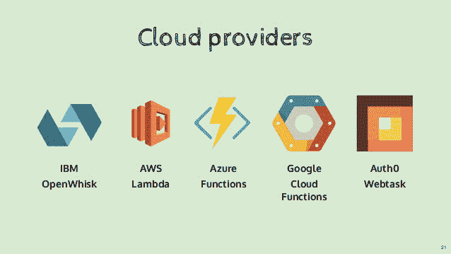
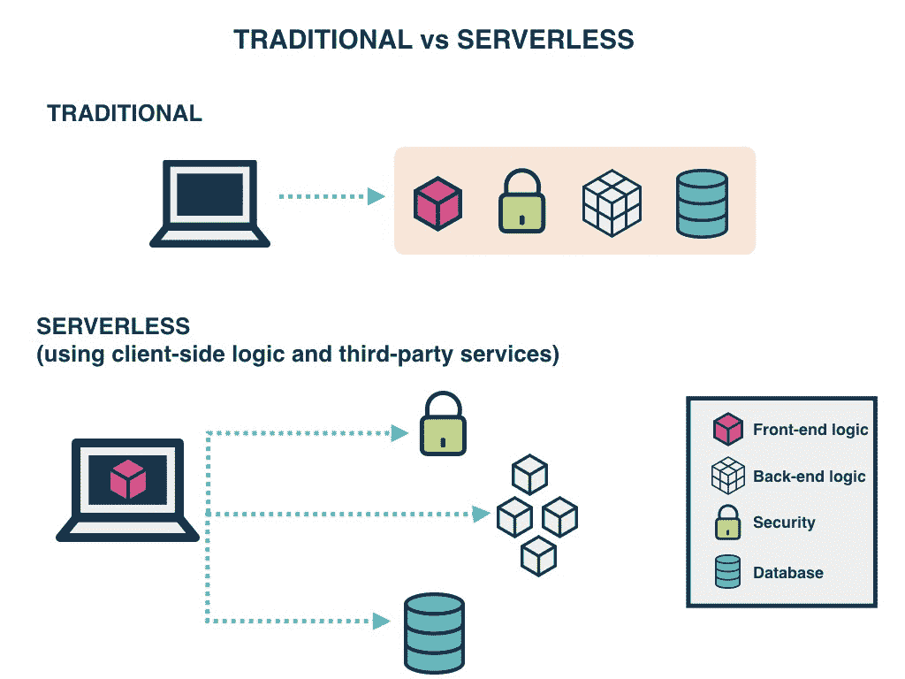

# 什么是无服务器架构？它的利弊是什么？

> 原文：<https://www.freecodecamp.org/news/what-is-serverless-architecture-what-are-its-pros-and-cons/>

无服务器，这个镇上的新流行语已经获得了科技行业专业人士和新手的大量关注。部分原因是像 AWS 这样的云供应商大肆宣传该架构的方式，从会议到聚会到博客帖子，几乎无处不在。但是，无服务器不仅仅是炒作，它承诺了理想的业务实现的可能性，这听起来很好听，而且可能也不会增加预算。

> **“专注于你的**，而不是那些****

****虽然听起来很轻松，但要知道你白天花了很多时间来实现、维护、调试和监控基础设施。随着所有这些基础设施的解除，我们真的可以专注于我们的应用服务的业务目标。许多富有成效的努力可以被引导到正确的方向，在理想的情况下。也许这听起来好得不像是真的，但事情本该如此。至少对于那些不能在现代复杂基础设施的错综复杂的网络中花费大量时间的人来说是这样。****

****除了预期之外，无服务器真的是打破了您的服务器基础设施的道路。无服务器已经被网飞、路透社、美国在线和 Telenor 等公司用于生产。整个行业的采用率在不断提高。无服务器已经准备好占据自己的位置，但是不要期望无服务器完全征服你的基础设施。在一些使用案例中，无服务器可能被证明是错误的选择。****

* * *

### ****那么，什么是无服务器？****

****无服务器是一种云计算执行模型，其中云提供商动态管理服务器的分配和供应。无服务器应用运行在无状态计算容器中，这些容器由事件触发、短暂(可能持续一次调用)，并且完全由云提供商管理。定价是基于执行的数量，而不是预先购买的计算能力，这难道不是您计划已久的项目的理想框架吗？好吧，去做吧。****

> ******无服务器应用是事件驱动的基于云的系统，其中应用开发仅依赖于第三方服务 ****、客户端逻辑**** 和云托管远程过程调用 ****(功能即服务)**** 的组合。******

**大多数云提供商已经在无服务器上投入了大量资金，这是一大笔钱；随着大规模的推广和现实的提供，你可以放心地假设无服务器是未来几年最常用的云服务之一。以下是一些目前可用的云服务:**

**

Source: [https://www.slideshare.net/loige/building-a-serverless-company-with-nodejs-react-and-the-serverless-framework-jsday-2017-verona](https://www.slideshare.net/loige/building-a-serverless-company-with-nodejs-react-and-the-serverless-framework-jsday-2017-verona)** 

*   **[****AWSλ****](https://aws.amazon.com/lambda/)**
*   **[****谷歌云功能****](https://cloud.google.com/functions/)**
*   **[****天蓝色功能****](https://azure.microsoft.com/en-us/services/functions/)**
*   **[****IBM open whisk****](https://www.ibm.com/cloud-computing/bluemix/openwhisk)**
*   **[****阿里巴巴函数计算****](https://www.alibabacloud.com/product/function-compute)**
*   **[****铁功能****](http://open.iron.io/)**
*   **[****Auth0 网页任务****](https://webtask.io/)**
*   **[****甲骨文 Fn 项目****](https://fnproject.io/)**
*   ****

* * *

### ****传统架构与无服务器架构****

****

Source: [https://www.gocd.org/2017/06/26/serverless-architecture-continuous-delivery/](https://www.gocd.org/2017/06/26/serverless-architecture-continuous-delivery/)**** 

****多年来，您的应用程序一直在服务器上运行，由于各种无法想象的错误影响了您的生产，您不得不修补、更新服务器，并在深夜和清晨持续维护服务器。只要你管理它们，它们正常运行的全部责任就在你身上。无服务器不像前面提到的，你不再需要担心底层服务器。原因是，他们不再受你的管理，管理的责任落在了云供应商身上。但是不管无服务器在某些情况下有多酷，传统的架构还是让它相形见绌。****

#### ****定价****

****使用无服务器的主要优势之一是降低成本，多年来，配置服务器和维护 24x7 服务器团队的成本已经不复存在。无服务器的成本模型是基于执行的:你需要为执行的次数付费。你被分配了一定的使用秒数，它随着你需要的内存量而变化。同样，每毫秒的价格随着你需要的内存量而变化。显然，对于大多数云供应商来说，运行时间较短的函数更适合这种峰值执行时间为 300 秒到 15 分钟的模型。****

****这里的赢家是无服务器架构。****

#### ****建立工作关系网****

****缺点是无服务器函数只能作为私有 API 访问。要访问这些，您必须设置一个 API 网关。这对您的定价或流程没有影响，但这意味着您无法通过通常的 IP 直接访问它们，snap！****

****这里的赢家是传统建筑。****

#### ****第三方依赖关系****

****如果不是所有的项目，大多数项目都有外部依赖，它们依赖于没有内置到您使用的语言或框架中的库。您经常使用包含加密、图像处理等功能的库。，这些库可能会很重。如果没有系统级访问，您必须将这些依赖项打包到应用程序本身中。****

> ****重新发明轮子并不总是一个好主意。****

*****这里的赢家是基于上下文的。对于依赖很少的简单应用，无服务器是赢家；对于任何更复杂的东西，传统建筑是赢家。*****

#### ****环境****

****为无服务器设置不同的环境就像设置单一环境一样简单。鉴于它是按执行付费的，这是对传统服务器的巨大改进，您不再需要设置开发、试运行和生产机器。最终，在某个时候，你会忘记所有的环境。****

****这里的赢家是无服务器架构。****

#### ****超时****

****对于无服务器计算，AWS Lambda 有一个 15 分钟的硬性超时限制。太复杂或长时间运行的功能对无服务器来说并不好，但是有一个硬超时会使它无法执行某些任务。对这个时间的硬性限制使得无服务器不能用于具有可变执行时间的应用程序，以及需要来自外部源的信息的某些服务。这种情况将来可能会改变。****

****这里明显的赢家是传统建筑。****

#### ****规模****

****无服务器的扩展过程是自动和无缝的，但是缺乏控制或者完全没有控制。虽然自动扩展很棒，但是很难不解决和减少与新的无服务器实例相关的错误。****

****这是无服务器架构和传统架构之间的纽带。****

* * *

### ****作为服务的功能(FaaS)****

****FaaS 是无服务器架构的实现，工程师可以在其中部署单独的功能或业务逻辑。它们在几毫秒内启动(对于 AWS Lambda 来说大约为 100 毫秒)，并在大多数云供应商规定的 300 秒到 15 分钟的超时内处理单个请求。****

#### ******FaaS 原理:******

*   ****服务器的全面管理****
*   ****基于发票的计费****
*   ****事件驱动，即时可扩展****

### ****FaaS 的主要特性:****

#### ****独立的服务器端逻辑功能****

****FaaS 类似于你用编程语言编写的函数，小而独立的逻辑单元，接受输入参数，对输入进行操作并返回结果。****

#### ****无国籍的****

****使用无服务器，一切都是无状态的，你不能在一次执行函数时将文件保存到磁盘，然后期望它在下一次还在那里。同一函数的任何两次调用都可以在完全不同的容器上运行。****

#### ****短暂的****

****FaaS 被设计成快速旋转，完成工作，然后再次关闭。它们不会闲置。只要执行了任务，基础容器就会报废。****

#### ****事件触发的****

****虽然函数可以直接调用，但它们通常由来自其他云服务的事件触发，如 HTTP 请求、新的数据库条目或入站消息通知。FaaS 经常被使用，并被认为是云环境中服务之间的粘合剂。****

#### ****默认情况下可伸缩****

****使用无状态函数，可以初始化多个容器，允许根据需要运行尽可能多的函数(如果需要，可以并行运行),以持续服务所有传入的请求。****

#### ****完全由云供应商管理****

****AWS Lambda、Azure Functions、IBM OpenWhisk 和 Google Cloud Functions 是最知名的可用 FaaS 解决方案。每个产品通常支持一系列语言和运行时，例如 Node.js、Python、.NET 核心，Java。****

* * *

### ****无服务器应用****

****无服务器解决方案由 web 服务器、Lambda 函数(FaaS)、安全令牌服务(sts)、用户认证和数据库组成。****

****

*Source: http://blog.tonyfendall.com/2015/12/serverless-architectures-using-aws-lambda/***** 

*   ********客户端应用**** —您的应用的 UI 在现代前端 Javascript 应用中呈现在客户端，这允许我们使用简单、静态的 web 服务器。****
*   ******网络服务器**** —亚马逊 S3 提供了一个强大而简单的网络服务器。我们应用程序的所有静态 HTML、CSS 和 JS 文件都可以从 S3 提供。**
*   ******【FaaS】****—它们是无服务器架构中的关键使能因素。FaaS 的一些流行的例子是 AWS Lambda，谷歌云函数和微软 Azure 函数。AWS Lambda 用在这个框架中。用于登录和访问数据的应用服务将被构建为 Lambda 函数。这些函数将读取和写入您的数据库，并提供 JSON 响应。**
*   ******【STS】****—为应用程序的用户生成临时 AWS 凭证(API 密钥和秘密密钥)。客户端应用程序使用这些临时凭证来调用 AWS API(从而调用 Lambda)。**
*   ******用户认证**** — AWS Cognito 是与 AWS Lambda 集成的身份服务。使用 Amazon Cognito，您可以轻松地将用户注册和登录添加到您的移动和 web 应用程序中。它还可以选择通过脸书、Twitter 或亚马逊等社交身份提供商，使用 SAML 身份解决方案或使用您自己的身份系统来验证用户。**
*   ******数据库**** — AWS DynamoDB 提供完全托管的 NoSQL 数据库。DynamoDB 对于无服务器应用程序来说并不重要，但在这里用作示例。**

* * *

### **无服务器架构的优势**

#### ****从商业角度来看****

1.  **无服务器应用程序产生的成本基于功能执行的数量，以毫秒而不是小时来衡量。**
2.  **过程敏捷性:较小的可部署单元可以更快地向市场交付特性，增加适应变化的能力。**
3.  **雇用后端基础设施工程师的成本下降。**
4.  **降低运营成本**

#### ****从开发者的角度来看****

1.  **责任减少，无需负责后端基础架构。**
2.  **零系统管理。**
3.  **更简单的运营管理。**
4.  **促进纳米服务、微服务和 SOA 原则的采用。**
5.  **设置更快。**
6.  **可扩展，无需担心并发请求的数量。**
7.  **开箱即用的监控。**
8.  **鼓励创新。**

#### ****从用户角度来看****

1.  **如果企业利用这种竞争优势更快地推出新功能，那么客户就会比以前更快地收到新功能。**
2.  **用户可以更容易地提供自己的存储后端(即 Dropbox、Google Drive)。**
3.  **这类应用更有可能提供客户端缓存，从而提供更好的离线体验。**

* * *

### **无服务器架构的缺点**

#### ****从商业角度来看****

1.  **整体控制力降低。**
2.  **供应商锁定要求更加信任第三方提供商。**
3.  **额外的风险暴露需要对第三方提供者的更多信任。**
4.  **安全风险。**
5.  **灾难恢复风险**
6.  **成本是不可预测的，因为执行的次数不是预先定义的**
7.  **所有这些缺点都可以用开源替代方案来减轻，但代价是前面提到的成本优势**

#### ****从开发者的角度来看****

1.  **不成熟的技术导致组件分散，最佳实践不明确。**
2.  **建筑的复杂性。**
3.  **防止功能蔓延所需的纪律。**
4.  **多租户意味着从技术上讲，邻居功能可能会在幕后霸占系统资源。**
5.  **本地测试变得棘手。**
6.  **对地方政府的重大限制。**
7.  **执行持续时间有上限。**
8.  **缺乏操作工具**

#### ****从用户角度来看****

1.  **除非架构正确，否则应用程序可能会因请求延迟增加而导致用户体验不佳。**

* * *

### **无服务器框架**

**

Source: [https//serverless.com](https://serverless.com/)/** 

**无服务器平台需要可以执行它们的基础设施，提供者不可知的框架提供了一种平台不可知的方式来在各种云平台或商业服务上定义和部署无服务器代码。**

*   **[无服务器框架](https://serverless.com/) (Javascript、Python、Golang)**
*   **[顶点](http://apex.run/) (Javascript)**
*   **ClaudiaJS (Javascript)**
*   **[Sparta](https://gosparta.io/) (Golang)**
*   **戈登(Javascript)**
*   **Zappa (Python)**
*   **[Up](https://github.com/apex/up) (Javascript、Python、Golang、Crystal)**

* * *

### **摘要**

**无服务器架构当然非常令人兴奋，但是它也有很多限制。因为架构的有效性和成功依赖于业务需求，而不仅仅依赖于技术。同理，Serverless 用在合适的地方也能发光。**

**看看无服务器的神奇之处，是时候看看无服务器的内部了。这里有几个链接可以帮助您开始无服务器之旅。**

**[**无服务器/示例**](https://github.com/serverless/examples)
[*无服务器示例——用无服务器构建的无服务器架构的样板和示例集合…*github.com](https://github.com/serverless/examples)**

**[**anaibol/awesome-无服务器**](https://github.com/anaibol/awesome-serverless)
[*awesome-无服务器- :cloud:无服务器/无服务器的 awesome 服务、解决方案和资源精选列表…*github.com](https://github.com/anaibol/awesome-serverless)**

**[**为静态网站构建无服务器联系表单**](https://hackernoon.com/building-serverless-contact-form-for-static-websites-b0e622d5a035)
[*用 AWS 无服务器 lambda 函数处理静态表单*hackernoon.com](https://hackernoon.com/building-serverless-contact-form-for-static-websites-b0e622d5a035)**

**我希望这篇文章有助于理解无服务器计算。我很想听听你们是如何在项目中使用无服务器的。分享知识，帮助更多的人获得知识。**