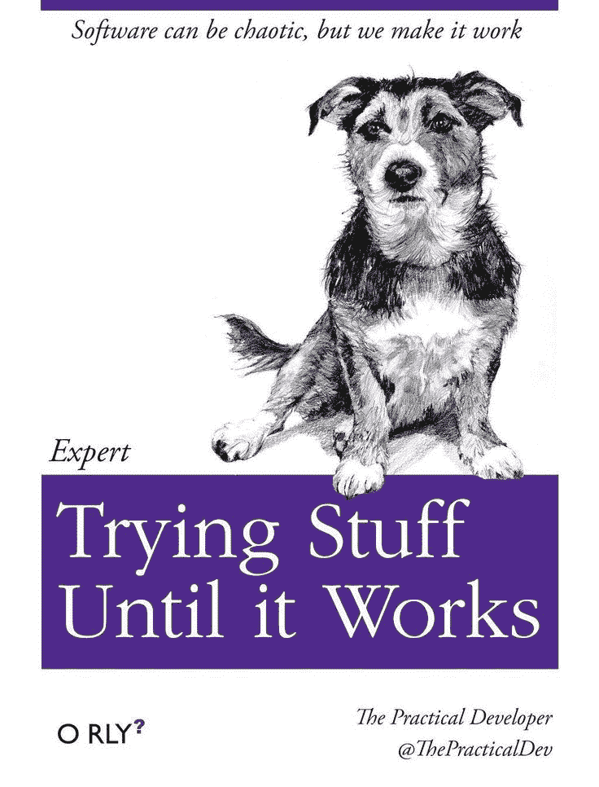
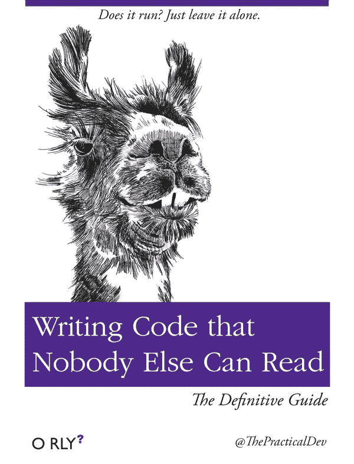
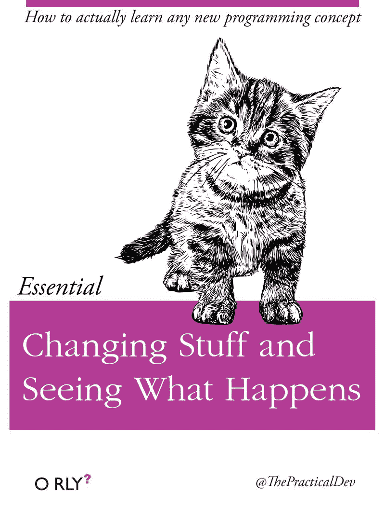
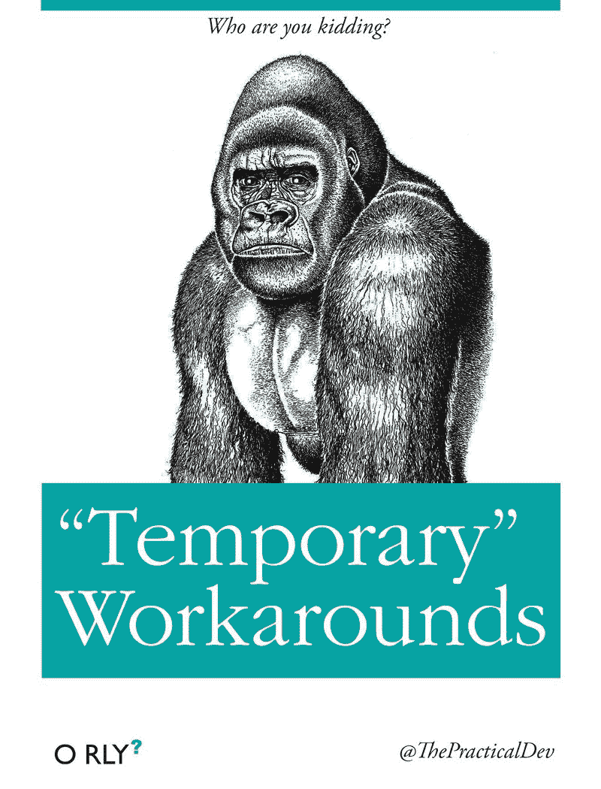
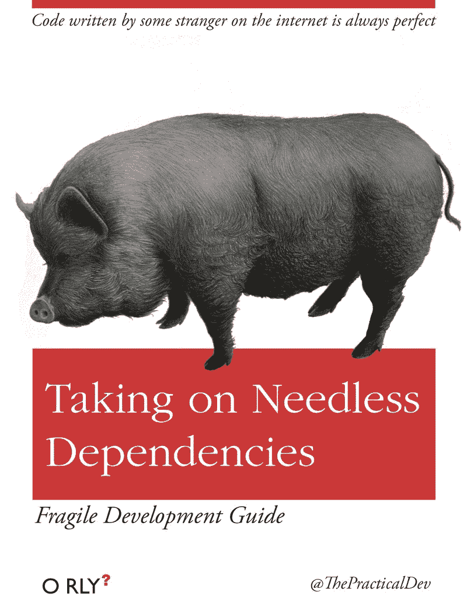
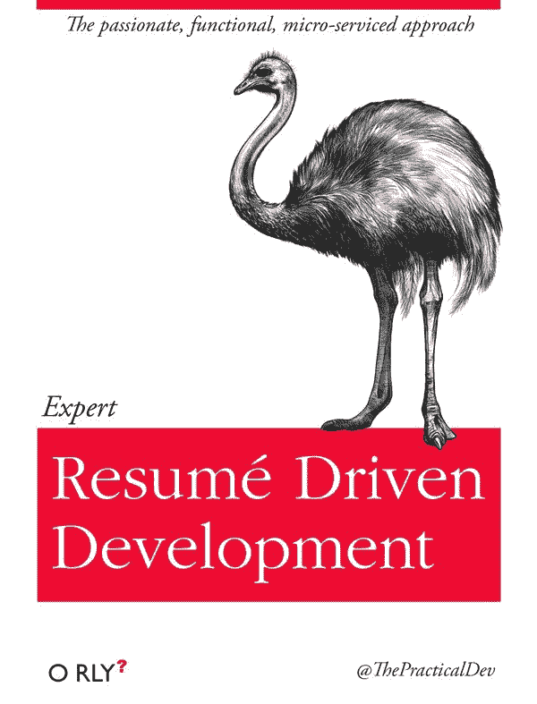

# 代码书法 VS 代码鸡抓

> 原文：<https://www.freecodecamp.org/news/what-is-shitty-code-handwriting-ae7c00708b/>

在过去的 17 年里，我和许多团队合作过 90 多个项目。但是直到我偶然发现 Git 的`blame`特性，我才了解到每个编码者的“笔迹”这种单纯的好奇很快就变成了习惯。每当我看到新代码，我都试图猜测是谁写的。然后我会用一个`git blame`来验证我的猜测。

(顺便说一句，如果你还不熟悉 [git](https://en.wikipedia.org/wiki/Git_%28software%29) ，这是开发人员在代码上合作的一种流行方式，它的“[责备](https://help.github.com/articles/using-git-blame-to-trace-changes-in-a-file/)功能向你显示谁创作了给定的行源代码。)

几年后，我开始看到一些模式，就像笔迹专家可能从他们画 W 的方式中发现一个反社会者。代码笔迹揭示了编写它的程序员的许多情况。

你可以从程序员的代码书写中了解到任何事情:他们有多少经验，他们有多关心代码的可读性(推而广之，他们有多关心他们的队友)。

代码对话。[烂代码](https://en.wikipedia.org/wiki/Code_smell)惨叫！所以你看的代码是代码书法还是代码鸡抓？

快速声明:你将要阅读的内容纯粹基于我的主观直觉。据我所知，还没有任何同行评议的学术研究。我的代码手写分析技能在过去为我提供了很好的服务，也可能对你有所帮助，但是——就像你在互联网上读到的任何东西一样——你的收获可能会有所不同。

### 洞察力#1:膨胀的代码=挣扎

通常，当我发现代码变得臃肿，比它需要的要大得多，这表明一个程序员正在努力完成一项超出他们能力的任务。他们要么没有知识，要么没有时间来完成这项工作。

在现实生活中，*做*少的人，倾向于*说*多。在代码领域也是一样:那些不能优雅地完成工作的人往往会写很多代码。

不幸的是，bug 以代码为食，代码条文越多，bug 的栖息地就越大。

> “我讨厌代码，我希望在我们的产品中尽可能少地使用代码。”——杰克·迪德里克

### 洞察力#2:死代码=草率

见过提交给回购的大量注释代码吗？或者更糟:不做任何特殊事情但由于历史原因而存在的代码？

有趣的是，这与编写它的程序员的桌子的混乱有直接的关系。见过过时的评论或测试吗？是的，你找到了一个粗心的程序员。

### 3.复杂代码=愚蠢或贪婪

我喜欢舒马赫的这句话:

> “任何聪明的傻瓜都能把事情变得更大、更复杂、更暴力。向相反的方向前进需要一点天赋和很大的勇气。”—弗里茨·舒马赫

如果你发现代码很难理解，请放心，它要么是由不知道自己在做什么的人编写的，要么是由通过获得那部分代码的“所有权”来寻求工作保障的人编写的。

### 洞察力#4:评论=团队成员(除非…)

所有高级语言都允许编写可读性足够好的代码，这样你就不需要注释了。但是有时由于缺乏知识、时间或优雅的框架，复杂性是不可避免的。

当程序员意识到他们的同事(或他们未来的自己)会对某一行代码提出疑问时，他们会放一个指向 API 引用或相关堆栈溢出问题的链接，我真的很喜欢这样。

也就是说，过度使用注释表明缺乏自尊(或者像我前面提到的，试图解释掉“臃肿的代码”)。

### 洞察力#5:名字=沟通技巧

变量名、函数名、参数名、类名。这些是与代码维护人员沟通的基本层面。

如果你遇到单个字母的名字(除了`i`，这是`for`循环中的默认设置)，你已经找到了一个缺乏沟通技巧或对他人缺乏同情心的程序员。

除非这是一个不会向任何人展示或维护的临时项目，否则为选择一个合适的名字而投入的每一秒都会带来好的因果报应。

如果一个实体的功能改变了，相应地重构它的名字是很重要的。

一些程序员声称名字不重要，因为机器不在乎。嗯，除非你是在用 0 和 1 写代码，否则你也是在为人类写代码！

### 洞察 6:可读性差=缺乏流畅性

有时程序员可以流利地使用一种语言，但是他们试图扭曲和改变另一种语言，使其表现得像他们最喜欢的语言一样。

JavaScript 是那些糟糕的目标语言之一。

大多数后端程序员可以选择他们的“母语”许多人足够勇敢，可以拼凑出几行前端代码。但是由于浏览器领域主要是 JavaScript(这是一种灵活的语言)，他们试图从他们的“母语”中模仿他们熟悉的模式

这一切都很好，直到一个真正的 JavaScript 程序员看到代码，并拔下他们的头发！

### 洞察力#7:黑客=肤浅的个性或缺乏纪律

曾经花了很多时间整理代码库，却看到你的同行把你漂亮的代码当作快速修改的平台，在上面浇满汽油？

恭喜你:你遇到黑客了！

黑客擅长快速修复，而不需要费心去全面理解架构(通常是通过调试程序，或者通过试错)。

那么有什么问题呢？他们解决了一个问题，又制造了 10 个问题。

顾问有表现出这种行为的倾向(因为他们的时间是昂贵的，而且他们不会带着他们的改变的后果生活)。此外，他们可以通过解决另外 10 个问题和制造 100 个新问题来获得报酬。

然而，我目睹过内部程序员让最邋遢的顾问看起来像摇滚明星。曾经估计一个问题需要 8 个小时，但是一些产品经理把你的估计减少到仅仅 1 个小时？这通常是黑客诞生的时候。

也就是说，有时你需要快速交付(比如在初创公司的原型阶段，以验证想法)，由于资源有限，抄近路也是可以接受的。没有人会在意一个漂亮的不解决任何问题的代码。但是用剪刀切和用大砍刀砍还是有区别的！

### 洞察力#8:不一致=骄傲和狂热

> 入乡随俗。—一句谚语

有如此多的编码约定。选哪个其实并不重要。但是一旦你的团队选择了一些惯例，坚持下去是至关重要的。

如果贡献者忽略了一些或所有的约定，他们要么是在不断地修改，要么是太骄傲而不愿改变他们的风格来匹配你的代码库。

最糟糕的是，当他们推动自己的公约。那是纯粹的狂热。你可以肯定程序员在其他事情上也是小心眼的。

### 洞察力#9 湿代码=坏记忆

[干](https://en.wikipedia.org/wiki/Don%27t_repeat_yourself)(“不要重复自己”)的反义词是湿(“我们喜欢打字”或者“把所有东西都写两遍”)。

嗯，虫子通过一个叫做“复制”和“粘贴”的混乱过程进行繁殖

湿码的种类多得惊人。例如:

1.  写了两次的函数或类，只有很小的不同
2.  保存另一个变量的值的变量
3.  可以驻留在函数中的一组重复指令

这不同于臃肿的代码，因为不仅仅是复杂或扭曲，湿代码是完全重复的。

通常重复代码是程序员不能回忆起(或者更糟，没有看到)其他类似代码的标志。人脑的主要任务之一就是检测模式。当程序员不能发现相似的代码时，这是缺乏经验或不注意细节的表现。

### 洞察力#10。临时变通办法=缺乏纪律

有时，开发人员会注入一个快速而肮脏的解决方案作为临时的解决方法，希望有一天他们会着手重构它。这通常是因为截止日期临近或缺乏知识。但是众所周知，临时的解决办法是存在的。

临时工作区表明一个务实的工程师对他们的工作缺乏品味或自豪感。他们也可能是自卑的表现，因为他们不想让别人(老板、顾客等)失望。

唯一可以接受的临时解决方法是学习项目或原型(概念验证)。即使在这种情况下，一旦你知道如何正确地做，最好还是重构它。

### 洞察力#11:大量的依赖=对项目未来的粗心大意

依赖关系需要保持最新。当一个项目有太多的依赖性时，这是草率的标志。

很难说什么是“太多”,但经验法则是:如果项目可以在没有依赖的情况下轻松生存，那么它就是多余的。

另一个衡量标准是，如果对依赖项正在解决的底层问题没有必要的需求，那么它可能是不必要的。

### 不必要的依赖有三个动机:

#### 原因 1:开发人员太渴望学习新东西了。

通过引入新的依赖项，他们有机会在真实的项目中学习。

好奇心是好的，但应该有其他的学习平台，比如辅助项目、短期任务或黑客马拉松。

你不想失去一个好的开发人员，因为他们认为他们不能在工作中成长，但是你也不想让他们把你的产品当成他们的宠物项目。

#### 原因 2:这是由一个过于雄心勃勃的初级开发人员完成的。

任何领域的新来者往往会被所有新的流行词汇淹没，出于沮丧或无知(或“专业人士”的推荐)，他们可能会决定“跳进游泳池”，一下子学会所有东西。别让他们得逞。[选择你的技术](https://medium.com/@alexewerlof/how-i-learn-new-tech-cb79db19c818)。

#### 原因 3:开发人员背负着另一项工作(或者一个兼职项目)的包袱

他们想通过引进一些只有他们自己非常了解的东西来超越他们的同行。

不幸的是，除了软技能，没有简单的解决方案:团队必须质疑每个依赖项的选择，如果有适当的代码审查和合并过程，就很难在没有人注意到的情况下偷偷放入可怕的代码。

有时，有问题的牛仔编码员可能会进行大规模的重构，然后让团队接受整个变更，因为它已经完成了。好吧，不要！请他们将他们的拉取请求分成更小的部分，并对带来新的依赖持怀疑态度。是的，这是更多的工作，但从长远来看，这将节省更多的时间和精力。

优秀的开发人员关心他们项目的未来，因为他们花费了他们最有限和最宝贵的资源来创建项目:他们的时间！

顺便说一句，大量的依赖性和时髦的流行语也可能是一个迹象，表明开发人员正在建立一份简历，并已经为他们的下一份工作做好准备。

### 代码书法

既然我们已经讨论了代码鸡抓，让我们谈谈另一面:代码是一种阅读的绝对乐趣。

有人甚至说“[代码就是诗歌](https://www.smashingmagazine.com/2010/05/the-poetics-of-coding/)”

[jQuery](https://github.com/jquery/jquery) 或 [lodash](https://github.com/lodash/lodash) 的源代码是很好的例子，但是 Github 上几乎所有受欢迎的库，很多贡献者最终都会汇聚到 beauty 上。朋友们，这是了不起的*代码书法*。

本质上，伟大的代码是:

1.  易于阅读、理解和调试
2.  灵活、可配置和可扩展
3.  智能使用资源
4.  高性能

请注意，有些项目要求不同的顺序。例如，[Linux 源代码](https://github.com/torvalds/linux)可能不太容易阅读，因为性能对于操作系统来说更重要。或者，一个不起眼的嵌入式物联网应用程序可能会牺牲配置来支持资源优化。

无论如何，通过分析他们的代码，你可以发现更多关于你的同行的信息。代码胜于雄辩！所以下一次你读代码的时候，试试`git blame`命令，开始识别代码笔迹。

⚡ ️ *喜欢你读的书吗？**关注**我写新东西时会收到通知。*

你也可能想知道为什么编程是有史以来最好的工作。