# 状态如何在 React 中工作——用代码示例解释

> 原文：<https://www.freecodecamp.org/news/what-is-state-in-react-explained-with-examples/>

状态是 React 中最复杂的东西，初学者和有经验的开发人员都很难理解。因此，在本文中，我们将探索 React 中所有的基本状态。

在理解状态之前，让我们先理解一些基本原理，这样以后就很容易理解状态了。

## 如何在 React 的 UI 中呈现数据

为了在屏幕上渲染任何东西，我们在 React 中使用了`ReactDOM.render`方法。

它具有以下语法:

```
ReactDOM.render(element, container[, callback]) 
```

*   可以是任何 HTML 元素、JSX 或返回 JSX 的组件
*   是 UI 上的元素，我们希望在其中呈现数据
*   是我们可以传递的可选函数，一旦在屏幕上呈现或重新呈现某些内容，就会调用这个函数

看看下面的代码:

```
import React from "react";
import ReactDOM from "react-dom";

const rootElement = document.getElementById("root");

ReactDOM.render(<h1>Welcome to React!</h1>, rootElement); 
```

这里有一个[代码沙盒演示](https://codesandbox.io/s/focused-shockley-oh4tn?file=/src/index.js)。

这里，我们只是将一个 h1 元素呈现到屏幕上。

要渲染多个元素，我们可以如下所示:

```
import React from "react";
import ReactDOM from "react-dom";

const rootElement = document.getElementById("root");

ReactDOM.render(
  <div>
    <h1>Welcome to React!</h1>
    <p>React is awesome.</p>
  </div>,
  rootElement
); 
```

这里有一个[代码沙盒演示](https://codesandbox.io/s/white-hooks-dgru0?file=/src/index.js)。

我们还可以取出 JSX 并将其放入一个变量中，如果内容变大，这是呈现内容的首选方式，如下所示:

```
import React from "react";
import ReactDOM from "react-dom";

const rootElement = document.getElementById("root");

const content = (
  <div>
    <h1>Welcome to React!</h1>
    <p>React is awesome.</p>
  </div>
);

ReactDOM.render(content, rootElement); 
```

这里有一个[代码沙盒演示](https://codesandbox.io/s/trusting-night-5g825?file=/src/index.js)。

这里，我们还添加了一对额外的圆括号来正确对齐 JSX，使其成为一个 JSX 表达式。

如果你想详细了解 JSX 及其各种重要特征，请点击这里查看我的文章。

现在，让我们在屏幕上显示一个按钮和一些文本:

```
import React from "react";
import ReactDOM from "react-dom";

const rootElement = document.getElementById("root");

let counter = 0;

const handleClick = () => {
  counter++;
  console.log("counter", counter);
};

const content = (
  <div>
    <button onClick={handleClick}>Increment counter</button>
    <div>Counter value is {counter}</div>
  </div>
);

ReactDOM.render(content, rootElement); 
```

这里有一个[代码沙盒演示](https://codesandbox.io/s/quizzical-cohen-x55p8?file=/src/index.js)。

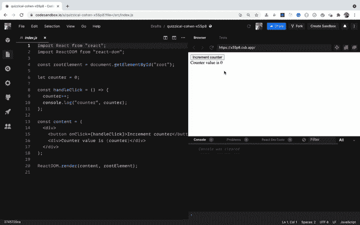

正如您所看到的，当我们单击按钮时，`counter`值会增加，正如您在控制台中看到的那样。但是在用户界面上，它没有得到更新。

这是因为当页面被加载时，我们只使用`ReactDOM.render`方法渲染了一次`content` JSX。我们不会再次调用它——所以即使`counter`的值在更新，它也不会显示在 UI 上。所以让我们来解决这个问题。

```
import React from "react";
import ReactDOM from "react-dom";

const rootElement = document.getElementById("root");

let counter = 0;

const handleClick = () => {
  counter++;
  console.log("counter", counter);
  renderContent();
};

const renderContent = () => {
  const content = (
    <div>
      <button onClick={handleClick}>Increment counter</button>
      <div>Counter value is {counter}</div>
    </div>
  );

  ReactDOM.render(content, rootElement);
};

renderContent(); 
```

这里有一个[代码沙盒演示](https://codesandbox.io/s/adoring-noether-8gsgu?file=/src/index.js)。

这里，我们将`content` JSX 和`ReactDOM.render`方法调用移到了`renderContent`函数中。一旦它被定义，我们就调用这个函数，这样它就会在页面加载时在 UI 上呈现内容。

注意，我们还在`handleClick`函数中添加了`renderContent`函数调用。所以每次我们点击按钮，就会调用`renderContent`函数，我们会在用户界面上看到更新的计数器。

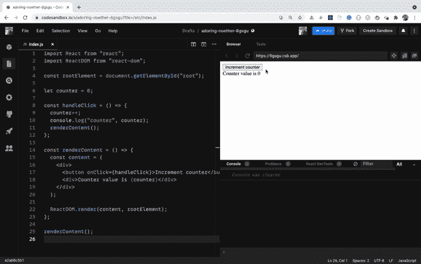

如您所见，它按预期工作，并且`counter`值正确地显示在 UI 上。

您可能认为每次点击按钮时重新呈现整个 DOM 代价很高，但事实并非如此。这是因为 React 使用了虚拟 DOM 算法，它检查 UI 上发生了什么变化，并且只重新呈现发生了变化的元素。因此整个 DOM 不再被重新呈现。

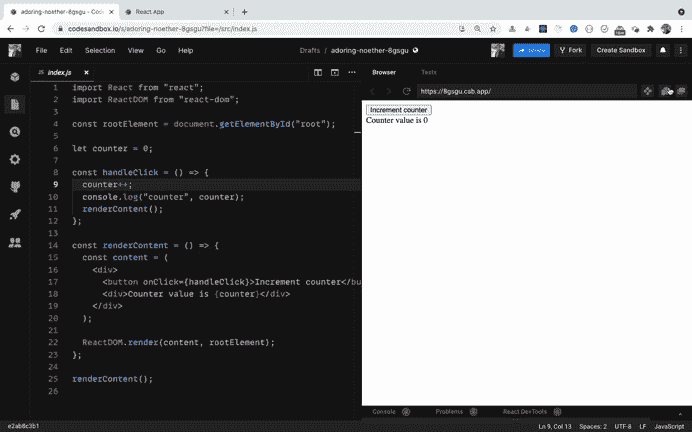

这里有一个[预览链接](https://8gsgu.csb.app/)供代码沙箱自己尝试。

正如您在 HTML 结构中看到的，只有`counter`值被重新呈现，因为它是 HTML 结构中唯一闪烁的东西。这就是 React 如此之快以及虚拟 DOM 使 React 更加有用的原因。

但是，每次我们想要更新 UI 时都调用`renderContent`函数是不可行的。所以 React 增加了状态的概念。

## React 中的状态介绍

状态允许我们管理应用程序中不断变化的数据。它被定义为一个对象，我们在其中定义键值对，指定我们希望在应用程序中跟踪的各种数据。

在 React 中，我们编写的所有代码都是在组件内部定义的。

在 React 中创建组件主要有两种方式:

*   基于类的组件
*   功能成分

> 我们现在从基于类的组件开始。在本文的后面，我们将看到创建组件的功能组件方法。

您应该知道如何使用基于类的组件以及功能组件，包括钩子。

不要用 React 钩子直接学习功能组件，应该先理解基于类的组件，这样很容易搞清楚基础。

您可以通过使用 ES6 class 关键字并扩展 React 提供的`Component`类来创建组件，如下所示:

```
import React from "react";
import ReactDOM from "react-dom";

class Counter extends React.Component {
  constructor(props) {
    super(props);

    this.state = {
      counter: 0
    };

    this.handleClick = this.handleClick.bind(this);
  }

  handleClick() {
    this.state.counter = this.state.counter + 1;

    console.log("counter", this.state.counter);
  }

  render() {
    const { counter } = this.state;

    return (
      <div>
        <button onClick={this.handleClick}>Increment counter</button>
        <div>Counter value is {counter}</div>
      </div>
    );
  }
}

const rootElement = document.getElementById("root");
ReactDOM.render(<Counter />, rootElement); 
```

> 请注意，组件的名称以大写字母(`Counter`)开头。

这里有一个[代码沙盒演示](https://codesandbox.io/s/nostalgic-burnell-57fhd?file=/src/index.js)。

让我们探索一下我们在做什么。

*   在构造函数内部，我们首先通过向其传递`props`来调用`super`。然后，我们将状态定义为一个对象，并将`counter`作为对象的属性。
*   我们还将`this`的上下文绑定到`handleClick`函数，这样在`handleClick`函数中我们可以得到`this`的正确上下文。
*   然后在`handleClick`函数中，我们正在更新`counter`并将其记录到控制台。
*   在`render`方法中，我们返回想要在 UI 上呈现的 JSX。

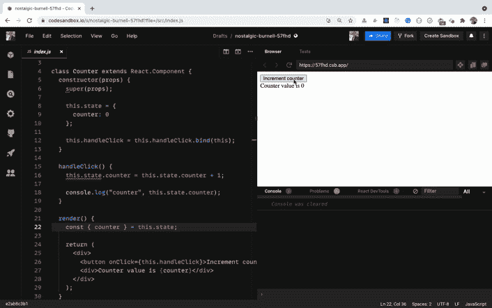

正如你在控制台中看到的,`counter`正在正确地更新——但是它在 UI 上没有更新。

这是因为我们直接更新了`handleClick`函数中的状态，如下所示:

```
this.state.counter = this.state.counter + 1
```

所以 React 不会重新渲染组件(而且**直接更新状态**也是不好的做法)。

> 永远不要在 React 中直接更新/改变状态，因为这是一个不好的做法，会导致应用程序出现问题。此外，如果您直接进行状态更改，您的组件将不会在状态更改时重新呈现。

## setState 的语法

为了改变状态，React 给了我们一个`setState`函数，允许我们更新状态的值。

`setState`函数的语法如下:

```
setState(updater, [callback]) 
```

*   可以是函数也可以是对象
*   `callback`是一个可选函数，一旦成功更新状态，就会执行该函数

> 调用`setState`自动重新渲染整个组件及其所有子组件。我们不需要像之前看到的那样使用`renderContent`函数手动重新渲染。

## 如何在 React 中使用函数更新状态

让我们修改上面的代码沙箱中的[来使用`setState`函数更新状态。](https://codesandbox.io/s/nostalgic-burnell-57fhd?file=/src/index.js)

这里有一个更新的[代码沙盒演示](https://codesandbox.io/s/withered-dust-p3emg?file=/src/index.js)。

如果你检查更新后的`handleClick`函数，它看起来是这样的:

```
handleClick() {
  this.setState((prevState) => {
    return {
      counter: prevState.counter + 1
    };
  });

  console.log("counter", this.state.counter);
} 
```

在这里，我们将一个函数作为第一个参数传递给`setState`函数，并返回一个新的状态对象，其中`counter`基于之前的`counter`值加 1。

我们在上面的代码中使用了箭头函数，但是使用普通函数也可以。

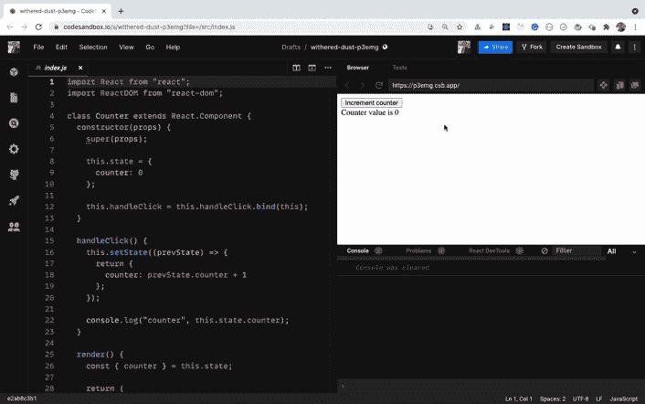

如果您注意到，我们正在正确地获取 UI 上的`counter`的更新值。但是在控制台中，即使我们在`this.setState`调用后添加了 console.log，我们还是会得到之前的`counter`值。

> 这是因为`setState`函数本质上是异步的。

这意味着即使我们调用了`setState`来增加`counter`的值 1，它也不会立即发生。这是因为当我们调用`setState`函数时，整个组件被重新渲染——因此 React 需要使用虚拟 DOM 算法检查所有需要更改的内容，然后执行各种检查以有效更新 UI。

这就是在调用`setState`后，您可能无法立即获得`counter`的更新值的原因。

> 这是 React 中需要记住的一件非常重要的事情，因为如果你不写代码，就会遇到难以调试的问题，记住`setState`在 React 中是异步的。

如果您想在调用`setState`之后立即获得状态的更新值，您可以将一个函数作为第二个参数传递给`setState`调用，一旦状态被更新，这个函数就会被执行。

这里有一个[代码沙盒演示](https://codesandbox.io/s/jolly-dawn-65wis?file=/src/index.js)的变化。

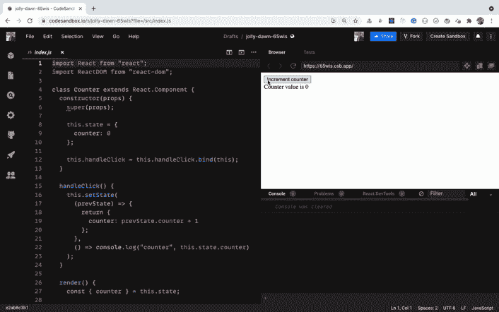

正如你所看到的，一旦 UI 上的`counter`被更新，我们就会在控制台中得到正确的值。

在上面的演示中，`handleClick`函数看起来像这样:

```
handleClick() {
  this.setState(
    (prevState) => {
      return {
        counter: prevState.counter + 1
      };
    },
    () => console.log("counter", this.state.counter)
  );
} 
```

所以在这里，对于`setState`函数调用，我们传递两个参数。第一个是返回新状态的函数，第二个是状态更新后调用的回调函数。我们只是在回调函数中将更新的计数器值记录到控制台。

> 尽管 React 提供了一个回调函数来立即获取更新后的状态值，但是建议您只在快速测试或日志记录时使用它。

相反，React 建议您使用`componentDidUpdate`方法，这是一种 React 生命周期方法，如下所示:

```
componentDidUpdate(prevProps, prevState) {
  if (prevState.counter !== this.state.counter) {
    // do something
    console.log("counter", this.state.counter);
  }
} 
```

这里有一个[代码沙盒演示](https://codesandbox.io/s/youthful-pine-txb1o?file=/src/index.js)。

你可以在这里找到更多关于为什么使用`componentDidUpdate`而不是`setState`回调[的信息。](https://stackoverflow.com/questions/56501409/what-is-the-advantage-of-using-componentdidupdate-over-the-setstate-callback#answer-56502614)

## 如何简化状态和方法声明

如果您在上面的代码沙盒演示中看到构造函数代码，您会看到它看起来像这样:

```
constructor(props) {
  super(props);

  this.state = {
    counter: 0
  };

  this.handleClick = this.handleClick.bind(this);
} 
```

要在`handleClick`事件处理程序中使用`this`关键字，我们必须将其绑定到构造函数中，如下所示:

```
this.handleClick = this.handleClick.bind(this); 
```

同样，要声明状态，我们必须创建一个构造函数，在其中添加一个`super`调用，然后我们就可以声明状态了。

这不仅麻烦，而且使代码变得不必要的复杂。

随着事件处理程序数量的增加，`.bind`调用的数量也在增加。我们可以使用类属性语法来避免这样做。

这里有一个更新的[代码沙盒演示](https://codesandbox.io/s/sad-bassi-7fxnl?file=/src/index.js)，带有类属性语法。

这里，我们像这样直接在类内部移动状态:

```
state = {
   counter: 0
}; 
```

并将`handlerClick`事件处理程序改为箭头函数语法，如下所示:

```
handleClick = () => {
  this.setState((prevState) => {
    return {
      counter: prevState.counter + 1
    };
  });
}; 
```

由于 arrow 函数没有自己的`this`上下文，它将上下文作为类，因此不需要使用`.bind`方法。

这使得代码更简单，更容易理解，因为我们不需要绑定每个事件处理程序。

> create-react-app 已经内置了对它的支持，您现在就可以开始使用这种语法。

从现在开始，我们将使用这种语法，因为它是编写 React 组件的更流行和首选的方式。

如果你想了解更多关于这个类属性语法的知识，请点击这里查看我的文章。

## 如何使用 ES6 速记语法

如果在上面的代码沙箱中检查`setState`函数调用，看起来是这样的:

```
this.setState((prevState) => {
  return {
    counter: prevState.counter + 1
  };
}); 
```

代码太多了。仅仅为了从函数中返回一个对象，我们使用了 5 行代码。

我们可以将其简化为一行，如下所示:

```
this.setState((prevState) => ({ counter: prevState.counter + 1 })); 
```

这里，我们将对象放在圆括号中，使其隐式返回。这样做是因为如果我们在一个箭头函数中有一个单独的语句，我们可以跳过 return 关键字和像这样的花括号:

```
const add = (a, b) => { 
 return a + b;
}

// the above code is the same as below code:

const add = (a, b) => a + b; 
```

但是由于开始的花括号被认为是函数体的开始，我们需要将对象放在圆括号内，使其正常工作。

这里有一个更新的[代码沙盒演示](https://codesandbox.io/s/zen-galois-pew17?file=/src/index.js)有这个变化。

## 如何在 React 中将对象用作状态更新器

在上面的代码中，我们使用了一个函数作为`setState`的第一个参数，但是我们也可以传递一个对象作为参数。

这里有一个[代码沙盒演示](https://codesandbox.io/s/zealous-nobel-yvvmw?file=/src/index.js)。

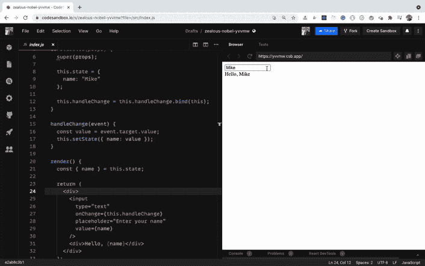

组件代码如下所示:

```
class User extends React.Component {
  state = {
    name: "Mike"
  };

  handleChange = (event) => {
    const value = event.target.value;
    this.setState({ name: value });
  };

  render() {
    const { name } = this.state;

    return (
      <div>
        <input
          type="text"
          onChange={this.handleChange}
          placeholder="Enter your name"
          value={name}
        />
        <div>Hello, {name}</div>
      </div>
    );
  }
} 
```

这里，我们添加了一个输入框，用户可以在其中输入自己的名字，当用户在文本框中输入名字时，这个输入框就会显示在文本框的下方。

在该状态下，我们已经将 name 属性初始化为`Mike`，并且我们已经向输入框添加了一个`onChange`处理程序，如下所示:

```
state = {
  name: "Mike"
};

...

<input
  type="text"
  onChange={this.handleChange}
  placeholder="Enter your name"
  value={name}
/> 
```

因此，当我们在文本框中键入任何内容时，我们通过向`setState`函数传递一个对象来用键入的值更新状态。

```
handleChange = (event) => {
  const value = event.target.value;
  this.setState({ name: value });
} 
```

> 但是我们应该使用哪种形式的`setState`——哪种更受欢迎？我们必须决定是将一个对象还是一个函数作为第一个参数传递给`setState`函数。

**答案是:**如果不需要`prevState`参数来寻找下一个状态值，就传递一个对象。否则将函数作为第一个参数传递给`setState`。

但是您需要注意将对象作为参数传递的一个问题。

看看[这个代码沙盒演示](https://codesandbox.io/s/eloquent-panini-u2ooe?file=/src/index.js)。

在上面的演示中，`handleClick`方法看起来像这样:

```
handleClick = () => {
  const { counter } = this.state;
  this.setState({
    counter: counter + 1
  });
} 
```

我们取`counter`的当前值，并将其递增 1。它运行良好，如下图所示:

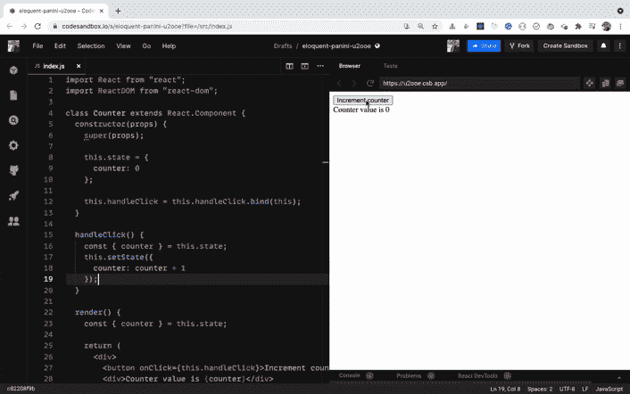

现在，看看这个代码沙盒演示，它是之前代码沙盒演示的修改版本。

我们的`handleClick`方法现在看起来像这样:

```
handleClick = () => {
  this.setState({
    counter: 5
  });

  const { counter } = this.state;

  this.setState({
    counter: counter + 1
  });
} 
```

这里，我们首先将`counter`值设置为 5，然后将它递增 1。所以`counter`的期望值是 6。我们来看看是不是这样。

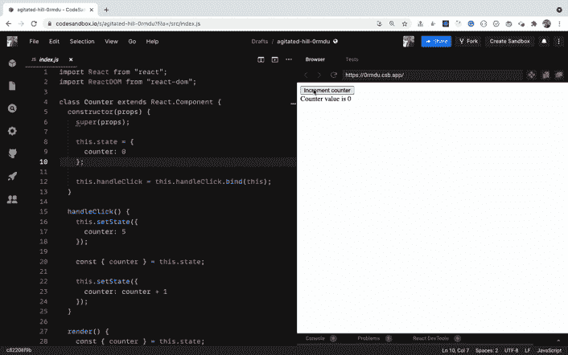

正如你所看到的，当我们第一次点击按钮时，我们期望`counter`值变成 5——但是它变成了 1，并且在随后的每一次点击中它都增加 1。

这是因为，正如我们之前看到的,`setState`函数本质上是异步的。当我们调用`setState`时，`counter`的值不会立即变成 5，所以在下一行中，我们将得到值为 0 的`counter`，我们已经在开始时将状态初始化为 0。

因此，当我们再次调用`setState`将`counter`增加 1 时，它变成 1，并且它继续增加 1。

为了解决这个问题，我们需要使用`setState`的更新语法，其中我们将一个函数作为第一个参数传递。

这里有一个[代码沙盒演示](https://codesandbox.io/s/strange-silence-qhykz?file=/src/index.js)。

在上面的演示中，`handleClick`方法现在看起来像这样:

```
handleClick = () => {
  this.setState({
    counter: 5
  });

  this.setState((prevState) => {
    return {
      counter: prevState.counter + 1
    };
  });

  this.setState((prevState) => {
    return {
      counter: prevState.counter + 1
    };
  });
} 
```

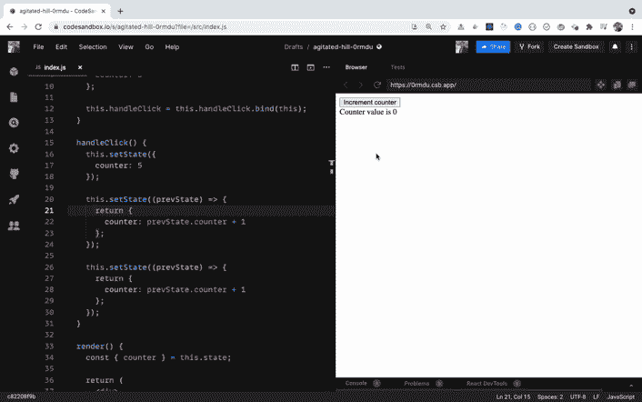

如你所见，当我们第一次点击按钮时，`counter`的值变成了 7。这是意料之中的，因为首先我们将它设置为 5，然后将它递增 1 两次，所以它变成了 7。即使我们多次点击这个按钮，它仍然是 7，因为每次点击我们都把它重新设置为 5 并递增两次。

这是因为在`handleClick`内部，我们调用`setState`通过传递一个对象作为`setState`函数的第一个参数来将`counter`的值设置为 5。之后，我们调用了两个`setState`调用，其中我们使用函数作为第一个参数。

那么这是如何正确工作的呢？

当 React 看到一个`setState`调用时，它调度一个更新来改变状态，因为它是异步的。但是在它完成状态改变之前，React 看到还有另一个`setState`调用。

因此，React 不会立即使用新的`counter`值重新渲染。相反，它会合并所有的`setState`调用，并基于之前的`counter`值更新`counter`，因为我们已经使用了`prevState.counter`来计算`counter`值。

一旦所有的`setState`调用都成功完成，React 才会重新呈现组件。因此，即使有三个`setState`调用，React 也只会重新呈现组件一次，这可以通过在`render`方法中添加一个`console.log`语句来确认。

> 所以要记住的一点是，当使用一个对象作为一个`setState`调用的第一个参数时，你应该小心，因为这可能会导致不可预知的结果。使用函数作为第一个参数，根据先前的结果获得正确的结果。

您可能不会像我们在上面的演示中那样一次又一次地调用`setState`，但是您可能会在另一个函数中调用它，如下所示:

```
state = {
 isLoggedIn: false
};

...

doSomethingElse = () => {
 const { isLoggedIn } = this.state;
 if(isLoggedIn) {
   // do something different 
 }
};

handleClick = () => {
  // some code
  this.setState({ isLoggedIn: true);
  doSomethingElse();
} 
```

在上面的代码中，我们定义了一个`isLoggedIn`状态，并且有两个函数`handleClick`和`doSomethingElse`。在`handleClick`函数中，我们将`isLoggedIn`状态值更新为`true`，并立即在下一行调用`doSomethingElse`函数。

所以在`doSomethingElse`中，你可能认为你将得到作为`true`的`isLoggedIn`状态，if 条件中的代码将被执行。但是它不会被执行，因为`setState`是异步的，状态可能不会立即更新。

这就是为什么 React 添加了像`componendDidUpdate`这样的生命周期方法，以便在状态或道具更新时做一些事情。

> 留意检查你是否在下一行或下一个函数中再次使用相同的`state`变量来做一些操作以避免这些不希望的结果。

## 如何在 React 中合并 setState 调用

看一看[这个 CodeSandbox 演示](https://codesandbox.io/s/bold-cache-zcj4u?file=/src/index.js)。

这里，我们在状态中声明了`username`和`counter`属性，如下所示:

```
state = {
  counter: 0,
  username: ""
}; 
```

并且`handleOnClick`和`handleOnChange`事件处理程序这样声明:

```
handleOnClick = () => {
  this.setState((prevState) => ({
    counter: prevState.counter + 1
  }));
};

handleOnChange = (event) => {
  this.setState({
    username: event.target.value
  });
}; 
```

检查上述函数中的`setState`调用。你可以看到在`handleOnClick`函数中，我们只为`counter`设置状态，在`handleOnChange`函数中，我们只为`username`设置状态。

所以我们不需要像这样同时为两个状态变量设置状态:

```
this.setState((prevState) => ({
    counter: prevState.counter + 1,
    username: "somevalue"
})); 
```

我们只能更新我们想更新的那个。React 将手动合并其他状态属性，因此我们不需要担心自己手动合并它们。

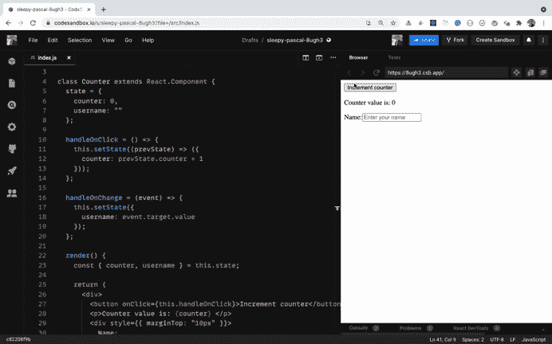

如你所见，我们成功地改变了彼此独立的`counter`和`username`。

## 如何在 React 的功能组件中使用状态

到目前为止，我们已经看到了如何在基于类的组件中使用状态。现在让我们看看如何在功能组件中使用它。

功能组件类似于类组件，只是它们没有状态和生命周期方法。这就是为什么你可能听说过它们被称为无状态功能组件。

这些组件只接受道具并返回一些 JSX。

功能组件使代码更短，更容易理解和测试。

它们的执行速度也更快，因为它们没有生命周期方法。它们也没有我们在基于类的组件中扩展的`React.Component`类带来的额外数据。

看看[这个代码沙盒演示](https://codesandbox.io/s/sleepy-pascal-8ugh3?file=/src/index.js)。

这里，我们从[随机用户生成器 API](https://randomuser.me/) 加载一个 20 个随机用户的列表，当组件像这样加载到`componentDidMount`方法中时:

```
componentDidMount() {
  axios
    .get("https://randomuser.me/api/?page=0&results=20")
    .then((response) => this.setState({ users: response.data.results }))
    .catch((error) => console.log(error));
} 
```

一旦我们获得了这些用户，我们就将其设置为`users`状态，并显示在 UI 上。

```
{users.map((user) => (
  <User key={user.login.uuid} name={user.name} email={user.email} />
))} 
```

这里，我们将所有需要显示的数据传递给`User`组件。

`User`组件看起来像这样:

```
const User = (props) => {
  const { name, email } = props;
  const { first, last } = name;

  return (
    <div>
      <p>
        Name: {first} {last}
      </p>
      <p>Email: {email} </p>
      <hr />
    </div>
  );
}; 
```

**这个`User`组件是一个功能组件。**

函数组件是以大写字母开始并返回 JSX 的函数。

无论是基于类的组件还是功能性组件，都要记住以一个大写字母开头，比如`User`。当我们像使用`<User />`一样使用它们时，这就是 React 与普通 HTML 元素的区别。

如果我们使用`<user />`，React 将检查名称为`user`的 HTML 元素。因为没有这样的 HTML 元素，所以不会得到想要的输出。

在上面的`User`函数组件中，我们在函数的`props`参数中得到传递给组件的道具。

因此，我们不像在类组件中那样使用`this.props`，而是只使用`props`。

我们从不在功能组件中使用`this`关键字，因此它避免了与`this`绑定相关的各种问题。

因此，功能组件优先于类组件。

一旦我们有了`props`，我们就使用对象析构语法来从中获取值并显示在 UI 上。

## 如何在 React 钩子中使用状态

从 16.8.0 版本开始，React 引入了钩子。它们完全改变了我们在 React 中编写代码的方式。使用 React 钩子，我们可以在功能组件中使用状态和生命周期方法。

> React 挂钩是添加了状态和生命周期方法的功能组件。

所以现在，基于类的组件和功能组件之间几乎没有区别。

它们都可以有状态和生命周期方法。

但是 React 挂钩现在是编写 React 组件的首选，因为它们使代码更短，更容易理解。

现在你很少会发现使用类组件编写的 React 组件。

要使用 React 钩子声明状态，我们需要使用`useState`钩子。

`useState`钩子接受一个参数，该参数是状态的初始值。

在基于类的组件中，状态总是一个对象。但是当使用`useState`时，您可以提供任何值作为初始值，比如数字、字符串、布尔值、对象、数组、null 等等。

`useState`钩子返回一个数组，它的第一个值是状态的当前值。第二个值是我们将用来更新状态的函数，类似于`setState`方法。

让我们举一个使用状态的基于类的组件的例子。我们将使用钩子把它转换成一个功能组件。

```
import React from 'react';
import ReactDOM from 'react-dom';

class App extends React.Component {
  state = {
    counter: 0
  };

  handleOnClick = () => {
    this.setState(prevState => ({
      counter: prevState.counter + 1
    }));
  };

  render() {
    return (
      <div>
        <p>Counter value is: {this.state.counter} </p>
        <button onClick={this.handleOnClick}>Increment</button>
      </div>
    );
  }
}

ReactDOM.render(<App />, document.getElementById('root')); 
```

这里有一个使用类组件编写的[代码沙盒演示](https://codesandbox.io/s/delicate-thunder-xdpri?file=/src/index.js)。

让我们把上面的代码转换成使用钩子。

```
import React, { useState } from "react";
import ReactDOM from "react-dom";

const App = () => {
  const [counter, setCounter] = useState(0);

  return (
    <div>
      <div>
        <p>Counter value is: {counter} </p>
        <button onClick={() => setCounter(counter + 1)}>Increment</button>
      </div>
    </div>
  );
};

ReactDOM.render(<App />, document.getElementById("root")); 
```

这里有一个使用 React 钩子编写的[代码沙盒演示](https://codesandbox.io/s/elegant-heyrovsky-3qco5?file=/src/index.js)。

正如你所看到的，使用 React 钩子使得代码更短，更容易理解。

我们来理解一下上面的代码。

*   为了使用`useState`钩子，我们需要像在第一行中那样导入它。
*   在 App 组件内部，我们通过传递`0`作为初始值并使用析构语法来调用`useState`。我们将由`useState`返回的数组值存储到`counter`和`setCounter`变量中。
*   常见的惯例是在用于更新状态的函数名前面加上关键字`set`，就像在`setCounter`中一样。
*   当我们单击 increment 按钮时，我们定义了一个内嵌函数，并通过传递更新的计数器值来调用`setCounter`函数。
*   注意，因为我们已经有了计数器值，所以我们使用`setCounter(counter + 1)`来增加计数器
*   由于内联点击处理程序中只有一条语句，所以没有必要将代码移到单独的函数中。尽管如果处理程序内部的代码变得复杂，您也可以这样做。

如果你想了解更多关于`useState`和其他 React 钩子的细节(以及例子)，那么看看我的[介绍 React 钩子](https://levelup.gitconnected.com/an-introduction-to-react-hooks-50281fd961fe?source=friends_link&sk=89baff89ec8bc637e7c13b7554904e54)的文章。

### 感谢阅读！

想从头开始详细学习所有 ES6+特性，包括 let 和 const、promises、各种 promise 方法、数组和对象析构、arrow 函数、async/await、import 和 export 等等吗？

查看我的[掌握现代 JavaScript](https://modernjavascript.yogeshchavan.dev/) 一书。这本书涵盖了学习 React 的所有先决条件，并帮助您更好地掌握 JavaScript 和 React。

> 点击查看该书[的免费预览内容。](https://www.freecodecamp.org/news/learn-modern-javascript/)

还有，你可以查看我的**免费**[React 路由器简介](https://yogeshchavan.podia.com/react-router-introduction)课程，从零开始学习 React 路由器。

想要了解关于 JavaScript、React、Node.js 的最新常规内容吗？[在领英上关注我](https://www.linkedin.com/in/yogesh-chavan97/)。

[](https://bit.ly/3w0DGum)