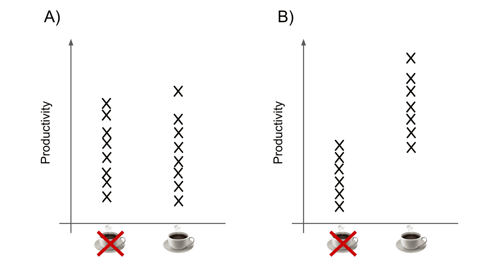

# 什么是统计意义？定义的 p 值以及如何计算它

> 原文：<https://www.freecodecamp.org/news/what-is-statistical-significance-p-value-defined-and-how-to-calculate-it/>

p 值是统计分析中使用最广泛的概念之一。研究人员、分析师和统计学家使用它们来从数据中获取见解并做出明智的决策。

除了统计意义，它们也是统计分析中最常被误用和误解的概念之一。

本文将解释:

*   P 值如何用于推断统计显著性
*   如何计算 P 值
*   以及如何避免一些常见的误解

### 回顾:假设检验

假设检验是从数据中获取洞察力的标准方法。它被用于几乎每一个定量学科，并有着一百多年的悠久历史。

假设检验的通常方法是用你感兴趣的变量来定义一个问题。那么，你可以形成两种对立的假设来回答它。

*   **零假设**声称变量之间没有统计上的显著关系
*   **替代假设**声称变量之间存在统计意义上的显著关系

例如，假设您正在测试咖啡因是否会影响编程效率。你对两个变量感兴趣——咖啡因的剂量，以及软件开发团队的生产力。

**零假设**将是:

*   “咖啡因摄入量对编程效率没有显著影响”。

另一个假设是:

*   “咖啡因的摄入确实对生产力有显著的影响”。

“重大”这个词在这里有非常特殊的含义。它指的是由于某种**而非偶然**存在的变量之间的关系。

相反，这种关系的存在(至少部分)是由于变量之间的“真实”差异或影响。

下一步是收集一些数据来检验假设。这可以从实验或调查中收集，或者从你可以访问的一组数据中收集。

最后一步是从数据中计算测试统计。这是一个代表数据某些特征的单一数字。例子包括 t 检验、卡方检验和克鲁斯卡尔-沃利斯检验等等。

具体计算哪一个将取决于您提出的问题、数据的结构以及数据的分布。

这里有一张方便的备忘单供你参考。

在咖啡因的例子中，一个合适的测试可能是[双样本 t 检验](https://www.itl.nist.gov/div898/handbook/eda/section3/eda353.htm)。

您将从您的数据中获得一个测试统计数据。剩下要做的就是解释这个结果，以确定它是支持还是拒绝零假设。

这就是 P 值发挥作用的地方。

### 这个统计的可能性有多大？

回想一下，您已经计算了一个测试统计，它代表了您的数据的一些特征。你想知道它是支持还是拒绝零假设。

采用的方法是假设零假设为真。也就是说，假设你感兴趣的变量之间没有显著的关系。

然后，看看你收集的数据。如果零假设真的是真的，你的测试统计有多大可能？

让我们回到之前咖啡因摄入的例子。

*   假设开发人员的生产力水平平均分配，不管他们是否饮用咖啡因(图 A)。如果零假设为真，这个结果可能会偶然发生。
*   然而，假设几乎所有的最高生产率都出现在喝咖啡因的开发人员身上(图表 B)。这是一个更“极端”的结果，如果零假设是真的，那么**不太可能偶然发生**。

但是一个结果需要有多“极端”才会被认为不太可能支持零假设呢？

这就是 P 值让你估计的。它提供了一个问题的数字答案:“如果零假设是真的，那么这个极端或更极端的结果的概率是多少？”

p 值是概率，所以总是在 0 到 1 之间。

*   一个**高的 P 值**表示观察到的结果是**可能在零假设下偶然发生**。
*   一个**低的 P 值**表示在零假设下结果**不太可能偶然发生**。

通常，选择阈值来确定统计显著性。这个阈值通常表示为α。

如果 P 值**低于阈值**，则您的结果为“**统计显著性**”。这意味着你可以拒绝零假设(并接受替代假设)。

不存在适用于所有应用的通用阈值。通常，将使用适合于上下文的任意阈值。

例如，在生态学和进化论等领域，很难控制实验条件，因为许多因素会影响结果。也很难收集非常大的样本量。在这些字段中，通常使用 0.05 的阈值。

在物理和工程等其他环境中，0.01 或更低的阈值会更合适。

### 卡方示例

在这个例子中，有两个(虚构的)变量:地区和政党成员。它使用卡方检验来判断地区和政党成员之间是否存在联系。

您可以更改每个政党的成员人数。

*   零假设:“地区和政党成员之间**没有显著关系**
*   另一种假设:“地区和政党成员之间有着重要的关系”

[https://codepen.io/pg2020/embed/preview/zYxgZvK?height=300&slug-hash=zYxgZvK&default-tabs=html,result&host=https://codepen.io](https://codepen.io/pg2020/embed/preview/zYxgZvK?height=300&slug-hash=zYxgZvK&default-tabs=html,result&host=https://codepen.io)

点击“重新运行”按钮尝试不同的场景。

### 常见的误解以及如何避免

关于 P 值和假设检验的使用，即使是有经验的从业者也会犯一些错误。本节旨在澄清这些问题。

❌ **零假设是无趣的** -如果数据是好的，分析是正确的，那么它本身就是一个有效的结论。

✅一个值得回答的问题应该有一个有趣的答案——不管结果如何。

❌ **P 值是零假设为真的概率**-p 值代表“假设零假设为真，结果的概率”。这不同于“给定结果，零假设为真的概率”。

*P(数据|假设)≠ P(假设|数据)*

**✅** 这意味着低 p 值告诉你:“如果零假设是真的，这些结果是不可能的”。它不会**而不是**告诉你:“如果这些结果是真的，零假设是不可能的”。

❌ **你可以使用相同的显著性阈值进行多重比较**——记住 p 值的定义。是偶然单独观察到某个检验统计量的概率。

如果你使用α = 0.05(或者 1/20)的阈值，并且你进行了 20 次统计测试...你可能会偶然发现一个低 P 值。

✅ 如果你要进行多重比较，你应该使用较低的阈值。有[修正方法](https://en.wikipedia.org/wiki/Family-wise_error_rate#Controlling_procedures)可以让你计算门槛应该低多少。

❌:显著性阈值没有任何意义——它完全是任意的。0.05 只是约定俗成。p = 0.049 和 p = 0.051 之间的差异与 p = 0.039 和 p = 0.041 之间的差异非常相似。

这是这种假设检验方法的最大弱点之一。它迫使你在沙地上划一条线，尽管没有一条线可以轻易划出来。

✅ 因此，总是考虑显著性阈值——完全是任意的。

❌:统计学上的显著性意味着机会不起作用——远非如此。通常，一个给定的结果有很多原因。有些是随机的，有些则不然。

✅发现一个非随机原因并不意味着它解释了你的变量之间的所有差异。重要的是不要把统计学意义误认为是“效应大小”。

❌p 值是确定统计显著性的唯一方法——有时还有其他更好的方法。

**✅** 和经典假设检验一样，考虑其他方法——比如用[贝叶斯因子](https://en.wikipedia.org/wiki/Bayes_factor)，或者[假阳性风险](https://arxiv.org/pdf/1802.04888.pdf)来代替。