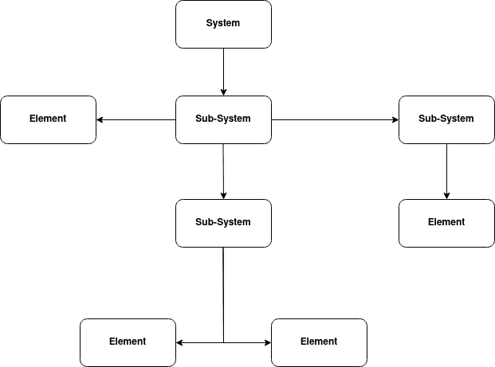
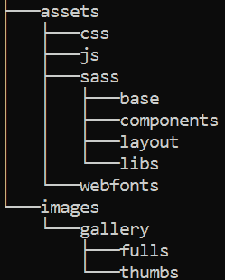

# 什么是系统工程？初学者指南

> 原文：<https://www.freecodecamp.org/news/what-is-systems-engineering/>

我最近在读 J. Martin 的书*系统工程指南——开发系统和产品的过程*。从中，我了解到系统工程降低了 40%的制造成本——你知道吗？

我也没有。即使上了一堂其中一个主题是系统工程的课，当我理解了它在现实生活中的应用时，我才明白它的相关性。

### 但是，系统工程用于软件开发吗？

是啊！

一些知名公司使用系统工程来改进他们的产品。

事实上，谷歌有自己的学科叫做[工程生产力](https://landing.google.com/engprod/)。

脸书也有自己的，叫做[制作工程](https://engineering.fb.com/category/production-engineering/)。

此外，亚马逊雇佣了一支由工程师组成的团队来帮助建立云计算基础设施。

为了理解什么是系统工程以及它有多重要，让我们回答四个问题:

1.  什么是系统？
2.  项目的生命周期是什么？
3.  什么是系统工程？
4.  为什么系统工程很重要？

## 什么是系统？

一个系统是许多“事物”的组合，这些“事物”就像一个整体一样协同工作。

举个例子，

*   太阳系
*   树
*   企业

这些例子中的每一个都有许多组成部分(行星、树叶、部门)，它们共同构成一个整体。

这些组件也可以是子系统。例如，我们的太阳系有我们的星球。我们的星球地球有自己的系统，如地圈、生物圈等等。

地圈是地球的一个子系统。[2]

Example of a system

在编程中，你可以把程序看作系统。

例如，给定程序中的一个函数可以被看作是系统中的一个元素。

通过为你的程序的不同组成部分设计一个系统，你不仅会做出一个更有效的程序，而且它会变得更容易维护和在将来添加。

然后你可以把一个程序的系统看成是其中的一种架构。

这是一个编程系统的例子:

File tree from [htm5up website template](https://html5up.net/paradigm-shift)

该图像显示了网站模板项目的目录(或文件夹)的结构。

这些目录中有许多包含多个。html，。css，还有。js 文件。

这些文件都具有与项目中的其他文件交互的组件和特征。本质上，这里有一个系统。

整个项目是一个系统。这个项目中的子系统就是方向。目录中的每个文件都有许多组件，这些组件构成了一个项目的整体。

通过学习如何创建系统，您将学习如何更好地创建和管理项目。

## 项目的生命周期是什么？

项目的生命周期指的是某个项目的各个阶段——从想法到项目的创建，再到最终的使用和制造。

通常，项目生命周期包括:

1.  想法
2.  一个想法的产生
3.  为实际项目概念创建概念
4.  利用和支持项目
5.  钝化作用

下面是一个例子，解释了如何应用系统工程为一家公司开发网站。

[Photo by Eduardo Dutra from Pexels](https://www.pexels.com/photo/person-in-front-of-laptop-on-brown-wooden-table-2115217/)

### 项目生命周期示例

假设你正在经营一家软件公司，一个客户要求你为他们公司开发一个网站。

#### 想出这个主意

在这里，你需要与客户进行对话，以确定项目将如何发展，并了解客户实际上想从项目中获得什么。

与客户讨论未来可能出现的潜在问题也是一个好主意，无论是技术问题还是财务问题。

这是项目整个生命周期中最重要的阶段。

不了解客户的需求，你就无法完成他们想要的项目。不管你的技术知识如何，这都是事实。

#### 创造和发展这个想法

下一步是在了解客户的需求后，计划将计划转化为实际项目所需的所有步骤。

例如，您将计划在哪里启动站点，在哪里部署站点，等等。

#### 提出实际项目概念的概念

在这个阶段，您构建客户想要的项目。这也是至关重要的一步。

它允许你根据客户的需求来设计网站。

#### 使用和支持项目

我们现在处于生产阶段。在此阶段，项目将被测试，任何技术问题将被修复。

如果有技术问题，它们应该是次要的，不应该对网站的大部分产生不利影响。

但是，项目一旦交给客户，维护就应该由客户来处理。

#### 钝化作用

在这最后一步，网站将被停用。

它要么被另一个网站取代，客户结束他们的公司并关闭该网站，等等。

## 什么是系统工程，为什么它很重要？

我们已经看到，系统是许多作为一个整体一起工作的“事物”的组合。

我们也看到系统有生命周期。

在项目开始之前和项目执行期间规划这些生命周期的行为被称为系统工程。

### 系统工程的技术范例

让我们假设你已经知道客户想要什么。

想象一下，他们让你设计一个电子商务网站，里面有来自卖家的数千张照片。

该网站需要一个中央服务器来托管和传送来自用户的大量图像。例如，你的网站可能会展示它所销售的产品的图片。

您需要创建一个高效且易于维护的系统，在短时间内为网站请求图像。

你如何实现这一点？

难答对不对？毫无疑问，这是一个具有挑战性的问题。

一个需要系统规划以最大化效率并尽可能易于维护的系统。

如果想进一步了解这个问题，可以查看[这篇文章](https://www.aosabook.org/en/distsys.html)。

虽然这是一个很大的技术问题，但还有其他更严重的问题。

例如，管理大型开源库增长的最佳方式是什么？

它的体系结构将如何构建，从而变得高效且易于使用？

[这里](https://www.aosabook.org/en/matplotlib.html)是 Python 中一个流行的库架构的概述， [matplotlib](https://matplotlib.org/) 。

规划系统时，可以创建和管理项目的结构。

因此，开发人员不必担心无法实现功能目标、严重的缺陷，或者在生产和维护上花费比预期多得多的钱。

正是因为这个原因，谷歌、脸书、亚马逊和许多其他公司都有专门的系统工程师团队。

通过系统工程，我们可以制定一种“计划”，以近乎完美的方式实现我们的目标或公司的目标。

## 包扎

好吧，现在你明白了:

*   什么是系统
*   什么是项目生命周期
*   什么是系统工程及其在各种项目中的价值

感谢阅读！

## **参考文献**

1.  J.系统工程指南开发系统和产品的过程。伦敦:CRC 出版社，第 5-6 页。
2.  国家地理学会，“地球系统”，*国家地理学会*，2019 年 10 月 29 日。https://www.nationalgeographic.org/article/earths-systems/
3.  “开源应用的架构(第 2 卷):可扩展的 Web 架构和分布式系统”，*www.aosabook.org*。https://www.aosabook.org/en/distsys.html
4.  B.Douglass，*实时设计模式:实时系统的健壮可伸缩体系结构*，波士顿:Addison-Wesley，2003 年，第 96–97 页。