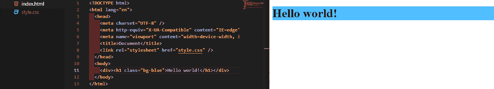
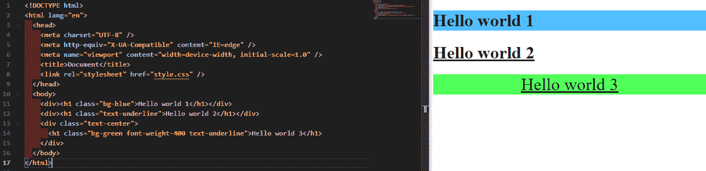
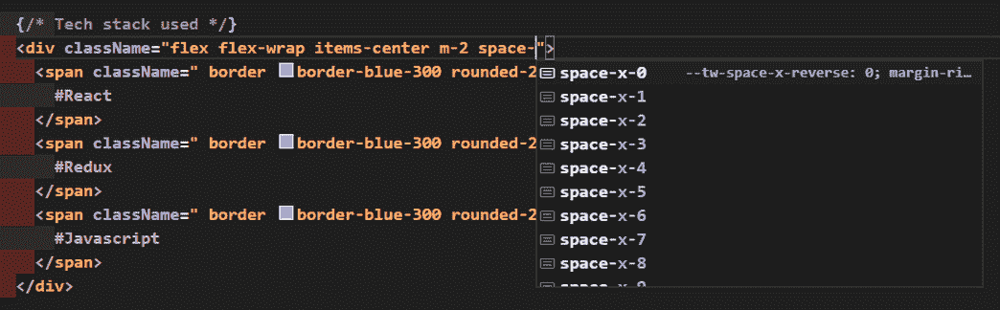
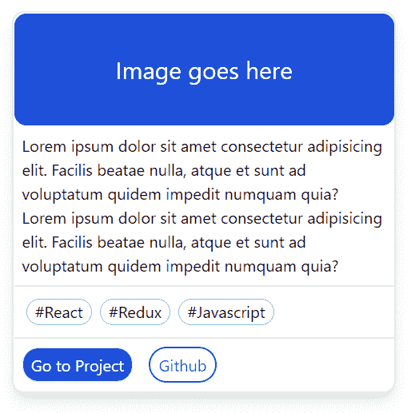
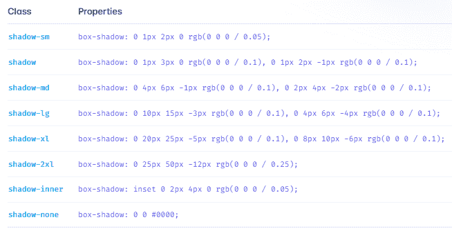

# 什么是顺风 CSS？初学者指南

> 原文：<https://www.freecodecamp.org/news/what-is-tailwind-css-a-beginners-guide/>

写 CSS 可能真的很难。句号。我也理解——确定自己的想法或从设计团队获得的设计可能会令人沮丧。

我相信你们中的许多人在发展生涯中至少经历过几次同样的痛苦。

不再是了。因为是时候学习一个有趣的工具了，它可以帮我们减轻很多负担。不，它不是 Bootstrap——它叫做 Tailwind CSS。

虽然顺风已经存在了一段时间，但你可能还没有遇到过它。也许你只是没有听说过，或者你真的不知道学习一门与 CSS 相关的新技术是否真的会让你的生活变得更容易。

事实上，有很多方法可以编写 CSS——比如 Vanilla CSS3、LESS、SCSS、Bootstrap、styled-components、Windi CSS 等等...唷。清单很长，不是吗？


我希望这个简短的指南能帮助你理解 Tailwind CSS 及其好处，这样你就可以说“就是它了。就是这个”。

闲聊到此为止。让我们直入主题吧。

## 什么是原子 CSS？

在跳入 Tailwind CSS 之前，我们先了解一下什么是原子 CSS。显示 [CSS 招数](https://css-tricks.com/lets-define-exactly-atomic-css/)

> 原子 CSS 是一种 CSS 体系结构方法，它支持小型、单一用途的类，这些类的名称基于视觉功能

这有点像是为了达到一个单一的目的而开设的课程。例如，让我们用下面的 CSS 创建一个`bg-blue`类:

```
.bg-blue {
  background-color: rgb(81, 191, 255);
} 
```

现在，如果我们将这个类添加到一个`<h1>`标签中，它将得到一个蓝色的背景，颜色为`rgb(81, 191, 255)`，正如你在上面的代码中看到的。

这是 HTML:

```
<!DOCTYPE html>
<html lang="en">
  <head>
    <meta charset="UTF-8" />
    <meta http-equiv="X-UA-Compatible" content="IE=edge" />
    <meta name="viewport" content="width=device-width, initial-scale=1.0" />
    <title>Document</title>
    <link rel="stylesheet" href="style.css" />
  </head>
  <body>
    <div><h1 class="bg-blue">Hello world!</h1></div>
  </body>
</html> 
```

所以这个 HTML 会产生这样的结果:



现在想象一下，编写这样有用的**单用途 CSS 规则**并将它们全部保存在一个**全局 CSS 文件**中。我知道这是一次性投资，但是想想这个——你现在可以在任何你想去的地方使用这些单一用途的助手类。

你只需要你的 HTML 文件去消费那个全局 CSS 文件，就这样。现在，您还可以在一个 HTML 标记中使用这些助手类的组合。

让我们看另一个例子，好吗？

让我们用以下规则创建一个 CSS 文件:

```
.bg-blue {
  background-color: rgb(81, 191, 255);
}
.bg-green {
  background-color: rgb(81, 255, 90);
}
.text-underline {
  text-decoration: underline;
}
.text-center {
  text-align: center;
}
.font-weight-400 {
  font-weight: 400;
} 
```

然后在我们的 HTML 文件中使用它，如下所示:

```
<!DOCTYPE html>
<html lang="en">
  <head>
    <meta charset="UTF-8" />
    <meta http-equiv="X-UA-Compatible" content="IE=edge" />
    <meta name="viewport" content="width=device-width, initial-scale=1.0" />
    <title>Document</title>
    <link rel="stylesheet" href="style.css" />
  </head>
  <body>
    <div><h1 class="bg-blue">Hello world 1</h1></div>
    <div><h1 class="text-underline">Hello world 2</h1></div>
    <div class="text-center">
      <h1 class="bg-green font-weight-400 text-underline">Hello world 3</h1>
    </div>
  </body>
</html> 
```

现在这会产生以下结果:



### 🗒️在这里指出注意:

*   **合并多个助手类:**看看我如何在`<h1>`标签的第 14 行合并多个助手类，即`bg-green`、`font-weight-400`和`text-underline`。这些都在我的 **Hello world 3** 文本中生效。
*   **助手类的可重用性:**在上面的例子中，看看`text-underline`助手类是如何在第 12 行和第 14 行中多次使用的。

看看我们如何能够在不离开 HTML 页面的情况下添加不同的样式。嗯，你可能会说，“嘿，我们确实必须在全局 CSS 文件中编写那些助手或实用程序类...那怎么办？”我明白了。这无疑是我们必须开始的最初投资。

当然，谁知道如果我们想要遵循这个原子 CSS 架构，我们将不得不创建多少个这种单一用途的助手或实用程序类。

这就是 Tailwind CSS 的用武之地。原子 CSS 的概念并不新鲜，但 Tailwind CSS 将它带到了另一个层次。

## tailwind CSS——实用的第一 CSS 框架

据他们自己的网站所说，Tailwind CSS 是一个“实用优先的 CSS 框架”,它提供了几个这样的**固执己见的**、**单一用途的实用类**,你可以在你的标记中直接使用它们来设计元素。

我最近经常使用的一些实用程序类是:

*   **flex** :用于将 Flexbox 应用到`<div>`
*   **items-center** :将 CSS 属性`align-items: center;`应用于一个`<div>`
*   **圆形-完整**:使图像呈圆形，以此类推

说真的，我不可能把它们都列出来，因为这些实用程序类实在太多了。但是最好的部分是，我们不必自己编写这些实用程序类，并把它们保存在任何全局 CSS 文件中。我们直接从顺风公司得到它们。

您可以从[文档页面](https://tailwindcss.com/docs/installation)获得 Tailwind 必须提供的所有实用程序类的列表。同样，如果你正在使用 VS 代码，你可以安装一个名为 [Tailwind CSS IntelliSense](https://marketplace.visualstudio.com/items?itemName=bradlc.vscode-tailwindcss) 的扩展，它会在你不断输入实用程序类时给你自动建议，如下图所示。



### 如何设置顺风 CSS

有多种方法可以在你的项目中设置 Tailwind CSS，所有这些都在他们的[文档](https://tailwindcss.com/docs/installation)中提到。

Tailwind CSS 可以流畅地与众多框架一起工作，比如 Next、React、Angular 等等——甚至是我们的 OG HTML。

对于下面的实际操作演示，我将使用 **Tailwind CSS 和下一个应用**。要使用 Tailwind CSS 直接设置下一个应用程序，请使用以下命令:

用`npx`

```
npx create-next-app --example with-tailwindcss with-tailwindcss-app 
```

或者用`yarn`

```
yarn create next-app --example with-tailwindcss with-tailwindcss-app 
```

一旦项目建立起来，您就可以进入下一步，创建一个基本的卡组件

### 动手演示

让我们在下一个项目中构建一个卡组件。

```
// Card.js file
// to be rendered in index.js

import React from "react";

const Card = () => {
  return (
    <div className="relative w-96 m-3 cursor-pointer border-2 shadow-lg rounded-xl items-center">
      {/* Image */}
      <div className="flex h-28 bg-blue-700 rounded-xl items-center justify-center">
        <h1 className="absolute mx-auto text-center right text-2xl text-white">
          Image goes here
        </h1>
      </div>

      {/* Description */}
      <div className="p-2 border-b-2">
        <h6>
          Lorem ipsum dolor sit amet consectetur adipisicing elit. Facilis
          beatae nulla, atque et sunt ad voluptatum quidem impedit numquam quia?
          Lorem ipsum dolor sit amet consectetur adipisicing elit. Facilis
          beatae nulla, atque et sunt ad voluptatum quidem impedit numquam quia?
        </h6>
      </div>

      {/* Tech stack used */}
      <div className="flex flex-wrap items-center m-2">
        <span className=" border border-blue-300 rounded-2xl px-2 my-1 mx-1">
          #React
        </span>
        <span className=" border border-blue-300 rounded-2xl px-2 my-1 mx-1">
          #Redux
        </span>
        <span className=" border border-blue-300 rounded-2xl px-2 my-1 mx-1">
          #Javascript
        </span>
      </div>

      {/* Links */}
      <div className="flex flex-wrap items-center rounded-b-xl border-t-2 bg-white">
        <button className="border rounded-2xl bg-blue-600 text-white shadow-sm p-1 px-2 m-2">
          Go to Project
        </button>
        <button className="border-2 border-blue-600 rounded-2xl text-blue-600 shadow-sm p-1 px-2 m-2">
          Github
        </button>
      </div>
    </div>
  );
};

export default Card; 
```

这导致在 UI 中呈现以下卡片:



看看我可以多么轻松地设计 card 组件的样式，甚至不用离开 Card.js 文件。不需要写任何额外的 CSS 文件。

将`flex`与`<div>`一起使用会对其应用`display: flex;` CSS 规则。想给一个`<div>`加上`position: relative;`？只需在`className`中加上`relative`就大功告成了。

我们还可以添加不同的修饰符，如`hover`、`active`、`focus`等等，以有条件地呈现实用程序类。可以像这样应用复杂的 CSS 规则:

```
.some-class-name {
          --tw-space-x-reverse: 0;
          margin-right: calc(0.5rem * var(--tw-space-x-reverse));
          margin-left: calc(0.5rem * calc(1 - var(--tw-space-x-reverse)));
} 
```

只需在`<div>`标签中提到`space-x-2`。很整洁，不是吗？

我们必须在某种全局 CSS 文件中的任何地方明确提到这些样式吗？绝对不行！顺风自动为我们做到了。这就是顺风的美妙之处。

我们还没有完成...还有很多其他的优势。现在让我们来看看它们。

### 顺风 CSS 的优势

#### 准时制(JIT)模式提供了极快的构建时间

在 Tailwind v3 之前，它会清除所有的样式，删除所有未使用的样式，以便产品版本尽可能小。

根据 Tailwind 的数据，生产版本通常在 5-10 kB 之间。但这是生产中的故事。在开发环境中，CSS 可能会变得很大，尤其是当我们使用大量个性化配置的时候。

在 v3 及以上版本中，Tailwind 发布了一个名为**实时编译器**的新特性。JIT 编译器避免了预先编译所有的 CSS，只在需要的时候编译 CSS。

这导致了在所有环境中闪电般的构建时间。由于样式是在我们需要时生成的，因此没有必要清除未使用的样式。这意味着所有环境中的 CSS 都是一样的。这有助于我们摆脱任何重要的 CSS 在生产中被清除的恐惧。

[https://www.youtube.com/embed/3O_3X7InOw8?feature=oembed](https://www.youtube.com/embed/3O_3X7InOw8?feature=oembed)

#### 它既固执又灵活

顺风 CSS 固执己见。当涉及到造型时，它确实指定了一些约束，如果你问我这是好的，因为它帮助我们将设计部分留给那些真正理解它的人。

只需查看其中一个实用程序类，为您的`<div>` ( [源](https://www.freecodecamp.org/news/what-is-tailwind-css-a-beginners-guide/tailwindcss.com/docs/box-shadow))添加一个`box-shadow`:



如你所见，顺风提供的阴影只有 8 种变体。垂直和水平偏移、模糊、扩散、颜色和不透明度都有预设值。这就是顺风固执己见的原因。

它试图给出一个关于在几乎所有的样式属性中选择什么属性值的意见。相信我，在大多数情况下，这 8 个变体(对于`box-shadow`)将足以产生一个伟大的 UI。

例如在上面的动手例子中，我已经在主父对象`<div>`中使用了`shadow-lg`来获得那个漂亮的外框阴影。

在 UI 的不同区域使用特定实用程序类的相同变体还可以确保整个应用程序的一致性，并产生更好的 UX。

但是如果你需要一些真正定制的特殊风格，你可以在`tailwind.config.js`中添加一个定制的主题。例如，要获得一个`shadow-3xl` (Tailwind 不提供开箱即用的`shadow-3xl`)，您可以在`tailwind.config.js`中的`module.exports`中添加以下行:

```
module.exports = {
  theme: {
    extend: {
      boxShadow: {
        '3xl': '0 35px 60px -15px rgba(0, 0, 0, 0.3)',
      }
    }
  }
} 
```

现在随着 JIT 的出现，您也可以使用方括号`[]`中的任意值，如下所示:

```
<div class="shadow-[0_35px_60px_-15px_rgba(0,0,0,0.3)]">
  // Rest of your code goes here
</div> 
```

当您只在少数地方需要特定的样式时，使用任意值可能会很有用。在这种情况下，在`tailwind.config.js`中为它创建一个主题似乎是不必要的。

## 我的想法

我真的希望我能够让你明白什么是 Tailwind CSS 以及你可以用它做什么。

Tailwind 是一个 CSS 框架，它为我们提供了**单一用途的实用程序类**，这些类在很大程度上是**固执己见的**，帮助我们从标记或。js/。jsx/。ts/。tsx 文件。

在我看来，顺风顺水简单易懂。确实，掌握所有实用程序类名可能需要一些时间，但是不要担心——当遇到困难时，可以参考它们的文档。

对于所有刚刚开始 web 开发之旅的初学者来说，在探索 Tailwind(或任何其他 CSS 框架，如 Bootstrap、Windi CSS 等)之前，了解 CSS3 是什么是非常重要的。

## 包扎

感谢阅读！我真的希望你喜欢阅读本文中关于 Tailwind CSS 的内容，并且觉得它很有用。

请考虑与你的朋友分享，我会非常感激。在 LinkedIn 和 Twitter 上关注我(见下文)，继续关注更多精彩内容。安静点。🖖

## 社会联系

*   [LinkedIn](https://www.linkedin.com/feed/)
*   [网站](https://www.sohamderoy.dev/)
*   [我的其他博客](https://blogs.sohamderoy.dev)
*   [推特](https://twitter.com/_sohamderoy)