# 什么是 Tailwind CSS，如何将它添加到我的网站或 React 应用程序中？

> 原文：<https://www.freecodecamp.org/news/what-is-tailwind-css-and-how-can-i-add-it-to-my-website-or-react-app/>

CSS 是一种可以成为你最好或最坏朋友的技术。虽然它非常灵活，可以产生神奇的效果，但是如果没有适当的照顾和关注，它会变得像其他代码一样难以管理。

Tailwind CSS 如何帮助我们控制自己的风格？

*   [什么是顺风？](#what-is-tailwind)
*   那么是什么让顺风变得伟大呢？
*   [第 1 部分:向静态 HTML 页面添加 Tailwind CSS](#part-1-adding-tailwind-css-to-a-static-html-page)
*   [第 2 部分:向 React 应用程序添加 Tailwind CSS](#part-2-adding-tailwind-css-to-a-react-app)

[https://www.youtube.com/embed/7KeZcRMltP0?feature=oembed](https://www.youtube.com/embed/7KeZcRMltP0?feature=oembed)

## 什么是顺风？

[Tailwind CSS](https://tailwindcss.com/) 是一个“实用优先”的 CSS 框架，它提供了一个 CSS 类和工具的深度目录，让您可以轻松地开始设计您的网站或应用程序。

潜在的目标是，当你构建你的项目时，你不需要处理层叠风格，也不需要担心如何覆盖过去两年来困扰你的应用程序的 10 个选择器的堆积。

## 那么是什么让顺风变得伟大呢？

Taildwind 的解决方案是提供各种各样的 CSS 类，每个类都有自己的用途。在 Tailwind 中，不是直接用一堆 CSS 属性创建一个名为`.btn`的类，而是将一堆像`bg-blue-500 py-2 px-4 rounded`这样的类应用于按钮元素，或者通过[将](https://tailwindcss.com/docs/functions-and-directives/#apply)这些实用类应用于选择器来构建一个`.btn`类。

虽然 Tailwind 还有很多优点，但在本教程中，我们将重点关注这些基础知识，所以让我们开始深入研究吧！

## 第 1 部分:向静态 HTML 页面添加 Tailwind CSS

我们将从将 Tailwind CSS 直接应用到静态 HTML 页面开始。希望通过关注 Tailwind 而不是应用程序，我们可以更好地理解框架的实际情况。

### 步骤 1:创建新页面

您可以通过简单地创建一个新的 HTML 文件来开始。对于内容，您可以使用任何您想要的，但我将使用 [fillerama.io](http://fillerama.io/) 以便填充内容更有趣一些。

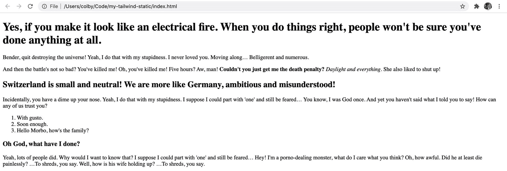

New HTML page with content

如果你想简化这一步，你可以直接[复制我创建的文件](https://github.com/colbyfayock/my-tailwind-static/commit/c7db11899c9cd193cdd666fd228cfaefe75623f2#diff-eacf331f0ffc35d4b482f1d15a887d3b)来开始。

[跟随提交！](https://github.com/colbyfayock/my-tailwind-static/commit/c7db11899c9cd193cdd666fd228cfaefe75623f2)

### 步骤 2:通过 CDN 添加 Tailwind CSS

Tailwind 通常建议您通过 [npm](https://www.npmjs.com/package/tailwindcss) 进行安装，以获得完整的功能，但同样，我们只是想先了解这是如何工作的。

因此，让我们在文档的`<head>`中添加一个到 CDN 文件的链接:

```
<link href="https://unpkg.com/tailwindcss@^1.0/dist/tailwind.min.css" rel="stylesheet">
```

一旦保存并重新加载页面，首先您会注意到所有的样式都被去除了！

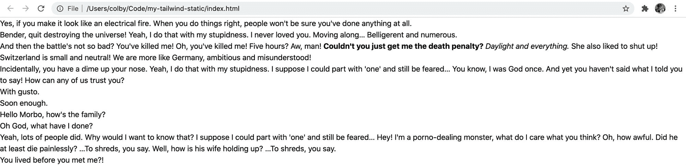

HTML page with the Tailwind CSS base

这是意料之中的。Tailwind 包含一组[预检样式](https://tailwindcss.com/docs/preflight)来修复跨浏览器的不一致性。首先，它们包括流行的 [normalize.css](https://github.com/necolas/normalize.css/) ，并以此为基础构建了自己的风格。

但是我们将学习如何使用 Tailwind 添加回我们的风格，并按照我们想要的方式进行设置！

[跟随提交！](https://github.com/colbyfayock/my-tailwind-static/commit/b431b75cee0a03154a70b194b6dfcf028bc65942)

### 步骤 3:使用 Tailwind CSS 向页面添加样式

现在我们已经安装了 Tailwind，我们已经添加了利用其庞大的实用类库的能力，我们现在将使用这些类库将样式添加回我们的页面。

让我们从给所有的段落(`<p>`)和列表元素(`<ol>`、`<ul>`)添加一些空白开始。我们可以通过向每个元素添加`.my-5`类来做到这一点，如下所示:

```
<p class="my-5">
  Bender, quit destroying the universe! Yeah, I do that with my stupidness. I never loved you. Moving along…
  Belligerent and numerous.
</p> 
```

您会注意到，其他实用程序类的类名遵循一种模式——`.my-5`代表应用于 y 轴(y)的 margin (m ),值为 5，在 Tailwind 的例子中，它使用了 [rem](https://developer.mozilla.org/en-US/docs/Learn/CSS/Building_blocks/Values_and_units) ,因此值为 5rem。


HTML page with basic paragraph styles

接下来，让我们使我们的标题看起来像真正的标题。从我们的`h1`标签开始，让我们添加:

```
<h1 class="text-2xl font-bold mt-8 mb-5"> 
```

事情是这样的:

*   `text-2xl`:将文本大小(字体大小)设置为 2xl。顺风时，2xl 相当于 1.5 雷姆
*   `font-bold`:将文本的粗细(字体粗细)设置为粗体
*   `mt-8`:与`my-5`类似，这将把页边距 top (t)设置为 8rem
*   `mb-5`:这将把页边距底部(b)设置为 5rem

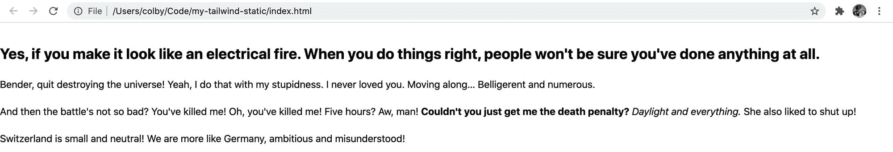

HTML page with styled H1

将这些类添加到`h1`中后，让我们将这些完全相同的类应用到我们的 header 元素的其余部分，但是当我们在列表中向下移动时，减小字体大小，这样看起来就像:

*   h2: `text-xl`
*   h3: `text-lg`

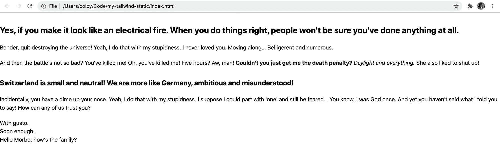

HTML page with all headers styled

现在让我们让列表元素看起来像列表。从我们的无序列表(`<ul>`)开始，让我们添加这些类:

```
<ul class="list-disc list-inside my-5 pl-2"> 
```

以下是我们要添加的内容:

*   `list-disc`:将列表样式类型设置为圆盘(各行项目上的标记)
*   `list-inside`:使用相对于列表项和列表本身的 list-style-position 设置列表标记的位置
*   `my-5`:将 y 轴的边距设置为 5rem
*   `pl-2`:将左填充设置为 2 毫米

然后，我们可以将完全相同的类应用于我们的有序列表(`<ol>`)，除了不是`list-disc`，我们想将我们的样式类型改为`list-decimal`，这样我们就可以在有序列表中看到数字。

```
<ol class="list-decimal list-inside my-5 pl-2"> 
```

我们有我们的名单！

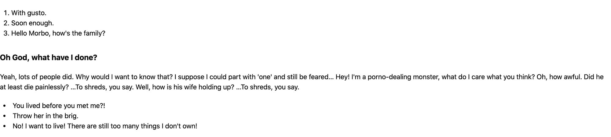

HTML page with styled lists

最后，让我们通过设置最大宽度和将内容居中来使我们的内容更容易阅读。在`<body>`标签上，添加以下内容:

```
<body class="max-w-4xl mx-auto"> 
```

/注意:通常你不会想将这些类应用到`<body>`本身，相反，你可以用一个`<main>`标签包装你的所有内容，但是因为我们只是想知道这是如何工作的，我们将继续这样做。如果您愿意，可以随意添加这些类的`<main>`标签！/

就这样，我们有了自己的页面！

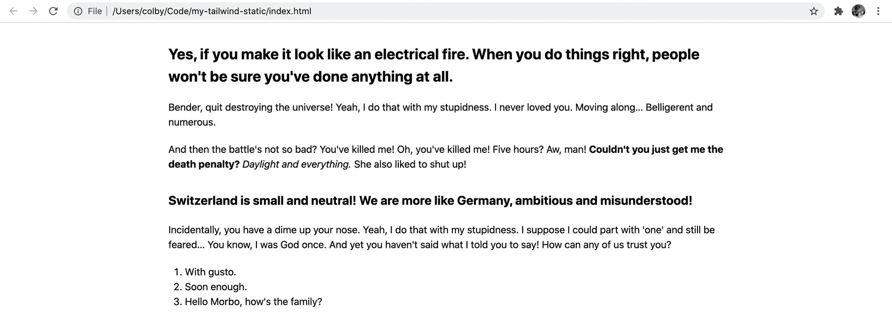

HTML page with centered content

[跟随提交！](https://github.com/colbyfayock/my-tailwind-static/commit/06fd719c98d17e2242b61ec2ab7034436c1c2ba6)

### 步骤 4:添加按钮和其他组件

对于静态示例的最后一部分，让我们添加一个按钮。

Tailwind 的诀窍是，他们故意不提供预烘焙的组件类，因为人们可能需要覆盖这些组件，以使它们看起来像他们想要的那样。

这意味着，我们将不得不使用工具类来创建我们自己的工具！

首先，让我们添加一个新按钮。在页面的某个地方，添加以下代码片段。我将把它添加到第一段(`<p>`)标签的正下方:

```
<button>Party with Slurm!</button> 
```


HTML page with unstyled button

您会注意到，就像所有其他元素一样，它是无样式的，但是，如果您尝试单击它，您会注意到它仍然具有单击动作。所以让我们把它做得像一个按钮。

让我们添加以下类:

```
<button class="text-white font-bold bg-purple-700 hover:bg-purple-800 py-2 px-4 rounded">
  Party with Slurm!
</button> 
```

下面是正在发生的事情的分类:

*   我们将文本颜色设置为白色
*   `font-bold`:将文本的粗细设置为粗体(字体粗细)
*   `bg-purple-700`:设置按钮的背景颜色为紫色，底纹为 700。700 是相对于其他被定义为紫色的颜色而言的，你可以在他们的[调色板文档页面](https://tailwindcss.com/docs/customizing-colors#default-color-palette)上找到这些值
*   `hover:bg-purple-800`:当有人悬停在按钮上时，将背景色设置为紫色阴影 800。Tailwind 提供了这些助手类，让我们可以很容易地用像[悬停、聚焦和主动修改器](https://tailwindcss.com/course/hover-focus-and-active-styles/)这样的东西来定义交互竖框
*   `py-2`:将 y 轴的空白设置为 2 毫米
*   `px-4`:将 x 轴的填充设置为 4 毫米
*   `rounded`:通过设置边框半径，使元素的角变圆。对于顺风，它将边界半径值设置为 0.25 雷姆

有了这些，我们就有了按钮！

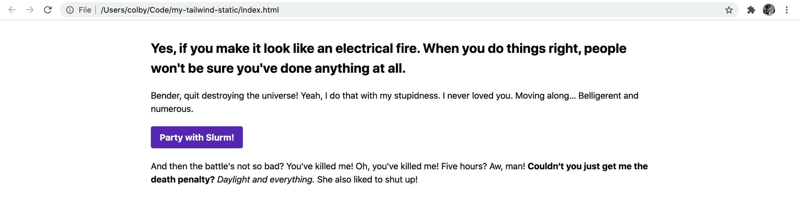

HTML page with a styled button

您可以将这种方法应用于您想要构建的任何其他组件。虽然这是一个手动过程，但我们会发现在构建像基于 React 的更动态的项目时，如何使这个过程变得更容易。

[跟随提交！](https://github.com/colbyfayock/my-tailwind-static/commit/09312336dce316a75e8007d6c935133490f16c25)

## 第 2 部分:向 React 应用程序添加 Tailwind CSS

对于更真实的用例，我们将把 Tailwind CSS 添加到用 [Create React App](https://reactjs.org/docs/create-a-new-react-app.html) 创建的应用中。

首先，我们将介绍使用 Create React 应用程序的全新安装将 tailwind 添加到项目中所需的步骤，然后我们将使用上一个示例中的内容在 React 中重新创建它。

### 第一步:创建一个新的 React 应用

我不打算过多地详述这一步。要点是我们将使用 Create React app 引导一个新的 React App。

首先，您可以按照官方 React 文档中的指示来学习[:](https://reactjs.org/docs/create-a-new-react-app.html)

[https://reactjs.org/docs/create-a-new-react-app.html](https://reactjs.org/docs/create-a-new-react-app.html)

启动开发服务器后，您应该会看到一个应用程序！


Create React App starting page

最后，让我们将所有的旧内容迁移到我们的应用程序中。为此，复制静态示例的`<body>`标签中的所有内容，并将其粘贴到新 React 项目的包装器`<div className="App">`中。

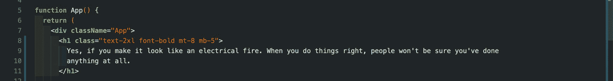

Migrating code to React app

接下来，将我们粘贴的内容中的所有`class="`属性更改为`className="`，以便它使用正确的 React 属性:

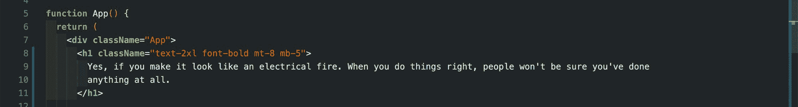

Fixing class attribute in content

最后，将包装器`<div>`上的类名`App`替换为我们在静态`<body>`上使用的类。

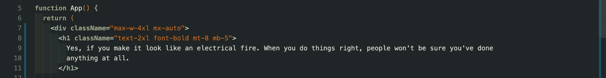

Adding wrapper styles to the app

一旦你保存了你的修改并重新启动了你的服务器，它看起来会很好。

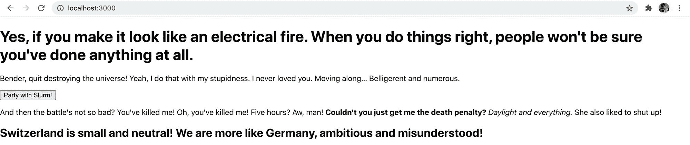

React app with basic content

React 本身包含一些基本的样式，所以虽然看起来不错，但我们实际上还没有使用 Tailwind。所以让我们开始安装吧！

[跟随提交！](https://github.com/colbyfayock/my-tailwind-dynamic/commit/57993883c77739f71072bcc02ed2398543efc2fd)

### 步骤 2:在 React 应用程序中安装 Tailwind

为了让 Tailwind 在我们的应用上运行，我们需要完成几个步骤。确保您仔细遵循这些步骤，以确保其配置正确。

首先，让我们添加依赖项:

```
yarn add tailwindcss postcss-cli autoprefixer
# or
npm install tailwindcss postcss-cli autoprefixer 
```

根据 Tailwind 的文档，我们需要能够处理我们的风格，以便它们可以正确地添加到我们的管道中。所以在上面，我们添加了:

*   [tailwindcss](https://tailwindcss.com/) :核心顺风包
*   postcss-cli : Create React App 已经使用了 postcss，但是我们需要将 Tailwind 配置为构建过程的一部分，并运行它自己的处理
*   autoprefixer : Tailwind 不包含厂商前缀，所以我们想添加 autoprefixer 来为我们处理这个问题。这作为我们的 postcss 配置的一部分运行

我们还将添加两个开发依赖项，使我们的代码更容易使用:

```
yarn add concurrently chokidar-cli -D
# or
npm install concurrently chokidar-cli --save-dev 
```

*   [concurrent](https://github.com/kimmobrunfeldt/concurrently):让我们设置一次运行多个命令的能力的包。这是很有帮助的，因为我们需要观察风格和反应程序本身。
*   chokidar-cli :让我们观察文件，并在更改时运行命令。我们将使用它来查看我们的 CSS 文件，并在 cahnge 上运行 CSS 的构建过程

接下来，让我们配置 postcss，在项目的根目录下创建一个名为`postcss.config.js`的新文件，包含以下内容:

```
// Inside postcss.config.js
module.exports = {
    plugins: [
        require('tailwindcss'),
        require('autoprefixer')
    ],
}; 
```

这将把 Tailwindcss 和 Autoprefixer 插件添加到我们的 postcss 配置中。

对于我们的配置，我们需要将其作为构建和观察过程的一部分。在`package.json`中，将以下定义添加到您的`scripts`属性中:

```
"build:css": "tailwind build src/App.css -o src/index.css",
"watch:css": "chokidar 'src/App.css' -c 'npm run build:css'", 
```

此外，修改`start`和`build`脚本，现在包括这些命令:

```
"start": "concurrently -n Tailwind,React 'npm run watch:css' 'react-scripts start'",
"build": "npm run build:css && react-scripts build", 
```

随着我们的配置准备就绪，让我们试着将我们的样式恢复到我们离开静态示例时的位置。

在`App.css`文件中，将整个内容替换为:

```
@tailwind base;
@tailwind components;
@tailwind utilities; 
```

这将导入 Tailwind 的基本样式、组件和实用程序类，使 Tailwind 能够如您所愿地工作。

我们还可以从我们的`App.js`文件中删除`App.css`导入，因为它现在被直接注入到我们的`index.css`文件中。所以去掉这一行:

```
import './App.css'; 
```

一旦完成，就可以开始备份开发服务器了！如果它已经启动，请确保重新启动它，以便所有配置更改生效。

现在页面看起来应该和静态例子中的一模一样了！

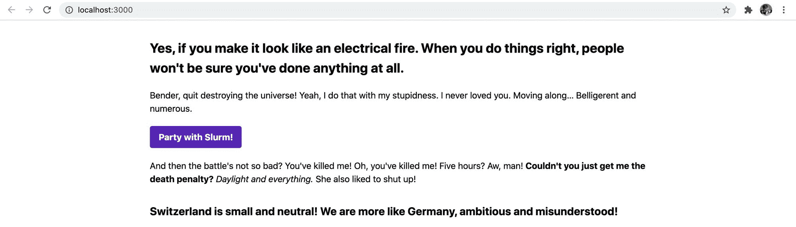

React app with content styled

[跟随提交！](https://github.com/colbyfayock/my-tailwind-dynamic/commit/5f50cc218ef58f469dad7f09bdad31f36b58a896)

### 步骤 3:用 Tailwind 创建一个新的按钮组件类

Tailwind 没有附带预烘焙组件类，但是它让创建它们变得很容易！

我们将使用已经创建的按钮作为创建新组件的示例。我们将创建一个新的类`btn`和一个颜色修改器`btn-purple`来完成这个任务。

我们要做的第一件事是打开我们的 App.css 文件，我们将在其中创建我们的新类。在该文件中，让我们添加:

```
.btn {
  @apply font-bold py-2 px-4 rounded;
} 
```

如果您还记得我们的 HTML，我们已经在我们的`<button>`元素中包含了那些相同的类。让我们将构成这些实用程序类的样式“应用”或包含到另一个类中，在本例中，就是`.btn`类。

现在我们正在创建这个类，让我们把它应用到我们的按钮上:

```
<button className="btn text-white bg-purple-700 hover:bg-purple-800">
  Party with Slurm!
</button> 
```

如果我们打开页面，我们可以看到我们的按钮看起来还是一样的。如果我们检查元素，我们可以看到用这些样式生成的新的`.btn`类。

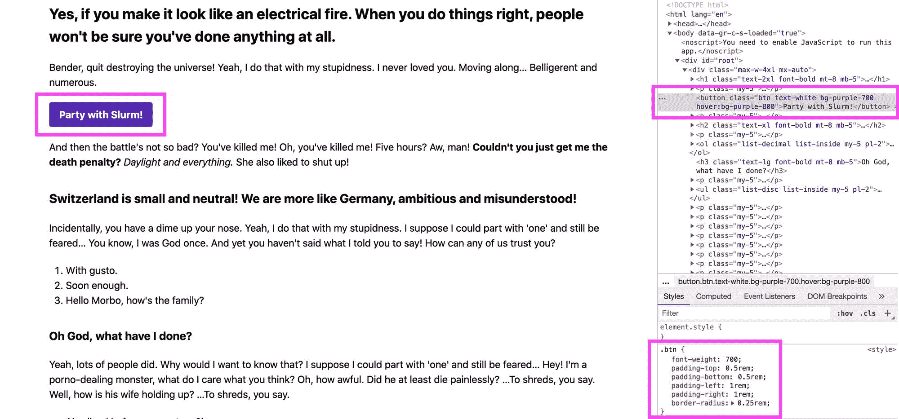

.btn class in a React app with Tailwind

接下来，让我们创建一个颜色修改器。与我们刚才所做的类似，我们将添加以下规则:

```
.btn-purple {
  @apply bg-purple-700 text-white;
}

.btn-purple:hover {
  @apply bg-purple-800;
} 
```

这里，我们将背景颜色和文本颜色添加到按钮类中。当有人悬停在按钮上时，我们也应用了较暗的按钮颜色。

我们还想更新我们的 HTML 按钮，以包含我们的新类，并删除我们刚刚应用的类:

```
<button className="btn btn-purple">
  Party with Slurm!
</button> 
```

虽然做了更改，但我们仍然可以看到没有任何变化，我们有了新的按钮类！

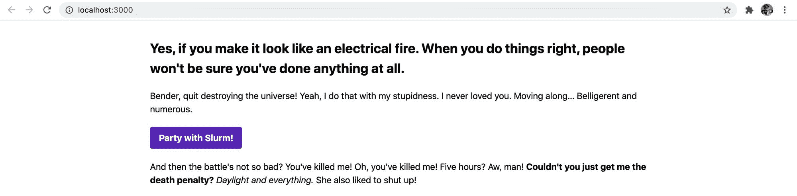

Styled button in React with Tailwind

[跟随提交！](https://github.com/colbyfayock/my-tailwind-dynamic/commit/7a76e8a4583b0a4c523ea902d73e889c7b86f437)

## 将这些概念应用于更多组件

通过本演练，我们学习了如何使用 Tailwind apply 指令创建新的组件类。这允许我们创建可重用的类，表示一个像按钮一样的组件。

我们可以将此应用于设计系统中的任意数量的组件。例如，如果我们希望总是按照我们在这里设置的方式显示我们的列表，我们可以创建一个`.list-ul`类，用 Tailwind 实用程序`list-disc list-inside my-5 pl-2`表示一个无序列表。

## 你喜欢用什么样的技巧和窍门来应对顺风？

在 [Twitter](https://twitter.com/colbyfayock) 上与我分享！

[](https://twitter.com/colbyfayock)

*   [？在 Twitter 上关注我](https://twitter.com/colbyfayock)
*   [？️订阅我的 Youtube](https://youtube.com/colbyfayock)
*   [✉️注册我的简讯](https://www.colbyfayock.com/newsletter/)